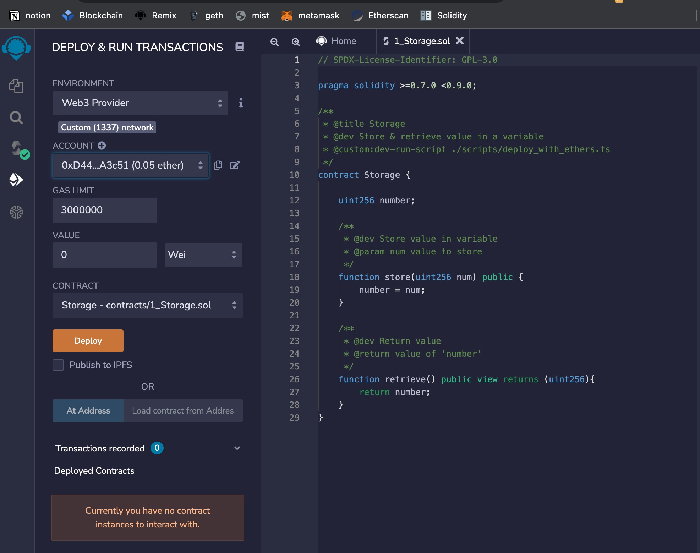

所有内容来自 [Geth Documentation](https://geth.ethereum.org/docs/)，如果错漏，请以官方文档为准。

## 概述

[Geth](https://geth.ethereum.org/) 是以太坊协议的官方 Go 实现，可以用作以太坊的独立客户端。

## 安装

+ Mac `brew install ethereum`。

## 网络

以太坊网络分为公网(public net)和专用网(private net)，公网又分为主网(mainnet)，测试网络(testnet)。

目前的测试网络主要有：

+ Ropsten: Proof-of-work test network
+ Rinkeby: Proof-of-authority test network
+ Görli: Proof-of-authority test network

### 公网

连接 `goerli` 测试网络：`geth --goerli --syncmode "light" --http`，更多命令命令行参数参见 [Command-line Options](https://geth.ethereum.org/docs/interface/command-line-options)

``` shell
INFO [04-27|18:24:27.281] Starting Geth on Görli testnet...
INFO [04-27|18:24:27.281] Dropping default light client cache      provided=1024 updated=128
INFO [04-27|18:24:27.283] Maximum peer count                       ETH=0 LES=10 total=50
INFO [04-27|18:24:27.283] Set global gas cap                       cap=50,000,000
INFO [04-27|18:24:27.284] Allocated cache and file handles         database=/Users/lsl/Library/Ethereum/goerli/geth/lightchaindata cache=64.00MiB handles=5120
INFO [04-27|18:24:27.372] Allocated cache and file handles         database=/Users/lsl/Library/Ethereum/goerli/geth/les.client cache=16.00MiB handles=16
INFO [04-27|18:24:27.478] Writing custom genesis block
INFO [04-27|18:24:27.483] Persisted trie from memory database      nodes=361 size=51.17KiB time=1.020137ms gcnodes=0 gcsize=0.00B gctime=0s livenodes=1 livesize=0.00B
INFO [04-27|18:24:27.485] Initialised chain configuration          config="{ChainID: 5 Homestead: 0 DAO: <nil> DAOSupport: true EIP150: 0 EIP155: 0 EIP158: 0 Byzantium: 0 Constantinople: 0 Petersburg: 0 Istanbul: 1561651, Muir Glacier: <nil>, Berlin: 4460644, London: 5062605, Arrow Glacier: <nil>, MergeFork: <nil>, Terminal TD: <nil>, Engine: clique}"
INFO [04-27|18:24:27.485] Added trusted checkpoint                 block=5,799,935 hash=2de018..c32427
INFO [04-27|18:24:27.485] Loaded most recent local header          number=0 hash=bf7e33..b88c1a td=1 age=3y3mo1w
INFO [04-27|18:24:27.486] Configured checkpoint oracle             address=0x18CA0E045F0D772a851BC7e48357Bcaab0a0795D signers=5 threshold=2
INFO [04-27|18:24:27.486] Gasprice oracle is ignoring threshold set threshold=2
WARN [04-27|18:24:27.486] Error reading unclean shutdown markers   error="leveldb: not found"
INFO [04-27|18:24:27.486] Starting peer-to-peer node               instance=Geth/v1.10.17-stable/darwin-amd64/go1.18
INFO [04-27|18:24:27.635] New local node record                    seq=1,651,055,067,635 id=98c360b7a75dcb44 ip=127.0.0.1 udp=30303 tcp=30303
INFO [04-27|18:24:27.635] Started P2P networking                   self=enode://c4b3d9939bef6d568d7719e5cb79c17a178d2addd5aaa68191d2f2e3034d7fd1b2643df7d85200f5b43ce7ab98a48e4a5a71a577ef3f5f69bcf937ee1f2be464@127.0.0.1:30303
INFO [04-27|18:24:27.653] Mapped network port                      proto=tcp extport=30303 intport=30303 interface=NAT-PMP(192.168.122.1)
INFO [04-27|18:24:27.656] IPC endpoint opened                      url=/Users/lsl/Library/Ethereum/goerli/geth.ipc
INFO [04-27|18:24:27.657] HTTP server started                      endpoint=127.0.0.1:8545 auth=false prefix= cors= vhosts=localhost
WARN [04-27|18:24:27.657] Light client mode is an experimental feature
INFO [04-27|18:24:27.665] Mapped network port                      proto=udp extport=30303 intport=30303 interface=NAT-PMP(192.168.122.1)
INFO [04-27|18:24:27.677] New local node record                    seq=1,651,055,067,636 id=98c360b7a75dcb44 ip=192.168.1.2 udp=30303 tcp=30303
WARN [04-27|18:24:49.731] Served eth_coinbase                      conn=127.0.0.1:62331 reqid=3 duration="20.84µs" err="mining is not supported in light mode"
INFO [04-27|18:25:05.237] Looking for peers                        peercount=0 tried=0 static=0
INFO [04-27|18:25:06.390] Updated latest header based on CHT       number=5,790,000 hash=7a7802..d140ec age=5mo3w2d
INFO [04-27|18:25:06.390] Block synchronisation started

```

要检查客户端在交互式控制台中连接了多少对等点，net 模块有两个属性，可提供有关对等点数量以及您是否是侦听节点的信息。

``` shell
> net.listening
true
> net.peerCount
4
```

#### 定制网络

有时可能不需要连接到实时公网，可以选择创建自己的专用网（将 12345 替换为任何 非负数）：

`geth -—networkid="12345" console`

这可以用于不需要测试外部合约而只想测试技术场景，因为不必与其他矿工竞争，并且很容易产生大量测试以太币。

### 专用网

通过 `geth init /path/to/file` 命令，也可以使用 JSON 文件中的自定义创世块运行 geth。 Genesis JSON 文件应具有以下格式：

```json
{
  "alloc": {
    "dbdbdb2cbd23b783741e8d7fcf51e459b497e4a6": { 
        "balance": "1606938044258990275541962092341162602522202993782792835301376"
    },
    "e6716f9544a56c530d868e4bfbacb172315bdead": {
        "balance": "1606938044258990275541962092341162602522202993782792835301376"
    },
    ...
  },
  "nonce": "0x000000000000002a",
  "difficulty": "0x020000",
  "mixhash": "0x0000000000000000000000000000000000000000000000000000000000000000",
  "coinbase": "0x0000000000000000000000000000000000000000",
  "timestamp": "0x00",
  "parentHash": "0x0000000000000000000000000000000000000000000000000000000000000000",
  "extraData": "0x",
  "gasLimit": "0x2fefd8"
}
```

关于如何创建专用网，参见[^1]

### 静态节点

如果始终想要连接的某些对等点，Geth 还支持一种称为静态节点的功能。静态节点在断开连接时重新连接。可以通过将以下内容放入 `<datadir>/geth/static-nodes.json` 来配置永久静态节点：

```json
[
  “enode://f4642fa65af50cfdea8fa7414a5def7bb7991478b768e296f5e4a54e8b995de102e0ceae2e826f293c481b5325f89be6d207b003382e18a8ecba66fbaf6416c0303@33.4.2.1:”
  “enode://pubkey@ip:port”
]
```

### 可信节点

Geth 支持始终允许重新连接的受信任节点，即使已达到对等限制。它们可以通过配置文件 `<datadir>/geth/trusted-nodes.json` 永久添加，也可以通过 RPC 调用临时添加。配置文件的格式与用于静态节点的格式相同。可以通过 js 控制台使用 `admin.addTrustedPeer()` RPC 调用添加节点，并使用 `admin.removeTrustedPeer()` 调用删除节点。

`admin.addTrustedPeer("enode://f4642fa65af50cfdea8fa7414a5def7bb7991478b768e296f5e4a54e8b995de102e0ceae2e826f293c481b5325f89be6d207b003382e18a8ecba66fbaf6416c0@33.4.2.1:30303")`

## Geth 交互

为了与区块链交互，可以通过 `console` 或者 `attach` 命令使用 `Geth` 提供的 `Geth JavaScript` 控制台。 该控制台为提供了一个类似于 `node.js` 的 JavaScript 环境。

`console` 子命令先启动节点后打开控制台。 attach 子命令将控制台附加到已经运行的 geth 实例。

``` shell
geth attach /some/custom/path.ipc
geth attach http://191.168.1.1:8545
geth attach ws://191.168.1.1:8546
```

如果不想在控制台中显示 Geth 节点的打印日志（可能会干扰交互），可以 `geth console 2> /dev/null`。

默认情况下，geth 节点不会启动 HTTP 和 WebSocket 服务器，并且出于安全原因，并非所有功能都通过这些接口提供。 这些默认值可以在 geth 节点启动时被 `--http.api` 和 `--ws.api` 参数覆盖，或者被 `admin.startRPC` 和 `admin.startWS` 覆盖。

+ IPC（进程间通信）：无限制访问所有 API ，但仅在运行 geth 节点的主机上使用控制台时才有效。
+ HTTP：只能访问 eth、web3 和 net 方法命名空间。

### HTTP

这里使用 HTTP 进行访问，端口号可以从启动后的打印信息汇中看 `HTTP server started   endpoint=127.0.0.1:8545`，打开控制台：`geth attach http://127.0.0.1:8545`

``` shell
Welcome to the Geth JavaScript console!

 modules: eth:1.0 net:1.0 rpc:1.0 web3:1.0

To exit, press ctrl-d or type exit
>
```

查询余额 `web3.fromWei(eth.getBalance("0xce8dba5e4157c2b284d8853afeeea259344c1653"), "ether")`

> 0.07

### JSON-RPC

使用 curl 工具：

``` shell
curl -X POST http://127.0.0.1:8545 \
  -H "Content-Type: application/json" \
  --data '{"jsonrpc":"2.0", "method":"eth_getBalance", "params":["0xca57f3b40b42fcce3c37b8d18adbca5260ca72ec","latest"], "id":1}'
```

## 账户间发送交易

Clef 我们与 Geth 签署交易的首选工具。

## 开发模式 (Dev mode)

Geth 有一种开发模式，可以设置单节点以太坊测试网络，并带有针对在本地机器上进行开发优化的选项。

该模式通过 `--dev` 参数启用：
`geth --datadir dev-mode --http --dev  --http.corsdomain "https://remix.ethereum.org,http://remix.ethereum.org"`

``` shell
INFO [04-27|15:46:53.317] Starting Geth in ephemeral dev mode...
INFO [04-27|15:46:53.319] Maximum peer count                       ETH=50 LES=0 total=50
INFO [04-27|15:46:53.319] Set global gas cap                       cap=50,000,000
INFO [04-27|15:46:53.484] Using developer account                  address=0x6A859F33088b5B9010682d0790700FCd76863BAD
INFO [04-27|15:46:53.484] Allocated cache and file handles         database=/Users/lsl/github/phenix3443/test/blockchain/ethereum/dev-mode/geth/chaindata cache=512.00MiB handles=5120
INFO [04-27|15:46:53.825] Opened ancient database                  database=/Users/lsl/github/phenix3443/test/blockchain/ethereum/dev-mode/geth/chaindata/ancient readonly=false
INFO [04-27|15:46:53.826] Allocated trie memory caches             clean=154.00MiB dirty=256.00MiB
INFO [04-27|15:46:53.827] Allocated cache and file handles         database=/Users/lsl/github/phenix3443/test/blockchain/ethereum/dev-mode/geth/chaindata cache=512.00MiB handles=5120
INFO [04-27|15:46:53.983] Opened ancient database                  database=/Users/lsl/github/phenix3443/test/blockchain/ethereum/dev-mode/geth/chaindata/ancient readonly=false
INFO [04-27|15:46:53.983] Writing custom genesis block
INFO [04-27|15:46:53.986] Persisted trie from memory database      nodes=12 size=1.82KiB time="273.488µs" gcnodes=0 gcsize=0.00B gctime=0s livenodes=1 livesize=0.00B
INFO [04-27|15:46:53.987] Initialised chain configuration          config="{ChainID: 1337 Homestead: 0 DAO: <nil> DAOSupport: false EIP150: 0 EIP155: 0 EIP158: 0 Byzantium: 0 Constantinople: 0 Petersburg: 0 Istanbul: 0, Muir Glacier: 0, Berlin: 0, London: 0, Arrow Glacier: <nil>, MergeFork: <nil>, Terminal TD: <nil>, Engine: clique}"
INFO [04-27|15:46:53.989] Initialising Ethereum protocol           network=1337 dbversion=<nil>
INFO [04-27|15:46:53.993] Loaded most recent local header          number=0 hash=1ce7a2..9ad546 td=1 age=53y4w1d
INFO [04-27|15:46:53.994] Loaded most recent local full block      number=0 hash=1ce7a2..9ad546 td=1 age=53y4w1d
INFO [04-27|15:46:53.994] Loaded most recent local fast block      number=0 hash=1ce7a2..9ad546 td=1 age=53y4w1d
WARN [04-27|15:46:53.995] Failed to load snapshot, regenerating    err="missing or corrupted snapshot"
INFO [04-27|15:46:53.997] Rebuilding state snapshot
INFO [04-27|15:46:53.999] Resuming state snapshot generation       root=2632f5..13eff9 accounts=0 slots=0 storage=0.00B elapsed="699.278µs"
INFO [04-27|15:46:54.000] Generated state snapshot                 accounts=10 slots=0 storage=412.00B elapsed=1.989ms
INFO [04-27|15:46:54.001] Regenerated local transaction journal    transactions=0 accounts=0
INFO [04-27|15:46:54.005] Gasprice oracle is ignoring threshold set threshold=2
WARN [04-27|15:46:54.006] Error reading unclean shutdown markers   error="leveldb: not found"
INFO [04-27|15:46:54.006] Starting peer-to-peer node               instance=Geth/v1.10.17-stable/darwin-amd64/go1.18
WARN [04-27|15:46:54.006] P2P server will be useless, neither dialing nor listening
INFO [04-27|15:46:54.006] Stored checkpoint snapshot to disk       number=0 hash=1ce7a2..9ad546
INFO [04-27|15:46:54.137] New local node record                    seq=1,651,045,614,137 id=ec4f08adc0db5886 ip=127.0.0.1 udp=0 tcp=0
INFO [04-27|15:46:54.137] Started P2P networking                   self=enode://9be85e7599856c85ee43aa28a26a1c4668ebe355d207d2a36cb1e888c4ea22e3953f9cf52f48205da5f7c238f453e94c2093ca6aa976edf9275310faabb8933a@127.0.0.1:0
INFO [04-27|15:46:54.140] IPC endpoint opened                      url=/Users/lsl/github/phenix3443/test/blockchain/ethereum/dev-mode/geth.ipc
INFO [04-27|15:46:54.141] HTTP server started                      endpoint=127.0.0.1:8545 auth=false prefix= cors=https://remix.ethereum.org,http://remix.ethereum.org vhosts=localhost
INFO [04-27|15:46:54.141] Transaction pool price threshold updated price=1,000,000,000
INFO [04-27|15:46:54.141] Updated mining threads                   threads=0
INFO [04-27|15:46:54.142] Transaction pool price threshold updated price=1
INFO [04-27|15:46:54.142] Etherbase automatically configured       address=0x6A859F33088b5B9010682d0790700FCd76863BAD
WARN [04-27|15:46:54.142] Block sealing failed                     err="sealing paused while waiting for transactions"
INFO [04-27|15:46:54.142] Commit new sealing work                  number=1 sealhash=9c6e1b..9516b8 uncles=0 txs=0 gas=0 fees=0 elapsed="677.311µs"
INFO [04-27|15:46:54.143] Commit new sealing work                  number=1 sealhash=9c6e1b..9516b8 uncles=0 txs=0 gas=0 fees=0 elapsed=1.035ms
```

连接到节点上的 IPC 控制台：
`geth attach /Users/lsl/github/phenix3443/test/blockchain/ethereum/dev-mode/geth.ipc`

``` shell
Welcome to the Geth JavaScript console!

instance: Geth/v1.10.17-stable/darwin-amd64/go1.18
coinbase: 0x6a859f33088b5b9010682d0790700fcd76863bad
at block: 0 (Thu Jan 01 1970 08:00:00 GMT+0800 (CST))
 datadir: /Users/lsl/github/phenix3443/test/blockchain/ethereum/dev-mode
 modules: admin:1.0 clique:1.0 debug:1.0 eth:1.0 miner:1.0 net:1.0 personal:1.0 rpc:1.0 txpool:1.0 web3:1.0

To exit, press ctrl-d or type exit
```

接着就可以执行交互操作了：

+ 创建账号：`> personal.newAccount()`

  >Passphrase:
  >Repeat passphrase:
  >"0xd44ca7215dc36595b00139e78d29035e4ffa3c51"

+ 转账 `eth.sendTransaction({from:eth.coinbase, to:eth.accounts[1], value: web3.toWei(0.05, "ether")})`

  > "0x066830c4c74c0ea301c2bce31744ba5776526bab8796f85c6bcaa63bd52b1efb"

+ 查询余额：`> eth.getBalance(eth.accounts[1])`

  > 50000000000000000

如果想以实际的块时间测试 dapp，可在启动开发模式的时候通过 `--dev.period 14` 参数使用 `--dev.period` 选项。

### 使用 Remix 连接

运行 geth，打开 `https://remix.ethereum.org`。正常编译合约，但是在部署和运行合约时，从 `Environment` 下拉菜单中选择 `Web3 Provider`，然后在弹出框中添加 `http://127.0.0.1:8545` 。



[^1]: https://geth.ethereum.org/docs/interface/private-network
[^2]: [以太坊源码解析（四）使用Geth](https://yaofeiliang.com/%E5%8C%BA%E5%9D%97%E9%93%BE/%E4%BB%A5%E5%A4%AA%E5%9D%8A%E6%BA%90%E7%A0%81%E8%A7%A3%E6%9E%90%EF%BC%88%E5%9B%9B%EF%BC%89%E4%BD%BF%E7%94%A8Geth/)