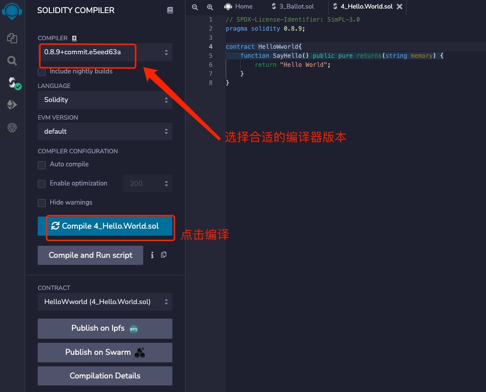

目标：编写合约，部署到测试环境中。

## Geth

直接基于 JavaScript console 编写代码，比较低效，不推荐。

## Remix IDE

[Remix IDE](https://remix.ethereum.org/) 是一个 Web App，更多内容参见[官方文档](https://remix-ide.readthedocs.io/en/latest/index.html)

## 合约开发

编写 HelloWorld 程序了解开发过程。

### 编写代码

``` solidity
// SPDX-License-Identifier: SimPL-3.0
pragma solidity ^0.8.9;

contract HelloWworld{
    function SayHello() public pure returns(string memory) {
        return "Hello World";
    }
}
```


### 编译代码



相关选项更详细的信息参考 [Remix Compiler](https://remix-ide.readthedocs.io/en/latest/compile.html)

### 部署合约


相关选项更详细的信息参考 [Remix Deploy ](https://remix-ide.readthedocs.io/en/latest/run.html)

### 运行合约


相关选项更详细的信息参考 [Remix Run](https://remix-ide.readthedocs.io/en/latest/udapp.html)

## Remixd

通过 [remixd](https://www.npmjs.com/package/@remix-project/remixd)  remix 可以直接访问本地文件。

+ 安装 `npm install -g @remix-project/remixd`
+ 检查安装结果：`remixd --version`
  > 0.6.1
+ 启动 remixd `remixd -s <absolute-path> --remix-ide https://remix.ethereum.org`
+ remix-web 连接本地网络。

## Remix Desktop

[Remix Desktop](https://github.com/ethereum/remix-desktop) 是 [Remix IDE](https://remix.ethereum.org/) (Web App) 的 Electron 版本。它适用于 Linux、Windows 和 Mac。 顾名思义，它是一个桌面应用程序 - 因此您可以无缝访问计算机文件系统上的文件。

安装 `brew install remix-ide`

有 web app 不同：

+ 访问您的硬盘
  
  Web app在浏览器中运行，如果不使用 remixd，它无法访问您计算机的文件系统。 而使用 Remix Desktop 可以很容易地访问文件系统。
  
  保存和访问保存在计算机上的文件是 Remix Desktop 的一大优势。 
  
  在 Remix Desktop 中，从 File 菜单（File -> Open Folder）中选择一个文件夹，使其成为文件资源管理器工作区中的活动文件夹。

+ 版本控制 & 文件夹容量

  使用 Remix Desktop，版本控制就像使用任何其他桌面 IDE 一样。同样，工作区文件夹的大小受计算机硬盘驱动器的限制。在 Remix IDE (web app) 中，工作区文件夹的大小受浏览器本地存储大小的限制。有一些技术可以在浏览器中进行版本控制（例如使用 remixd 或 DGIT 插件），但这些都是针对浏览器固有限制的变通方法。

+ 使用 Injected Web3 和 Metamask 部署到公共测试网
  
  Remix Desktop 无法访问 Metamask（浏览器插件），因此部署到公共链目前涉及使用 Wallet Connect 插件。Remix IDE 可以轻松访问 Metamask 浏览器插件。


## VSCode

推荐安装以下扩展：

### solidity

[solidity](https://marketplace.visualstudio.com/items?itemName=JuanBlanco.solidity) 可以用来做代码补全、跳转功能。

### solidity-visual-auditor

[solidity-visual-auditor](https://marketplace.visualstudio.com/items?itemName=tintinweb.solidity-visual-auditor) 为 Visual Studio Code 提供了以安全为中心的语法和语义高亮显示、详细的类大纲、专门的视图、高级 Solidity 代码洞察和增强。

主要可以用来生成调用图。

## Hardhat
