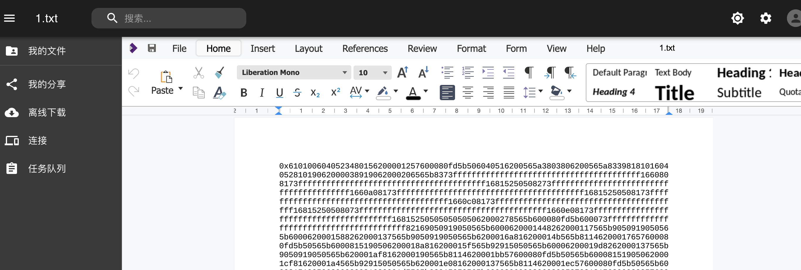
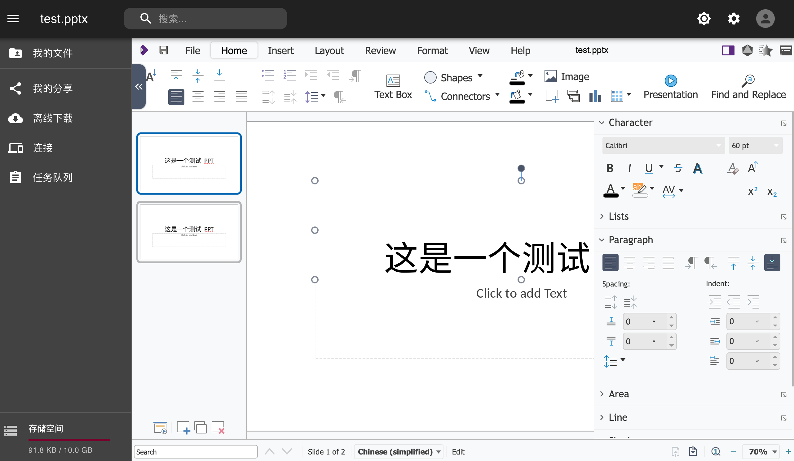
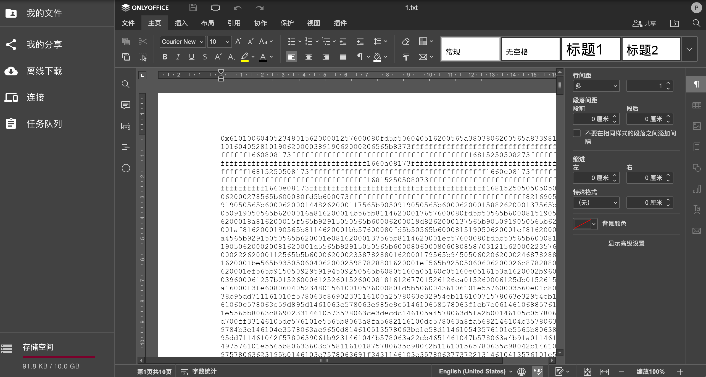
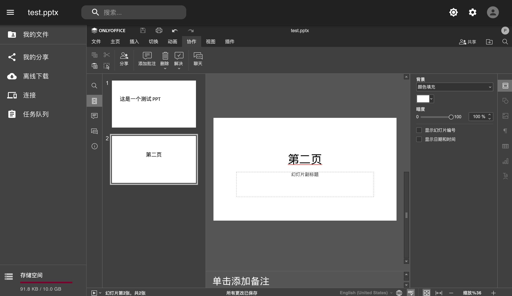

## 概述

## cloudreve

[cloudreve](https://cloudreve.org/) 是一个公私可用的网盘系统，部署过程很简单，我按照[官方指南](https://docs.cloudreve.org/getting-started/install#docker-compose)在本地树莓派上部署成功，用于替代家庭的 FTP 服务。



## wopi

cloudreve 中关于[文档预览/编辑的相关说明](https://docs.cloudreve.org/use/wopi)，这里有个坑：如果 cloudreve 开启了 HTTPS ，那么 WOPI 服务也要使用 HTTPS，否则浏览器(Firefox/chrome) 会由于[Mixed Content](https://support.mozilla.org/en-US/kb/mixed-content-blocking-firefox)风险阻止 WOPI 服务。

由于 Cloudreve 服务域名是 Cloudflare 代理的，自动生成了 SSL 证书，但是 WOPI 服务是自己部署在 GCP 上的，域名使用的阿里云进行配置和 DNS 解析，只能自己申请 SSL 证书，好消息是阿里云提供[一年免费的证书服务](https://help.aliyun.com/document_detail/156645.html)。



### collabora

按照[官方安装指南](https://sdk.collaboraonline.com/docs/installation/CODE_Docker_image.html) 在自己的 GCP 上通过 docker 安装 `collabora/code` 的在线文档服务。

关于 SSL 相关的配置可以看[Configure 中的相关说明](https://sdk.collaboraonline.com/docs/installation/Configuration.html#ssl-configuration)

### onlyofffice

[ONLYOFFICE Docs](https://www.onlyoffice.com/zh/about.aspx) 是由 Ascensio System SIA 公司开发的一套在线办公软件，可以查看并编辑文本文件、电子表格和演示文稿。

按照[官方安装指南](https://helpcenter.onlyoffice.com/installation/docs-community-install-docker.aspx) 在自己的 GCP 上通过 docker 安装 `onlyoffice/doc` 的在线文档服务。

最终效果如下：

### 最终选择

简单对比两个 WOPI 服务，可以看到 onlyoffice 展示和编辑效果更好，最终选择其作为 cloudreve 在线文本编辑的后台服务。

## WebDAV

通过 WebDav 可以直接将磁盘挂载到 MacOS 或者已经部署的 [alist]() 上
