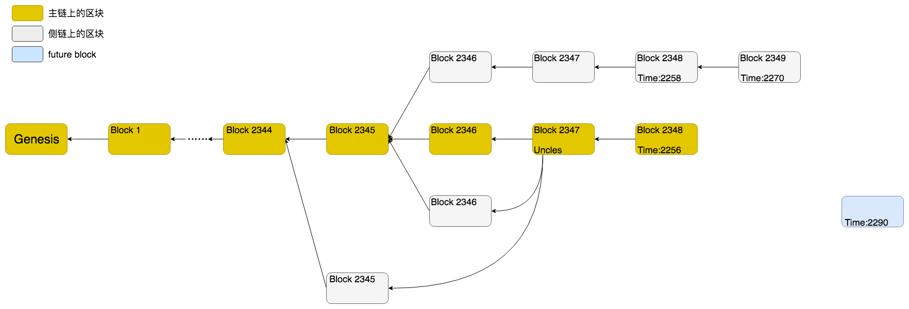

## 概述[^1]

## blockchain

## sync-modes

Geth客户端共有三种同步模式`snap`,`full`和`light`，默认是`snap`（前身为`fast`），可以通过命令行参数`--syncmode value` 进行指定。更多参见 [get sync modes]()。

+ snap：同步所有的区块头、区块体和状态数据，但不对区块中的交易进行重放以生成状态数据，只会在后期对区块中的数据（包括交易）进行校验。
+ full：同步所有的区块头，区块体，并重放区块中的交易以生成状态数据。所有区块和区块中的交易都会被逐一验证。
+ light：同步所有区块头，不同步区块体和状态数据，仅在需要时从网络上其他节点处获取。不会主动进行校验（仅在读取时进行哈希校验）。

## block

## future block

## prune block

## 区块的组织

我们先整体地看一下在以太坊中区块是如何组织成链的。然后再深入细节，去讨论一些具体的问题。

在以太坊中，区块可能会组织成下面这个样子：



这个图体现了以太坊区块链的大多数特性。大多数区块组成了一个链条，每个区块指向了自己的父多块，直到`创世区块（Genesis）`。但也很容易注意到，这个链条从头到尾并不是只有一条，而是有不少“毛刺”似的或长或短的分支链。这些分支链条被称为`侧链(sidechain)`，而主要的那个链条则是`主链(也称为规范链：canonical chain)`，而这种出现分支链的情况就叫做`分叉(fork)`。

每个区块都会有一个`高度`，它是这个区块在链条上的位置的计数。比如创世块的高度是0，因为它是第一个区块。第二个区块的高度是1，以此类推。如果我们仔细观察图中的区块高度，会发现主链上最后一个区块的高度并不是最大。这说明以太坊中并**不以区块高度来判断**是主链还是侧链。后面我们会再详细说一下这个问题。

不管是主链还是侧链上，都有一些侧链上的区块又被“包含”回来的情况，也就是说有些区块不仅会指向父块，还可能指向自己的叔叔辈的区块。这是以太坊中比较有特色的特点，叫做`叔块`，名字也是非常形象。

还有一些区块不在链上，这些区块被称为`future block`。以太坊有时候会收到一些时间戳较父块大得太多的区块，因此会作为`future block`暂存这些区块。待到时机成熟时再尝试将其加入到链中。

另外关于修剪的内容没能在这个图上体现出来。以太坊的`state`存储了所有以太坊的账户信息，`state`底层使用`trie`对象存储。由于`trie`的机制和以太坊日益增长的数据，存储全部state数据需要非常大的磁盘空间。因此以太坊的区块增加了“修剪”`state`的功能：即那些比较旧的区块的`state`是不存储的，只存储比较新的区块的`state`。我们后面还会详细分析这块功能。

这就是以太坊中区块的组织形式。可以看到，以太坊中的区块链不仅仅是简单的一个链条，它还加上了一些其它的功能和特性。

## 源码简介

以太坊中关于区块链结构的代码位于三个目录下：

+`core/`（仅包含目录下的go文件）：包含了几乎所有重要功能，是以太坊区块链的核心代码：
  +`blockchain.go`中实现的`BlockChain`结构及方法是核心实现，代表具有给定创世块的数据库的规范链。BlockChain 管理链导入(import)、恢复(recover)、链重组(reorg)。
  +`headerchain.go`中实现的`HeaderChain`实现了对区块头的管理。
+`core/rawdb`目录实现了从数据库中读写所有区块结构的方法。
+`light/`：实现了`light`同步模式下区块链的组织和维护。

从这些代码中可以看出区块链在代码中是如何组织的。

### Block

现在看下一个完整的区块[Block](https://github.com/ethereum/go-ethereum/blob/c4a662176ec11b9d5718904ccefee753637ab377/core/types/block.go#L170)包含了哪些数据：

```go

```

### BlockChain

[BlockChain](https://github.com/ethereum/go-ethereum/blob/c4a662176ec11b9d5718904ccefee753637ab377/core/blockchain.go#L167)

将块导入区块链是根据两阶段验证器(validator)定义的规则集进行的。 Processor 对 block 以及其中的交易进行处理。世界状态(state) 的验证在 Validator 的第二部分完成。 失败会中止导入。

BlockChain 还有有助于返回数据库中的`任何`链以及代表规范链的块。 重要的是要注意 GetBlock 可以返回任何块，这些块甚至不需要包含在规范链中，而 GetBlockByNumber 始终代表规范链。

BlockChain.currentBlock：当前区块，blockchain中并不是储存链所有的block，而是通过currentBlock向前回溯直到genesisBlock，这样就构成了区块链。

#### 初始化

[eth.New](https://github.com/ethereum/go-ethereum/blob/c4a662176ec11b9d5718904ccefee753637ab377/eth/backend.go#L204) 处创建了 blockchain.

[eth.NewBlockChain](https://github.com/ethereum/go-ethereum/blob/c4a662176ec11b9d5718904ccefee753637ab377/core/blockchain.go#L226) 创建一个新的 blockChian .

SetHead 将本地链倒回到一个新的头。 根据节点是快速同步还是完全同步以及处于何种状态，该方法将尝试从磁盘中删除最少的数据，同时保持链的一致性。

#### 插入和验证

在以太坊的区块链代码中，插入区块的方法是`BlockChain.InsertChain`，但主要的代码是由`BlockChain.insertChain`完成的。

[`BlockChain.InsertChain`](https://github.com/ethereum/go-ethereum/blob/c4a662176ec11b9d5718904ccefee753637ab377/core/blockchain.go#L1448) 方法的代码比较简单短，我们直接完整的拷贝到这里：

```go
// InsertChain attempts to insert the given batch of blocks in to the canonical
// chain or, otherwise, create a fork. If an error is returned it will return
// the index number of the failing block as well an error describing what went
// wrong. After insertion is done, all accumulated events will be fired.
func (bc *BlockChain) InsertChain(chain types.Blocks) (int, error) {
  // Sanity check that we have something meaningful to import
  if len(chain) == 0 {
    return 0, nil
  }
  bc.blockProcFeed.Send(true)
  defer bc.blockProcFeed.Send(false)

  // Do a sanity check that the provided chain is actually ordered and linked.
  for i := 1; i < len(chain); i++ {
    block, prev := chain[i], chain[i-1]
    if block.NumberU64() != prev.NumberU64()+1 || block.ParentHash() != prev.Hash() {
      log.Error("Non contiguous block insert",
        "number", block.Number(),
        "hash", block.Hash(),
        "parent", block.ParentHash(),
        "prevnumber", prev.Number(),
        "prevhash", prev.Hash(),
      )
      return 0, fmt.Errorf("non contiguous insert: item %d is #%d [%x..], item %d is #%d [%x..] (parent [%x..])", i-1, prev.NumberU64(),
        prev.Hash().Bytes()[:4], i, block.NumberU64(), block.Hash().Bytes()[:4], block.ParentHash().Bytes()[:4])
    }
  }
  // Pre-checks passed, start the full block imports
  if !bc.chainmu.TryLock() {
    return 0, errChainStopped
  }
  defer bc.chainmu.Unlock()
  return bc.insertChain(chain, true, true)
}
```

参数`chain`其实表明：所有待导入（import）的区块本身构成了一条长度较短的区块链（chain）。所以这里首先进行了两个简单的检查：

1. 检查`chain`的长度是否为0.
2. 检查`chain`中的各区块的高度是否是从小到大按顺序依次排列的。

检查完成后，就调用`BlockChain.insertChain`进行实际的插入工作。

`BlockChain.insertChain`由于逻辑比较多且稍复杂，单独写[文章]()分阶段来分析具体的代码。

[^1]: http://yangzhe.me/2019/03/24/ethereum-blockchain/
[^2]: https://miaoguoge.xyz/geth-snap-rpc/