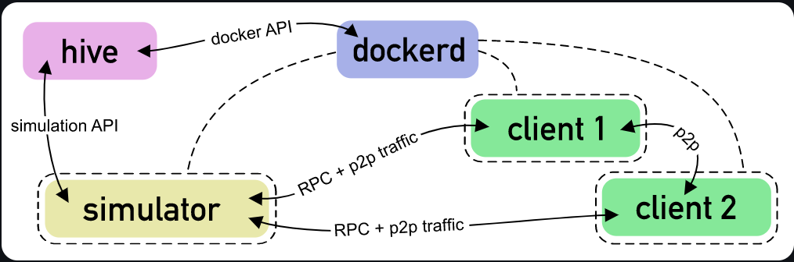

## 引言[^1]

[Hive](https://github.com/ethereum/hive/blob/master/docs/overview.md) 是一个帮助以太坊（ethereum）客户端（clients）进行集成测试（integration tests）的系统。

在 Hive 中，集成测试称为“`simulations`”。 simulations 由 `simulator` 控制，simulator 是可用任何语言编写的程序。simulator 启动客户端并包含测试逻辑。它将测试结果上报 Hive，在那里它们被聚合以显示在 web 浏览器中。

Hive 与其他通用 CI 基础设施的不同之处在于其同太坊客户端及其功能紧密集成。simulator 程序通常不需要关心客户端实现之间的差异，因为 Hive 提供了一个通用接口来启动和配置它们。当前，可以为任何 Ethereum 1 网络定义配置客户端，即创世块和硬分叉激活块号。simulations 还可以指示客户端加载预定义的测试链并启用挖矿（mining）。您可以在 [hive 客户端文档]() 中找到有关客户端配置的更多信息。

Ethereum Foundation 运行 hive 的公共实例来检查共识兼容性、P2P网络规范合规性以及大多数 Ethereum 客户端实现的用户 API 支持。您可以在 <https://hivetests.ethdevops.io/> 找到最新的测试结果。

## 当前 simulators

这是当前在生产环境的 hive 实例上实现和持续运行的一些 simulator 的概述：

+ `devp2p`：该 simulator 运行 “eth”、“snap” 和 “discv4” P2P 协议测试。测试套件（test suits）本身在 go-ethereum 仓库中维护。在它们的 hive 适配代码中，simulator 启动具有已知测试链的客户端，获取其 P2P 端点（`enode://` URL）并向其发送协议消息。客户端的响应由测试套件进行分析，以确保它们符合相应的协议规范。

+ `ethereum/sync`：该 simulator 尝试在所有客户端之间同步区块链。对于每个启用（通过 hive command 中的 --client 指定）的客户端实现，它都会创建一个实例作为“源客户端”。“源客户端”使用已知的测试链进行初始化。然后，simulator 针对“源客户端”启动新实例作为“接收客户端”，并检查“接收客户端”是否可以从“源客户端”同步链。

+ `ethereum/consensus`：该 simulator 针对所有客户端运行 Ethereum 1 共识测试。虽然通常期望客户端实施者自己运行这些测试，但它们可能并不总是运行最新的测试，并且如果花费的时间太长，它们可能会跳过其中的一些测试。在hive simulation 中运行这些测试可确保不会跳过任何测试。

+ `ethereum/rpc`：该 simulator 为 clique PoA 挖矿配置客户端，并针对 web3 JSON-RPC 接口运行各种测试。这些测试确保客户端能够通过 RPC 接收交易，将它们合并到其链中，并通过标准 API 报告交易结果。

+ `ethereum/graphql`：该 simulator 使用已知测试链初始化客户端并启用 GraphQL API 端点。然后它执行某些查询并将其输出与已知的期望输出进行比较。

## 运行原理 {#how-it-works}

本节说明单个 simulation 运行的工作原理。

对于单次运行，用户提供要运行的 simulator 的名称，以及一组要运行的客户端名称。例如：

`./hive --sim ethereum/sync --client go-ethereum,besu,openethereum`

Hive 首先使用 docker 构建 simulator 和客户端镜像。它需要 `./simulators/ethereum/sync` 目录中的 Dockerfile 以及指定的每个客户端的 Dockerfile（在 `./clients/*/Dockerfile` 中）。

虽然 simulator 构建必须始终无错误地工作，但某些客户端构建失败也没问题，只要其中一个成功就可以了。这是因为从各自的上游存储库中提取的客户端代码有时可能无法构建。



一旦构建了所有镜像， simulator 程序就会在 docker 容器中启动。`HIVE_SIMULATOR` 环境变量包含 hive 控制器（hive controller）的 HTTP 服务 URL。可以通过此 URL 访问 [hive simulation API](https://github.com/ethereum/hive/blob/master/docs/simulators.md#simulation-api-reference)。simulator 启动客户端并通过 API 报告测试结果。

当 simulator 请求客户端实例时，Hive 控制器使用构建的客户端镜像启动一个新的 docker 容器。客户端容器入口点通过 simulator 提供的环境变量和文件接收进行配置。根据此配置数据，客户端入口点配置客户端的创世状态并导入测试链（如果提供）。现在期望客户端启动其网络端点以进行 RPC 和 p2p 通信。

当客户端完成启动时，simulator 程序在 RPC 和 p2p 端点上与其通信。可以启动多个客户端，客户端也可以相互通信。

在 simulation 运行期间， simulator 必须通过 simulation API 提供有关“测试套件（test suits）”及其测试用例（test cases）的信息。Hive 控制器通过一个 JSON 文件收集此信息。它还收集客户端日志以及 simulator 程序的输出。所有文件都写入结果目录 (`./workspace/logs`)。

当 simulator 程序退出时， simulator 容器和所有客户端容器都被停止并删除。然后 hive 命令也会退出。

## Simulation 输出文件

simulation 运行的结果存储在“结果目录（result directory）”中。对于 simulator 执行的每个测试套件，都会创建一个如下所示的 JSON 文件：

```json
{
  "id": 0,
  "name": "sync",
  "description": "This test suite verifies that...",
  "clientVersions": {
    "besu": "",
    "go-ethereum": ""
  },
  "simLog": "1612356621-simulator-a9a2e71a6aabe509bbde35c79e7f0ed9c259a642c19ba0da6167fa9efd0ea5a1.log"
  "testCases": {
    "1": {
      "name": "besu as sync source",
      "description": "This loads the test chain...",
      "start": "2021-02-03T12:50:21.77396767Z",
      "end": "2021-02-03T12:51:56.080650164Z",
      "summaryResult": {
        "pass": true,
        "details": ""
      },
      "clientInfo": {
        "893a6ea2": {
          "ip": "172.17.0.4",
          "name": "besu",
          "instantiatedAt": "2021-02-03T12:51:04.371913809Z",
          "logFile": "besu/client-893a6ea2.log"
        }
      }
    }
  }
}
```

结果目录还包含 simulator 和客户端输出的日志文件。

## 工具集[^2] {#tools}

### hive

编译 hive 可执行程序：

```shell
git clone https://github.com/ethereum/hive
cd ./hive
go build .
```

运行 simulation 需要 [Docker](https://docs.docker.com/engine/install/debian/#install-using-the-repository)。 Hive 需要和 dockerd 在同一台机器上运行。目前不支持远程使用 docker。

所有 hive 命令都应从仓库的根目录中运行。要运行 simulation ，请使用以下命令：

`./hive --sim <simulator-expression> --client <要测试的客户端>`

例如，如果想针对 geth 和 openethereum 运行 discv4 测试，命令如下所示：

`./hive --sim devp2p --sim.limit discv4 --client go-ethereum,openethereum`

客户端列表可以包含任意数量的客户端。可以通过使用 `_` 将其附加到客户端名称来选择特定的客户端版本，例如：

`./hive --sim devp2p --client go-ethereum_v1.9.22,go-ethereum_v1.9.23`

常用的命令行选项有：

+ `--docker.pull`：设置这个选项让 hive 重新拉取所有构建的 docker 容器的基础镜像。
+ `--docker.output`：这允许将所有 docker 容器输出打印到 stderr。
+ `--sim.loglevel <level>`：选择客户端实例的日志级别。支持值 0-5，默认为 3。请注意，此值可能会被特定客户端的 simulator 覆盖。这会在客户端容器中设置`HIVE_LOGLEVEL`的默认值。
+ `--sim.limit <expression>`：指定一个正则表达式以选择性地启用套件和测试用例。这是由 simulator 解释的。它设置 `HIVE_TEST_PATTERN` 环境变量。
+ `--docker.nocache <expression>`：选择强制重建的 docker 镜像的正则表达式。可以在 simulator 开发期间使用此选项以确保构建新镜像，即使 simulator 代码没有更改也是如此。
+ `--sim.timelimit <timeout>`：simulation 超时时间。如果超过此时间，Hive 将中止 simulator 。没有默认超时。

上面的 expression 是 golang regexp 支持[re2语法](https://learn.microsoft.com/zh-cn/deployedge/edge-learnmore-regex)。更多命令行参数参见[command line](https://github.com/ethereum/hive/blob/master/docs/commandline.md)

```log
% ./hive --sim devp2p --sim.limit discv4 --client go-ethereum
INFO[11-24|21:10:59] building image                           image=hive/hiveproxy nocache=false pull=false
INFO[11-24|21:11:00] building 1 clients...
INFO[11-24|21:11:00] building image                           image=hive/clients/go-ethereum:latest dir=clients/go-ethereum nocache=false pull=false
INFO[11-24|21:11:00] building 1 simulators...
INFO[11-24|21:11:00] building image                           image=hive/simulators/devp2p:latest dir=simulators/devp2p nocache=false pull=false
INFO[11-24|21:11:01] running simulation: devp2p
INFO[11-24|21:11:02] hiveproxy started                        container=79959fc25d80 addr=172.17.0.2:8081
INFO[11-24|21:11:02] API: suite started                       suite=0 name=discv4
INFO[11-24|21:11:02] API: test started                        suite=0 test=1 name=go-ethereum
INFO[11-24|21:11:04] API: client go-ethereum started          suite=0 test=1 container=f598f244
INFO[11-24|21:11:04] API: container IP requested              network=bridge container=f598f244 ip=172.17.0.4
INFO[11-24|21:11:04] API: network created                     name=network1
INFO[11-24|21:11:04] API: container connected to network      network=network1 container=simulation
INFO[11-24|21:11:05] API: container connected to network      network=network1 container=f598f244
INFO[11-24|21:11:05] API: container IP requested              network=bridge container=simulation ip=172.17.0.3
INFO[11-24|21:11:05] API: container IP requested              network=network1 container=simulation ip=172.19.0.2
INFO[11-24|21:11:05] API: test started                        suite=0 test=2 name="Ping/Basic (go-ethereum)"
INFO[11-24|21:11:05] API: test ended                          suite=0 test=2 pass=true
INFO[11-24|21:11:05] API: test started                        suite=0 test=3 name="Ping/WrongTo (go-ethereum)"
INFO[11-24|21:11:05] API: test ended                          suite=0 test=3 pass=true
INFO[11-24|21:11:05] API: test started                        suite=0 test=4 name="Ping/WrongFrom (go-ethereum)"
INFO[11-24|21:11:05] API: test ended                          suite=0 test=4 pass=true
INFO[11-24|21:11:05] API: test started                        suite=0 test=5 name="Ping/ExtraData (go-ethereum)"
INFO[11-24|21:11:05] API: test ended                          suite=0 test=5 pass=true
INFO[11-24|21:11:05] API: test started                        suite=0 test=6 name="Ping/ExtraDataWrongFrom (go-ethereum)"
INFO[11-24|21:11:05] API: test ended                          suite=0 test=6 pass=true
INFO[11-24|21:11:06] API: test started                        suite=0 test=7 name="Ping/PastExpiration (go-ethereum)"
INFO[11-24|21:11:06] API: test ended                          suite=0 test=7 pass=true
INFO[11-24|21:11:06] API: test started                        suite=0 test=8 name="Ping/WrongPacketType (go-ethereum)"
INFO[11-24|21:11:06] API: test ended                          suite=0 test=8 pass=true
INFO[11-24|21:11:06] API: test started                        suite=0 test=9 name="Ping/BondThenPingWithWrongFrom (go-ethereum)"
INFO[11-24|21:11:06] API: test ended                          suite=0 test=9 pass=true
INFO[11-24|21:11:06] API: test started                        suite=0 test=10 name="Findnode/WithoutEndpointProof (go-ethereum)"
INFO[11-24|21:11:06] API: test ended                          suite=0 test=10 pass=true
INFO[11-24|21:11:06] API: test started                        suite=0 test=11 name="Findnode/BasicFindnode (go-ethereum)"
INFO[11-24|21:11:06] API: test ended                          suite=0 test=11 pass=true
INFO[11-24|21:11:06] API: test started                        suite=0 test=12 name="Findnode/UnsolicitedNeighbors (go-ethereum)"
INFO[11-24|21:11:06] API: test ended                          suite=0 test=12 pass=true
INFO[11-24|21:11:07] API: test started                        suite=0 test=13 name="Findnode/PastExpiration (go-ethereum)"
INFO[11-24|21:11:07] API: test ended                          suite=0 test=13 pass=true
INFO[11-24|21:11:07] API: test started                        suite=0 test=14 name="Amplification/InvalidPongHash (go-ethereum)"
INFO[11-24|21:11:07] API: test ended                          suite=0 test=14 pass=true
INFO[11-24|21:11:07] API: test ended                          suite=0 test=1 pass=true
INFO[11-24|21:11:07] removing docker network                  name=network1
INFO[11-24|21:11:07] API: suite ended                         suite=0
INFO[11-24|21:11:08] simulation devp2p finished               suites=1 tests=14 failed=0
```

### hiveview

Hive simulation 运行的结果存储在 JSON 文件中，Hive 还会创建几个包含 simulator 和客户端输出的日志文件。 可以使用 hiveview 工具在 Web 浏览器中查看测试结果和日志：

`go build ./cmd/hiveview`

启动 HTTP 服务器：

`./hiveview --serve --logdir ./workspace/logs`

浏览器打开 `http://127.0.0.1:8080` 显示有关已收集信息的所有 simulation 运行的信息。

### hivechain

`hivechain` 工具可以创建 RLP 编码的区块链以包含在 simulation 中：

`go build ./cmd/hivechain`

要生成所需长度的链，请运行以下命令：

`./hivechain generate -genesis ./genesis.json -length 200`

hivechain 默认生成空块。 如果以下帐户在创世状态下有余额，则该链将包含非空块。 可以在 `hivechain` 源代码中找到相应的私钥。

+ 0x71562b71999873DB5b286dF957af199Ec94617F7
+ 0x703c4b2bD70c169f5717101CaeE543299Fc946C7
+ 0x0D3ab14BBaD3D99F4203bd7a11aCB94882050E7e

[^1]: [hive overview](https://github.com/ethereum/hive/blob/master/docs/overview.md)
[^2]: [hive commandline](https://github.com/ethereum/hive/blob/master/docs/commandline.md)
