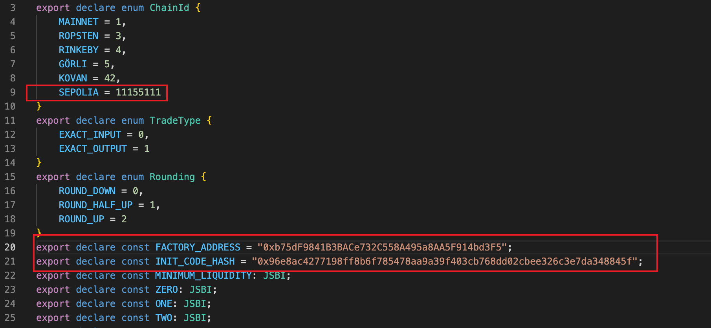
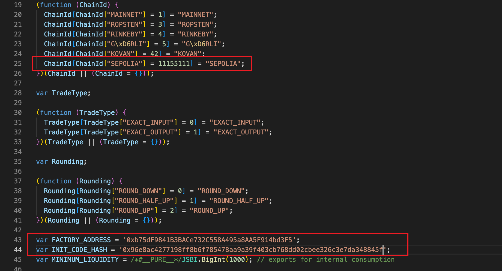
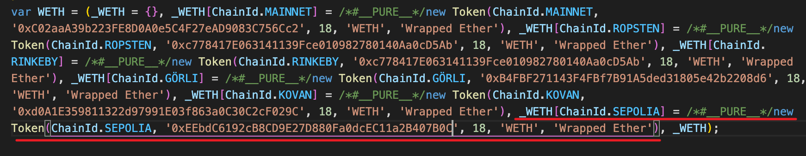
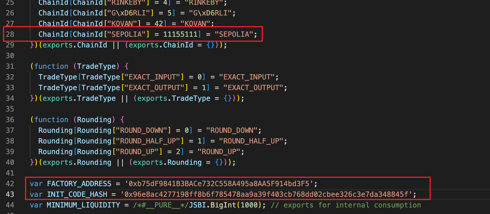
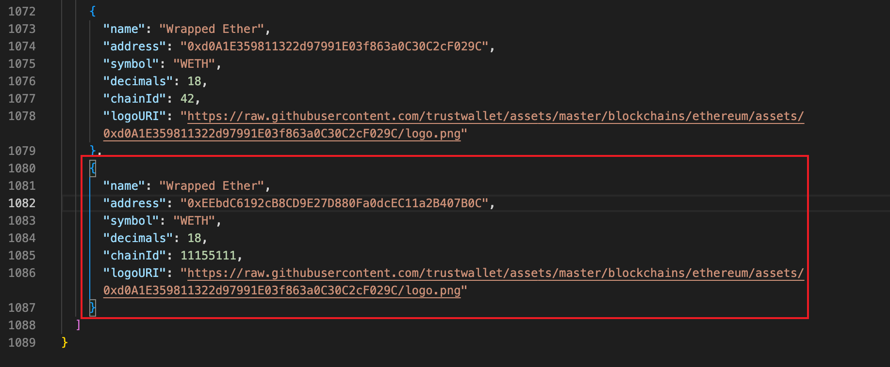
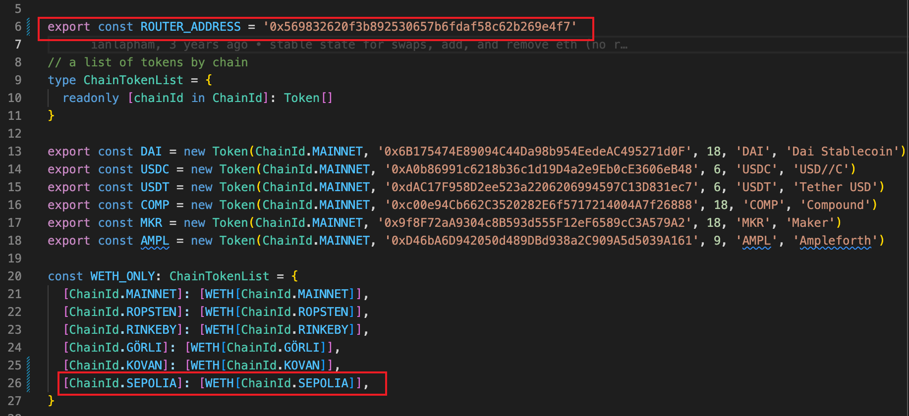
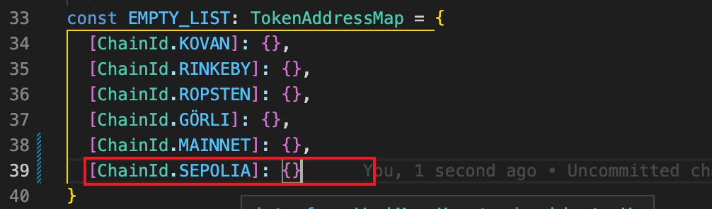

[Uniswap](https://uniswap.org/)  是以太坊最为流行的去中心化交易所，它的代码完全开源，本文将以 Uniswap v2 版本为例，讲解如何将 uniswap v2 智能合约部署到以太坊 sepolia  测试网络，并且搭建前端进行操作。

## 准备工作

uniswap-v2 版本智能合约部分的代码存放在 [Uniswap/v2-core](https://github.com/Uniswap/v2-core)  和 [Uniswap/v2-periphery](https://github.com/Uniswap/v2-periphery)  两个仓库，编译智能合约需要 `node@>=10`  版本。

然后将 clone 两个智能合约的代码仓库到本地：

```shell
git clone git@github.com:Uniswap/v2-core.git
git clone git@github.com:Uniswap/v2-periphery.git
```

还需要准备一个开放了 JSON RPC API 的以太坊节点，嫌麻烦可以去 [https://infura.io](https://link.segmentfault.com/?enc=01KYiQMcrygNadbBQzSA0A%3D%3D.TaiP9vRsroRZk4ZeHg3q7FbQPW7jg9%2FAYgJw2%2B1YqxY%3D)  申请一个免费的 API Key。以及一个拥有足够 ETH 余额的以太坊地址，sepolia 测试网络可以打开 [triangleplatform](https://faucet.triangleplatform.com/ethereum/sepolia)  水龙头为你的地址获取测试的 ETH 代币。

现在准备工作完成了，下面开始编译并且部署智能合约。

## 部署合约

由于智能合约代码存放在两个仓库，不便统一部署，我们先创建一个文件夹 `uniswap-contracts`  保存后续编译的智能合约代码。

```shell
mkdir uniswap-contracts
```

当前的目录结构如下：

```shell
$ ls
interface      uniswap-contracts    v2-core     v2-periphery
```

接下来我们分别编译两个项目的智能合约代码，然后拷贝到 `uniswap-contracts`  目录。

### 编译

首先是 `Uniswap/v2-core`  项目，进入目录后拉取依赖然后编译：

```shell
cd v2-core
yarn && yarn compile
```

编译后的代码存放在 `build`  目录，我们需要把它拷贝至之前创建的 `uniswap-contracts`  目录。

```shell
cp -r build ../uniswap-contracts
cd ..
```

接下来编译 `Uniswap/v2-periphery`  项目，也是相同的步骤，最后将编译后的代码拷贝到 `uniswap-contracts`  目录：

```shell
cd v2-periphery
yarn && yarn compile
cp -r build ../uniswap-contracts
cd ..
```

### 部署

编译好的合约代码我们已经全部拷贝到 `uniswap-contracts`  目录。接下来就是部署合约了，这一步稍微麻烦一些，需要我们编写一个脚本。

首先在 `uniswap-contracts`  目录下创建一个文本文件 `deploy.js`，并将下面的代码拷贝进去。

> 注意：常量 **endpoint**  和 **hexPrivateKey**  请自行修改，并保证地址里面有足够的 **ETH**  用于支付 GAS 费用。

```jsx
const Web3 = require("web3");
const WETH9 = require("./build/WETH9.json");
const UniswapV2Pair = require("./build/UniswapV2Pair.json");
const UniswapV2Factory = require("./build/UniswapV2Factory.json");
const UniswapV2Router01 = require("./build/UniswapV2Router01.json");
const UniswapV2Router02 = require("./build/UniswapV2Router02.json");

const endpoint = "https://goerli.infura.io/v3/5c5a4a14c82f4d6e852b7cc29b2cbb6e";
const hexPrivateKey =
  "0xfad9c8855b740a0b7ed4c221dbad0f33a83a49cad6b3fe8d5817ac83d38b6a19";

async function sendTransaction(web3, chainId, account, data, nonce, gasPrice) {
  const message = {
    from: account.address,
    gas: 5000000,
    gasPrice: gasPrice,
    data: data.startsWith("0x") ? data : "0x" + data,
    nonce: nonce,
    chainId: chainId,
  };
  const transaction = await account.signTransaction(message);
  return web3.eth.sendSignedTransaction(transaction.rawTransaction);
}

(async () => {
  const options = { timeout: 1000 * 30 };
  const web3 = new Web3(new Web3.providers.HttpProvider(endpoint, options));
  const account = web3.eth.accounts.privateKeyToAccount(hexPrivateKey);

  const chainId = await web3.eth.getChainId();
  const gasPrice = await web3.eth.getGasPrice();
  let nonce = await web3.eth.getTransactionCount(account.address);

  // deploy WETH contract
  let weth = null;
  {
    const contract = new web3.eth.Contract(WETH9.abi);
    const data = contract.deploy({ data: WETH9.bytecode }).encodeABI();
    const receipt = await sendTransaction(
      web3,
      chainId,
      account,
      data,
      nonce,
      gasPrice
    );
    console.info("WETH:", (weth = receipt.contractAddress));
    nonce = nonce + 1;
  }

  // deploy UniswapV2Factory contract
  let factory = null;
  {
    const contract = new web3.eth.Contract(UniswapV2Factory.abi);
    const options = {
      data: UniswapV2Factory.bytecode,
      arguments: [account.address],
    };
    const data = contract.deploy(options).encodeABI();
    const receipt = await sendTransaction(
      web3,
      chainId,
      account,
      data,
      nonce,
      gasPrice
    );
    console.info("UniswapV2Factory:", (factory = receipt.contractAddress));
    nonce = nonce + 1;
  }

  // deploy UniswapV2Router01 contract
  {
    const contract = new web3.eth.Contract(UniswapV2Router01.abi);
    const options = {
      data: UniswapV2Router01.bytecode,
      arguments: [factory, weth],
    };
    const data = contract.deploy(options).encodeABI();
    const receipt = await sendTransaction(
      web3,
      chainId,
      account,
      data,
      nonce,
      gasPrice
    );
    console.info("UniswapV2Router01:", receipt.contractAddress);
    nonce = nonce + 1;
  }

  // deploy UniswapV2Router02 contract
  {
    const contract = new web3.eth.Contract(UniswapV2Router02.abi);
    const options = {
      data: UniswapV2Router02.bytecode,
      arguments: [factory, weth],
    };
    const data = contract.deploy(options).encodeABI();
    const receipt = await sendTransaction(
      web3,
      chainId,
      account,
      data,
      nonce,
      gasPrice
    );
    console.info("UniswapV2Router02:", receipt.contractAddress);
    nonce = nonce + 1;
  }

  let data = UniswapV2Pair.bytecode;
  if (!data.startsWith("0x")) data = "0x" + data;
  console.info("INIT_CODE_HASH:", web3.utils.keccak256(data));
})();
```

然后再拉取依赖：

```shell
yarn init && yarn add web3
```

最后执行部署合约脚本：

```shell
node deploy.js
```

稍等片刻终端就会输入部署后的合约地址了，如下所示：

```shell
~/uniswap-contracts# node deploy.js
WETH: 0xEEbdC6192cB8CD9E27D880Fa0dcEC11a2B407B0C
UniswapV2Factory: 0xb75dF9841B3BACe732C558A495a8AA5F914bd3F5
UniswapV2Router01: 0xaA60271e6590A7aD9E4E190e232586Ad1C3d0bbE
UniswapV2Router02: 0xf0cC3752BDE1B65bd32B925b1a672396BF26B77e
INIT_CODE_HASH: 0x96e8ac4277198ff8b6f785478aa9a39f403cb768dd02cbee326c3e7da348845f
```

到这里合约就部署完成了，把终端输出的合约地址记录下来，部署前端的时候需要进行配置。

## 部署前端

我们需要 clone [Uniswap/interface](https://github.com/Uniswap/interface)  前端仓库，把 tag 切换到 `v2.6.5`，因为后续的版本推出了 **UNI**  代币和治理功能，这里不进行部署。

```shell
git clone git@github.com:Uniswap/interface.git
cd interface
git checkout v2.6.5
```

首先进入 `Uniswap/interface`  目录然后拉取依赖：

```shell
cd interface
yarn
```

### 修改 SDK

升级 @uniswap/sdk 到 3.0.3，因为当前 beta 版本无法将改动做成 patch:

```shell
yarn add --dev patch-package
yarn add --dev @uniswap/sdk
```

我们开始修改 SDK 中的以下文件：

`node_modules/@uniswap/sdk/dist/constants.d.ts`

1. 添加 Sepolia chain ID.
2. 修改 FACTORY_ADDRESS 和 INIT_CODE_HASH 为之前部署的值。



`node_modules/@uniswap/sdk/dist/sdk.esm.js`

1. 添加 Sepolia chain ID。
2. 修改 FACTORY_ADDRESS and INIT_CODE_HASH。
3. 添加 sepolia WETH 新配置。





`node_modules/@uniswap/sdk/dist/sdk.cjs.development.js`

1. 添加 Sepolia chain ID。
2. 修改 FACTORY_ADDRESS and INIT_CODE_HASH。
3. 添加 sepolia WETH 新配置。




`node_modules/@uniswap/default-token-list/build/uniswap-default.tokenlist.json`添加 sepolia weth 新配置。



`node_modules/@uniswap/sdk/dist/entities/token.d.ts`, 添加 sepolia 新配置。


为了复用上面的 sdk 更改，我们将其做成 patch。

```bash
yarn add --dev patch-package postinstall-postinstall
yarn patch-package @uniswap/default-token-list
yarn patch-package @uniswap/sdk
```

这样下次运行 `yarn install` 后，直接运行 `yarn patch-package` 就可以应用上面的更改。

也可以将这个过程作为 npm script 放在 package.json 中，这样运行 `yarn postinstall` 即可


### 修改前端代码

由于我们部署了新的合约，而前端配置里面还是 uniswap 官方的合约地址，所以需要进行如下修改：

`src/constants/index.ts`  文件中 **ROUTER_ADDRESS**  的值为 `${UniswapV2Router02}`。



`src/state/swap/hooks.ts`文件中 **BAD_RECIPIENT_ADDRESSES**  数组的值为 [`${UniswapV2Factory}`, `${UniswapV2Router01}`, `${UniswapV2Router02}`]。


`src/connectors/index.ts` L29, 添加 sepolia chainId(11155111) in the `supportedChainIds` array.


`src/constants/multicall/index.ts` (why)


`src/constants/v1/index.ts` (why)


`src/state/lists/hooks.ts`



`src/utils/index.ts` , 这一变化主要用于交易后的哈希提示，可以直接点击进入浏览器查看。


`src/components/Header/index.tsx`, 这一变化主要用于显示在页面右上角的网络名称。


You

修改完成之后运行前端程序：

```
yarn start
```

```
Starting the development server...

Browserslist: caniuse-lite is outdated. Please run:
npx browserslist@latest --update-db

Files successfully emitted, waiting for typecheck results...

Compiled successfully!

You can now view @uniswap/interface in the browser.

  Local:            http://localhost:3000
  On Your Network:  http://172.23.227.86:3000

Note that the development build is not optimized.
To create a production build, use yarn build.
```

最后打开浏览器访问地址 [http://localhost:3000](http://localhost:3000)  查看效果。

1. 点击 **Connect to a wallet**，选择 **MetaMask**  钱包(需要预先安装[浏览器插件](https://metamask.io/))。

   

2. 注意切换钱包网络至 sepolia 测试网络，因为我们的智能合约部署在上面。

   [https://www.notion.so](https://www.notion.so)

3. 现在可以开始添加流动性或者交易了。

   

## 添加代币列表

现在 uniswap v2 已经成功部署了，如果我们想要在交易所添加自己的代币该怎么办呢？下面我就来一步一步讲解如何添加自定义代币。

uniswap v2 前端显示的代币列表配置在 `interface/src/constants/lists.ts`  文件中的 **DEFAULT_LIST_OF_LISTS**  常量数组，数组元素的值可以是一个 **http 地址**、**ifps 地址**  和 **ENS name**。地址返回结果必须是指定结构的 **json**  文件，我们可以通过向 **DEFAULT_LIST_OF_LISTS**  常量数组添加新的地址达到添加自定义代币的目的。

下面就来通过添加一个代币详细描述这个过程。

### 创建 tokens.json 文件

文件格式如下：

```json
{
  "name": "Test Tokens List",
  "version": {
    "major": 1,
    "minor": 0,
    "patch": 0
  },
  "logoURI": "https://raw.githubusercontent.com/trustwallet/assets/master/blockchains/ethereum/assets/0x7D1AfA7B718fb893dB30A3aBc0Cfc608AaCfeBB0/logo.png",
  "timestamp": "2021-07-25 00:00:00.000+00:00",
  "tokens": [
    {
      "chainId": 5,
      "address": "0x499d11E0b6eAC7c0593d8Fb292DCBbF815Fb29Ae",
      "name": "Matic Token",
      "symbol": "MATIC",
      "decimals": 18,
      "logoURI": "https://raw.githubusercontent.com/trustwallet/assets/master/blockchains/ethereum/assets/0x7D1AfA7B718fb893dB30A3aBc0Cfc608AaCfeBB0/logo.png"
    }
  ]
}
```

`tokens`  字段是一个数组类型，它负责描述代币列表包含的所有代币。我们在里面添加了一个名为 `Matic Token`  的代币(当然也可以添加多个代币)，符号是 `MATIC`，合约地址是 `0x499d11E0b6eAC7c0593d8Fb292DCBbF815Fb29Ae`。请注意里面有一个 `chainId`  字段，值为 `5`，这是因为 goerli 测试网络的 chainId 是 5，前端只有在钱包连接网络的 chainId 为 5 时才会显示这个代币。其它以太坊网络 chainId 的值请参考：[https://besu.hyperledger.org/en/stable/Concepts/NetworkID-And-ChainID](https://link.segmentfault.com/?enc=LTyIX4MGVQNqg7pqllRb0A%3D%3D.jrJafrcRPlxj4vlZo5Ys9pyAij5Xl0ZmdSTsCWPxGeZTET0iFoDAYh9eZU8jk6P48GnGjLiW%2BU6nELE31PVTEjbdcdEKxSRw5aZQmo9BCUI%3D)。

### 上传 tokens.json 文件

tokens.json 文件完成编辑后就可以上传至服务器了。随便上传到哪里都可以，比如你自己的 HTTP 文件服务器，只要能够公网访问就行。我将它上传到了 [gist.github.com](https://gist.github.com/) (需要翻墙)，访问地址是：[https://gist.githubusercontent.com/pygdev/ec497ed8bba8008c2512b3f241bfb5ef/raw/ac6d0286e3e5a39499a71575a065f16787782a70/tokens.json](https://gist.githubusercontent.com/pygdev/ec497ed8bba8008c2512b3f241bfb5ef/raw/ac6d0286e3e5a39499a71575a065f16787782a70/tokens.json)。

### 在前端添加 Tokens List

首先打开 uniswap v2 前端页面，连接钱包，并切换至 seplia 网络，然后点击 **选择通证**  按钮。


然后在输入框输入 `tokens.json`  的地址，点击 **Add**  按钮。


添加 `tokens.json`  成功后 Tokens List 就会出现在列表里面了，点击 **Select**  按钮添加代币列表。


添加成功，现在可以在交易所里面为 **MATIC**  代币添加流动性或者进行兑换了。


