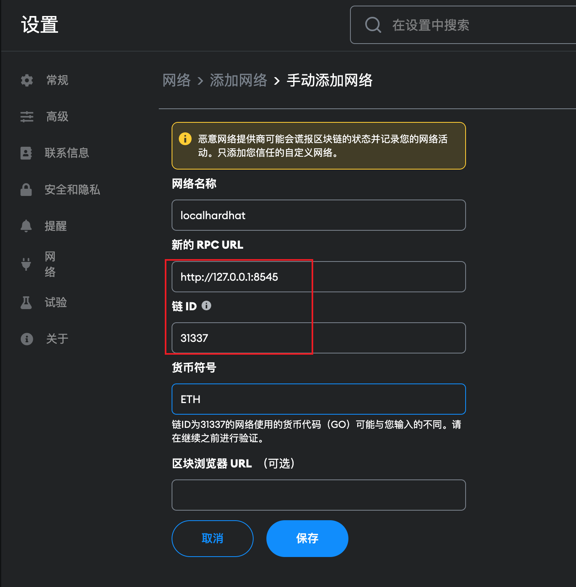
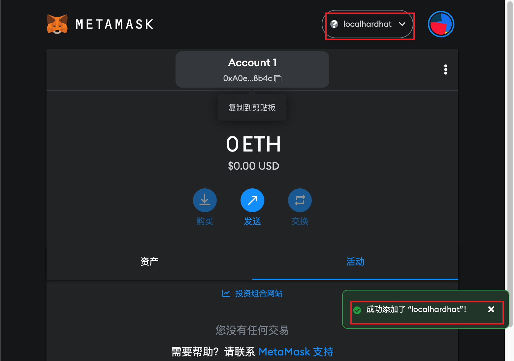
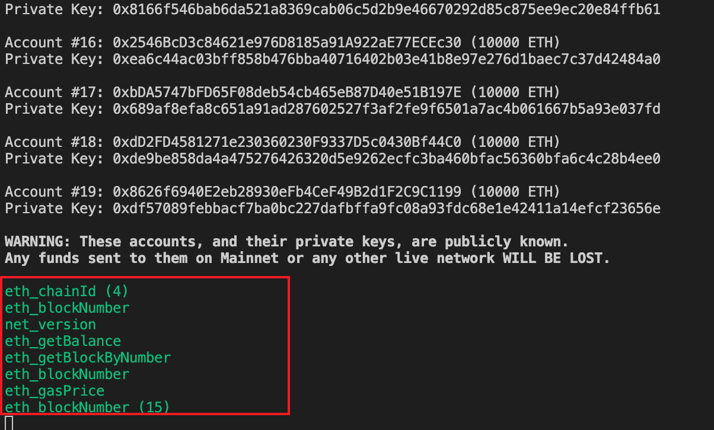

## 概述

[hardhat](https://hardhat.org/) 是以太坊软件的开发环境。它由用于编辑、编译、调试和部署智能合约和 dApp 的不同组件组成，所有这些组件共同创建一个完整的开发环境。 通读[官方文档](https://hardhat.org/hardhat-runner/docs/getting-started#overview) 后，本文补充记录一些注意事项和使用技巧。

1. 什么是 node provider?
2. 什么是 network accounts
3. hardhat lock 合约为什么 deploy 代码是怎么生成的？ hardhat.ether lib 如何使用？

## Config[^4]

- tasks 定义在配置文件 `hardhat.config.ts` 中。

## Network[^2]

### 本地节点网络

这个功能可以搭建本地测试网络，供其他钱包或者程序连接，有助于本地测试合约和 dapp 程序。

本地启动 hardhat node， `npx hardhat node`， 然后通过 metamask 添加网络：

添加网络后，metamask 自动切换网络到 `localhardhat` 网络：

运行 hardhat node 的控制台也打印出 metamask 连接时候发出的请求。

### fork other network[^3]

Hardhat Network 有能力将主网区块链的状态复制到你的本地环境中，包括所有余额和部署的合约。这就是所谓的 "fork other net"。

技术上来说，hardhat 可以 fork 任何 EVM-compatible blockchain，这样我们就可以更方便的在本地测试其他现有网络，不用担心 token 不足或者目标网络没有部署合适的测试网络等问题。

## test

hardhat 还包括 `hardhat-gas-reporter` 插件，可以根据测试的执行情况，获得 gas 使用量的指标。这有利于性能调优。

`REPORT_GAS=true npx hardhat test`

可以使用[Mocha Test Explorer](https://marketplace.visualstudio.com/items?itemName=hbenl.vscode-mocha-test-adapter) 直接从 Visual Studio Code 运行测试。[^1]

## Verify Contract

[A Guide to Smart Contract Verification](https://blog.tenderly.co/guide-to-smart-contract-verification-methods/) 对此有更进一步的说明。

[sourcify](https://sourcify.dev/)也有[一篇文章](https://docs.sourcify.dev/blog/verify-contracts-perfectly/) 说明他们是如何验证合约的。

## tasks & scripts

通过 `subtask` 来组织结构复杂的 task。

## console

console 的执行环境与任务、脚本和测试是一样的。这意味着 `hardhat config` 已被处理，`hre` 已被初始化并注入全局范围。

与 Ethereum 网络互动，都是异步操作。因此，大多数 API 和库使用 JavaScript 的 Promise 来返回值。

为了使事情变得更容易，Hardhat 的控制台支持顶级的 `await` 语句（例如，`console.log(await ethers.getSigners())`）。

## 命令行补全[^5]

Hardhat 有一个配套的 npm 包(`hardhat-shorthand`)， 作为 npx hardhat 的简写(`hh`)，同时，它可以在你的终端中实现命令行补全。可以将其全局安装，运行本地安装的 hardhat。

`npm install --global hardhat-shorthand`

## 参考

[^1]: [Running tests in Visual Studio Code](https://hardhat.org/hardhat-runner/docs/advanced/vscode-tests)
[^2]: [hardhat network](https://hardhat.org/hardhat-network/docs/overview)
[^3]: [fork other net](https://hardhat.org/hardhat-network/docs/guides/forking-other-networks)
[^4]: [hardhat config](https://hardhat.org/hardhat-runner/docs/config)
[^5]: [Command-line completion](https://hardhat.org/hardhat-runner/docs/guides/command-line-completion)
