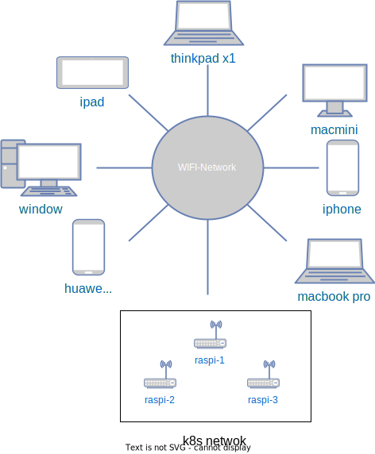
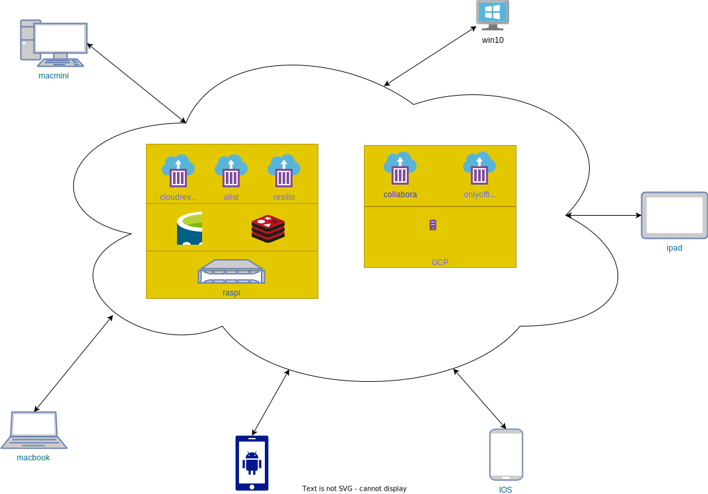

## 概述

## 技术需求

- 技术开源。开源软件从一定程度上更能保证安全性。优先选择 GitHub 上的开源项目。
- 自动化。好处不言自明，Github Action 搭配 docker compose 部署可以解决。
- 域名访问。
  - 域名使用之前阿里云申请的十年有效期的域名。 GCP 部署的服务有外网 IP，可以直接在阿里云绑定进行解析。
  - 家里内网部署的服务，通过 [cloudflare tunnel 提供内网穿透功能](https://sspai.com/post/79278)进行访问。Cloudflare 默认为域名提供 SSL 证书，支持 HTTPS 访问。
- 节能。 `7*24` 运行的服务能效比是必须考虑的，相比较 nas 或者 nuc，闲置吃灰的树莓派 4B 功耗只有 5w 左右，是个不错的选择。

## 业务需求

### 同步

作为业余摄影爱好者，现在积累的素材都已经上 T 了。年初时候 macmini 系统崩溃了一次，虽然最后数据恢复了，但仍然心有余悸。需求点：

- 同步。不只是备份，多端同步方便其他工作端(macbook/windows/Android/ios)进一步处理和分享。
- 速度要快。有 P2P 支持多设备同步当然更快。
- 最好支持加密后同步，方便利用现有网盘功能进行备份，这样既可以利用网盘功能，又不担心资源泄露。

多方调研后发现 resilio 用作跨设备同步是一个完美的解决方案。之前该软件曾被国内封禁过一段时间，现在已经解禁。

### 备份

自己搭建网盘主要有几方面的考虑：

- 有些网盘不开会员下载速度感人，没错，说的就是百度网盘。
- 敏感信息
  - 都是家人小孩视频，不想被拿做去 AI 训练。
  - 基于众所周知的原因，有些资源存储在国内的网盘会被删掉，哪怕是误删，厂商也不会承担任何责任，国内网盘提供商这方面可以说劣迹斑斑。

与同步功能不同，备份主要是用来存储下载的电影。这就要求除了基本的存储功能外，还需支持：

- webDAV。可以作为磁盘挂载本地电脑或者电视软件上通过 webDAV 打开。
- 在线预览播放功能，方便直接下载观看，不用下载。
- 分享，可以通过链接对外分享相关资源。

多方调研对比后发现 cloudreve 满足上面的需求。

## 家庭网络拓扑

- 为了可互联网访问家庭网络，使用 Cloudflare tunnel 进行内网穿透，注意启动服务

  ```shell
  sudo systemctl enable cloudflared
  sudo systemctl restart cloudflared
  ```

- 三台 raspi 为了达到通电可用的目的：

  - 设置好 SSH 后通电即可使用。
  - 通过 WIFI 连接到路由器，在路由器上绑定 mac 和 IP。

- NUC 通过 wlan 唤醒的方式，使用 Microsoft Remote Desktop 工具进行远程访问



## 业务架构



- raspi 上面的服务通过 docker compose 进行部署，所有的服务共享 home-services 网络，这样就不用对外暴露端口，减少暴露风险
- collabora 和 onlyoffice 运行对树莓派的负载较大，所以部署在 GCP 上面。

## 进度

- [resilio]() 用于资源同步。
- [cloudreve]() 私人网盘空间。
- [alist]() 网盘聚合，用于聚合 115、阿里云盘等网盘资源。
- clash 用于软路由，科学上网。

```

```
