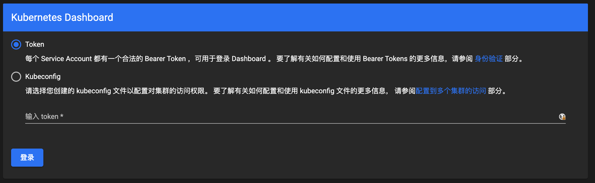
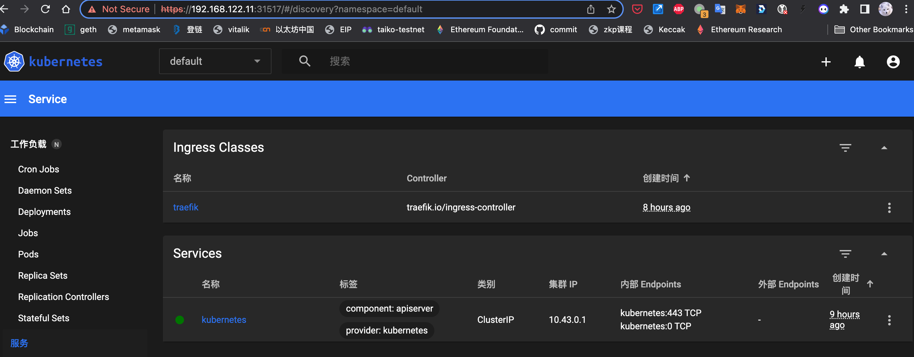

## dashboard

[dashboard](https://github.com/kubernetes/dashboard) Kubernetes Dashboard 是一个通用的、基于 Web 的 Kubernetes 集群的用户界面。它允许用户管理集群中运行的应用程序，并对其进行故障排除，以及管理集群本身。

## 安装

可以通过以下命令部署：

```shell
kubectl apply -f https://raw.githubusercontent.com/kubernetes/dashboard/v2.7.0/aio/deploy/recommended.yaml
```

## 配置

默认 dashboard 只能在集群内部访问，为了在集群外部访问，需要将 service 从 ClusterIP 改为 NodePort，为此[编辑 kubernetes-dashboard service](https://github.com/kubernetes/dashboard/blob/master/docs/user/accessing-dashboard/README.md#nodeport)：

```shell
kubectl -n kubernetes-dashboard edit service kubernetes-dashboard
```

在服务对应的配置文件中，将 `type: ClusterIP` 修改为 `type: NodePort`，保存文件。

查看部署状态

```shell
kubectl get po,svc -n kubernetes-dashboard
NAME                                             READY   STATUS    RESTARTS         AGE
pod/dashboard-metrics-scraper-5cb4f4bb9c-s7qn5   1/1     Running   99 (2m27s ago)   22h
pod/kubernetes-dashboard-6967859bff-gndtg        1/1     Running   83 (2m27s ago)   22h

NAME                                TYPE        CLUSTER-IP       EXTERNAL-IP   PORT(S)         AGE
service/dashboard-metrics-scraper   ClusterIP   10.110.149.173   <none>        8000/TCP        2d4h
service/kubernetes-dashboard        NodePort    10.100.197.19    <none>        443:31707/TCP   2d4h
```

Dashboard has been exposed on port 31707 (HTTPS).

### 创建示例用户

为了保护你的集群数据，默认情况下，Dashboard 会使用最少的 RBAC 配置进行部署。 当前，Dashboard 仅支持使用 Bearer 令牌登录。

可以按照[创建示例用户](https://github.com/kubernetes/dashboard/blob/master/docs/user/access-control/creating-sample-user.md) 上的为管理员用户创建令牌。

创建以下资源清单文件：

dashboard.admin-user.yml



dashboard.admin-user-role.yml



部署 admin-user 配置：

```shell
kubectl create -f dashboard.admin-user.yml -f dashboard.admin-user-role.yml
```

获取管理员令牌：

```shell
sudo kubectl -n kubernetes-dashboard create token admin-user
```

### 欢迎界面

浏览器打开 `https://<control-plane-ip>:31707`，可以看到登录界面。



control-plane-ip 可以通过执行 `kubectl cluster-info` 看到。

输入上一步骤产生的 token 即可登录查看集群信息。



### 删除默认证书

```shell
kubectl delete secret kubernetes-dashboard-certs -n kubernetes-dashboard

kubectl create secret generic kubernetes-dashboard-certs \
--from-file=/opt/kubernetes/ssl/server-key.pem --from-file=/opt/kubernetes/ssl/server.pem -n kubernetes-dashboard
```
