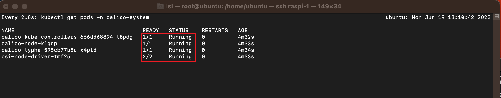

## 概述

按照官方的[使用 kubeadm 引导集群](https://kubernetes.io/zh-cn/docs/setup/production-environment/tools/kubeadm/)进行搭建部署。

注意安装过程中需要用到 root 权限的，不要使用`sudo`，而使用 `sudo su` 切换到 root 用户执行。

## 准备开始

| hostname | 硬件     | CPU | 内存 | 磁盘          | 系统             | 容器运行时 | 角色   |
| -------- | -------- | --- | ---- | ------------- | ---------------- | ---------- | ------ |
| ubuntu   | raspi 4B |     | 8G   | 256GB SSD     | ubuntu 22.04 LTS | containerd | master |
| rb2      | raspi 4B |     | 8G   | 64GB micro-sd | ubuntu 22.04 LTS | cri-o      | node   |
| rb4      | raspi 4B |     | 8G   | 64GB micro-sd | ubuntu 22.04 LTS | containerd | node   |

### 更改树莓派名字

将几个树莓派名字就分别改成了 rb1/rb2/rb3/：

```shell
ubuntu@ubuntu:~$ sudo hostnamectl hostname rb1
ubuntu@ubuntu:~$ hostnamectl status
 Static hostname: rb1
       Icon name: computer
      Machine ID: 7da3fac0bd364c13b961b0f417046494
         Boot ID: 6f52ccfc62704383a852e47839e6c543
Operating System: Ubuntu 22.04.2 LTS
          Kernel: Linux 5.15.0-1024-raspi
    Architecture: arm64
```

### 运行时选择

关于[容器运行时的对比](https://www.zhangjiee.com/blog/2021/container-runtime.html)，两台安装 containerd，一台安装 cri-o。

### 识别 Linux 节点上的 cgroup 版本

[官方说明](https://kubernetes.io/zh-cn/docs/concepts/architecture/cgroups/)

cgroup 版本取决于正在使用的 Linux 发行版和操作系统上配置的默认 cgroup 版本。 要检查你的发行版使用的是哪个 cgroup 版本，请在该节点上运行 stat -fc %T /sys/fs/cgroup/ 命令：

```shell
stat -fc %T /sys/fs/cgroup/
```

- 对于 cgroup v2，输出为 cgroup2fs。
- 对于 cgroup v1，输出为 tmpfs。

对于当前系统版本，默认支持 cgroup v2

## 安装容器运行时

根据[官方指南](https://kubernetes.io/zh-cn/docs/setup/production-environment/container-runtimes/#%E8%BD%AC%E5%8F%91-ipv4-%E5%B9%B6%E8%AE%A9-iptables-%E7%9C%8B%E5%88%B0%E6%A1%A5%E6%8E%A5%E6%B5%81%E9%87%8F) 操作。

### 转发 IPv4 并让 iptables 看到桥接流量

执行下述指令：

```shell
cat <<EOF | sudo tee /etc/modules-load.d/k8s.conf
overlay
br_netfilter
EOF

sudo modprobe overlay
sudo modprobe br_netfilter
```

设置所需的 sysctl 参数，参数在重新启动后保持不变

```shell
cat <<EOF | sudo tee /etc/sysctl.d/k8s.conf
net.bridge.bridge-nf-call-iptables = 1
net.bridge.bridge-nf-call-ip6tables = 1
net.ipv4.ip_forward = 1
EOF
```

应用 sysctl 参数而不重新启动

```shell
sudo sysctl --system
```

通过运行以下指令确认 br_netfilter 和 overlay 模块被加载：

```shell
lsmod | grep br_netfilter
lsmod | grep overlay
```

通过运行以下指令确认`net.bridge.bridge-nf-call-iptables、net.bridge.bridge-nf-call-ip6tables 和 net.ipv4.ip_forward` 系统变量在你的 sysctl 配置中被设置为 1：

```shell
sysctl net.bridge.bridge-nf-call-iptables net.bridge.bridge-nf-call-ip6tables net.ipv4.ip_forward
```

### cgroup 驱动

需要确保 kubelet 与将来使用的容器运行时的 cgroup 都使用 systemd 驱动。

后续安装过程中可以发现，当前 kubelet(v1.27.3) 默认驱动已经是 cgroup。

### containerd

按照[官方说明](https://github.com/containerd/containerd/blob/main/docs/getting-started.md#option-2-from-apt-or-dnf)通过 docker 进行安装，注意执行[linux post-install](https://docs.docker.com/engine/install/linux-postinstall/) 启动 containerd 服务。

生成默认配置文件：

```shell
sudo su
containerd config default > /etc/containerd/config.toml
```

做如下修改：

#### 配置 systemd cgroup 驱动

```conf
[plugins."io.containerd.grpc.v1.cri".containerd.runtimes.runc.options]
  SystemdCgroup = true
```

由于是从软件包（例如，RPM 或者 .deb）中安装 containerd，你可能会发现其中默认禁止了 CRI 集成插件。你需要启用 CRI 支持才能在 Kubernetes 集群中使用 containerd。 要确保 cri 没有出现在配置文件中 disabled_plugins 列表内。

#### 重载沙箱（pause）镜像

```conf
[plugins."io.containerd.grpc.v1.cri"]
  sandbox_image = "registry.aliyuncs.com/google_containers/pause:3.9"
```

注意：

- 通过`kubeadm config images list` 可以看到当前 kubeadm 使用的 `registry.k8s.io/pause` 是 3.9，所以这里也应使用该版本。
- 由于国内访问 `registry.k8s.io` 有问题，所以使用阿里云的镜像服务。

配置文件修改以后需要重启 containerd，

```shell
systemctl restart containerd
```

查看当前 containerd 版本。

```shell
containerd --version
containerd containerd.io 1.6.21 3dce8eb055cbb6872793272b4f20ed16117344f8
```

### cri-o

```shell
sudo su
export VERSION=1.24 OS=xUbuntu_22.04

echo "deb [signed-by=/usr/share/keyrings/libcontainers-archive-keyring.gpg] https://download.opensuse.org/repositories/devel:/kubic:/libcontainers:/stable/$OS/ /" > /etc/apt/sources.list.d/devel:kubic:libcontainers:stable.list
echo "deb [signed-by=/usr/share/keyrings/libcontainers-crio-archive-keyring.gpg] https://download.opensuse.org/repositories/devel:/kubic:/libcontainers:/stable:/cri-o:/$VERSION/$OS/ /" > /etc/apt/sources.list.d/devel:kubic:libcontainers:stable:cri-o:$VERSION.list

mkdir -p /usr/share/keyrings
curl -L https://download.opensuse.org/repositories/devel:/kubic:/libcontainers:/stable/$OS/Release.key | gpg --dearmor -o /usr/share/keyrings/libcontainers-archive-keyring.gpg
curl -L https://download.opensuse.org/repositories/devel:/kubic:/libcontainers:/stable:/cri-o:/$VERSION/$OS/Release.key | gpg --dearmor -o /usr/share/keyrings/libcontainers-crio-archive-keyring.gpg

apt update
apt install -y cri-o cri-o-runc
```

#### 重载 crio 沙箱（pause）镜像

```conf
# /etc/crio/crio.conf
[crio.image]
pause_image="registry.aliyuncs.com/google_containers/pause:3.9"
```

启动 service

```shell
systemctl enable crio && systemctl start crio
```

### docker

`docker info`：



Docker Engine 没有实现 CRI， 而这是容器运行时在 Kubernetes 中工作所需要的。 为此，必须安装一个额外的服务 cri-dockerd。

```shell
git clone https://github.com/Mirantis/cri-dockerd.git
cd cri-dockerd
make cri-dockerd
sudo su
install -o root -g root -m 0755 cri-dockerd /usr/local/bin/cri-dockerd
install packaging/systemd/* /etc/systemd/system
sed -i -e 's,/usr/bin/cri-dockerd,/usr/local/bin/cri-dockerd,' /etc/systemd/system/cri-docker.service
systemctl daemon-reload
systemctl enable cri-docker.service
systemctl enable --now cri-docker.socket
```

## 使用部署工具安装 Kubernetes

我们选择通过 kubeadm 来引导集群。[官方指南](https://kubernetes.io/zh-cn/docs/setup/production-environment/tools/kubeadm/)

### 准备工作

- 操作系统关闭 swap。当前系统并未开启，所以不需要做修改；如需修改，可在 `/etc/fstab` 中注释掉 `swapfile`。
- 确保每个节点上 MAC 地址，当前系统没有发现 product_uuid，可以忽略。

### 安装 kubeadm、kubelet 和 kubectl

需要通过环境变量以及[apt 配置代理]()，才可以访问 `packages.cloud.google.com`。

```shell
export https_proxy=http://clash:7890 http_proxy=http://clash:7890 all_proxy=socks5://clash:7890
```

更新 apt 包索引并安装使用 Kubernetes apt 仓库所需要的包：

```shell
sudo apt update
sudo apt install -y apt-transport-https ca-certificates curl
```

下载 Google Cloud 公开签名秘钥：

```shell
curl -fsSL https://packages.cloud.google.com/apt/doc/apt-key.gpg | sudo gpg --dearmor -o /etc/apt/keyrings/kubernetes-archive-keyring.gpg
```

添加 Kubernetes apt 仓库：

```shell
echo "deb [signed-by=/etc/apt/keyrings/kubernetes-archive-keyring.gpg] https://apt.kubernetes.io/ kubernetes-xenial main" | sudo tee /etc/apt/sources.list.d/kubernetes.list
```

更新 apt 包索引，安装 kubelet、kubeadm 和 kubectl，并锁定其版本：

```shell
sudo apt update
sudo apt install -y kubelet kubeadm kubectl
sudo apt-mark hold kubelet kubeadm kubectl
```

### 配置 cgroup 驱动程序

容器运行时和 kubelet 都具有名字为 "cgroup driver" 的属性，该属性对于在 Linux 机器上管理 CGroups 而言非常重要。

警告：你需要确保容器运行时和 kubelet 所使用的是相同的 cgroup 驱动，否则 kubelet 进程会失败。

## 创建集群

[官方指南](https://kubernetes.io/zh-cn/docs/setup/production-environment/tools/kubeadm/create-cluster-kubeadm/)

### 准备所需的容器镜像

```shell
sudo kubeadm config images pull --image-repository registry.aliyuncs.com/google_containers
```

### 初始化控制平面节点

```shell
sudo kubeadm init --apiserver-advertise-address=192.168.122.12 --pod-network-cidr=192.168.0.0/16 --cri-socket=unix:///run/containerd/containerd.sock --image-repository registry.aliyuncs.com/google_containers

```

- `apiserver-advertise-address：kubeadm` 使用 eth0 的默认网络接口（通常是内网 IP）做为 Master 节点的 advertise address ，如果我们想使用不同的网络接口，可以使用 `--apiserver-advertise-address` 参数来设置
- `pod-network-cidr：pod-network-cidr`: 指定 pod 网络的 IP 地址范围，它取决于你在下一步选择的哪个网络网络插件，比如我在本文中使用的是 Calico 网络，指定为 192.168.0.0/16。

成功后显示结果如下：



要使非 root 用户可以运行 kubectl，请运行以下命令， 它们也是 kubeadm init 输出的一部分：

```shell
mkdir -p $HOME/.kube
sudo cp -i /etc/kubernetes/admin.conf $HOME/.kube/config
sudo chown $(id -u):$(id -g) $HOME/.kube/config
```

#### init 失败处理

- 切换至 root 权限：`sudo su`
- 执行重置命令：`kubeadm reset -f  --cri-socket=unix:///var/run/containerd/containerd.sock`
- 删除所有相关数据:

  ```shell
  rm -rf /etc/cni /etc/kubernetes /var/lib/dockershim /var/lib/etcd /var/lib/kubelet /var/run/kubernetes ~/.kube/\*
  ```

- 刷新所有防火墙(iptables)规则

```shell
iptables -F && iptables -X
iptables -t nat -F && iptables -t nat -X
iptables -t raw -F && iptables -t raw -X
iptables -t mangle -F && iptables -t mangle -X
```

### 验证控制平面节点

普通用户使用以下命令确认您的集群中现在有一个节点。

```shell
kubectl get nodes -o wide
```

它应该返回类似如下内容:

```shell
NAME     STATUS     ROLES           AGE    VERSION   INTERNAL-IP      EXTERNAL-IP   OS-IMAGE             KERNEL-VERSION      CONTAINER-RUNTIME
ubuntu   Ready    control-plane   3h20m   v1.27.3   192.168.122.11   <none>        Ubuntu 22.04.2 LTS   5.15.0-1032-raspi   containerd://1.6.21
```

## 安装 Pod 网络附加组件

根据[指南](https://docs.tigera.io/calico/latest/getting-started/kubernetes/quickstart)安装 calico 网络创建。

```shell
sudo su
export KUBECONFIG=/etc/kubernetes/admin.conf
```

安装 Tigera Calico 运算符和自定义资源定义。

```shell
kubectl create -f https://raw.githubusercontent.com/projectcalico/calico/v3.26.0/manifests/tigera-operator.yaml
```

通过创建必要的自定义资源来安装 Calico。有关此清单中可用的配置选项的更多信息，请参阅[安装参考](https://docs.tigera.io/calico/latest/reference/installation/api)。

```shell
kubectl create -f https://raw.githubusercontent.com/projectcalico/calico/v3.26.0/manifests/custom-resources.yaml
```

使用以下命令确认所有 pod 都在运行。

```shell
watch kubectl get pods -n calico-system
```

等到每个 pod 的状态都为 Running。



### 控制平面节点隔离

默认情况下，出于安全原因，你的集群不会在控制平面节点上调度 Pod。 如果你希望能够在控制平面节点上调度 Pod，例如单机 Kubernetes 集群，请运行:

```shell
kubectl taint nodes --all node-role.kubernetes.io/control-plane-
node/<your-hostname> untainted
```

## 加入数据节点

### 执行加入命令

```shell
sudo su
kubeadm join 192.168.122.12:6443 --token knao8f.3y0su********iq --discovery-token-ca-cert-hash sha256:9eee********d1eb926d9c8438e34f6cb60a6c937da2e67
```

### 验证加入成功

几秒钟后，当你在控制平面节点上执行 kubectl get nodes，你会注意到该节点出现在输出中：



### 为其他用户生成 kubeconfig 文件

[官方指南](https://kubernetes.io/zh-cn/docs/tasks/administer-cluster/kubeadm/kubeadm-certs/#kubeconfig-additional-users)

在集群创建过程中，kubeadm 对 admin.conf 中的证书进行签名时，将其配置为 Subject: O = system:masters, CN = kubernetes-admin。 system:masters 是一个例外的超级用户组，可以绕过鉴权层（例如 RBAC）。 强烈建议不要将 admin.conf 文件与任何人共享。

你要使用 kubeadm kubeconfig user 命令为其他用户生成 kubeconfig 文件，这个命令支持命令行参数和 kubeadm 配置结构。 以上命令会将 kubeconfig 打印到终端上，也可以使用 kubeadm kubeconfig user ... > somefile.conf 输出到一个文件中。

如下 kubeadm 可以在 --config 后加的配置文件示例：

## kubelet

### 启动服务

最后, 考虑到集群宕机自愈的问题, 还需要设置 kubelet 服务开机自动启动:

```shell
sudo systemctl enable kubelet
sudo systemctl restart kubelet
```

## kubectl

[在 Linux 系统中安装并设置 kubectl](https://kubernetes.io/zh-cn/docs/tasks/tools/install-kubectl-linux/)

### 启动自动补全功能

```shell
echo 'source <(kubectl completion bash)' >>~/.bashrc
```

## 部署和访问 Kubernetes 仪表板（Dashboard）

[官方指南](https://kubernetes.io/zh-cn/docs/tasks/access-application-cluster/web-ui-dashboard/)

### 部署 Dashboard UI

默认情况下不会部署 Dashboard。可以通过以下命令部署：

```shell
kubectl apply -f https://raw.githubusercontent.com/kubernetes/dashboard/v2.7.0/aio/deploy/recommended.yaml
```

### 访问 Dashboard 用户界面

为了保护你的集群数据，默认情况下，Dashboard 会使用最少的 RBAC 配置进行部署。 当前，Dashboard 仅支持使用 Bearer 令牌登录。 要为此样本演示创建令牌，你可以按照[创建示例用户](https://github.com/kubernetes/dashboard/blob/master/docs/user/access-control/creating-sample-user.md) 上的指南进行操作。

```shell

```

## 参考

- [搭建一个基于 containerd 的高可用 Kubernetes 集群](https://www.rondochen.com/build-your-own-k8s-cluster/)
- [https://blog.haohtml.com/archives/32728](https://blog.haohtml.com/archives/32728)
- [手把手教大家使用树莓派 4B 搭建 K8s 集群](https://zhuanlan.zhihu.com/p/390805379)
