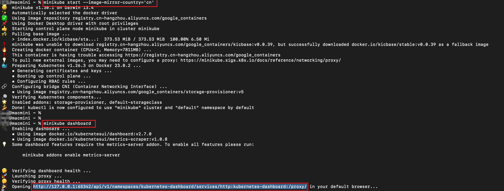
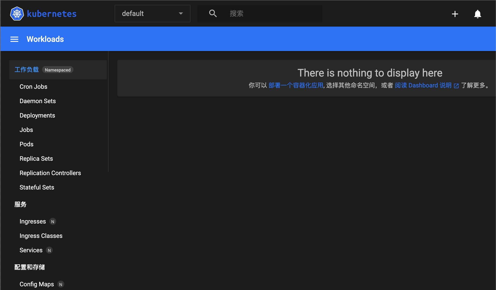

## 概述

为了方便开发和体验 Kubernetes，社区提供了可以在本地部署的开发环境 Minikube。

- [minikube 官方教程](https://minikube.sigs.k8s.io/docs/start/)

## start cluster

由于国内网络原因，无法下载相关的镜像，官方给出了[解决办法](https://minikube.sigs.k8s.io/docs/faq/#i-am-in-china-and-i-encounter-errors-when-trying-to-start-minikube-what-should-i-do)：

`minikube start --image-mirror-country='cn'`



更多的命令行参数参见 [commands](https://minikube.sigs.k8s.io/docs/commands/)。

查看当前已经启动的 pods：`kubectl get po -A`

```shell
NAMESPACE              NAME                                        READY   STATUS    RESTARTS   AGE
kube-system            coredns-567c556887-vfpvs                    1/1     Running   0          133m
kube-system            etcd-minikube                               1/1     Running   0          134m
kube-system            kube-apiserver-minikube                     1/1     Running   0          134m
kube-system            kube-controller-manager-minikube            1/1     Running   0          134m
kube-system            kube-proxy-vsdz8                            1/1     Running   0          133m
kube-system            kube-scheduler-minikube                     1/1     Running   0          134m
kube-system            metrics-server-6588d95b98-sbmfk             1/1     Running   0          12m
kube-system            storage-provisioner                         1/1     Running   0          134m
kubernetes-dashboard   dashboard-metrics-scraper-5c6664855-zmz2q   1/1     Running   0          133m
kubernetes-dashboard   kubernetes-dashboard-55c4cbbc7c-g7rzz       1/1     Running   0          133m

```

启动控制面板：`minikube dashboard`



可以简单浏览一下默认启动的 Services/cluster/namespaces/config 等。

## deploy applications

按照教程进行尝试，观察 dashboard 中工作负载/服务等的变化。
