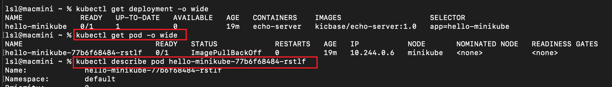
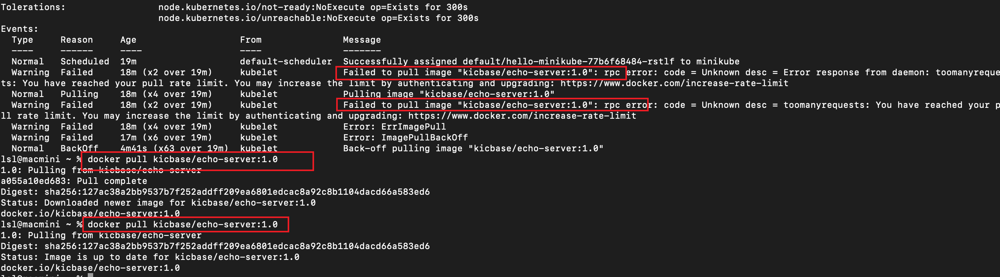

## 概述

## minikube

### hello-minikube 问题排查

[官方教程](https://minikube.sigs.k8s.io/docs/start/)，但是无法在浏览器中看到内容，说明 hello-minikube

查看 pod 状态：`kubectl get pod -o wide`，可以看到 hello-minikube pod 状态并没有 ready。



查看部署日志：`kubectl describe pod hello-minikube-77b6f68484-rstlf`



问题找到了：官网中的 kicbase/echo-server:1.0 镜像被墙，在国内无法拉取到镜像，导致 Pod 构建失败。

可以通过代理，手动下载出下载失败的镜像：

```shell
docker pull kicbase/echo-server:1.0
```

删掉之前的 service 和部署流程：

```shell
kubectl delete service hello-minikube
kubectl delete deploy hello-minikube
```

重新部署服务
