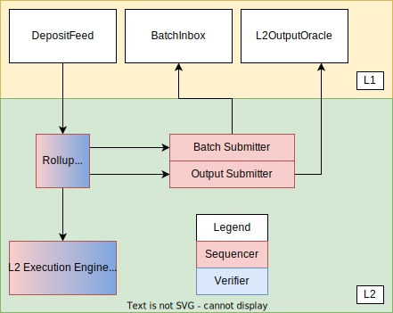

## 引言

[Bedrock](https://github.com/ethereum-optimism/optimism/tree/bedrock/specs) 是 Optimism 网络的下一个主要版本，计划于 2023 年第一季度发布。

## 架构

### L1 组件

+ `DepositFeed`：L2 交易的提要，起源于 L1 状态下的智能合约调用。（todo：这里是什么意思？）
  + `DepositFeed` 合约发出 `TransactionDeposited` 事件，`rollup driver` 读取这些事件以处理存款（deposits）。
  + 存款保证在`sequencing window`内反映在 L2 状态中。
  + 请注意，存入的是交易(transaction)，而不是代币（token）。然而，存款交易是实现代币存款的关键部分（代币在 L1 上锁定，然后通过存款交易在 L2 上铸造）。
+ `BatchInbox`：`Batch Submitter`用于批量提交交易的 L1 地址。
  + 批量交易包括 L2 交易的 calldata、timestamp 和 ordering information。
  + BatchInbox 是一个常规的 EOA 地址。 这让我们可以通过不执行任何 EVM 代码来节省 gas 成本。
+ `L2OutputOracle`：一种存储 [L2 output root]() 的智能合约，用于取款和故障证明。

### L2 组件

+ Rollup node：
  + 一个独立的、无状态的二进制文件。
  + Receives L2 transactions from users.（todo: 有这个功能么？）
  + 同步并验证 L1 上的 rollup 数据。
  + 应用特定于 rollup 的块生产规则从 L1 合成块。
  + 使用 engine-api 将块附加到 L2 链。
  + 处理 L1 重组。
  + 将未提交的块分发到其他 rollup node 。

+ Execution engine：实际执行交易的组件。

## Rollup node

rollup node 有点类似于 consensus layer client，它始终向 execution engine 提供 L2 state root，因为这是需要来自 L1 的可信的 root。它还可以提供来自 L1 的所有交易进行同步，但该机制比 snap sync 慢。

它还可以通过对等网络进行通信，以下载尚未提交给 L1 的块。参见 [这篇文章]()

有关rollup node的更多信息可以参阅 [Rollup Node Specification](https://github.com/ethereum-optimism/optimism/blob/develop/specs/rollup-node.md)。

## Execution engine

Execution engine（[op-geth](https://github.com/ethereum-optimism/op-geth)），是一个稍加修改的 geth 版本，类似于以前版本的 l2geth[^3]，但没有与 [DTL](https://github.com/ethereum-optimism/optimism/tree/develop/packages/data-transport-layer)[^3] 等效的部分；在 EVM 等效性方面，更接近上游 geth。

从上游 geth 继承的一个重要特性是它们的点对点（其他 Optimism  execution engine）同步，这可以更快的同步 state 和 transaction。请注意，点对点同步是允许的，而不是必需的。为了抗审查，execution engine 可以只从rollup node 同步。有两种可能的同步类型：

+ `Snap sync`，它只将状态同步到已提交到 L1 的点。
+ `Unsafe block sync`，包括 sequencer 创建的所有内容，即使尚未写入 L1。

Bedrock 其他有关 contract、JsonRPC 等信息参见官网文章[^1] [^2]。

## 测试网络

使用 Bedrock 测试网络参考 [官方说明](https://oplabs.notion.site/Usage-Guide-3667cfd2b180475894201f4a69089419)。

如何运行一个 Bedrock 节点参考 [Running a Node](https://oplabs.notion.site/Running-a-Node-eda545c730e64b44b762ab12e93296aa)。

## 源码

+ [optimism](https://github.com/ethereum-optimism/optimism) 中有部分代码属于 Bedrock，具体可以参看[仓库目录说明](https://github.com/ethereum-optimism/optimism#directory-structure)。
+ [op-geth](https://github.com/ethereum-optimism/op-geth) 二层网络节点，基于 Geth 1.10.x，

## 总结

[^1]: [How is Bedrock Different?](https://community.optimism.io/docs/developers/Bedrock/)
[^2]: [Infrastructure providers' guide (Bedrock edition)](https://community.optimism.io/docs/developers/Bedrock-temp/infra/)
[^3]: [How Optimism Works](https://community.optimism.io/docs/how-optimism-works/#block-execution)
