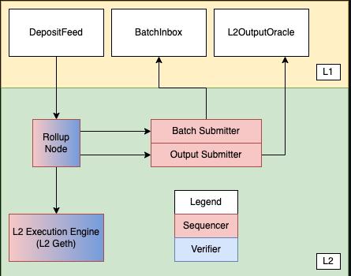
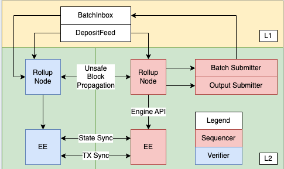
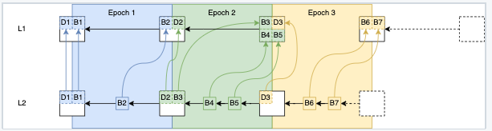

## 引言

[上篇文章]()我们介绍了 optimism 的网络角色以及关键的交互流程。从这篇文章开始，我们从代码角度分析 optimism 的实现。

## 代码架构

### L1 组件

+ `DepositFeed`：源于 L1 状态下的智能合约调用的 L2 交易的提要（todo:这里的翻译是什么意思？）。
  + `DepositFeed` 合约发出 `TransactionDeposited` 事件，`rollup driver` 读取这些事件以处理 deposits。
  + Deposits 保证在`sequencing window`内反映在 L2 状态中。
  + 请注意，deposit 的是交易(transaction)，而不是代币（token）。然而，deposited transaction 是实现代币充值的关键部分（代币在 L1 上锁定，然后通过 deposited transaction 在 L2 上铸造）。
+ `BatchInbox`：用于`Batch Submitter`提交 transaction batches 的 L1 地址。
  + transaction batches 包括 L2 交易的 calldata、时间戳和排序信息。
  + BatchInbox 是一个常规的 EOA 地址。这让我们可以通过不执行任何 EVM 代码来节省 gas 成本（todo：这句话是什么意思）。
+ `L2OutputOracle`：一种存储 [L2 output root](https://github.com/ethereum-optimism/optimism/blob/develop/specs/glossary.md#l2-output) 的智能合约，用于取款和故障证明。

### L2 组件

+ Rollup node：
  + 一个独立的、无状态的二进制文件。
  + 从用户接收 L2 交易。
  + 同步并验证 L1 上的 rollup 数据。
  + 应用特定于 rollup 的块生产规则从 L1 合成块。
  + 使用 engine-api 将块附加到 L2 链。
  + 处理 L1 重组。
  + 将未提交的块传播到其他 rollup node。

+ Execution engine：
  + 一个普通的 Geth node，经过少量修改以支持 Optimism。
  + 维护 L2 状态。
  + 将状态同步到其他 L2 节点以实现快速加入。
  + 向 rollup node 提供 engine-API。

+ Batch Submitter

  将（[transaction batches](https://github.com/ethereum-optimism/optimism/blob/develop/specs/glossary.md#sequencer-batch)）提交到 BatchInbox 地址的后台进程。

+ Output Submitter

  将 L2 output commitments 提交到 L2OutputOracle 的后台进程。

### 交易/块传播

规范链接:[Execution Engine]()

由于 EE 在底层使用 Geth，Optimism 使用 Geth 的内置 P2P 网络和交易池来传播交易。同一网络还可用于传播提交的块并支持快照同步（snap sync）。

未提交的块将使用单独的 Rollup 节 P2P 网络传播。 这是可选的，并且是为了降低验证器（verifiers）及其 JSON-RPC 客户端的延迟而提供的。下图说明了定序器（sequencer）和验证器（verifiers）如何组合在一起：

## 深入理解关键交互

### deposits

规范链接:[deposits]()

Optimism 支持两种类型的`deposit`：`user deposits` 和 `L1 attributes deposits` 。 为了执行`user deposits`，用户调用`DepositFeed`合约上的`depositTransaction` 方法。 这反过来会发出`TransactionDeposited`事件，rollup 节点会在区块推导期间读取这些事件。

L1 attributes deposits 用于在 L2 上注册 L1 块属性（数字、时间戳等），通过调用 L1 Attributes Predeploy 来执行。 它们不能由用户发起，而是由 rollup 节点自动添加到 L2 块中。两种 Deposit 类型都由 L2 上的单个自定义 EIP-2718 交易类型表示。

### 块推导（block derivations）

#### 概述

给定 L1 以太坊链，可以确定性地推导出 rollup chain。整个 rollup chain 可以基于 L1 块推导这一事实使 Optimism 成为 rollup。这个过程可以表示为：

`derive_rollup_chain(l1_blockchain) -> rollup_blockchain`

Optimism 的区块推导函数是这样设计的：

+ 除了可以通过 L1 和 L2 engine-api 访问的状态外，不需要任何状态。
+ 支持定序器和定序器共识。
+ 对定序器审查具有弹性。

##### Epochs and 定序窗口(Sequencing Window)

rollup chain 被细分为 epoch。 L1 区块编号和 epoch 编号之间存在 1:1 的对应关系。

对于编号为 n 的 L1 区块，有一个对应的 rollup epoch n，它只能在经过一个定序窗口数量的区块后得出，即在编号为 `n + SEQUENCING_WINDOW_SIZE` 的 L1 区块被添加到 L1 链之后。

每个 epoch 至少包含一个区块。 epoch 中的每个块都有一个包含 L1 信息的交易，其中包含有关 L1 的上下文信息，例如块哈希和时间戳。该 epoch 的第一个区块还包含通过 L1 上的 DepositFeed 合约发起的所有 deposits。所有 L2 块还可以包含有序交易，比如直接提交给定序器的交易。

每当定序器为给定的 epoch 创建新的 L2 块时，它必须在 epoch 的定序窗口内将块作为 batch 的一部分提交给 L1（即 batch 必须在 L1 块 `n + SEQUENCING_WINDOW_SIZE` 之前落地）。这些 batch （连同 L1 `TransactionDeposited`事件）允许从 L1 链推导 L2 链。

为了在 L1 顶端构建 L2 块，可将 L2 块批量提交到 L1，而这不需要定序器。事实上，交易批次通常包含多个 L2 块价值的有序交易。这也是定序器上实现快速交易确认的原因。（todo: 这句话是什么意思？）

由于给定 epoch 的 transaction batches 可以在定序窗口内的任何位置提交，因此验证器必须在窗口内的所有块中搜索交易批次。这可以防止 L1 交易包含的不确定性。（todo：这里是什么意思？）这种不确定性也是我们首先需要定序窗口的原因：否则 定序器可能会追溯性地将块添加到旧 epoch，而验证器将不知道它们何时可以完成一个 epoch。

定序窗口还可以防止定序器进行审查：最坏情况下，在`SEQUENCING_WINDOW_SIZE`个 L1 块通过后，在给定的 L1 块上进行的 deposits 将被包含在 L2 链中。

下图描述了这种关系，以及如何从 L1 块推导 L2 块（L1 信息交易已被省略）：

（todo: 这幅图是什么意思？）

##### 块推导循环

rollup 节点的一个被称为 rollup driver 的子组件实际上负责执行块推导。rollup driver 本质上是一个运行区块推导函数的无限循环。对于每个 epoch，块推导函数执行以下步骤：

+ 下载定序窗口中的 deposit 和每个区块的 transaction batch 数据。
+ 将 deposit 和 transaction batch 数据转换为 engine API 的 payload attributes。
+ 将 payload attributes 提交给 engine API，在那里它们被转换成块并添加到规范链中。

然后以递增处理 的epoch，直到到达 L1 的顶端。

### Engine API

rollup driver 实际上并不创建块。相反，它指示执行引擎通过engine API 执行此操作。对于上述块推导循环的每次迭代，rollup driver 将创建一个 payload attributes 对象并将其发送到执行引擎。执行引擎然后将 payload attributes 对象转换为块，并将其添加到链中。rollup driver 的基本顺序如下：

+ 使用 payload attributes 对象调用`engine_forkChoiceUpdatedV1`。我们现在将跳过分叉选择状态参数的细节——只知道它的字段之一是 L2 链的`headBlockHash`，并且它被设置为 L2 链顶端的块哈希。 engine API 返回 payload  ID。
+ 使用步骤 1 中返回的 payload ID 调用`engine_getPayloadV1`。 engine API 返回一个 payload 对象，其中包含块哈希作为其字段之一。
+ 使用步骤 2 中返回的 payload 调用`engine_newPayloadV1`。
+ 调用`engine_forkChoiceUpdatedV1`，并将分叉选择参数的`headBlockHash`设置为步骤 2 中返回的区块哈希值。L2 链的顶端现在是步骤 1 中创建的区块。

## 测试网络

使用 Bedrock 测试网络参考 [官方说明](https://oplabs.notion.site/Usage-Guide-3667cfd2b180475894201f4a69089419)。

如何运行一个 Bedrock 节点参考 [Running a Node](https://oplabs.notion.site/Running-a-Node-eda545c730e64b44b762ab12e93296aa)。

## 总结
