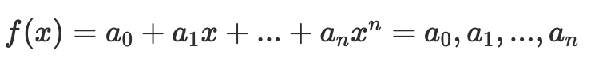
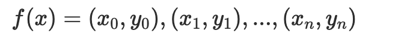
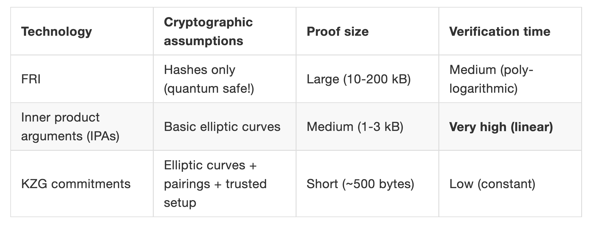

## 多项式

什么是多项式？这个比较简单，以单变量多项式为例说明：

以上是系数表示形式，系数序列确定多项式也就确定了。

还有一种表示方法是使用 n+1 点值对表示 n 次多项式。

同样，这种方法也能唯一确定多项式。

两种表示方法，各有其应用场景，比如系数表示法在计算多项式相加的场合效率高，而点值表示法则应用在多项式相乘计算场合。

由于两种表示法本质是同一个东西，所以二者可以相互转化，其中 FFT 就是实现系数表达到点值表示的转换方法，而 IFFT 正好相反。关于 FFT 和 IFFT 深入解读超出本文范围，可自行查阅。

## 多项式承诺

多项式承诺(polynomial commitments) 有多种方式，比如最直接的就是把多项式系数承诺出去，这样`多项式在承诺后就不能再改变了`。 这种方式在系数较少即多项式度数较低时适用。

当系数比较多（比如超过 10 万）承诺结果就会比较大，增加存储与传输的代价。能不能用点值方式做承诺呢？最好适用一个点的值，因为点值用的多了同样也会有上述问题。

一个原始的点值承诺方法浮出水面：

### 全部打开

- 承诺生成（Commit）阶段：

  承诺方选择一个暂不公开的多项式，在某一点 r 处，计算出对应的承诺 c 并公开。`c = f(r)`, 将`(r,c)`公开给验证方

- 承诺披露（Reveal）阶段：

  承诺方公布多项式，验证方根据多项式计算 r 处值 c' = f(r)，比较 c'= c，一致则表示验证成功，否则失败。

这种原始承诺方式有问题吗？仔细想想容易发现有以下问题：

在 r 处取值为 c 的多项式存在多个，比如 `f(r) = c`, `g(r) = c` ,那么承诺方就可以在承诺时候使用多项式 f(x), 而在验证阶段使用 g(x) 也能通过验证，这样就达不到承诺的目的了。

### 部分打开

上面这种把多项式和盘托出的打开方式成为`全部打开`，还有一种`部分打开`的方式：

- 承诺生成（Commit）阶段：

  承诺方选择一个暂不公开的多项式，在某一点 r 处，计算出对应的承诺 c 并公开。c = f(r), 将（r，c）公开给验证方

- 挑战（challenge）与证明生成：

  验证方 V 随机选择一个数 z,发给承诺方 P, P 计算在 z 处值 s = f(z)，同时计算出 t(x) = f(x)-s / (x-z),计算 t(x)在 z 处的值 w = t(z)(w 也称为见证 witness) 返回给验证方 V(s,w)

- 验证阶段：

  验证方验证：s = f(z) --> f(z) - s = 0 --> 方程 f(x)-s = 0 有根 x=z, 即存在 t(x) 使得 f(x) - s = t(x)(x - z), 这个方程是恒等式，所以任意点都成立。

  在 r 处自然也是成立的，所以可以检验 f(r) - s = t(r)(r - z) = c - s = w(r - z ) 通过则验证成功，否则失败。

这种方法采用部分打开方式验证，使得多项式增加了隐私性，自始至终没有完全暴露最初的多项式。现在已经比较接近 Kate 承诺的方案了

## 应用场景

多项式承诺应用方向总结起来可以分为 3 大类

- 数据可用性（ETH Surge 升级，ETH danksharding，降低 L2 成本，模块化数据可用性项目 Avails）
- 数据结构优化（MPT 树改为 Verkle 树，ETH Verge 升级，无状态客户端，实现 ETH 的轻量的验证节点）
- 零知识证明系统（Zksync，Zkswap，Scroll，PSE 给 Zk 提供多项式承诺方案，大大提升链的拓展能力）

## 承诺方案

上表中：

- FRI 是 Starkware 采用的多项式承诺方案，可以实现量子级别的安全，但证明的数据量却是最大；
- IPA 是 Bulletproof 和 Halo2 零知识算法默认的多项式承诺方案，验证时间相对较长，采用的项目有门罗币，zcash 等，前两者是不需要初始可信设置的。
- 在证明大小与验证时间上，KZG 多项式承诺的优势比较大，KZG 承诺也是目前应用最广的一种多项式承诺方式。但 KZG 是基于椭圆曲线，配对函数，需要初始可信设置的。

## 参考

- [多项式承诺，正在重塑整个区块链](https://web3caff.com/zh/archives/38949)
- [多项式承诺 Polynomial commitment 方案汇总](https://blog.csdn.net/mutourend/article/details/125922653)
- [区块链中的数学 - 多项式承诺](https://learnblockchain.cn/article/2165)
- [Vitalik：以太坊状态爆炸问题，多项式承诺方案可解决](https://www.8btc.com/article/567865) 建议阅读。
