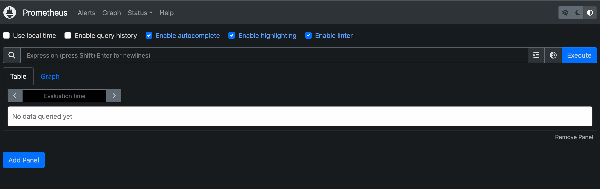
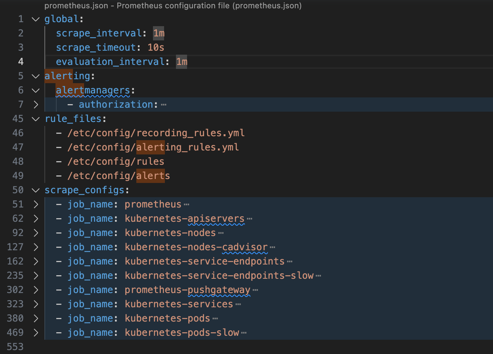
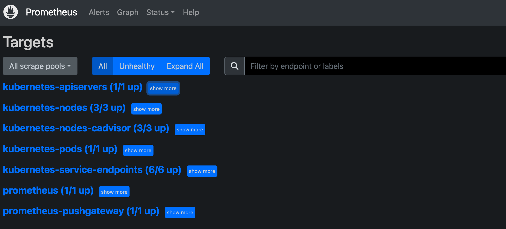

## 概述

[prometheus](https://prometheus.io/docs/introduction/overview/) 是目前 kubernetes 监控的事实标准。

### metric

metric 是数据模型。

- name
- labels
- timestamp
- value

### exporters

用于暴露 metrics 的实现称为 [exporter](https://prometheus.io/docs/instrumenting/exporters/)。

### Job & Instances

在 Prometheus 中，每一个可以抓取监控样本数据的 endpoint 称为一个实例(Instance)，通常对应单个进程。例如在当前主机上运行的 node exporter 可以被称为一个实例。

具有相同目的的实例集合（例如，为了可扩展性或可靠性而复制的进程）称为 job。

详见[Jobs and Instances](https://prometheus.io/docs/concepts/jobs_instances/#jobs-and-instances)

### 架构 {#architecture}


- Prometheus Server 是 Prometheus 组件中的核心部分，负责实现对监控数据的获取，存储以及查询。

## 部署

可以通过 helm 安装到 k8s 集群。



```shell
helm repo add prometheus-community https://prometheus-community.github.io/helm-charts &&
    helm repo update &&
    helm upgrade prometheus prometheus-community/prometheus -f prometheus/values.yaml --install --namespace monitor --create-namespace
```

可以对照 [架构]() 看下已经部署的 pods：



- 有三个 node exporter 用于获取 node 相关的 machine metrics，详见[pod 对应的镜像介绍](https://quay.io/repository/prometheus/node-exporter)。
- prometheus-kube-state-metrics 通过监听 kubernetes apiserver 获得各种资源对象的 metrics。详见[github 介绍](https://github.com/kubernetes/kube-state-metrics)
- prometheus server
- prometheus push gateway
- prometheus alert manager

## prometheus UI

Prometheus UI 是 Prometheus 内置的一个可视化管理界面，通过 Prometheus UI 用户能够轻松的了解 Prometheus 当前的配置，监控任务运行状态等。

```shell
kubectl port-forward services/prometheus-server 6789:80
```



### Alerts

### Graph{#graph}

通过 Graph 面板，用户可以直接使用 [PromQL]() 实时查询监控数据。

Prometheus server 本身提供了相关的 metrics，它提供有关内存使用、垃圾回收等各种主机级指标。

```shell
kubectl port-forward pods/prometheus-server-5dcccb966d-rrq88 6789:9090
```

浏览器打开 `http://localhost:6789/metrics` 查看相关的 metrics。

通过 describe pod 的相关信息：



可以看到 node-pod 是以 DaemonSet 方式部署在 Node 上，并且可以直接通过 NodeIP:9100 进行访问。

浏览器 `http://192.168.122.16:9100/metrics` 可以看到该 node-exporter 上报的信息，可以通过 cpu/memory/load 搜索到相关的 metric。

### Status

Status 系统运行状态的相关信息，比如 prometheus server 编译信息、tsdb 数据库状态、sever 命令行参数、server 配置、数据来源(target)、服务发现等信息。

#### Configuration{#Configuration}

这里可以查看当前 prometheus server 运行的配置，详细解析参见[配置说明]()，先看下默认配置的整体结构：



#### Rules

#### Targets

Targets 页面查看当前所有的监控任务（定义在[configuration]()），以及各个任务下所有实例(instances)的状态：



这与使用“up”表达式查询到的信息是一样的。

#### Service Discovery

## PromQL{#PromQL}

[探索 PromQL](https://yunlzheng.gitbook.io/prometheus-book/parti-prometheus-ji-chu/promql) 做了很好地解释，推荐学习。

## 配置{#config}

Prometheus Server 可以通过静态配置管理监控目标，也可以配合使用 Service Discovery 的方式动态管理监控目标，并从这些监控目标中获取数据。

具体配置参考 [Configuration](https://prometheus.io/docs/prometheus/latest/configuration/configuration/)

编辑好的配置可以通过 promtool 工具检查：

```shell
promtool check rules /path/to/example.rules.yml
```

## 高级

## 参考

- [prometheus book](https://yunlzheng.gitbook.io/prometheus-book/)

## Next

- Prometheus UI 提供了快速验证 PromQL 以及临时可视化支持的能力，而在大多数场景下监控系统通常还需要可以长期使用的监控数据可视化面板（Dashboard）。这时用户可以考虑使用第三方的可视化工具如 [Grafana]()，Grafana 是一个开源的可视化平台，并且提供了对 Prometheus 的完整支持。
