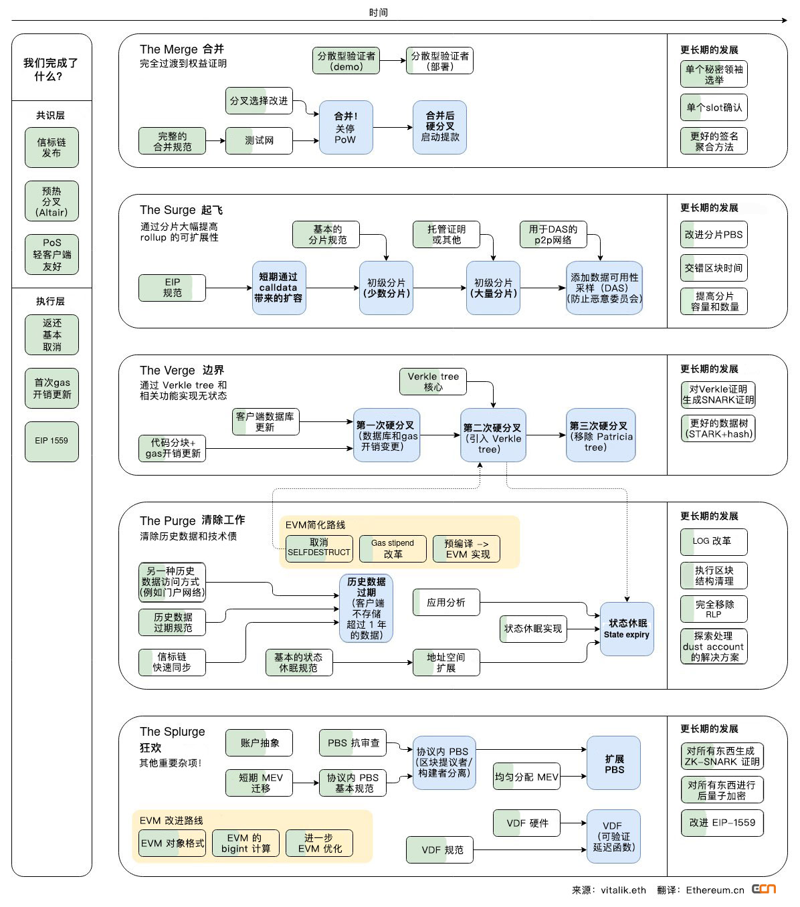
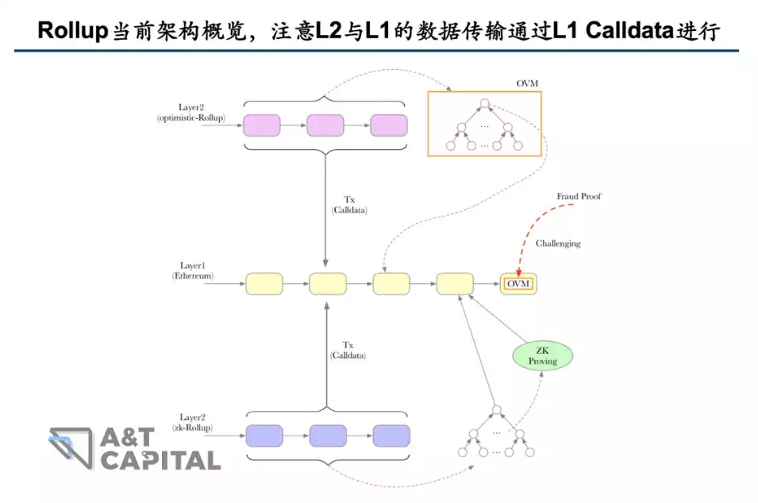
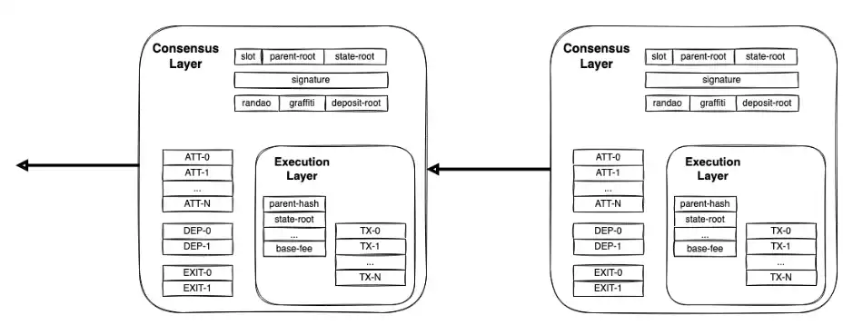
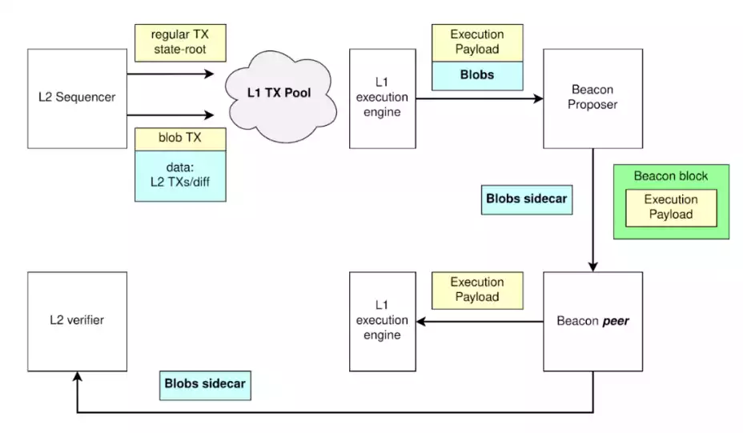
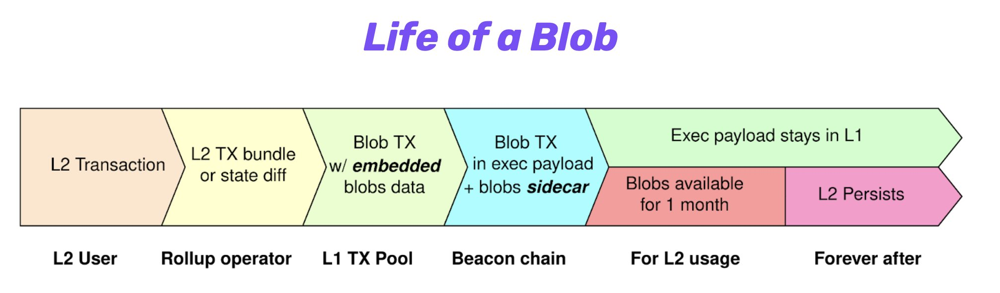

## 数据可用性导致的扩容瓶颈

### 现状[^1]

当前以太坊 L2 大多以 [Rollups](https://ethereum.org/zh/layer2/#rollups) 为基本的技术路线，Vitalik 更是将以太坊的更新用[“a rollup-centric roadmap”](https://twitter.com/VitalikButerin/status/1311921668005060608)描述（注意上图中的 the surge 阶段），可见 Rollup 基本已经一统 L2 江湖。

而 Rollup 运行的基本原理，是`将一捆交易在以太坊主链外执行，执行完后将执行结果和交易数据本身经过压缩后发回到 L1 上，以便其他人去验证交易结果的正确性`。

我们看一笔 rollup 交易包含哪些开销：

- 执行开销 (网络中所有节点执行交易并且验证其有效性的开销)
- 存储/状态开销 (使用新的值更新区块链 “数据库” 的开销)
- 数据可用性开销 (将数据发布至 L1 的开销)

其中，前两笔开销都是 Rollup 网络上的花费，占总开销的比例非常低。而数据可用性开销才是扩容的关键瓶颈。

我们为什么需要这种数据呢？

显然，如果其他人没有办法读取数据，那就无法完成验证。因此让其他人能够获取交易原始数据这一点至关重要，它也被称为[数据可用性(Data Availability)]()。

而受限于以太坊当前的架构，L2 向 L1 的传输的数据，是储存在交易的 Calldata 里面的。然而，Calldata 在最初以太坊设计的时候只是一个智能合约函数调用的参数，是所有节点必须同步下载的数据。如果 Calldata 膨胀，将造成以太坊网络节点的高负载，因此 Calldata 的费用是比较昂贵的。这也是造成当前 L2 费用的主要因素。

### 改进思路

其实我们可以观察到，L2 的交易压缩数据的上传，只是为了让它能够被其他人所下载验证，并不需要被 L1 所执行。而 Calldata 费用之所以高，是因为它作为一个函数调用的参数，是默认可能被 L1 执行的，因此`需要全网的节点进行同步`。

那怎么改进呢？

我们可以把 L2 传过来的数据单独设计一个数据类型，把它和 L1 的 Calldata 分开。这种数据类型只需要满足能在`一定时间内`被有需要的其他人所访问下载即可，`无需做全网的同步`。实际上，这点也被众多以太坊技术社区的成员所想到了。

EIP-4844 的改进，其实就是围绕着这个脉络进行的。

## EIP-4844 的核心：带 Blob 的交易

Proto-Danksharding，也被称为 [EIP-4844](https://eips.ethereum.org/EIPS/eip-4844)，这个名字来自于提出这个想法的两位研究人员：Protolambda 和 Dankrad Feist。

如果用一句话来概括 [EIP-4844]() 究竟做了什么，那就是：引入了`“携带 blob 的交易(Blob-carrying Transaction)”`这一`新的交易类型`。Blob 就是上文提到的，为 L2 的数据传输所专门设计的数据类型。

因此，将有关 blob 的细节理解清楚，就可以说基本搞明白了 EIP-4844 。

Blob 是一个用于放置 `L2 压缩数据`的“大数据块”，`存在共识层的节点(beacon node)中`。之前放在 calldata 中 L2 的数据(交易，证明等)，现在就放到 Blob 里面。相比于 Calldata，Blob 的数据大小可以非常大。

Blob 是由共识层的节点进行存储的，而不是像 Calldata 那样在会直接上主链，这也带来了 Blob 的两个核心特点：

- 不能像 Calldata 那样被 EVM 所读取，这也意味着未来的分片工作只需要对信标节点(beacon node)进行修改.
- 有生命周期。每 2 周后会修剪一次 blob。可用时间长到足以让 L2 的所有角色都能检索到它，短到足以让磁盘使用可控。这使得 Blobs 的价格比 CALLDATA 便宜，因为 CALLDATA 永远保存在历史中。[^2]

更细节一点的来说[^4]：

- Blob 本身，是一个由 4096 个元素所构成的向量(Vector)，每个元素 32 个字节，每个 blob 约为`4096 * 32 bytes=128kB`。单块 blob 上限可以从低开始，并在多次网络升级中增长。

  这个向量每个维度都可以看做是一个不高于 4096 阶的有限域多项式的各个系数，这个结构设计，是为了方便 [KZG 多项式承诺]()的生成。

- 每个 transaction 最多挂 2 个 blob。
- 每个 block 理想状态包含 8 个 blob，约为 1MB(`128kB*8=1MB`)，最多包含 16 个 blob，约为 2MB。

## Blob 架构设计：Sidecar[^3]

在理解 Blob 架构之前，先需要说明一个概念：Execution Payload（执行负载）。在以太坊合并之后，分出了 Consensus Layer 和 Execution Layer，它们分别负责两个主要功能：前者负责 PoS 共识，后者执行 EVM。而 Execution Payload 可以简单认为是 EL 层里面普通的 L1 交易。

Blob 和现在以太坊架构的融合，可以类比为摩托车本体和摩托车挎斗（Sidecar）之间的关系，就像这样：（左边的就是摩托车的 Sidecar）

Sidecar（摩托车挎斗）是一个[官方比喻](https://eips.ethereum.org/EIPS/eip-4844#beacon-chain-validation)。它的含义，其实就是 Blob 的运转虽然依赖于主链，但某种程度上也平行于主链、具备相当的独立性。

如下图所示，接下来就让我们来过一遍 Blob 相关的执行流程，以更好的理解这一比喻：

首先，L2 Sequencer 确定交易，将交易的结果和相关证明（黄色部分）和数据包（Blob，蓝色部分）传到 L1 的交易池中。

L1 的节点（Beacon Proposer）看到了交易，它会在新的区块提议（Beacon Block）里面执行相关交易并进行广播；但在广播的时候，它会把 Blob 分离出来留在共识层 CL 中(blobs sidecar)，并不会把它放到执行层的新区块里面。

其它 L1 节点（Beacon Peer）会收到了新的区块提议和交易结果。如果它们有需要成为 L2 验证者，它们可以去 Blobs Sidecar 下载相关的数据。

下图是从另一个角度对 Blob 生命周期的阐述，我们可以清晰地看到 blob 数据不会上 L1 主链，只会存在共识层节点之中，并且它有着不一样的生命周期。

因此，这也不难理解为什么 Blob 无法被 EVM，也就是 L1 的智能合约所直接读取：能被读取的都是被传到执行层的东西，既然 Blob 仅仅留在共识层，那么肯定就没有这个功能了。而事实上，这种分离，也正是 Rollup 费用能因此降低的原因。

## Blob 的存储：新的 Fee Market

前文提到，Blob 数据将存在共识层节点之中，并且具备生命周期。但显然这种服务也不是免费的，因此它将会带来一个独立于 L1 Gas 费的新费用市场，这也是 Vitalik 所倡导的 Multi-dimensional Fee Market。这个 Fee Market 的相关细节还在迭代完善之中，详见 [Github 的相关讨论与更新](https://github.com/ethereum/EIPs/pull/5707)。

另外，如果节点层面只能短期存储这些数据，那么如何实现长期的储存呢？对此，Vitalik 表示解决方案其实很多。因为这里的安全假设要求不高，是[“1 of N 信任模型”](https://www.ethereum.cn/Thinking/trust-model)，只需有人能够完成真实数据的存储即可。在大的存储硬件只需要 20 美元每 TB 的当下，每年 2.5 TB 的数据存储对于有心人而言只是小问题。另外，其它各种去中心化存储解决方案也会是一种选择，不过 Vitalik 在这里并没有提到具体的项目。

## Blob 的验证[^5]

Rollups 在 data blob 中发布他们执行的交易，还公布了对数据的“承诺(`commitment`)”：通过将数据[拟合](https://blog.csdn.net/qq_27586341/article/details/90170839)一个多项式函数(`KZG`)来实现。之后，可以在不同的点上计算这个函数对应的数值。例如，如果我们定义一个极其简单的函数 `f(x)=2x-1`，那么我们可以在 `x=1、x=2、x=3` 的情况下计算这个函数，得到 `1、3、5` 的结果。一个验证者将从数据拟合出同样的函数，并在相同的点上进行计算。如果原始数据被改变，该函数将不完全相同，因此在每个点上计算的值也不完全相同。在现实中，承诺和证明更为复杂，因为它们被包裹在加密函数中。

### 什么是 KZG？

KZG 是 `Kate-Zaverucha-Goldberg` 的缩写--这是三个[原始作者](https://link.springer.com/chapter/10.1007/978-3-642-17373-8_11)的名字，他们的方案将一团数据简化为一个小的[加密 "承诺(commitment)"](https://dankradfeist.de/ethereum/2020/06/16/kate-polynomial-commitments.html)。rollups 提交的 data blobs 必须经过验证，以确保 rollups 没有发生错误行为。这涉及到验证者重新执行 blob 中的交易，以检查承诺是否有效。这在概念上与执行客户端在一层使用 Merkle 证明检查 Ethereum 交易有效性的方式相同。KZG 是一种替代性证明，它将多项式方程与数据拟合。承诺人在一些秘密数据点上计算该多项式。验证者将在数据拟合相同的多项式，并在相同的数值上计算，检查结果是否相同。这是一种验证数据的方式，与一些 rollups 和最终以太坊协议的其他部分所使用的零知识技术兼容。

### 什么是 KZG Ceremony？

KZG Ceremony 是一种让整个以太坊社区的许多人一起生成一个秘密的随机数字串的方式，可以用来验证一些数据。这串数字不为人所知，不能被任何人重新创建，这一点非常重要。为了确保这一点，每个参加 Ceremony 的人都会从之前的参与者那里收到一个字符串。然后他们创建一些新的随机值（例如，通过让他们的浏览器测量他们的鼠标移动），并将其与之前的值混合在一起。然后，他们把这个值发送给下一个参与者，并从他们的本地机器上销毁它。只要 Ceremony 中的一个人诚实地做这件事，最终的值将是攻击者无法知道的。EIP-4844 的 KZG Ceremony 向公众开放，数以万计的人参与其中，增加自己的熵。为了使 Ceremony 受到破坏，必须所有参与者都是不诚实的。从参与者的角度来看，如果他们知道自己是诚实的，就没有必要相信其他人，因为他们知道他们保证了 Ceremony 的安全（他们单独满足了 [1-N](https://www.ethereum.cn/Thinking/trust-model) 个诚实参与者的要求）。

### KZG Ceremony 的随机数是用来做什么的？

当一个 rollups 在 blob 中发布数据时，他们提供了一个链上 "承诺"。这个承诺是在某些点上对数据进行多项式拟合计算的结果。这些点是由 KZG Ceremony 中生成的随机数定义的。然后，证明者(Provers)可以在相同的点上计算多项式，以验证数据--如果他们得出相同的值，那么数据就是正确的。

### 为什么 KZG 的随机数据必须秘密的？

如果有人知道用于承诺的随机位置，他们很容易产生一个新的多项式，在这些特定的点上进行拟合（即“碰撞”）。这意味着他们可以从 blob 中添加或删除数据，并仍然提供一个有效的证明。为了防止这种情况，承诺者并没有给证明者实际的秘密位置，而是用椭圆曲线将位置包裹在一个加密的 "黑盒子 "中。这些有效地扰乱了数值，使原始数值不能被反向工程，但通过一些巧妙的代数，证明者和验证者仍然可以在他们所代表的点上计算多项式。

无论是 Danksharding 还是 Proto-Danksharding 都没有遵循传统的 "分片(sharding)" 模式(将区块链分成多个部分)。分片链(Shared chains)不再是路线图的一部分。相反，Danksharding 使用跨 blob 的分布式数据采样来扩展 Ethereum。这在实现上要简单得多。这种模式有时被称为 "数据分储(data-sharding)"。

## EIP-4844 的影响

在架构层面，EIP-4844 引入了新的交易类型 Blob-carrying Transaction，这是以太坊第一次为 L2 单独构建数据层，也是之后 [Full Danksharding]() 实现的第一步。

在经济模型层面，EIP-4844 将为 blob 引入新的 Fee Market，这也会是以太坊迈向 Multi-dimensional Market 的第一步。

在用户体验层面，用户最直观的感知就是 L2 费用的大幅降低，这个底层的重要改进，将为 L2 以及其应用层的爆发提供重要基础。

## 材料

- 规范。

  对执行层（即 geth、erigon 等）和共识层（即 prysm、lighthouse 等）的修改在 [EIP-4844](https://eips.ethereum.org/EIPS/eip-4844) 和[信标链规范](https://github.com/ethereum/consensus-specs/tree/dev/specs/eip4844)中规定。

- 客户端原型

  共识层和执行层客户端都要进行的修改的原型。你可以在[这里](https://github.com/ethereum/pm/blob/master/Breakout-Room/4844-readiness-checklist.md#client-implementation-status)关注这一方面的进展。

- 设置 KZG 信任

  EIP-4844 涉及使用 KZG 承诺。为了生成这些 seed，将会运行一个基于浏览器的[distributed ceremony](https://github.com/ethereum/KZG-Ceremony)，所以每个人都有机会确保它是正确和安全地生成。

- 开发网

  为了证明 EIP-4844 的可行性，一个开发者网络测试环境现在已经可以使用，并初步实现了这些变化。启动网络的说明可[在此](https://github.com/Inphi/eip4844-interop)获得。

- 测试网络

  一旦开发网络被证明是可行的，并且贡献者对它有信心，一个测试网将被启动，向社区展示一切是如何工作的，并允许任何人成为验证者，运行一个节点，等等。

- 准备就绪检查表

  为了确保 EIP 的设计是合理的，所有潜在的问题都得到了解决，一个[公开的列表](https://github.com/ethereum/pm/blob/master/Breakout-Room/4844-readiness-checklist.md)跟踪这些问题和潜在的解决方案。对于新的贡献者来说，这些都是很好的切入点!

## EIP-4844 后的展望：Fully Danksharding

EIP-4844 只是“Proto-Danksharding”，意为 Danksharding 的原型。[完整版 Danksharding]() 中，每个节点都可以直接通过数据可用性采样（Data Availability Sampling），实现对 L2 数据正确性的实时验证。这将会进一步提高 L2 的安全性和性能。

## 参考

- [观点：以太坊距离大规模扩容 ，可能比我们想象的更近](https://www.8btc.com/article/6790012)
- [热度飙升的 EIP-4844 究竟是什么 ？V 神亲自详细解答](https://www.tuoluo.cn/article/detail-10095959.html) 没看懂

[^1]: [一文读懂 EIP-4844：如何降低 Layer2 费用 100 倍？](https://www.8btc.com/article/6794798)
[^2]: [eip4844](https://www.eip4844.com)
[^3]: [OP in Paris: OP Lab's Protolambda walks us through EIP-4844](https://www.youtube.com/watch?v=KQ_kIlxg3QA)
[^4]: [EIP-4844](https://eips.ethereum.org/EIPS/eip-4844)
[^5]: [如何在证明中使用 KZG 承诺](https://www.ethereum.cn/Technology/kzg-commitments-in-proofs)
