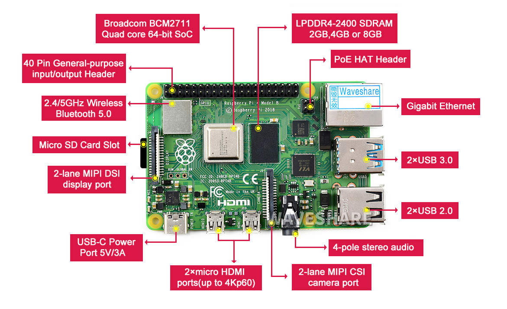
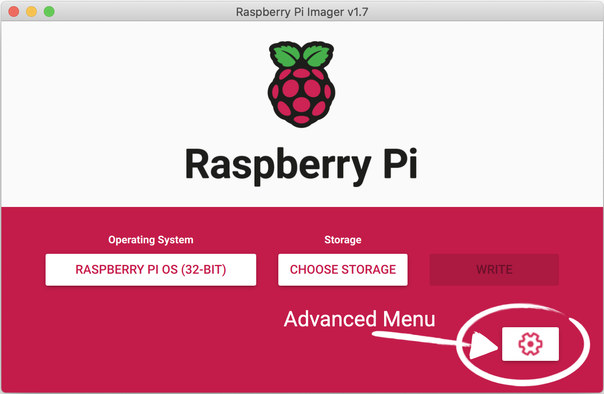
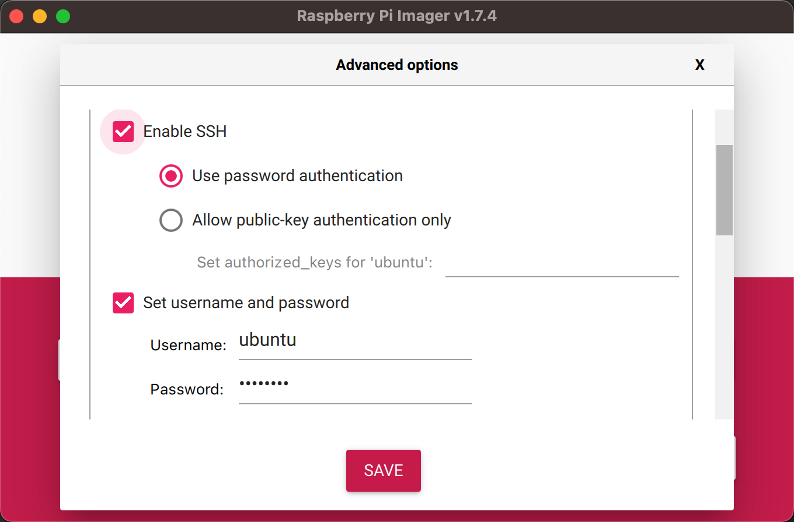
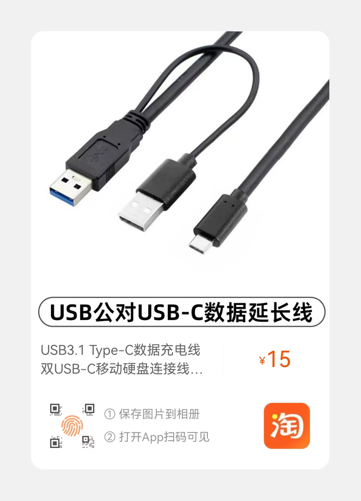

## 概述

## 硬件

### 官方规格

以下数据来自[raspi 4 model B specifications](https://www.raspberrypi.com/products/raspberry-pi-4-model-b/specifications/)。



- 处理器： Broadcom BCM2711，四核 Cortex-A72（ARM v8），64 位 SoC @ 1.5GHz，1MB shared L2 cache
- 内存： 8GB LPDDR4-3200 LPDDR4
- 连接：
  - 2.4 GHz 和 5.0 GHz IEEE 802.11ac 无线
  - 千兆以太网
  - 蓝牙 5.0，BLE
  - 2 个 USB 3.0 端口
  - 2 个 USB 2.0 端口
- GPIO： 标准 40 针 GPIO 接头
- 视频/音频:
  - 2 个 micro-HDMI 端口（最多支持 4kp60）
  - DSI 屏幕： 2 通道 MIPI DSI 显示端口
  - CSI 摄像头： 2 通道 MIPI CSI 摄像机端口
  - 视频输出： 4 针立体声音频和复合视频端口
- 多媒体：
  - H.265（4kp60 解码）
  - H.264（1080p60 解码，1080p30 编码）
  - OpenGL ES 3.0 图形
- 内存卡插槽： Micro-SD 卡插槽，用于加载操作系统和数据存储
- 电源输入：
  - 通过 USB-C 连接器 5V DC（最小 3A）
  - 通过 GPIO 接头提供 5V DC（最小 3A）
  - POE 供电： 启用以太网供电（PoE）（需要单独的 PoE HAT）
- 工作温度： 0 – 50 摄氏度环境

一些注意事项：

- 由于 Raspberry Pi Zero、1 和 2 的硬件限制，SD 卡上的启动分区必须是 256GB 或以下，否则设备将无法启动。Raspberry Pi 2 的后期型号--采用 BCM2837 SoC--以及 Raspberry Pi 3、4、Zero 2 W 和 Raspberry Pi 400 都没有这个限制。这并不影响 Raspberry Pi 操作系统，它总是使用一个小的启动分区。也就是说我可以给 raspi4B 挂载一个 2TB 的 SSD。

### 扩展

- 存储
- 电源

## 操作系统

使用[Raspberry Pi Imager](https://www.raspberrypi.com/software/) 将操作系统烧录到存储中。烧录镜像的时候进行一些设置：

当你打开 Raspberry Pi Imager，并选择了要安装的操作系统后，会出现一个齿轮，允许你打开一个 “高级选项” 菜单（如果该操作系统支持的话）。这个菜单可以让你执行一些任务，比如启用 SSH，或者设置 Raspberry Pi 的主机名，以及在第一次启动前配置默认用户。




### Raspberry Pi OS

- apt
- [rpi-update](https://www.raspberrypi.com/documentation/computers/os.html#rpi-update)

### Ubuntu

### raspi-config

[raspi-config](https://www.raspberrypi.com/documentation/computers/configuration.html#raspi-config) 是 Raspberry Pi 配置工具，最初由 Alex Bradbury 编写。

## 实际使用

如果没有在制作镜像的时候使用“高级选项”菜单进行设置，需要进行以下操作。

### 本地化

[本地化]()

### 设置网络

- 路由器设置 mac 地址绑定，方便 SSH 登录。
- [启用 WIFI]()

### 设置主机名

主机名分别修改为 rb1/rb2/rb3/rb4/rb5 进行区分：

```shell
ubuntu@rb1:~$ sudo hostnamectl hostname rb1
ubuntu@rb1:~$ hostnamectl status
 Static hostname: rb1
       Icon name: computer
      Machine ID: 7da3fac0bd364c13b961b0f417046494
         Boot ID: 6f52ccfc62704383a852e47839e6c543
Operating System: Ubuntu 22.04.2 LTS
          Kernel: Linux 5.15.0-1024-raspi
    Architecture: arm64
```

### 存储

使用闲置 SSD 和移动硬盘替代 micro-sd card 作为系统盘，提高性能。

| hostname | 磁盘                  | 硬盘盒        |
| -------- | --------------------- | ------------- |
| rb1      | 256GB SSD             | SSk/飚王 C326 |
| rb2      | 512GB USB3.0 移动硬盘 |
| rb3      | 2TB SSD               | 绿联 CM559    |
| rb4      | 1TB USB3.0 移动硬盘   |

外置存储设备需要 USB3.1 Type-C 数据充电线进行独立供电，如下图：



### 电源

关于电源问题参见：

- [树莓派 99%的故障来自于 5V 电源](http://www.shumeipai.net/thread-13938-1-1.html)。
- [《树莓派实战秘籍》——1.9 　技巧 09 解决电源问题](https://developer.aliyun.com/article/98470)

实际使用的时候发现华为 66W/6A 的快充可以持续稳定的给 SSD/移动硬盘供电，电压一直保持在 5V 以上，非华为原装充电器电压会低于树莓派的规定电压。

可以通过华为官网[保修期及权益查询](https://consumer.huawei.com/cn/support/warranty-query/) 查询闲鱼淘的充电器是否原装。

### 关机

不要直接拔电源关机或重启，先关闭操作系统。

```shell
sudo shutdown -h now
```

重启

```shell
sudo shutdown -r now
```

## 参考

- [树莓派官方文档](https://www.raspberrypi.com/documentation/computers/)
