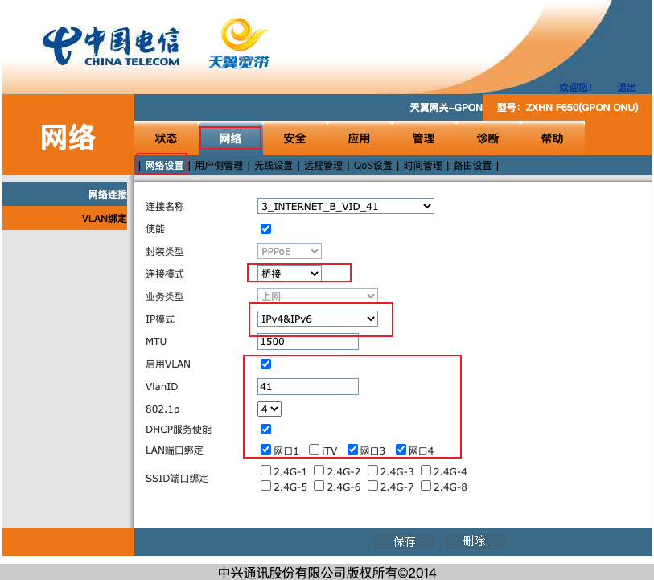

## 概述

此次操作是为了可以在公网通过域名访问家里的树莓派。

## 方案

### 公网 IP

如果当地电信可以申请公网 IP，不管是动态还是静态，IPv4 还是 IPv6，那么可以这样：

1. 将公网 IP 与自己的域名进行绑定。

   由于公网 IP 是动态的，所以需要内网主机通过 DDNS 自动更新域名绑定，推荐使用 docker 镜像： [newfuture/ddns](https://hub.docker.com/r/newfuture/ddns)。

2. 路由器进行端口转发，这要求路由器具有两个功能：
   - 静态 IP 租赁，也就是绑定 mac 和 IP 地址，静态 IP 才好设置端口转发。
   - 端口映射。

### 内网穿透

如果没有公网 IP，可以使用内网穿透的方法。异次元介绍了[几种穿透方法](https://www.iplaysoft.com/tag/%E7%A9%BF%E9%80%8F)。

## 实施

广东电信可以开通动态的公网 IP 地址，而且 IPv4 和 IPv6 地址都有。所以我才采用的是公网 IP 的方法。通过（[ipw](https://ipw.cn/)）查看自己的 IP 地址信息。

电信宽带给安装的是中兴 ZXHN F650 千兆光猫，自带有路由功能，但是路由功能没有静态 IP 绑定，端口映射功能也不能用，所以只能将光猫修改为桥接模式，在路由器进行上述两项操作。

### 光猫设置

修改光猫为桥接模式步骤：

- 通过网线或者 ChinaNet-xxxx 的 WiFi 打开光猫 web 设置页面，一般是 192.168.1.1，具体可以看光猫背面的配置。
- 使用超级用户登录，有的地方的超级用户的账号密码是动态的，获取方式根据当地电信情况自行查询，广东电信目前还是静态的。
- “网络”标签下，通过 “新建 WAN 连接” 新建桥接连接：

注意，桥接模式下，通过路由器的网络是不能访问光猫的设置页面的。

### 路由器设置

路由器设置就很简单：

- 设置 PPoE 拨号。
- 设置静态 IP 绑定。
- 设置端口转发。

### 内网主机设置

一般需要开通的是 ssh 端口，由于现在可以公网访问了，所以需要进行必要的安全设置。

## WakeOnLan

家里有一台 Intel NUC windows 机器，想要通过 WOL 进行启动。按照 [官方指导](https://www.intel.com/content/www/us/en/support/articles/000027615/intel-nuc.html)， 实际操作过程只需要在 “Power Options” 中关闭快速启动即可。

mac 上有两个软件可以给网卡发送 WakeOnLan 信号：

- wakeonlan

  命令行工具，免费软件，`wakeonlan <mac 地址> <ip 地址>`

- remote-wake-u

  GUI 界面，可以显示局域网中存活的网卡，但该软件收费。

这样就可以在 nuc 不使用的时候关机，使用的时候通过 wake on lan 唤醒。
