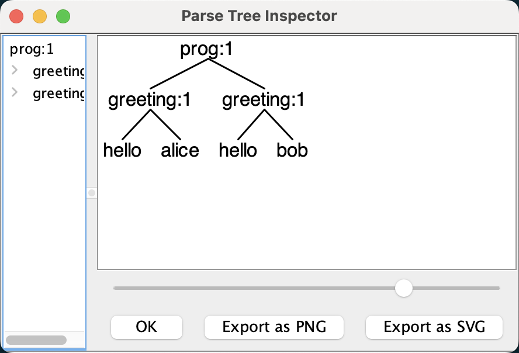

## 概述

[ANTLR](https://www.antlr.org/)  是由 Terence Parr 教授在上世纪 90 年代初期使用 Java 语言开发的一个强大的语法分析器生成工具，至今仍在积极开发，并且有着一个稳定的社区。ANTLR 支持生成 C#, Java, Python, JavaScript, C++, Swift, Go, PHP 等几乎所有主流编程语言的目标代码，并且 ANTLR 官方自己维护了 Java、C++、Go 等目标语言的运行时库。

本文中，我们会安装 ANTLR，尝试通过它来识别一个简单的`Hello` 语法，并概览语言类应用程序的开发过程。

## 初识 ANTLR

本节我们的目标是大体上知道 ANTLR 能做什么。除此之外，我们还希望探究语言类应用程序的架构。在后续的章节中，我们将会通过更多真实的例子来循序渐进地、系统性地学习 ANTLR。在开始之前，我们需要首先安装 ANTLR，然后尝试用它编写一份简单的`Hello` 语法。

### 安装 ANTLR

ANTLR 是用 Java 编写的，但是通过`antlr4-tools`可以不用担心 Java 相关的环境设置：

```sh
pip3 install antlr4-tools
```

该命令创建 antlr4 和 antlr4-parse 可执行文件，如有必要，它们将下载并安装 Java 11 以及最新的 ANTLR jar:



- antlr4 可用于生成词法和语法解析器对应的目标代码。
- antlr4-parse 可以详细列出一个语言类应用程序在匹配输入文本过程中的信息，这些输入文本可以来自文件或者标准输入。

### 运行 ANTLR 并测试识别程序

antlr 定义的语法规则放在后缀为`.g4`的规则文件中，下面是一个简单识别类似 hello world 词组的语法：



该规则对应的代码如下：



`antlr4-parse Hello.g4 prog greetings.txt -tokens`打印代码解析后对应的符号列表：



每行输出代表一个词法符号， 其中包含该词法符号的全部信息。 例如， `[@1,6:10='alice',<ID>,1:6]` 表明它是第 1 个词法符号（ 从 0 开始计数） ， 由第 6 到第 10 个字符组成（ 从 0 开始计数， 包含第 8 和第 10） ， 包含的文本是 alice， 类型是 4（ID） ， 位于输入文本的第 1 行（ 从 1 开始计数） 第 6 个字符（ 从 0 开始计数， tab 作为一个字符） 处。 注意， 输出的结果中不包含空格和换行符， 这是因为在我们的语法中， WS 规则的“->skip” 指令将它们丢弃了

 `antlr4-parse Hello.g4 prog -gui` 直接在 GUI 窗口中展示词法分析结果。



更多使用说明参见 [antlr4-tools](https://github.com/antlr/antlr4-tools/tree/master)，还可以直接在 [antlr lab](http://lab.antlr.org/) 试验。

现在，我们已经成功地安装了 ANTLR，并尝试着用它分析了一个简单的语法。在下一章中，我们将学习一些重要的术语。之后，我们将会尝试建立一个简单的 golang 工程来进一步识别和翻译 hello 语法。

## 概览全局

在上节中，我们安装了 ANTLR，了解了如何构建和运行一个简单的示例语法。在本节中，我们将纵观全局，学习语言类应用程序相关的重要过程、术语和数据结构。随着学习的深入，我们将认识一些关键的 ANTLR 对象，并简单了解 ANTLR 在背后帮助我们完成的工作。

一般来说，如果一个程序能够分析计算或者执行语句，我们就称之为解释器（interpreter），例如 Python 解释器。如果一个程序能够将一门语言的语句转换为另外一门语言的语句，我们称之为翻译器（translator）。比如 Java 到 C#的转换器和普通的编译器。

为了达到预期的目的，解释器或者翻译器需要识别出一门特定语言的所有的有意义的语句、词组和子词组。识别语言的程序称为`语法分析器`（parser）。`语法`是指约束语言中的各个组成部分之间关系的`规则`，在本文中，我们会通过 ANTLR 语法来指定语言的语法，所以 ANTLR 语法也称为元语法。

语法分析的过程分解为两个相似但独立的阶段：

第一阶段将字符聚集为单词或者符号（词法符号，token）的过程称为`词法分析（lexical analysis）`或者词法符号化（tokenizing）。我们把可以将输入文本转换为词法符号的程序称为`词法分析器（lexer`）。词法分析器可以将相关的词法符号归类，例如 INT（整数）、ID（标识符）、FLOAT（浮点数）等。当语法分析器不关心单个符号，而仅关心符号的类型时，词法分析器就需要将词汇符号归类。词法符号包含至少两部分信息：词法符号的类型（从而能够通过类型来识别词法结构）和该词法符号对应的文本。

第二个阶段是实际的`语法分析过程`，在这个过程中，输入的词法符号被“消费” 以识别语句结构，默认情况下，ANTLR 生成的语法分析器会建造一种名为`语法分析树`（parse tree）的数据结构，该数据结构记录了语法分析器识别出输入语句结构的过程，以及该结构的各组成部分。图 2-1 展示了数据在一个语言类应用程序中的基本流动过程。



语法分析树的内部节点是词组名，这些名字用于识别它们的子节点，并将子节点归类。由于我们使用一系列的规则指定语句的词汇结构，语法分析树的子树的根节点就对应语法规则的名字，叶子节点是输入的词法符号。

下面这条语法规则对应上图中的赋值语句子树的第一级：

```antlr
assign: ID '=' expr ';'; //匹配类似 sp=100; 的赋值语句
```

首先，我们来认识一下 ANTLR 在识别和建立语法分析树的过程中使用的数据结构和类名。熟悉这些数据结构将为我们未来的讨论奠定基础，也有利于后续阅读生成的代码。

前已述及，词法分析器处理字符序列并将生成的词法符号提供给语法分析器，语法分析器随即根据这些信息来检查语法的正确性并建造出一棵语法分析树。这个过程对应的 ANTLR 类是 `CharStream`、`Lexer`、`Token`、`Parser`，以及 `ParseTree`。连接词法分析器和语法分析器的“管道” 就是 TokenStream。图 2-2 展示了这些类型的对象在内存中的交互方式。





ANTLR 尽可能多地使用共享数据结构来节约内存。如图 2-2 所示，语法分析树中的叶子节点（词法符号）仅仅是盛放词法符号流中的词法符号的容器。每个词法符号都记录了自己在字符序列中的开始位置和结束位置，而非保存子字符串的拷贝。其中，不存在空白字符对应的词法符号（索引为 2 和 4 的字符）的原因是，我们假定我们的词法分析器会丢弃空白字符。

图 2-2 中也显示出，ParseTree 的子类 RuleNode 和 TerminalNode，二者分别是子树的根节点和叶子节点。RuleNode 有一些令人熟悉的方法，例如 `getChild()`和 `getParent()`，但是，对于一个特定的语法，RuleNode 并不是确定不变的。为了更好地支持对特定节点的元素的访问，ANTLR 会为每条规则生成一个 RuleNode 的子类。如图 2-3 所示，在我们的赋值语句的例子中，子树根节点的类型实际上是 StatContext、AssignContext 以及 ExprContext。

这些根节点包含了使用规则识别词组过程中的全部信息，它们被称为上下文（context）对象。每个上下文对象都知道自己识别出的词组中，开始和结束位置处的词法符号，同时提供访问该词组全部元素的途径。例如，AssignContext 类提供了方法 `ID()`和方法 `expr()`来访问标识符节点和代表表达式的`子树`。

### 语法分析树监听器

ANTLR 的运行库提供了两种遍历树的机制。默认情况下，ANTLR 使用内建的遍历器访问生成的语法分析树，并为每个遍历时可能触发的事件生成一个语法分析树监听器接口（parse-tree listener interface）。

为了将遍历树时触发的事件转化为监听器的调用，ANTLR 运行库提供了 ParseTreeWalker 类。我们可以自行实现 ParseTreeListener 接口，在其中填充自己的逻辑代码（通常是调用程序的其他部分），从而构建出我们自己的语言类应用程序。ANTLR 为每个语法文件生成一个 ParseTreeListener 的子类，在该类中，语法中的每条规则都有对应的 enter 方法和 exit 方法。例如，当遍历器访问到 assign 规则对应的节点时，它就会调用 `enterAssign()`方法，然后将对应的语法分析树节点——AssignContext 的实例——当作参数传递给它。在遍历器访问了 assign 节点的全部子节点之后，它会调用`exitAssign()`。图 2-4 用粗虚线标识了 ParseTreeWalker 对语法分析树进行深度优先遍历的过程。



图 2-5 显示了在我们的赋值语句生成的语法分析树中，ParseTreeWalker 对监听器方法的完整的调用顺序。



监听器机制的优秀之处在于，这一切都是自动进行的。我们不需要编写对语法分析树的遍历代码，也不需要让我们的监听器显式地访问子节点。

### 访问器

有时候，我们希望`控制遍历语法分析树的过程`，通过显式的方法调用来访问子节点。在命令行中加入`-visitor` 选项可以指示 ANTLR 为一个语法生成访问器接口（visitor interface），语法中的每条规则对应接口中的一个 visit 方法。图 2-6 是使用常见的访问器模式对我们的语法分析树进行操作的过程。



其中， 粗虚线显示了对语法分析树进行深度优先遍历的过程。 细虚线标示出访问器方法的调用顺序。 我们可以在自己的程序代码中实现这个访问器接口， 然后调用`visit()` 方法来开始对语法分析树的一次遍历。

## 入门的 ANTLR 项目

作为我们的第一个 ANTLR 项目， 我们将识别给定文本中的 Hello 语法，并将语法中的人名打印出来。

### ANTLR 工具、 运行库以及自动生成的代码

本节中，我们选择 Go 作为目标语言来生成语法分析器代码。[antlr4 package](https://pkg.go.dev/github.com/antlr4-go/antlr/v4) 推荐了一种代码生成的模板：

为了生成 Go 目标语言的代码，通常建议将源语法文件放在一个独立的包中，并使用 `go generate` 指令通过 shell 脚本方法生成代码。

下面是一个推荐的通用 golang 语言代码模板：







请根据是否需要访问器（visitors）或监听器（listeners）设置`generate.sh`中 antlr4 命令的选项。

执行以下命令将生成解析器的代码：

```sh
go generate ./...
```

根据语法 Hello.g4，ANTLR 自动生成了很多文件：



目前，我们仅仅需要大致了解这个过程，下面简单介绍一下生成的文件：

- Hello.tokens： ANTLR 会给每个我们定义的词法符号指定一个数字形式的类型，然后将它们的对应关系存储于该文件中。有时，我们需要将一个大型语法切分为多个更小的语法，在这种情况下，这个文件就非常有用了。通过它，ANTLR 可以在多个小型语法间同步全部的词法符号类型。更多内容请参阅后文 [语法导入]() 部分。

### 测试生成的语法分析器



### 测试监听器

我们继续完成 Hello 语法的示例程序，下一个目标是能够遍历语法树，而不仅仅是能够识别它们。例如，我们想要将 `hello` 后面的人名搜集起来。为了完成这项工作，程序必须能够从语法分析树中提取数据。最简单的方案是使用 ANTLR 内置的语法分析树遍历器进行深度优先遍历，然后在它触发的一系列回调函数中进行适当的操作。正如我们之前看到的那样，ANTLR 能够自动生成一个监听器接口和一个默认的实现类。

我们如果想要通过编写程序来操纵输入的数据的话，只需要继承 `BaseHelloListener` 类，然后覆盖其中必要的方法即可。我们的基本思想是，在遍历器进行语法分析树的遍历时，令每个监听器方法提取其中的人名并保存下来。监听器机制的优雅之处在于，我们不需要自己编写任何遍历语法分析树的代码。事实上，我们甚至都不知道 ANTLR 运行库是怎么遍历语法分析树、怎么调用我们的方法的。我们只知道，在语法规则对应的语句的开始和结束位置处，我们的监听器方法可以得到通知。



### 测试访问器



## 快速指南

“Hello 语法” 只有寥寥数行， 但是实际中的语法可能多达成千上万行。 在下一节中， 我们将会学习如何使那样的大型语法维持在可控范围内。

### 语法导入  {#import}

一个好主意是， 将非常大的语法拆分成逻辑单元， 正如我们在软件开发中所做的那样。 拆分的方法之一是将语法分为两部分： 语法分析器的语法和词法分析器的语法。这是一个不错的方案， 因为在不同语言的词法规则中， 有相当大的一部分是重复的。 例如， 不同语言的标识符和数字定义通常是相同的。 将词法规则重构并抽取出来成为一个“模块” 意味着我们可以将它应用于不同的语法分析器。 下面的这个词法语法包含了上面的“Hello 语法” 中所有的词法规则。



现在我们可以将原先的语法中的那些词法规则替换为一个 import 语句了。



构建和测试过程与重构之前相同。 我们不需要对被导入的语法运行 ANTLR。

到现在为止， 我们假设输入都是合法的， 但是错误处理是几乎所有语言类应用程序必不可少的部分。 我们接下来将会看到， ANTLR 如何处理有错误的输入。

### 错误输入

ANTLR 语法分析器能够自动报告语法错误并从错误中恢复。

## 参考

- [使用 ANTLR 和 Go 实现 DSL 入门](https://tonybai.com/2022/05/10/introduction-of-implement-dsl-using-antlr-and-go/) 系列文章。
- [官方教程](https://github.com/antlr/antlr4/blob/master/doc/getting-started.md)
- [ANTLR4 权威指南](https://book.douban.com/subject/27082372/)
