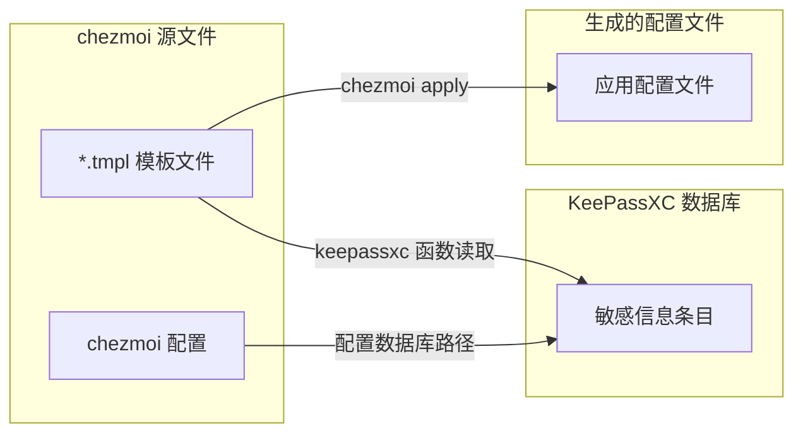

如何安全、高效地管理跨多台机器的配置文件？本文分享我使用 chezmoi + KeePassXC + age 加密构建的 dotfiles 管理方案的核心思路。具体安装步骤和命令见仓库 [github.com/phenix3443/dotfiles](https://github.com/phenix3443/dotfiles)。

<!--more-->

## 背景与痛点

多机同步配置时常见问题：敏感信息（API keys、tokens、密码）不宜进 git；不同系统路径和格式不一；手动同步麻烦；配置变更缺少版本与回滚。

## 解决方案架构

用三个工具组合解决：

- **chezmoi**：管理 dotfiles，支持模板、加密和跨平台
- **KeePassXC**：本地存储敏感信息，不落库
- **age**：加密需要同步的敏感文件后再提交

### 工作流程

核心思路：

1. 只把**配置模板**（`.tmpl`）和**加密后的敏感文件**提交到 git
2. 敏感信息放在本地 KeePassXC 里，模板里用 `keepassxc "条目名"` 按需读取
3. KeePassXC 数据库用 age 加密后以 `*.age` 形式进仓库，新机器上有私钥即可解密
4. 执行 `chezmoi apply` 时：先解密 kdbx，再根据模板从 KeePassXC 取数据生成最终配置

这样仓库里没有明文密钥，多机共享同一套「模板 + 加密数据」，每台机器只需保管好 age 私钥和 KeePassXC 主密码。

## 项目里都放了什么

仓库 [github.com/phenix3443/dotfiles](https://github.com/phenix3443/dotfiles) 大致结构：

- **dotfiles/**：chezmoi 源状态——模板（如 Cursor、Claude、kubeconfig 等）、加密后的 kdbx 和 kubeconfig
- **scripts/**：安装 chezmoi/keepassxc-cli/age、配置 git hooks、管理 KeePassXC 条目等脚本
- **Makefile**：一键安装依赖、配置 age、加密 kubeconfig、KeePassXC 条目增删改查等入口
- **docs/**：Cursor、kubeconfig 等子模块的说明

具体目录树和每个文件的用途见仓库 README。

## 核心实践要点

- **模板 + KeePassXC**：需要注入密钥的配置写成 `.tmpl`，用 keepassxc 函数读条目字段（Password、Username、URL 等），应用时再渲染成真实配置。
- **跨平台**：同一逻辑用 `dot_config/`、`private_Library/...`、`AppData/...` 等区分 Linux/macOS/Windows，由 chezmoi 按当前系统应用对应路径。
- **敏感文件**：不能模板化的（如 kubeconfig）用 age 加密后以 `config.age` 形式入库，apply 时自动解密到目标路径。
- **防泄露**：本地用 gitleaks + lefthook 做 pre-commit，CI 用 TruffleHog 扫历史和当前提交，避免误把明文密钥推进仓库。

## 版本与安全边界

- **进 git**：模板、chezmoi 配置、age 加密后的 kdbx/kubeconfig、脚本和文档。
- **不进 git**：KeePassXC 明文库、age 私钥、apply 生成出的含敏感信息的文件。

## 适用场景与注意点

适合：多机同步配置、配置里带 API keys/tokens、希望有版本和审计、跨平台统一管理。

注意：每次 apply 会提示 KeePassXC 主密码；模板里的条目名要和 KeePassXC 里完全一致；age 私钥需自行备份，丢了无法解密已提交的 age 文件。

## 相关资源

- [项目仓库（GitHub）](https://github.com/phenix3443/dotfiles)
- [chezmoi 官方文档](https://www.chezmoi.io/)
- [KeePassXC 官网](https://keepassxc.org/)
- [age 加密工具](https://github.com/FiloSottile/age)
