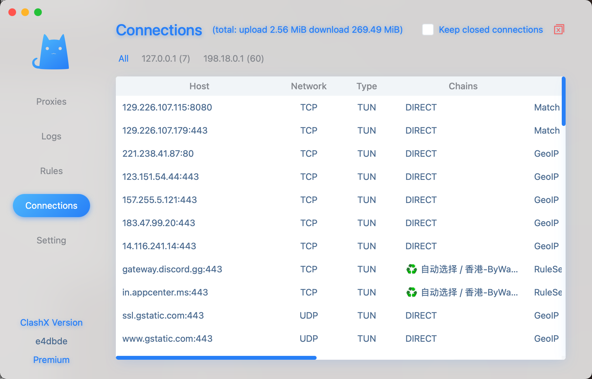

本文介绍如何使用 clash 搭建透明代理。

<!--more-->
## 概述

[Clash](https://github.com/Dreamacro/clash) 是一款网络代理工具。阅读本文前请先阅读 [官方文档](https://dreamacro.github.io/clash/configuration/introduction.html)，本文主要涉及：

- 官方文档中容易忽略的事项以及周边技术资料。
- 如何使用 TPClash 搭建局域网内的透明代理。

## 代理服务器

[proxy-groups](https://dreamacro.github.io/clash/configuration/outbound.html#proxy-groups) 可以方便的对代理进行组合：

- relay：多个代理服务形成中继链来处理代理请求。
- utl-test：clash 通过多方面测试选择最适合的代理服务器。
- fallback：选择第一个返回测试响应的服务器。
- load-balance: 对代理服务器进行负载均衡。
- select：手动选择代理服务器。

[proxy-provides](https://dreamacro.github.io/clash/configuration/outbound.html#proxy-providers) 使用户能够动态加载代理服务器列表，而不是将它们硬编码在配置文件中。

proxy-groups 搭配 proxy-providers 可聚合（多个）机场提供的代理资源，以及自建的代理服务器，详见下面的 TPClash 配置。

## 代理规则

[代理规则](https://dreamacro.github.io/clash/configuration/rules.html#rules) 的基本语法是：

```shell
TYPE,ARGUMENT,POLICY(,no-resolve)
```

其中 POLICY 可以使以下取值：

- DIRECT: 不走代理，也不查询系统路由表，直接通过配置的网卡接口访问。
- REJECT: 不可访问。
- Proxy: 通过指定的代理服务器访问。
- Proxy Group: 通过指定的代理服务器组访问。

需要注意的是：代理规则支持 PROCESS-NAME/PROCESS-PATH，可以用来直接对指定程序设置代理，在没有设置透明代理的情况下，对于那些不提供代理设置的应用程序（比如 discord）简直是福音。

[rule providers](https://dreamacro.github.io/clash/premium/rule-providers.html#rule-providers) 可以让我们方便的使用别人配置好的代理规则。

## 透明代理

### 配置

[TProxy](https://liqiang.io/post/tproxy-in-linux) 是 Linux 一种用于支持透明代理的，常见的实现方式是 [iptables](https://liqiang.io/post/dive-in-iptables) 以及 nftables。

clash 与透明代理相关的配置：

- [tune device](https://dreamacro.github.io/clash/premium/tun-device.html#tun-device)
- [eBPF Redirect](https://dreamacro.github.io/clash/premium/ebpf.html) 更加高效。

[TPClash](https://github.com/mritd/tpclash) 是一款基于 clash Premium 的辅助工具，将配置透明代理的工作量降到了最低，但是目前对 HTTP 类型的 proxy provider 支持不够好：不能解析机场返回的代理资源，这个应该是一个 bug，希望作者可以进行修正。

TPClash 配置：



### DNS 劫持

如果 clash 的 DNS 劫持没有生效，可能需要修改系统默认的 DNS 配置。

```shell
sudo systemctl stop systemd-resolved
sudo rm -f /etc/resolv.conf
echo "nameserver 1.1.1.1" | sudo tee /etc/resolv.conf
```

再次查看 github 域名解析：



看到对应的域名解析已经变为`198.18.0.3`，说明 clash 配置的 DNS 劫持已经生效。

### 开机启动

TPClash 通过 systemd 进行管理：



可通过 yacd( `http://{{external-controller}}/ui` ) 对 clash 进行管理。

TPClash 启动成功后，当前机器的透明代理就搭建完成了。

## 局域网网关

### 路由转发

该主机要作为局域网内的网关，需要开启 kernel 路由转发功能：

临时开启：

```shell
sudo sysctl -w net.ipv4.ip_forward=1
```

永久生效需要编辑 `/etc/sysctl.conf` 文件中的相关字段。

### 其他主机设置

其他主机可以通过两个步骤使用透明代理：

- 使用 TPClash 服务器 IP 作为网关。
- 使用 TPClash 服务器 IP 作为 DNS 服务器。

使用 [netplan](https://linux.fasionchan.com/zh_CN/latest/administration/network/netplan.html) 可以通过编辑`/etc/netplan/`下的配置文件设置 DNS 和默认网关：



执行`sudo netplan apply`生效。

## 客户端

### clashx

可以通过 icloud 保存配置文件，方便在多个 apple 终端同步同步。`Settings`->`Use iCloud to store config files`

使用下面的配置文件：



启动 enhanced-mode，生效如下：



### clash for windows

[CFW](https://docs.cfw.lbyczf.com/) 是 Clash 的 Windows/macOS/Linux 图形客户端，相比 clashx，更具跨平台性，也更加可配置。

#### 配置说明

CFW 启动的过程会使用到两个配置文件，分别是：

- ${Home}/config.yaml 该文件是 Clash 的启动文件，如果此文件有错，则 Clash 核心将无法启动。
- ${Home}/profiles/xxxx.yaml，该目录下的文件均由用户导入，CFW 统一生成的，一般命名为时间戳。该目录下的文件不建议添加 `tun/dns/hosts` 等字段。

配置加载过程参见 [官方说明](https://docs.cfw.lbyczf.com/contents/configfile.html#%E5%8A%A0%E8%BD%BD%E8%BF%87%E7%A8%8B)。

## 参考

- [Linux Tun/Tap 介绍](https://www.zhaohuabing.com/post/2020-02-24-linux-taptun/)
- [Systemd 入门教程：实战篇](https://www.ruanyifeng.com/blog/2016/03/systemd-tutorial-part-two.html)
- [Systemd 入门教程：命令篇](https://www.ruanyifeng.com/blog/2016/03/systemd-tutorial-commands.html)
