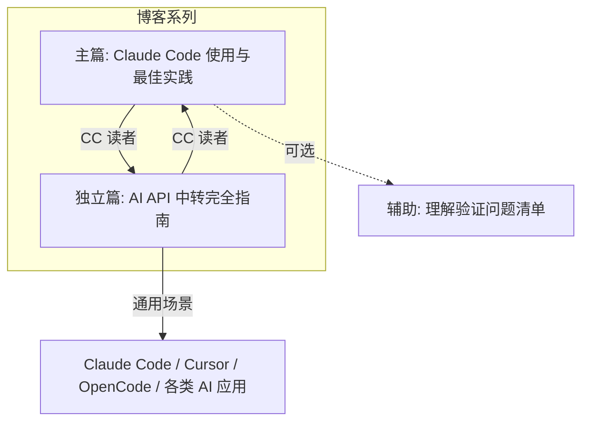

# Claude Code 博客系列规划

## 一、为什么需要拆成多篇

单篇博客难以兼顾深度和可读性。拆分理由：

- **主题边界清晰**：主篇聚焦「怎么用好 CC」，中转篇聚焦「怎么连上各类 AI API」（通用中转）
- **读者路径不同**：有人只想知道怎么配置中转；有人已经直连，只关心使用技巧
- **篇幅可控**：主篇预计 3000-5000 字，中转篇 3000-4000 字，单篇阅读负担更小
- **便于维护**：中转商、价格、坑点变动时，只需更新中转篇

建议采用 **2 篇主文 + 1 篇辅助** 的结构。

---

## 二、博客系列结构



| 篇目 | 路径 | 定位 | 预计字数 |
|------|------|------|----------|
| **主篇** | index.md | Claude Code 使用、配置、工作流、工程实践 | 3500-5000 |
| **中转篇** | content/posts/ai/api-relay/index.md（新建） | 通用 AI API 中转：动因、原理、坑、多产品推荐 | 3000-4000 |
| **验证清单** | 计划文件或附录 | 自测问题，辅助写作 | 参考用 |

---

## 三、主篇大纲：Claude Code 使用与最佳实践

**目标读者**：已能正常使用 CC（直连或中转），想提升效率与稳定性。

### 建议结构

1. **引言**
   - CC 是什么：从聊天到 Agent 的转变
   - 与 Cursor、Copilot 等的大致区别

2. **快速上手**
   - 安装方式（CLI、IDE 插件、桌面版）
   - 首次运行与基础交互
   - 直连 vs 中转：简要说明，详情见中转篇

3. **配置入门**
   - CLAUDE.md 的作用与最小可用配置
   - `/init` 的用法
   - 项目级 vs 全局配置（`~/.claude/`）

4. **工作流进阶**
   - Plan Mode：Explore → Plan → Implement → Commit
   - 验证优先：如何让 CC 自检结果
   - Prompt 策略：具体化、引用文件、提供示例

5. **高级定制**
   - Skills、Hooks、Subagents 的适用场景
   - 权限与沙箱（`/permissions`、`/sandbox`）
   - MCP 与 CLI 工具集成

6. **工程实践**
   - 上下文管理：`/clear`、compaction、子 Agent
   - 并行会话与 Writer/Reviewer 模式
   - 非交互模式与 CI 集成（`claude -p`）

7. **避坑指南**
   - 常见失败模式（kitchen sink session、over-specified CLAUDE.md 等）
   - 纠错策略：何时 `/clear`、何时重写 prompt

8. **总结与资源**
   - 官方文档链接
   - 系列内交叉引用：中转篇

---

## 四、中转篇大纲：AI API 中转完全指南（多产品通用）

**目标读者**：无法直连 OpenAI/Anthropic/Google 等 API，或想降低成本、统一管理多模型，需要理解通用 AI API 中转方案。

**定位**：本篇面向**通用 AI API 中转**，涵盖 OpenAI、Claude、Gemini、DeepSeek 等多产品。Claude Code 作为典型消费场景之一，在「接入示例」中单独说明。

### 建议结构

1. **为什么需要中转**
   - 网络限制：国内/企业环境无法直连 api.openai.com、api.anthropic.com 等
   - 成本：订阅转 API、多账号轮换、拼车分摊、统一计费
   - 速率：突破单账号 rate limit，负载均衡、故障转移
   - 统一入口：多模型、多供应商（OpenAI/Claude/Gemini/DeepSeek）共用一个 endpoint
   - 协议统一：将不同厂商 API 转为 OpenAI 兼容格式，简化客户端

2. **中转的基本原理**
   - 本质：反向代理 / API Gateway，与具体产品无关
   - 请求路径：`客户端/应用 → 中转服务 → 目标 API（OpenAI/Anthropic/...）→ 原路返回`
   - 常见能力：鉴权、格式转换、日志/计费、负载均衡、故障转移、多 Key 轮换
   - 简单架构示意（可选 Mermaid 图）

3. **支持的产品与协议**
   - 常见中转支持的厂商：OpenAI、Anthropic Claude、Google Gemini、DeepSeek、Azure OpenAI、阿里 DashScope 等
   - OpenAI 兼容 vs 原生协议：多数中转提供 OpenAI 兼容接口，部分支持 Anthropic 原生格式（Claude Code、OpenCode 等依赖）
   - Claude Code 的特殊性：需 Anthropic 原生或兼容端点，部分中转需确认是否支持

4. **主要类型与选型**
   - **商业中转**：第三方付费服务，开箱即用，适合个人/小团队
   - **自建多模型中转**：One-API、GPT-Load、9Router 等，支持多产品一体化
   - **单产品/轻量自建**：CRS（Claude 侧重）、CC-Proxy 等
   - **聚合平台**：OpenRouter 等，统一接入多厂商
   - 选型对照表：支持的产品、自建 vs 商业、成本、可控性

5. **推荐方案概览（多产品维度）**
   - **多模型统一管理**：One-API — OpenAI/Claude/Gemini/DeepSeek 等，Key 管理、二次分发
   - **多人拼车/团队**：Claude Relay Service (CRS) — 支持 Claude、OpenAI、Gemini 等，Web 面板、智能轮换
   - **智能降级与成本优化**：9Router — 订阅→廉价→免费三层降级，支持 Claude Code、Cursor 等
   - **高性能企业级**：GPT-Load — OpenAI/Gemini/Claude 格式，负载均衡、故障恢复
   - **已有 Claude 订阅**：Claude Max API Proxy — 订阅转 API
   - **轻量自建**：CC-Proxy、llm-bridge 等 — 按需选择支持的产品范围
   - **无需自建**：OpenRouter 等聚合平台 — 按量付费，多模型

6. **常见坑与应对**
   - **baseURL 与路径**：缺少 `/v1` 导致 404；OpenAI 兼容 vs Anthropic 路径差异
   - **鉴权**：401 常见原因（Key 无效、套餐、权限、Key 格式）
   - **模型名**：配置的模型 ID 必须与中转商/目标 API 完全一致，不同厂商命名不同
   - **协议兼容**：Claude Code/OpenCode 等需 Anthropic 协议，确认中转是否支持
   - **modalities**：图片/多模态输入在不同产品中的配置方式
   - **数据安全**：请求经第三方，注意敏感数据与合规
   - **依赖链**：稳定性同时依赖中转商与上游 API，需考虑 fallback

7. **接入示例**
   - 通用配置思路：baseURL + API Key，多数客户端一致
   - **Claude Code**：配置 `ANTHROPIC_BASE_URL` 或等价方式，指向中转
   - **OpenCode**：opencode.json 中 provider 的 baseURL 与 npm 驱动
   - **Cursor / 其他**：环境变量或配置中的 API 地址
   - 多中转并存、快速切换

8. **总结**
   - 何时用中转、何时直连
   - 安全与成本取舍
   - 主篇（Claude Code 使用）链接

---

## 五、目录与文件规划

```
content/posts/
├── ai/
│   └── api-relay/
│       └── index.md      # 中转篇：通用 AI API 中转（新建）
└── claude/
    ├── index.md          # 主篇：Claude Code 使用与最佳实践
    └── plan.md           # 本规划（写作参考）
```

- 主篇与中转篇可在 frontmatter 中设置 `series: ["Claude Code"]`，形成系列导航
- 中转篇可同时加入 `tags: [ai, api, relay, claude, openai]`，便于「AI / API」主题检索

---

## 六、写作顺序建议

1. **先写中转篇**：先把「怎么连上各类 AI API」讲清楚，主篇可默认读者已能运行 CC 或相关工具
2. **再写主篇**：在能稳定使用的前提下，展开 Claude Code 使用与最佳实践
3. **最后微调**：主篇「快速上手」中补充到中转篇的链接；中转篇在「接入示例」中说明 Claude Code，末尾补充到主篇的链接

---

## 七、参考资料

- [Claude Code 官方文档](https://code.claude.com/)
- [Claude Code 最佳实践](https://code.claude.com/docs/en/best-practices)
- [One-API](https://github.com/songquanpeng/one-api) — 多模型统一管理
- [Claude Relay Service (CRS)](https://github.com/Wei-Shaw/claude-relay-service)
- [9Router](https://github.com/decolua/9router)
- [GPT-Load](https://github.com/tbphp/gpt-load)
- [CC-Proxy](https://github.com/xushuhui/cc-proxy)
- [Claude Code 镜像与中转指南](https://blog.ai4.plus/posts/2025/claude-code-mirror-guide-cn/)
- [第三方中转 - AI 编程助手实战指南](https://learnopencode.com/1-start/04f-claudecode-relay.html)
