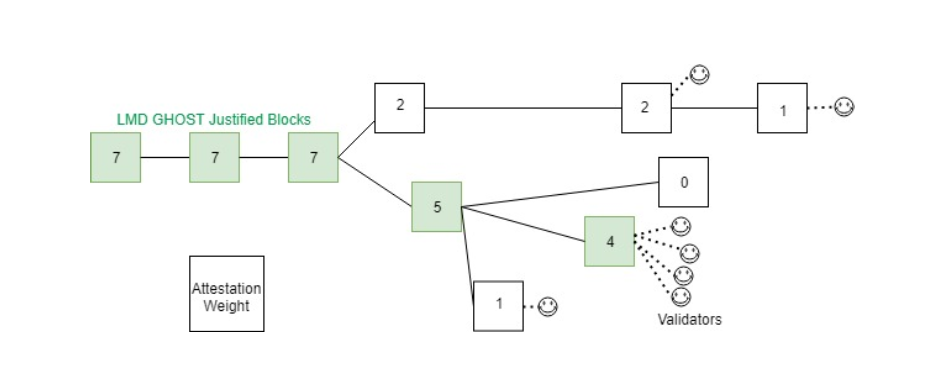
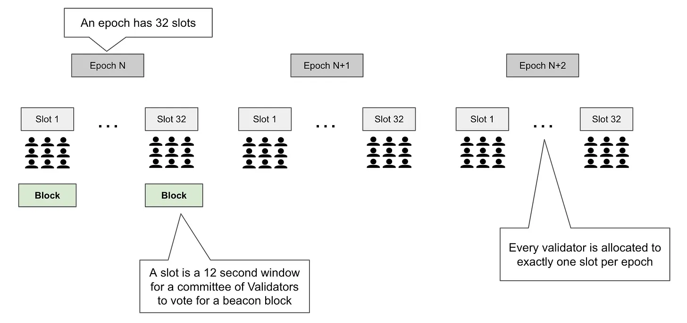
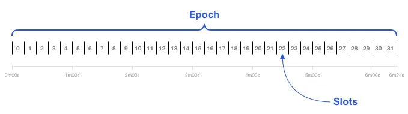
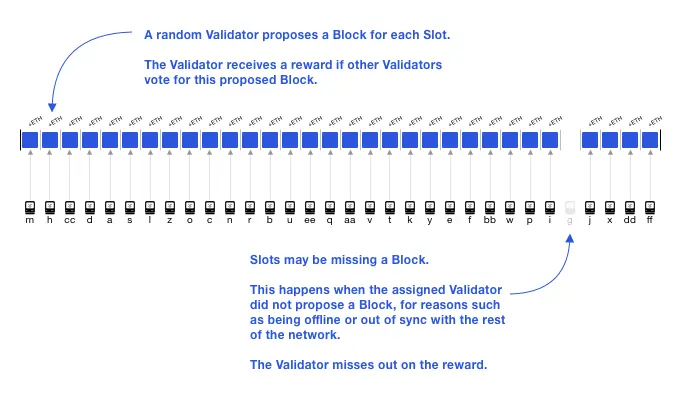
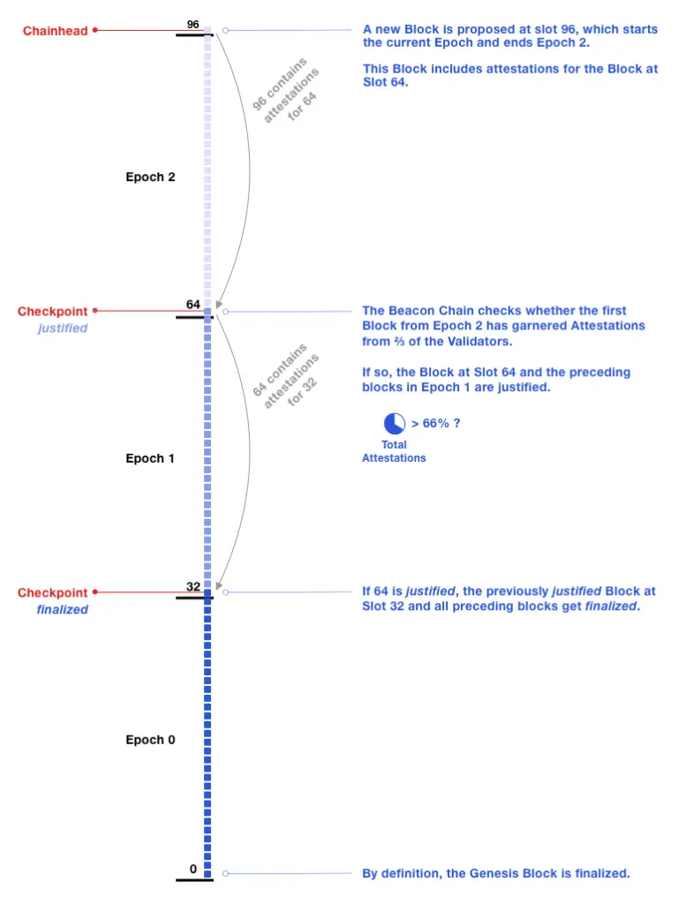
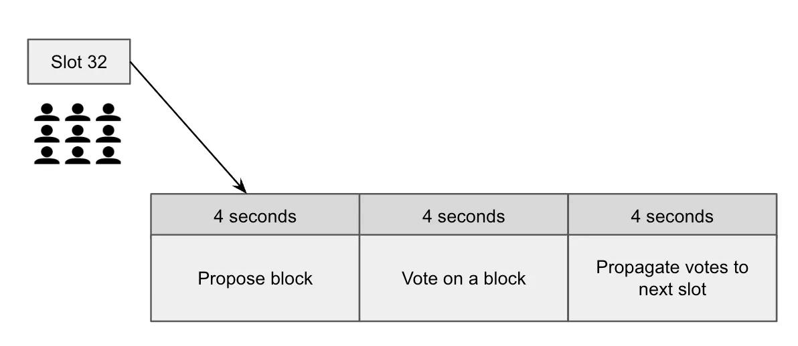
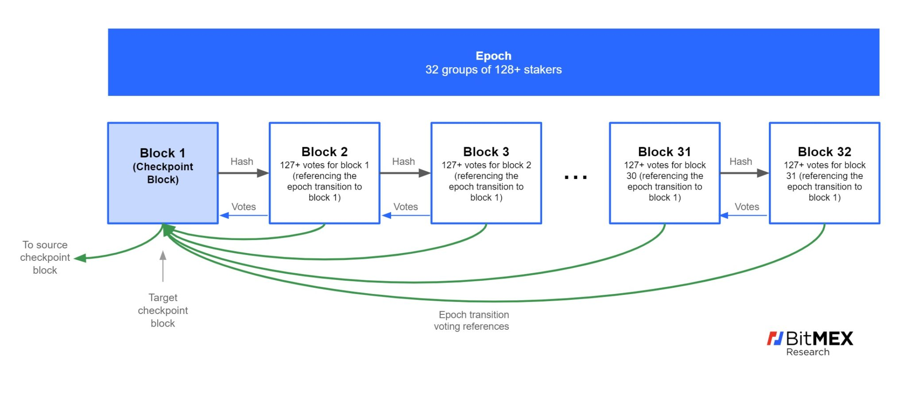

## 概述

Eth2.0 的共识算法设计目标就是让 PoS 就有一定的安全性和可用性 (certain safety and liveness claims).

对应着这个目标，提出了两大组件来定义分叉规则和最终性：

### 最终性规则 Casper FFG

2017 年，Vitalik Buterin 与 Virgil Griffith 共同发表了 [Casper the Friendly Finality Gadget（友好的最终确定性工具）](https://arxiv.org/abs/1710.09437) ，Casper FFG 引入 `justification`和`finalization` 来定义最终性。

同时，Casper 也引入了惩罚条件 (slashing conditions)：

- validator 对同一个高度的 checkpoint，只能给一个完全一致的证明
- validator 在两个不相邻的 checkpoint 之间只能给一个完全一致的证明，也就是说这两个 checkpoint 之间的 checkpoint 不能再给不一样的证明了

可以看出，Casper 只是规定了 checkpoint 是怎么确定下来的，也就是说最终性是如何确定的，而把分叉规则单独最为一个组件，这么做也是为了解耦这两部分。

### 分叉规则 LMD GHOST

Sompolinsky 等人提出的 [The Greediest Heaviest Observed SubTree rule(GHOST 分叉选择规则）](https://arxiv.org/abs/2003.03052) 是一种在 PoW （工作量证明） 和其他区块链平台非常受欢迎的协议。GHOST 协议遵循“最重的”子树 (the “heaviest” subtree)，也就是最长的那条链。在比特币区块链中，“最重的”分支就是那条在其区块中投入了最多算力的链，这条链也就是最长的链。显然最长的链就是我们所说的“权威链 (canonical chain)”，但这条链依旧有可能切换为另一条分叉链 （虽然可能性很小），因此最长链的最终性是概率性的。

由于 PoS 的共识算法需要消息驱动来获取投票的权重，因此称之为 Latest Message Driven Greediest Heaviest Observed SubTree(LMD GHOST).

上图中体现了由最新消息驱动的分叉选择规则：绿色区块表示经由 LMD GHOST 分叉选择规则证明了的区块，笑脸符号表示最新的 validator 证明 (attestations)，某个区块中的证明总量（笑脸总数）就是该区块的权重，用区块中的数字表示。

在上图中，尽管位于上方的那条分叉链是最长的链，但下方的那条由绿色区块组成的链才是“权威链”，因为绿色区块包含了最多的证明，也就是拥有最多的 validator 投票。

## Gasper

以太坊使用被称为 Gasper 的共识机制，该机制结合了 Gasper FFG 和 LMD GHOST。在 2020 年 5 月修改版的 [Combining GHOST and Casper](https://arxiv.org/pdf/2003.03052.pdf) 一文中，V 神的团队详细解释了 Gasper 如何在指定分叉规则的同时，还具有最终性。

为了理解 Gasper，我们先要了解几个基本概念：

### Epoch && Slot

每 12 秒为一个 slot， 每 32 个 slot 为一个 epoch, 每个 Epoch 的时间为 384 秒，即 6.4 分钟。

我们可以将 slot 看作是区块生成时间，随机 validator 在每个 slot 中提议一个区块，如果其他 validator 投票赞成该区块，那么提议 validator 将会获得奖励。

slot 可能会丢失区块，当被选中的 validator 因为掉线、同步失败等原因而没有提议区块时，就会丢失区块，那么 validator 也无法得到奖励。下图中，某 epoch 中第 28 个 slot 无区块提议。

epoch 代表了权益证明协议的一个完整的回合， slot 为 validator 提供了一个参与该回合的机会。

### Checkpoint

checkpoint 指位于每个 epoch 第一个 slot 里的区块，如果该 slot 内没有产生区块，则最近的前一个区块为 checkpoint。每个 epoch 都会有一个 checkpoint 区块；一个区块可能同时是多个 epoch 的 checkpoint。

当一个 epoch 结束之后，如果其 checkpoint 得到了 2/3 余额票数，那么该 checkpoint 就被证明 (justified) 了。如果其下一个 epoch 的 checkpoint 也被证明了，那么 B 就被最终确定了 (finalized)。一般来说，一个 checkpoint 会在两个 epoch 内得以最终确定，即 12.8 分钟。

通常来说，用户交易发生在一个 epoch 的中间部分；那么距下一个 checkpoint 就还有半个 epoch 的时间，也就是说，一笔交易经过 2.5 个 epoch（16 分钟）便可得以最终确定 (finality)。在理想情况下，超过 2/3 的证明 (attestations) 将会被打包进某个 epoch 的第 22 个 slot 中。因此，交易得以最终确定的平均时长为 14 分钟（16+32+22 个 slot）。区块确认过程则经由区块证明 (attestations)，到被证明 (justification)，再到最终确定 (finality)。用户可以自己决定是否等到交易最终确定，还是说稍低一点的安全性也足够了。

### Committee

所有的 validator 被分配到每一个 epoch 中，每个 slot 随机选出包含至少 128 个 validator 组成 committee，第一个 validator 成为可以出块的 proposer，其他 validator 成为对区块进行验证投票的见证者（attester），他们判断 propose 出的区块是否会成为新的区块链 head。每个 epoch 有 32 个区块提议者（每个 slot 一个），所有 validator 都有机会参与权益证明协议，向他们认为应该是规范信标链（canonical beacon chain）的链头投出一票。

所有 slot 都是按照时间顺序一个接一个地产生的。每一个 slot 都准确地按照 12 秒一个被分配出来，并被分成三个阶段：

- 提议区块 指定一个 validator 提议一个区块，并在前 4 秒内将其广播给所有 committee 成员。
- 投票周期 所有其他 committee 的成员都为一个区块投票（见证），他们相信，接下来的四秒内他们的投票就要被这个区块接受。
- 广播投票 在最后的四秒里所有 committee 成员的投票应该被聚合起来并发送给下个 slot 的区块提议者。

所有的区块和投票都是在一个 slot 的 committee 内进行广播。在 committee 中有一个额外的角色，叫做聚合者 (aggregators)，他们会在将证明传递给下一个 slot 的区块提议者之前将其聚合。他们是自选的，这是一个自愿的角色，以减少通信的成本。我们将暂时跳过具体细节--因为这将在未来的文章中涉及。

如果一个提议的区块或见证是在截止日期之后发布的，那么就不能保证该活动会被其他 validator 认可。例如，一个迟到的区块可能会被跳过，因为这个 slot 的见证者可能已经为其父块投了票。一个迟到的见证将被其他见证者在一个 epoch 中处理，最多迟到 32 个 slot，并有不同程度的惩罚。如果它在 32 个 slot 之后被发布，那么它将不会被任何 validator 处理。

最后提醒一下，这个严格的时间窗口保证了运行 validator 所需的带宽和计算能力的下限，因为他们必须要有准时接收、处理、发送见证/区块的能力。

  

除了上面描述的分叉选择投票，同时还会对上一个 epoch 的 checkpoint 进行投票。也就是会进行两次投票：

- 分叉选择投票：为本 slot 选出新出块，为了分叉链选择做依据。
- 检查点候选投票（ FFG 投票）：对上一个 epoch 的 checkpoint 区块进行投票，这也意味着，本 epoch 走完时，上一个 epoch 的 checkpoint 已经被 justified（超过 2/3 的验证人对其投了）。pre-pre-epoch 的检点已经被 finalized。
  
如同区块，证明也会由 validator 在系统中进行广播。validator 之间也会互相监督，通过举报其他 validator 自相矛盾的投票或提议多个区块的行为，从而获得奖励。

## staker

validator 是虚拟的，并由质押者激活。而在以太坊 2.0 阶段，用户通过质押 ETH 来激活和管理 validator。

为了更清楚地理解质押 validator 的含义，我们可以将质押者（stakers）和质押金 (stake)，validator (validators) 和余额 (balance) 联系起来。每个 validator 拥有的余额最多为 32 个 ETH，不过，质押者可以质押他们所有的 ETH。每质押 32 个 ETH，一个 validator 就会被激活。

## 延伸阅读

- [权益证明机制](https://ethereum.org/zh/developers/docs/consensus-mechanisms/pos/)
- [详解以太坊 2.0 信标链](https://learnblockchain.cn/article/901)
- [consensus-specs](https://github.com/ethereum/consensus-specs/blob/dev/specs/phase0/beacon-chain.md)
- [Validator Attestations and Voting Protocols](https://www.cryptofrens.info/p/validator-attestations-and-voting)
- [Compensation and punishment](https://www.cryptofrens.info/p/compensation-and-punishment)
- [PoS 系列 #2——Epoch、Slot 与信标区块](https://www.ethereum.cn/ETh2/epochs-slots-and-beacon-blocks)
