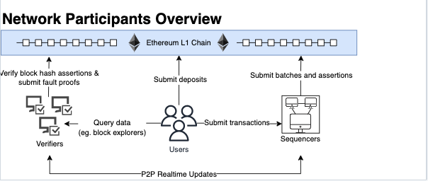
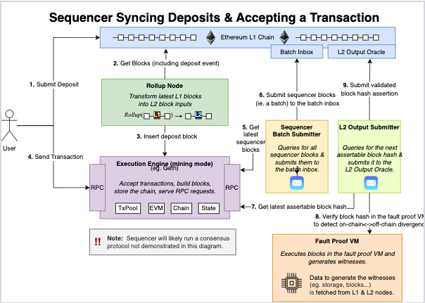
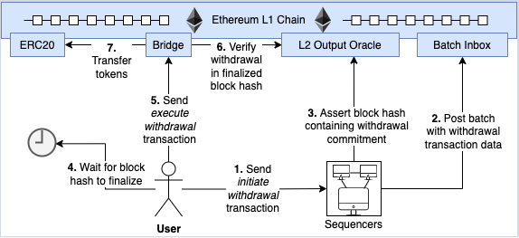

## 引言

关于 optimism 代码讲解我们基于 [Bedrock](https://github.com/ethereum-optimism/optimism/tree/bedrock/specs) 进行。

BedRock 是 Optimism 网络的下一个主要版本，计划于 2023 年第一季度发布。这篇文章主要介绍整个网络中各个参与角色是如何交互的。

## 网络角色 [^1]

Optimism 中有三个参与者：用户（users）、定序器（sequencers）和验证器（verifiers）。

### 用户（Users）

网络的核心是用户。用户可以：

1. 通过将数据发送到以太坊主网上的合约，在 L2 上 deposit 或 withdraw 任意交易。
2. 通过将交易发送到定序器，在第 2 层使用 EVM 智能合约。（todo：用户直接将交易发送到定序器而不是 op-geth 么？）
3. 使用网络验证器提供的区块浏览器查看交易状态。

### 定序器（sequencers）

定序器是主要的块生产者。可能有一个或多个使用共识协议的定序器。对于 1.0.0，只有一个定序器。通常，规范可能会使用“the sequencer”作为由多个定序器操作的共识协议的替代术语。

1. 接受用户链下交易。
2. 观察链上交易（主要是来自 L1 的 deposit 事件）。
3. 将两种交易以特定顺序合并到 L2 块中。
4. 通过将以下两个东西作为 calldata 提交给 L1，来将合并的 L2 块传播到 L1：
   - 步骤 1 中接受的 pending 链下交易。
   - 关于链上交易顺序的足够信息，以成功重建步骤 3 中的块，这些信息完全通过观察 L1 得到。

定序器还提供在步骤 3 中访问块数据的权限，以便用户可以选择在 L1 确认之前访问实时状态。

### 验证器（Verifiers）

验证器有两个目的：

- 向用户提供 rollup 数据。
- 验证 rollup 完整性并争论无效断言。

为了让网络保持安全，必须至少有一个诚实的验证器能够验证 rollup 链的完整性并为用户提供区块链数据。

## 关键交互图

下图演示了在关键用户交互期间如何使用协议组件，以便在深入研究任何特定组件规范时提供上下文。

### depositing 和发送交易

用户通常会通过从 L1 存入 ETH 来开始他们的 L2 旅程。一旦他们有 ETH 来支付费用，他们就会开始在 L2 上发送交易。下图演示了这种交互以及使用的所有关键 Optimism 组件：

上图中涉及组件的相关链接：

- [Batch Inbox (WIP)](posts/batch-inbox/)
- [Rollup Node](posts/ethereum/optimism/bedrock/rollup-node/)
- [Execution Engine](posts/ee/)
- [Sequencer Batch Submitter (WIP)](posts/sequencer-batch-submitter/)
- [L2 Output Oracle](posts/l2-output-oracle/)
- [L2 Output Submitter](posts/l2-output-submitter/)
- [Fault Proof VM (WIP)](posts/fault-proof-vm/)

### withdraw

用户可以从 rollup 上 withdraw，与 depositing 一样至关重要。withdraw 由 L2 上的正常交易发起，但在争议期结束后使用 L1 上的交易完成。

上图中涉及组件相关链接：

- [L2 Output Oracle](posts/l2-output-oracle/)

## 总结

[后续文章]() 我们从代码层面介绍 optimism 是如何实现的。

[^1]: [Introduction](https://github.com/ethereum-optimism/optimism/blob/develop/specs/introduction.md)
