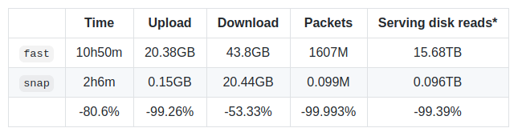

## Snapshots[^1]

快照我们[谈论快照](https://blog.ethereum.org/2020/07/17/ask-about-geth-snapshot-acceleration)已经有很长时间了，最 ​​ 终在一个版本中看到它们感觉很奇怪。无需赘述（参见链接文章），快照是以太坊状态之上的一种加速数据结构，可以显着加快读取账户和合约存储的速度。

给快照加上一个数字后，快照功能将访问帐户的成本从 O(logN) 降低到 O(1)（todo：这里是什么原因？）。乍一看这可能看起来不多，但实际上，在拥有 1.4 亿个帐户的主网上，快照可以为每个帐户读取节省大约 8 次数据库查找。这几乎比磁盘查找少了一个数量级，保证了与状态大小无关的常数。

哇，这是否意味着我们可以将 gas 限制提高 10 倍？不，不幸的是。虽然快照确实为我们提供了 10 倍的读取性能，但 EVM 执行也会写入数据，这些写入需要经过 Merkle 验证。 Merkle 证明要求保留了写入时 O(logN) 磁盘访问的必要性。

那么，那有什么意义呢？！虽然对账户和合约存储的快速读取访问不足以提高 gas 限制，但它确实解决了一些特别棘手的问题：

- 拒绝服务（DoS）。 2016 年，以太坊遭受了有史以来最严重的 DoS 攻击——上海攻击——持续了大约 2-3 个月。攻击围绕着膨胀以太坊的状态和滥用各种价格低廉的操作码来使网络陷入瘫痪。经过多次客户端优化和重新定价硬分叉后，攻击被击退。根本原因仍然存在：状态访问操作码具有固定的 EVM gas 成本 O(1)，但执行成本却在缓慢增加 O(logN)。我们已经提高了 [Tangerine Whistle](https://eips.ethereum.org/EIPS/eip-150)、[伊斯坦布尔](https://eips.ethereum.org/EIPS/eip-1884)和现在[柏林](https://eips.ethereum.org/EIPS/eip-2929)的 gas 成本，以使 EVM 成本与运行时成本保持一致，但这些都是权宜之计。另一方面，快照将状态读取的执行成本降低到 O(1) - 与 EVM 成本一致 - 从而长期解决基于读取的 DoS 问题（不要引用我的话）。
- 调用（Call）。在以太坊中检查智能合约的状态需要一个 mini EVM 执行。其中一部分是运行字节码，一部分是从磁盘读取状态槽。如果您拥有仅用于个人需求的个人以太坊节点，那么当前状态访问速度很有可能绰绰有余。但是，如果您正在运行一个节点以供多个用户使用，那么快照带来的 10 倍性能提升意味着您可以以相同的成本提供 10 倍的查询。
- 同步（Sync）。同步以太坊节点有两种主要方式。您可以下载区块并执行其中的所有交易；或者您可以下载区块、验证 PoW 并下载与最近区块相关的状态。后者要快得多，但它依赖于别人为您提供最近状态的副本。使用当前的 Merkle-Patricia 状态模型，这些恩人从磁盘读取 16TB 数据以服务于同步节点。快照使服务节点只能从磁盘读取 96GB 的数据，以使新节点加入网络。更多参看在 Snap 同步部分。

与所有功能一样，这是一个权衡游戏。虽然快照有巨大的好处，我们坚信它足以为每个人启用，但它们有一定的成本：

- 快照是已经包含在 Merkle Patricia 树的叶子中的原始以太坊状态的冗余副本。因此，快照目前需要在主网上额外增加大约 20-25GB 的磁盘开销。希望快照将允许我们做一些进一步的状态优化，并可能消除 Merkle 尝试目前的一些磁盘开销。
- 由于尚未在网络中构建快照，因此节点最初需要承担迭代状态树和自己创建初始快照的成本。根据节点的负载，这可能需要一天到一周的时间，但您只需要在节点的生命周期中执行一次（如果事情按预期工作）。快照生成在后台运行，与所有其他节点操作同时进行。一旦快照在网络中普遍可用，我们计划不再要求这样做。更多参见 Snap 同步部分。

如果您对快照功能没有信心，您可以在 Geth 1.10.0 中通过 `--snapshot=false` 禁用它，但请注意，我们将长期强制使用它以保证基线网络健康。

## Snap Sync[^1]

在这之前，先了解一下历史：

当以太坊启动时，您可以选择两种不同的网络同步方式：完全同步（`full sync`）和快速同步（`fast sync`）（本次讨论中省略轻客户端）。完全同步通过下载整个链并执行所有交易来操作； 快速同步在最近的块中建立了初始信任，并直接下载了与其相关的状态(`state`)（之后它如完全同步一样切换到块执行）。 尽管两种操作模式产生了相同的最终数据集，但它们更倾向于不同的权衡：

- 完全同步最小化信任，选择执行从创世到头部的所有交易。虽然它可能是最安全的选择，但以太坊主网目前包含超过 10.3 亿笔交易，以每天 125 万笔的速度增长。选择从创世开始执行一切意味着完全同步的成本永远增加。目前，在相当强大的机器上处理所有这些交易需要 8-10 天。
- 快速同步选择依赖 PoW 的安全性。它没有执行所有交易，而是假设顶部有 64 个有效 PoW 的块对于某人来说构建起来会非常昂贵，因此可以下载与 HEAD-64 相关的状态。快速同步信任来自最近区块的状态根，它可以直接下载状态树。这用对网络带宽和延迟的需求取代了对 CPU 和磁盘 IO 的需求。具体来说，以太坊主网目前包含大约 6.75 亿个状态树节点，在连接良好的机器上下载大约需要 8-10 个小时。

任何想要花费资源来验证以太坊的整个历史的人仍然可以使用完全同步，但对于大多数人来说，快速同步已经绰绰有余了。有一个计算机科学悖论，一旦系统达到其设计使用量的 50 倍，它就会崩溃。逻辑是，与事情的运作方式无关，将其推得足够紧，就会出现无法预料的瓶颈。

在快速同步的情况下，无法预见的瓶颈是延迟，这是由以太坊的数据模型引起的。以太坊的状态树是一棵 Merkle 树，其中叶子包含有用的数据，上面的每个节点都是 16 个子节点的哈希。从树的根（嵌入在块头中的哈希）同步，下载所有内容的唯一方法是一个接一个地请求每个节点。有 6.75 亿个节点要下载，即使将 384 个请求批处理在一起，最终也需要 175 万次往返。假设对 10 个服务对等点的 50 毫秒 RTT 过于慷慨，快速同步实质上是等待超过 150 分钟的数据到达。但网络延迟只是问题的 1/3。

当服务对等点收到对 trie 节点的请求时，它需要从磁盘中检索它们。以太坊的 Merkle trie 在这里也无济于事。由于 trie 节点由散列键控，因此没有有意义的方式来批量存储/检索它们，每个都需要读取自己的数据库。更糟糕的是，LevelDB（Geth 使用）以 7 个级别存储数据，因此随机读取通常会触及尽可能多的文件。将所有这些相乘，384 个节点的单个网络请求（每次读取 7 次）相当于 2700 次磁盘读取。凭借最快的 SATA SSD 的 100.000 IOPS 速度，额外延迟为 37 毫秒。在与上述相同的 10 个服务对等点假设下，快速同步只是增加了 108 分钟的额外等待时间。但服务延迟只是问题的 1/3。

单独请求许多 trie 节点意味着实际上将许多哈希上传到远程对等点以提供服务。有 6.75 亿个节点要下载，那就是 6.75 亿个哈希要上传，或者 675*32 字节 = 21GB。在全球平均 51Mbps 的上传速度（X Doubt）下，快速同步只是增加了 56 分钟的额外等待时间。下载量是原来的两倍多，因此全球平均速度为 97Mbps，*快速同步\*又增加了 63 分钟。带宽延迟是问题的最后 1/3。

总结一下，快速同步花费了 6.3 个小时，什么都不做，只是等待数据：

- 如果您的网络链接高于平均水平。
- 如果您有大量的服务同行
- 如果你的同龄人不为任何人服务，但你服务。

[快照同步](https://github.com/ethereum/devp2p/blob/master/caps/snap.md)旨在解决所有三个列举的问题。核心思想相当简单：snap sync 不是逐个节点下载 trie，而是下载连续的有用状态数据块，并在本地重建 Merkle trie：

- 无需下载中间的 Merkle trie 节点，就可以大批量获取状态数据，消除网络延迟带来的延迟。
- 不下载 Merkle 节点，下游数据下降一半；如果不单独处理每条数据，上游数据就会变得微不足道，从而消除了带宽造成的延迟。
- 在不请求随机键控数据的情况下，对等点只执行几次连续的磁盘读取来提供响应，从而消除磁盘 IO 的延迟（如果对等点已经以适当的平面格式存储了数据）。

虽然 snap sync 与 Parity 的 [warp sync](https://openethereum.github.io/Warp-Sync.html) 非常相似 - 并且确实从中汲取了许多设计理念 - 但显着改进了后者：

- Warp 同步依赖于每 30000 个块创建的[静态快照](https://openethereum.github.io/Warp-Sync-Snapshot-Format)。这意味着服务节点需要每 5 天左右重新生成一次快照，但迭代整个状态树实际上可能需要更多时间。这意味着经纱同步是不可持续的长期。与此相反，快照同步基于[动态快照](https://blog.ethereum.org/2020/07/17/ask-about-geth-snapshot-acceleration)，无论多慢，它们都只生成一次，然后随着链的进展保持最新。
- Warp 同步的快照格式不遵循 Merkle Trie 布局，因此无法单独证明 Warp 数据块。同步节点需要下载整个 20+GB 数据集才能验证。这意味着 Warp 同步节点理论上可能会受到伤害。与此相反，snap sync 的快照格式只是顺序的 Merkle 叶子节点，它允许证明任何范围，因此可以立即检测到不良数据。

为了对快速同步与快速同步进行比较，将主网状态（忽略块和收据，因为它们是相同的）与 3 个服务对等点同步，在块 ~#11,177,000 产生了以下结果：

[^1]: https://blog.ethereum.org/2021/03/03/geth-v1-10-0
