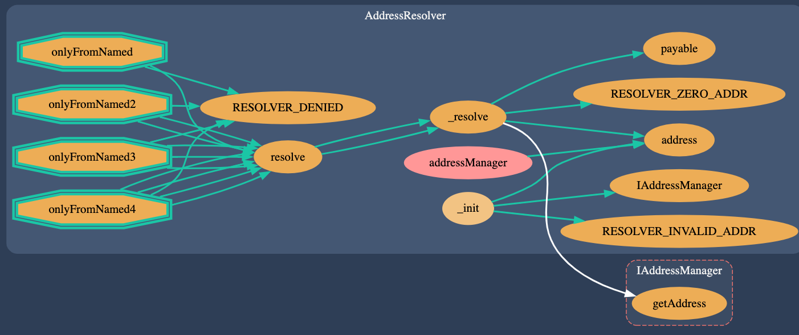
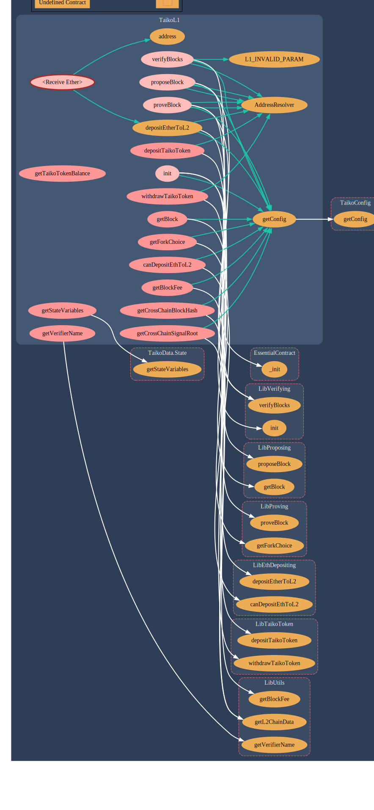

本文解析 [Taiko 合约](https://github.com/taikoxyz/taiko-mono)，当前版本`commit 06ac4f015ca252e60bc6863a3154e9c22668893b`。

<!--more-->

## 概述

## 地址管理

[AddressManger](https://github.com/taikoxyz/taiko-mono/blob/06ac4f015ca252e60bc6863a3154e9c22668893b/packages/protocol/contracts/common/AddressManager.sol#L43) 在私有状态变量 [addresses](https://github.com/taikoxyz/taiko-mono/blob/06ac4f015ca252e60bc6863a3154e9c22668893b/packages/protocol/contracts/common/AddressManager.sol#L44) 中保存了区块链中合约到部署地址之间的映射：

```solidity
mapping(uint256 chainID=> mapping(bytes32 name => address)) private addresses;
```


[AddressResolver](https://github.com/taikoxyz/taiko-mono/blob/06ac4f015ca252e60bc6863a3154e9c22668893b/packages/protocol/contracts/common/AddressResolver.sol#L17) 则会通过 [resolve](https://github.com/taikoxyz/taiko-mono/blob/06ac4f015ca252e60bc6863a3154e9c22668893b/packages/protocol/contracts/common/AddressResolver.sol#L91) 方法对外提供 name 到 address 的解析。同时，该合约通过 [EssentialContract](https://github.com/taikoxyz/taiko-mono/blob/06ac4f015ca252e60bc6863a3154e9c22668893b/packages/protocol/contracts/common/EssentialContract.sol#L18) 被其他合约继承，并在合约创建的时候通过传入 AddressManger 的部署地址进行初始化。这样，其他合约可以在合约内部直接查找第三方合约地址来进行调用，避免将合约地址硬编码在合约中。



AddressManger 与 AddressResolver 搭配使用，实现了类似 DNS 的效果。

## TaikoToken

L1 上部署的 [TaikoToken](https://github.com/taikoxyz/taiko-mono/blob/06ac4f015ca252e60bc6863a3154e9c22668893b/packages/protocol/contracts/L1/TaikoToken.sol#L35) 是一个 ERC20 代币合约，可以用于充值和提现，主要用于质押。

## ProverPool

[ProverPool](https://github.com/taikoxyz/taiko-mono/blob/06ac4f015ca252e60bc6863a3154e9c22668893b/packages/protocol/contracts/L1/ProverPool.sol#L18) 保存了已经完成质押的 Prover，[TaikoL1]() 会从中选择 prover 来验证 propose 到 L1 的 L2 Block。

### 数据结构

```solidity
/// @dev These values are used to compute the prover's rank (along with the
/// protocol feePerGas).
struct Prover {
    uint64 stakedAmount; // 质押时初始化为质押金额
    uint32 rewardPerGas; // 质押时初始化由质押者初始化，可以理解为其接受的 gasFee
    uint32 currentCapacity; // 质押时被初始化为 staker.maxCapacity。
}

/// @dev Make sure we only use one slot.
struct Staker {
    uint64 exitRequestedAt;
    uint64 exitAmount; // 退出质押时候可提现的 token
    uint32 maxCapacity;
    uint32 proverId; // 0 to indicate the staker is not a top prover
    // 上面这行的意思是：因为 uint32 的默认值是 0，所以 provers 中的存储是从 ID=1 开始的。
}

uint256 public constant MAX_NUM_PROVERS = 32;

// Reserve more slots than necessary
Prover[1024] public provers; // 保存完成质押的 prover
// Save the weights only when: stake / unstaked / slashed
mapping(address staker => Staker) public stakers; // 保存质押者的信息
```

### stake

如果想要质押，质押数额必须大于 provers 中的 [最低质押值](https://github.com/taikoxyz/taiko-mono/blob/dfd23ca7de7cba179841603bd92ebc81b45949fb/packages/protocol/contracts/L1/ProverPool.sol#L328-L336) ，这里用简单的代码实现了一个单调栈的更新，挺巧妙的。

如果第一个质押者质押了大量的 token，提高了新的 prover 进入的门槛，可能会出现以下问题：

- 最终可能很难有足够的 prover？
- 如果只有少数的几个 prover，也可能会导致中心化？

### assignProver

TaikoL1 从完成质押的 Provers 中结合 [权重](https://github.com/taikoxyz/taiko-mono/blob/06ac4f015ca252e60bc6863a3154e9c22668893b/packages/protocol/contracts/L1/ProverPool.sol#L264) 和 [一定的随机性](https://github.com/taikoxyz/taiko-mono/blob/06ac4f015ca252e60bc6863a3154e9c22668893b/packages/protocol/contracts/L1/ProverPool.sol#L106) [选择](https://github.com/taikoxyz/taiko-mono/blob/06ac4f015ca252e60bc6863a3154e9c22668893b/packages/protocol/contracts/L1/ProverPool.sol#L442) prover 来证明 L1 块有效性。

### releaseProver

prover 在完整证明后会被 [释放 capacity](https://github.com/taikoxyz/taiko-mono/blob/06ac4f015ca252e60bc6863a3154e9c22668893b/packages/protocol/contracts/L1/ProverPool.sol#L127)，以提高下次 assignProver 时的权重。

### slashProver

如果选中的 prover 没有及时完成证明，会通过 [燃烧其 exitAmount 或者质押的 token](https://github.com/taikoxyz/taiko-mono/blob/06ac4f015ca252e60bc6863a3154e9c22668893b/packages/protocol/contracts/L1/ProverPool.sol#L160-L172) 来对其惩罚。

## HorseToken && BullToken

L1 上部署的两个 ERC20 代币，可用于 swap。

## TaikoL1

Taiko Rollup 的核心逻辑位于 [TaikoL1](https://github.com/taikoxyz/taiko-mono/blob/06ac4f015ca252e60bc6863a3154e9c22668893b/packages/protocol/contracts/L1/TaikoL1.sol#L31) 中。

状态变量 [TaikoData.State](https://github.com/taikoxyz/taiko-mono/blob/1ff0b7a3be7871038714dcff7a40f0ddb26a1578/packages/protocol/contracts/L1/TaikoData.sol#L186-L219) [state](https://github.com/taikoxyz/taiko-mono/blob/06ac4f015ca252e60bc6863a3154e9c22668893b/packages/protocol/contracts/L1/TaikoL1.sol#L37) 保存合约运行信息：



- `blocks` 保存了 proposed/proved/verified [block]()，可以将这个字段理解为数组实现的循环队列，这个队列的状态可能如下：队列头部是最近的 verified blocks，然后是可能存在 proved blocks，然后是可能存在 proposed blocks。

该变量在 [LibVerifying.init](https://github.com/taikoxyz/taiko-mono/blob/06ac4f015ca252e60bc6863a3154e9c22668893b/packages/protocol/contracts/L1/libs/LibVerifying.sol#L72-L93) 中初始化。



从上图中可以看出：`TaikoL1.sol` 主要封装了对外接口，内部实现都是位于在对应的库合约（LibContract）中。

### Block



- Taiko L1 中的 Block 与 layer-1/layer-2 的 ethereum block 并不是一回事。blockId 也不等同于 ethereum block number。每次成功 propose layer-2 交易都会产生一个新的 taiko block，并记录在 TaikoL1.state.block 中。

### 充值提现

- depositTaikoToken
- withdrawTaikoToken
- depositEtherToL2
- canDepositEthToL2

### Rollup

#### proposeBlock



- proverBlock
- verifyBlock
- getVerifierName

### 查询链状态

- getBlock
- getBlockFee
- getForkChoice
- getStateVariables
- getConfig

### 跨链消息

- getCrossChainBlockHash
- getCrossChainSignalRoot
