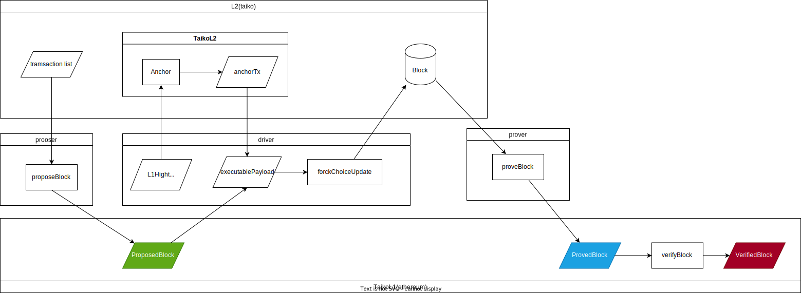

本文解析 Taiko 代码，主要针对：

- [taiko-protocol](https://github.com/taikoxyz/taiko-mono/tree/main/packages/protocol)，当前版本`commit: 839326c9aa776e1335a2b8aac5a797ee081e667d`。
- [taiko-client](https://github.com/taikoxyz/taiko-client) , 当前版本`commit: becdd735e83a5b444ed04671e4957ce44ab222a1`
<!--more-->

## 概述

taiko 是一个基于以太坊的安全的、去中心化的 zkRollup 实现。

zkRollup 核心逻辑：

- 将所有重建 L2 状态的数据都放在了 L1 上，并通过零知识证明（zk） 来验证这些数据在 L2 的正确性。
- L2 可以通过 L1 的数据来重建自身状态。

### TaikoBlock

在 Taiko 中，L1 将 L2 的 txlist(transaction list) 抽象为 TaikoBlock 存储 TaikoL1 合约中，TaikoBlock 与以太坊的 Block 完全不同的概念，二者完全没有任何可比性，不可混淆。

TaikoBlock 有三种状态：

- proposed

  proposed txlist 对应一个 proposedBlock。当一个 proposedBlock 生成后， L2 的下一个 Block 也就确定了，这是因为：

  - TaikoBlock 生成后是不变的，基于以太坊的特性，所有 taiko-client(proposer、driver、prover) 看到的 L1 的状态是一致的。
  - proposer 在 propose txlist 前，其连接的 L2 与 L1 必须同步（官方实现）：`L2.LatestBlock.TaikoBlockID == TaikoL1.LatestProposedBlockID`，这是为了避免 propose 无效的 txlist。
  - 假设有的 proposer 没有同步就 propose 会有什么问题？无效的 txlist 可能会别 propose 到 L1，但 driver 在生成新的 L2 Block 前会对检查和过滤 txlist，如果所有 transactions 都非法，那么就在 L2 提交一个只有 [anchorTx]() 的 Block。

- proved

  当 proposedBlock 被 prover 证明了其在 L2 的正确性后，就转变为 provedBlock。

  由于 TaikoBlock 是不可变的，所以 proposedBlock 的 prove 工作可以并行执行，这加快了 txlist 的验证速度。

- verified

  如果 provedBlock 的所有父块都已经 proved，就会转变为 verifiedBlock。
  
  为什么 TaikoBlock 需要 verified，而不是只 proved 就够了？因为 TaikoBlock 可以并行 prove，provedBlock 的 parent 并不一定已经被 prove。verifiedBlock 则说明其本身以及父块都已经 proved, 即其对应的 txlist 已经对应 L2 的某一个 block 了。

### AnchorTransaction {#anchorTx}

为什么需要 AnchorTransaction（简称 anchorTx）?

假设 L2 forkChoiceUpdate 使用的 executablePayload 只有 txlist，那么 L2 如何确定这些 txlist 是来自 L1 呢？这就需要一个额外的 transaction 来记录与 txlist 相关的 L1 信息，比如 forkChoiceUpdate 时的 L1Height、L1Hash，通过这些信息，在 L2 上就可以确定与 L1 的同步状态。

我们约定 payload 中第一个 transaction 必须是 anchorTx，这样就不会因为其位置不同导致 blockHash 不一致。

## 数据结构

### Block





proposed txlist 转化后的 proposedBlock 包含两个部分：

- blockMetadata，TaikoBlock 中保存了该数据 hash。
- txlist，存放在 blob 中，TaikoBlock 中保存了对应的 hash。

### State

TaikoL1 中状态变量 [TaikoData.State](https://github.com/taikoxyz/taiko-mono/blob/1ff0b7a3be7871038714dcff7a40f0ddb26a1578/packages/protocol/contracts/L1/TaikoData.sol#L186-L219) state 保存合约运行信息：



`blocks` 保存了 proposed/proved/verified [block]()，可以将这个字段理解为数组实现的循环队列，队列头部一定是 verifiedBlock。
该变量在 [LibVerifying.init](https://github.com/taikoxyz/taiko-mono/blob/839326c9aa776e1335a2b8aac5a797ee081e667d/packages/protocol/contracts/L1/libs/LibVerifying.sol#L72-L93) 中初始化。

transitionId 保存了 block 与 L2 Block 之间的关联。

transitions 保存了 block 不同的 prove 数据。

通过 block.verifiedTransitionId,transitionId,transitions 这三个数据可以重建 L2 状态。

## proposeBlock

propose txlist 到 TaikoL1，生成对应的 proposedBlock, 并触发 BlockProposed Event。

### 有效性检查

proposedBlock 有 [两个部分](https://taiko.xyz/docs/concepts/proposing#intrinsic-validity-functions)：

- block metadata
- txlist（存储在一个 blob 中，BlockMetadata 存储该 blob 的哈希值）

我们将 proposedBlock 的有效性检查分为两部分：

- metadataCheck
- txListCheck

proposedBlock 必须通过这两项检查，才能将 txList 映射到 Taiko 上的 L2 区块。如果一个 proposedBlock 通过了 metadataCheck，但随后却未能通过 txlistCheck，那么将创建一个只有 anchorTx 的区块。

## createL2lBlock
  
监听到 blockProposedEvent 后，从 proposeBlock tx 的 calldata 解析出 txlist，然后通过 forkChoiceUpdate 更新 L2 上的区块。

检查 txlist 有效性：

- 如果 txlist 中的每笔交易都是有效的，则会跳过 nonce 无效或发送方以太币余额太少无法支付交易的交易，创建 txlist 的有序子集。该有序子集与锚 anchorTx 一起用于创建 taiko L2 Block。
- 如果 txlist 中的所有交易无效，则会在 L2 上创建一个只有 anchorTx 的 Block。

## proveBlock
  
监听到 L2 上的 NewBlockEvent，然后获取相关数据做验证。



有两种类型的 Prover：

- CommunityProver: 大多数运行的 Prover 都是 CommunityProver。
- OracleProver: taiko 官方的 prover，能够覆盖 CommunityProver。由于 ZK-EVM 仍处于开发阶段时，这是为防止无效区块被标记为通过社区证明验证而设置的安全机制。OracleProver 会生成一个假证明，将一个区块标记为已验证。测试网只要求每 N 个区块生成一个真实证明。这是测试网的一项临时功能，目的是降低社区证明者的成本。

## verifyBlock

TaikoL1 在 proposeBlock 或者 proveBlock 时会触发 verifyBlock.
