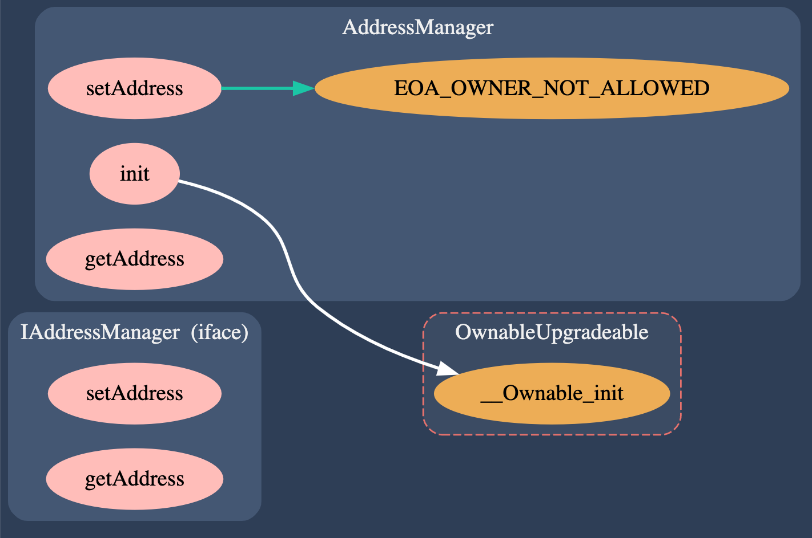
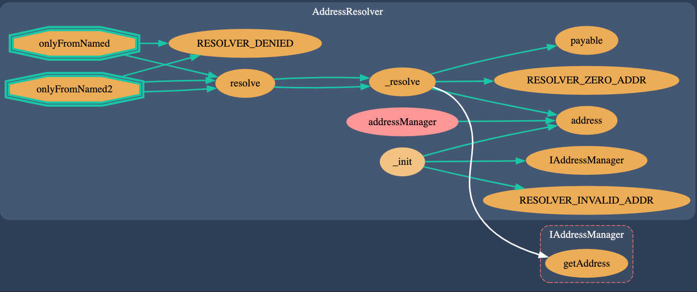
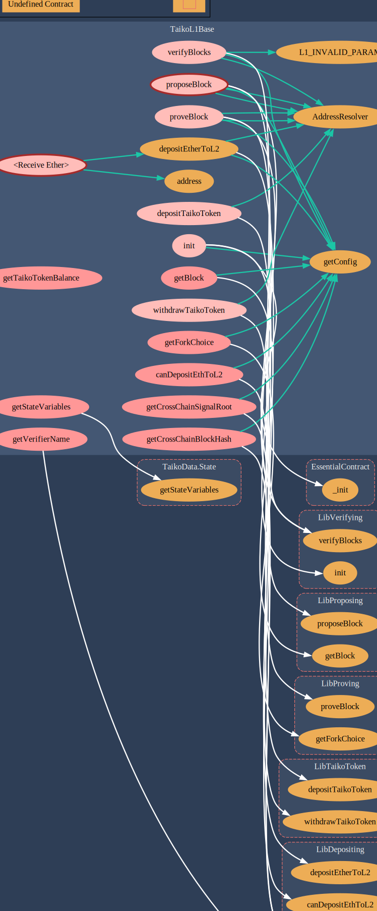

本文解析 Taiko 代码，主要针对：

- [taiko-protocol](https://github.com/taikoxyz/taiko-mono/tree/main/packages/protocol)，当前版本`commit 85bef055c8778a473fff41318b06792c151efa52`。
- [taiko-client](https://github.com/taikoxyz/taiko-client) , 当前版本`commit:28ea4dbb658a7e708ffb7bc54a194a29d7013f18`
<!--more-->

## 概述

taiko 是一个基于以太坊的安全的、去中心化的 zkRollup 实现。

zkRollup 核心逻辑：

- 将所有重建 L2 状态的数据都放在了 L1 上，并通过零知识证明（zk） 来验证这些数据在 L2 的正确性。
- L2 可以通过 L1 的数据来重建自身状态。


### TaikoBlock

在 Taiko 中，L1 将 L2 的 txlist(transaction list) 抽象为 TaikoBlock 存储 TaikoL1 合约中，TaikoBlock 与以太坊的 Block 完全不同的概念，二者完全没有任何可比性，不可混淆。

proposed txlist 在 TaikoL1 对应一个 TaikoBlock，并且其 ID 是递增的，这是 TaikoL1 中规定的，并且所有的 TaikoBlock 生成后不可改变（除非 L1 reorg）。

TaikoBlock 有三种状态：

- proposed

  proposed txlist 对应一个 proposedBlock。当一个 proposedBlock 生成后， L2 的下一个 Block 也就确定了，这是因为：

  - TaikoBlock 是不变的，基于以太坊的特性，所有 taiko-client(proposer、driver、prover) 看到的 L1 的状态是一致的。
  - proposer 在 propose txlist 前，其连接的 L2 与 L1 必须同步（官方实现）：`L2.LatestBlock.TaikoBlockID == TaikoL1.LatestProposedBlockID`，这是为了避免 propose 无效的 txlist。但是如果有的 proposer 实现没这么做会有什么问题？假设 propose 错误的 txlist 到 L1，driver 在生成新的 L2 Block 前会对检查和过滤 txlist，如果所有 transactions 都非法，那么就在 L2 提交一个只有 [anchorTx]() 的 Block。

- proved

  当 proposedBlock 被 prover 证明了其在 L2 的正确性后，就转变为 provedBlock。

  由于 TaikoBlock 是不可变的，所以 proposedBlock 的 prove 工作可以并行执行，这加快了 txlist 的验证速度。

- verified

  如果 provedBlock 的所有父块都已经 proved，就会转变为 verifiedBlock。
  
  为什么 TaikoBlock 需要 verified ，而不是只 proved 就够了？因为 TaikoBlock 可以并行 prove，provedBlock 的 parent 并不一定已经被 prove。通过 verifiedBlock 可以确定其本身以及父块都已经在 L2 上了。

### AnchorTransaction {#anchorTx}

为什么需要 AnchorTransaction（简称 anchorTx）?

假设 L2 forkChoiceUpdatePayload 只有 txlist，那就 prover 无法验证这些 txlist 是不是已经存在于 L1 上，所以我们需要一个额外的 transaction 来记录与 txlist 相关的 L1 信息，比如 forkChoiceUpdate 时的 L1Height、L1Hash，通过这些信息，在 L2 上就可以确定与 L1 的同步状态。

我们约定 payload 中第一个 transaction 必须是 anchorTx，这样就不会因为其位置不同导致 blockHash 不一致。

todo: anchorTx 还做了哪些事情？

## proposeBlock

### State

Taiko Rollup 的核心逻辑位于 [TaikoL1](https://github.com/taikoxyz/taiko-mono/blob/85bef055c8778a473fff41318b06792c151efa52/packages/protocol/contracts/L1/TaikoL1.sol#L31) 中。

状态变量 [TaikoData.State](https://github.com/taikoxyz/taiko-mono/blob/1ff0b7a3be7871038714dcff7a40f0ddb26a1578/packages/protocol/contracts/L1/TaikoData.sol#L186-L219) [state](https://github.com/taikoxyz/taiko-mono/blob/85bef055c8778a473fff41318b06792c151efa52/packages/protocol/contracts/L1/TaikoL1.sol#L37) 保存合约运行信息：



- `blocks` 保存了 proposed/proved/verified [block]()，可以将这个字段理解为数组实现的循环队列，这个队列的状态可能如下：队列头部是最近的 verified blocks，然后是可能存在 proved blocks，然后是可能存在 proposed blocks。

该变量在 [LibVerifying.init](https://github.com/taikoxyz/taiko-mono/blob/85bef055c8778a473fff41318b06792c151efa52/packages/protocol/contracts/L1/libs/LibVerifying.sol#L72-L93) 中初始化。

propose txlist 到 TaikoL1，并触发 BlockProposedEvent。

### blockMeta



### block



### 有效性检查

proposedBlock 有 [两个部分](https://taiko.xyz/docs/concepts/proposing#intrinsic-validity-functions)：

- block metadata
- txlist（存储在一个 blob 中，BlockMetadata 存储该 blob 的哈希值）

我们将 proposedBlock 的有效性检查分为两部分：

- metadataCheck
- txListCheck

proposedBlock 必须通过这两项检查，才能将 txList 映射到 Taiko 上的 L2 区块。如果一个 proposedBlock 通过了 metadataCheck，但随后却未能通过 txlistCheck，那么将创建一个只有 anchorTx 的区块。

## createL2lBlock
  
监听到 blockProposedEvent 后，从 proposeBlock tx 的 calldata 解析出 txlist，然后通过 forkChoiceUpdate 更新 L2 上的区块。

检查 txlist 有效性：

- 如果 txlist 中的每笔交易都是有效的，则会跳过 nonce 无效或发送方以太币余额太少无法支付交易的交易，创建 txlist 的有序子集。该有序子集与锚 anchorTx 一起用于创建 taiko L2 Block。
- 如果 txlist 中的所有交易无效，则会在 L2 上创建一个只有 anchorTx 的 Block。

## proveBlock
  
监听到 L2 上的 NewBlockEvent，然后获取相关数据做验证。



有两种类型的 Prover：

- CommunityProver: 大多数运行的 Prover 都是 CommunityProver。
- OracleProver: taiko 官方的 prover，能够覆盖 CommunityProver。由于 ZK-EVM 仍处于开发阶段时，这是为防止无效区块被标记为通过社区证明验证而设置的安全机制。OracleProver 会生成一个假证明，将一个区块标记为已验证。测试网只要求每 N 个区块生成一个真实证明。这是测试网的一项临时功能，目的是降低社区证明者的成本。

## verifyBlock

TaikoL1 内部自行触发 verifyBlock.

## L1 合约

### AddressManager

AddressManger 与 AddressResolver 搭配使用，实现了类似 ens 的作用，避免硬编码调用合约的地址。

AddressManger 在私有状态变量 [addresses](https://github.com/taikoxyz/taiko-mono/blob/85bef055c8778a473fff41318b06792c151efa52/packages/protocol/contracts/common/AddressManager.sol#L44) 中保存了链上合约到部署地址之间的映射：

```solidity
mapping(uint256 chainID=> mapping(bytes32 name => address)) private addresses;
```



AddressResolver 则会通过 [resolve](https://github.com/taikoxyz/taiko-mono/blob/85bef055c8778a473fff41318b06792c151efa52/packages/protocol/contracts/common/AddressResolver.sol#L91) 方法对外提供 name 到 address 的解析。同时，该合约通过 [EssentialContract](https://github.com/taikoxyz/taiko-mono/blob/85bef055c8778a473fff41318b06792c151efa52/packages/protocol/contracts/common/EssentialContract.sol#L18) 被其他合约继承。



### TaikoToken

L1 上部署的 [TaikoToken](https://github.com/taikoxyz/taiko-mono/blob/85bef055c8778a473fff41318b06792c151efa52/packages/protocol/contracts/L1/TaikoToken.sol#L35) 是一个 ERC20 代币合约，可以用于充值和提现，主要用于质押。

### HorseToken && BullToken

L1 上部署的两个 ERC20 代币，可用于 swap。

### TaikoL1



从上图中可以看出：`TaikoL1.sol` 主要封装了对外接口，内部实现都是位于在对应的库合约（LibContract）中。

## 充值提现

- depositTaikoToken
- withdrawTaikoToken
- depositEtherToL2
- canDepositEthToL2

假设当前 propose 第一个 block：

## 查询链状态

- getBlock
- getBlockFee
- getForkChoice
- getStateVariables
- getConfig

## merkle proof

Merkle Tree 是一种数据存储结构，可以用一个哈希值（称为 Merkle root）对大量数据进行指纹识别。通过这种结构，人们可以验证这个大型数据结构中是否存在某些值，而无需访问整个 Merkle Tree。为此，验证者需要：

- Merkle root，这是 Merkle Tree 的单个 "指纹 "哈希值
- value，这是我们要检查是否在 Merkle root 中的值
- sibling hashes 列表，这些哈希值能让验证者重新计算 Merkle Tree 根。

在 TaikoL1/TaikoL2 合约上调用 `getCrossChainBlockHash(0)` 可以获取目标链上存储的最新已知 Merkle root。通过在 "SourceChain"上使用标准 RPC 调用 eth_getProof，可以获得要验证的值/消息以及最新已知 Merkle root 的 sibling hashes。然后，您只需将它们发送给 "目的链 "上的列表中存储的最新已知块哈希值进行验证。

验证器将利用值（Merkle Tree 中的叶子）和 sibling hashes 重新计算 Merkle root。如果计算出的 Merkle root 与目标链的区块哈希值列表（源链的区块哈希值）中存储的区块哈希值相匹配，那么我们就证明了信息是在源链上发送的，前提是目标链上存储的源链区块哈希值是正确的。

## SignalService

Taiko 的 SignalService 是一种在 L1 和 L2 上都可用的智能合约，可供任何应用程序开发者使用。它使用 merkle proofs 来提供安全的跨链消息传递服务。

它可以存储 signal，并检查 signal 是否从某个地址发出。它还公开了一个更重要的函数：`isSignalReceived`。

这个函数有什么作用？首先要了解的是，Taiko 协议维护两个重要的合约：

- TaikoL1
- TaikoL2

这两个合约都会跟踪另一条链上的 block hash。因此，部署在以太坊上的 TaikoL1 可以访问 Taiko 上最新的 block hash。而部署在 Taiko 上的 TaikoL2 可以访问以太坊上的最新 block hash。

因此，`isSignalReceived`可以在任何一条链上证明你向另一条链上的 SignalService 发送了 signal。用户或 dapp 可以调用 [eth_getProof](https://eips.ethereum.org/EIPS/eip-1186)，生成默克尔证明。

您需要向 eth_getProof 提供以下信息：

- signal（您要证明的数据存在于链上某个区块的存储根中）
- SignalService 地址（存储所提供 signal 的合约地址）
- 您断言 signal 是在哪个区块上发送的（可选--如果不提供，将默认为最新的区块号）

此外，eth_getProof 还将生成一个默克尔证明（它将提供必要的 sibling hashes 和区块高度，与 signal 一起重建所断言 signal 存在的区块的默克尔存储根）。

这意味着，假设 TaikoL1 和 TaikoL2 维护的哈希值是正确的，我们就可以可靠地发送跨链信息。

让我们来看一个例子：

1. 首先，我们可以在某个源链上发送一条消息，并将其存储在 SignalService 中。
2. 接着，我们调用 eth_getProof，它会给出一个证明，证明我们确实在源链上发送了一条消息。
3. 最后，我们在目标链的 SignalService 上调用 isSignalReceived，它本质上只是验证默克尔证明。isSignalReceived 会查找你声称已在源链（你最初发送信息的地方）上存储信息的块哈希值，并利用默克尔证明中的 sibling hash 重建默克尔根，从而验证 signal 是否包含在该默克尔根中--这意味着它已被发送。

## Bridge

- getCrossChainBlockHash
- getCrossChainSignalRoot

## 经济模型
