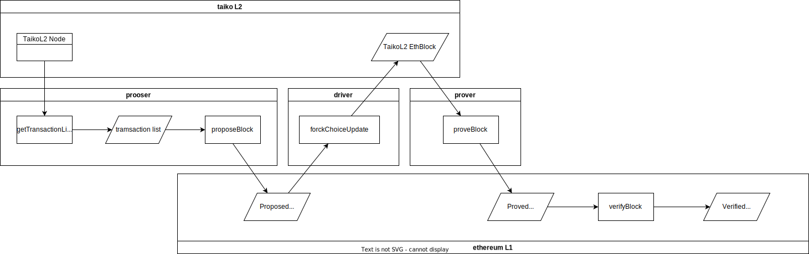

本文解析 [Taiko 合约](https://github.com/taikoxyz/taiko-mono)，当前版本`commit 85bef055c8778a473fff41318b06792c151efa52`。

<!--more-->

## 概述

## 地址管理

AddressManger 与 AddressResolver 搭配使用，实现了类似 ens 的作用，避免硬编码调用合约的地址。

AddressManger 在私有状态变量 [addresses](https://github.com/taikoxyz/taiko-mono/blob/85bef055c8778a473fff41318b06792c151efa52/packages/protocol/contracts/common/AddressManager.sol#L44) 中保存了链上合约到部署地址之间的映射：

```solidity
mapping(uint256 chainID=> mapping(bytes32 name => address)) private addresses;
```


AddressResolver 则会通过 [resolve](https://github.com/taikoxyz/taiko-mono/blob/85bef055c8778a473fff41318b06792c151efa52/packages/protocol/contracts/common/AddressResolver.sol#L91) 方法对外提供 name 到 address 的解析。同时，该合约通过 [EssentialContract](https://github.com/taikoxyz/taiko-mono/blob/85bef055c8778a473fff41318b06792c151efa52/packages/protocol/contracts/common/EssentialContract.sol#L18) 被其他合约继承。


## TaikoToken

L1 上部署的 [TaikoToken](https://github.com/taikoxyz/taiko-mono/blob/85bef055c8778a473fff41318b06792c151efa52/packages/protocol/contracts/L1/TaikoToken.sol#L35) 是一个 ERC20 代币合约，可以用于充值和提现，主要用于质押。

## HorseToken && BullToken

L1 上部署的两个 ERC20 代币，可用于 swap。

## TaikoL1

zkRollup 一个重要的地方就是数据可见性：L2 上的交易要放在 L1 上，并且进行数据验证。TaikoL1 合约就是用来实现这部分内容的：



- proposer 将 L2 transaction list（后简称 txlist） 提交（propose）到 TaikoL1 合约，proposed transactions 被 TaikoL1 抽象为一个关联的 [TaikoData.Block]()，并触发 BlockProposedEvent。
- driver 监听到 blockProposedEvent 后，从 proposeBlock transaction 的 calldata 解析出 txlist，然后通过 forkChoiceUpdate 更新 L2 上的区块。
- prover 监听到 L2 上的 NewBlockEvent，然后获取相关数据做验证。
- TaikoL1 内部自行触发 verifyBlock.

### Block



> 注意：此处的 Block 不同于 layer-1/layer-2 的 ethereum block 。blockId 也不等同于 ethereum block number。每次成功 propose layer-2 交易都会产生一个新的 taiko block，并记录在 TaikoL1.state.block 中。

### State

Taiko Rollup 的核心逻辑位于 [TaikoL1](https://github.com/taikoxyz/taiko-mono/blob/85bef055c8778a473fff41318b06792c151efa52/packages/protocol/contracts/L1/TaikoL1.sol#L31) 中。

状态变量 [TaikoData.State](https://github.com/taikoxyz/taiko-mono/blob/1ff0b7a3be7871038714dcff7a40f0ddb26a1578/packages/protocol/contracts/L1/TaikoData.sol#L186-L219) [state](https://github.com/taikoxyz/taiko-mono/blob/85bef055c8778a473fff41318b06792c151efa52/packages/protocol/contracts/L1/TaikoL1.sol#L37) 保存合约运行信息：



- `blocks` 保存了 proposed/proved/verified [block]()，可以将这个字段理解为数组实现的循环队列，这个队列的状态可能如下：队列头部是最近的 verified blocks，然后是可能存在 proved blocks，然后是可能存在 proposed blocks。

该变量在 [LibVerifying.init](https://github.com/taikoxyz/taiko-mono/blob/85bef055c8778a473fff41318b06792c151efa52/packages/protocol/contracts/L1/libs/LibVerifying.sol#L72-L93) 中初始化。


从上图中可以看出：`TaikoL1.sol` 主要封装了对外接口，内部实现都是位于在对应的库合约（LibContract）中。

### Block

### 充值提现

- depositTaikoToken
- withdrawTaikoToken
- depositEtherToL2
- canDepositEthToL2

### Rollup

#### proposeBlock



- 将 L2 txlist 封装为 block，放入 TaikoL1.state.blocks 中。

假设当前 propose 第一个 block：

#### proverBlock



#### verifyBlock

### getVerifierName

### 查询链状态

- getBlock
- getBlockFee
- getForkChoice
- getStateVariables
- getConfig

### 跨链消息

- getCrossChainBlockHash
- getCrossChainSignalRoot

## SignalService

1. 是在 taikoL1 前面部署的？因为地址被作为参数传递给 taikoL1 部署脚本。
