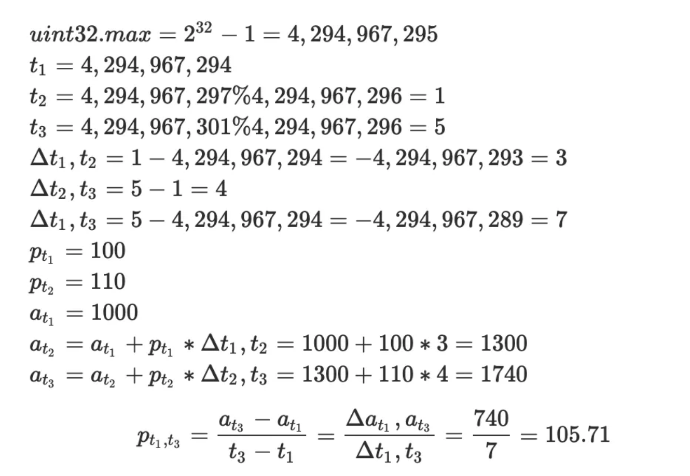

## 前言

本文作为《深入理解 Uniswap》系列的第一篇，将从 [Uniswap V2 白皮书](https://uniswap.org/whitepaper.pdf) 入手，讲解 Uniswap V2 协议的设计思路和数学公式推导过程。

网络上讲解 Uniswap 的文章已经很多了，为什么要再写一遍呢？

最初原因是为了记录我个人在学习 Uniswap 过程中的总结，这些总结不是简单的翻译，更多是对于白皮书知识点的延伸阅读、数学公式的推导以及合约代码的工程实现的学习思考，而这些在原版白皮书大多没有展开。

虽然目前 Uniswap v3 已经推出一段时间了，但是学习 V2 仍然是理解 V3 的基础；并且由于 [v3 的 License 限制](https://blog.uniswap.org/uniswap-v3#license)，其他 EVM 链 AMM 项目大多 fork V2 代码，因此深入学习 Uniswap V2 仍然很有必要。

此外，Uniswap 作为 DeFi 的基础协议，无论是行业地位，还是理论基础及其工程实现，都是 DeFi 的经典范例，对于想要深入学习 DeFi 或者智能合约编程的同学，Uniswap V2 是非常好的入门材料。

希望本文能够帮助你在理解 Uniswap V2 的过程中提供一点帮助。由于本人水平有限，文中难免出现错误，欢迎斧正。

下文将按照 Uniswap V2 白皮书章节结构进行翻译，同时将重点知识的延伸阅读和数学公式推导过程以注释形式说明。

## 摘要

这份技术白皮书解释了 Uniswap V2 core 合约背后的一些设计决策。它涵盖了合约的新特性，包括在 ERC20 代币之间创建任意配对 (pair)、一个加强的价格预言机 (price oracle)，该预言机允许其他合约估算在给定时间间隔内的加权平均价格 (TWAP)、闪电交换 (Flash swaps) 功能，该功能允许交易者在交易结束前接收资产并在其他地方使用，以及未来可能启用的协议费（protocol fee）。此外，该白皮书还重构了合约以减少攻击面。这份白皮书描述了 Uniswap V2 的 core 合约的机制，包括存储流动性提供者资金的 pair 合约以及用于实例化 pair 合约的 factory 合约。​

## 介绍

Uniswap V1 是一个以太坊链上智能合约系统，实现了基于恒定乘积公式 ($x * y = k$) 的自动化流动性协议。每一个 Uniswap V1 交易对包含两种代币，在提供流动性的过程中保证两种代币储量的乘积无法减少。交易者为每次交易支付 0.3% 的手续费给流动性提供者。v1 的合约不可升级。

Uniswap V2 是基于同一个公式的新版实现，包含许多令人期待的新特性。其中最重要的一个特性是可以支持任意 ERC20 代币的交易对，而 V1 只支持 ERC20 与 ETH 的交易对。此外，V2 提供了价格预言机功能，其原理是在每个区块开始时累计两种代币的相对价格。这将允许其他以太坊合约可以获取任意时间段内两种代币的时间加权平均价格；最后，V2 还提供“闪电贷”功能，这将允许用户在链上自由借出并使用代币，只需在该交易的最后支付（或归还）这些代币即可。

虽然 V2 的合约也是不可升级的，但是它支持通过私钥在工厂合约中修改一个变量，以便允许 Uniswap 协议针对每笔交易收取 0.05% 的手续费（即 0.3%的 1/6）。该手续费默认关闭，但是可以在未来被打开，在打开后流动性提供者将只能获取 0.25% 手续费，而非 0.3% 。

在第三节，我们将介绍 Uniswap V2 同时修复了 Uniswap V1 的一些小问题，同时重构了合约实现，通过最小化（持有流动性资金的）core 合约逻辑，降低了 Uniswap 被攻击的风险，并使得系统更加容易升级。

本文讨论了 core 合约和用来初始化 pair 合约的 factory 合约的结构。实际上，使用 Uniswap V2 需要通过 router 合约调用 pair 合约，它将在交易和提供流动性时帮助计算需要向交易对合约转账的代币数量。

## 新特性

### ERC-20 交易对

Uniswap V1 使用 ETH 作为桥接代币，任何交易对都包含 ETH 作为其中一个代币。这使得路由更加简单，比如要想实现 ABC 和 XYZ 的交易，只需要分别使用 `ETH/ABC` 和`ETH/XYZ` 交易对即可，这同时也减少了流动性碎片化。

> 注：由于交易对总是包含 ETH，相比 V2 任意 ERC-20 代币组合，v1 的交易对数量大大减少，并且流动性都被吸收到 ETH 这一侧，所以流动性更集中。在没有桥接货币的情况下，每一种代币对的组合都需要独立的流动性池。例如，如果有 100 种代币，理论上可能需要 4950 个不同的流动性池（每种代币与其他代币配对一次，根据组合数组计算 $C_{100}^2$ ）。但是，使用 ETH 作为桥接货币，只需要每种代币与 ETH 形成配对，大大减少了所需的流动性池数量。

但是这样的规则给流动性提供者带来巨大成本。所有的流动性提供者都将面临 ETH 的风险敞口，并且在代币价格相对 ETH 价格波动时承受无常损失。如果 ABC 和 XYZ 是两种关联的代币，比如都是 USD 稳定币，那么交易对 ABC/XYZ 的无常损失将小于 `ABC/ETH` 或 `XYZ/ETH`。

> 注：由于恒积公式引入的滑点，流动性提供者在 Uniswap 做市时将承受无常损失，简单而言就是在代币价格单方面（上涨或下跌）波动时，做市者手中持有的代币总价值反而减少。关于无常损失与滑点，可以参考 [之前的文章]()。
>
> 由于所有交易对都包含 ETH，流动性提供者必须持有 ETH，从而暴露于 ETH 价格波动的风险。例如，如果两个资产（比如两种稳定币）价格相关性很高，流动性提供者在直接的 `ABC/XYZ` 配对中面临的暂时性损失可能比在 `ABC/ETH` 或 `XYZ/ETH` 配对中要小。

使用 ETH 作为强制的交易代币也会增加交易成本。相比直接使用 `ABC/XYZ` 交易对，他们将支付两倍的交易手续费，同时承受两倍的滑点。

> 注：因为在 v1，要想从 ABC 交易到 XYZ，必须依次交易 `ABC/ETH` 和 `ETH/XYZ`，因此手续费和滑点都需要两倍。

Uniswap V2 允许流动性提供者为任意两个 ERC-20 代币创建交易对合约。

交易对数量的激增将给寻找最优交易路径带来困难，但是路由问题可以在上层解决（比如通过链下或链上的路由器或聚合器）。

### 价格预言机

在时间点 t 由 Uniswap 提供的边际价格（不包含手续费）可以通过代币 a 和代币 b 的数量相除得出：

$$
\tag{1}p_t = \frac{r_t^a}{r_t^b}
$$

当 Uniswap 提供的价格不正确时，套利者可以在 Uniswap 交易套利（通过足够数量代币以支付手续费），因此 Uniswap 提供的代币价格将跟随市场价格。这意味着 Uniswap 提供的代币价格可以作为一种近似的价格预言机。

> 注：同一个代币在不同市场的价格差异提供了套利机会，驱使套利者维持 Uniswap 市场价格与其他市场（如中心化交易所或 DEX）价格一致。

然而，Uniswap V1 无法提供安全的链上预言机，因为它的价格很容易被操控。假设其他合约使用当前 ETH-DAI 价格作为衍生品交易的基准价格。攻击者可以从 ETH-DAI 交易对买入 ETH 来操控价格，并触发衍生品合约的清算，接着再将 ETH 卖回以使价格回归正常。上述操作可以通过一个原子交易完成，或者被矿工通过排序同一区块中的不同的交易来实现。

> 注：由于采样的价格是瞬时的，因此很容易通过买入卖出大额代币来操纵实时价格。samczsun 有一篇 [博客](https://samczsun.com/taking-undercollateralized-loans-for-fun-and-for-profit/) 介绍了这种攻击。

Uniswap V2 改进了预言机功能，通过在每个区块的第一笔交易前计算和记录价格来实现（等价于上一个区块的最后一笔交易之后）。操纵这个价格会比操纵区块中任意时间点的价格要困难。如果攻击者通过在区块的最后阶段提交一笔交易来操纵价格，其他套利者（发现价格差异后）可以在同一区块中提交另一笔交易来将价格恢复正常。矿工（或者支付了足够 gas 费用填充整个区块的攻击者）可以在区块的末尾操控价格，但是除非他们同时挖出了下一个区块，否则他们没有特殊的优势可以进行套利。

> 注：由于价格预言机仅在每个区块记录一次，因此除非同一个人控制了两个区块的所有交易，否则他们将没有足够的套利优势。但是这从另一方面说明，Uniswap V2 的预言机仍然是不够健壮的。我们在 v3 可以看到这方面的改进。

具体来说，Uniswap V2 通过在每个区块第一笔交易前记录累计价格实现预言机。每个价格会以时间权重记录（基于当前区块与上一次更新价格的区块的时间差）。这意味着在任意时间点，该累计价格将是此合约历史上每秒的现货价格之和。
$$
\tag{2}a_t = \sum_{i=1}^t{p_i}
$$
为了估算在 $t_1$ 到 $t_2$ 时间段内的时间加权平均价格（TWAP），外部调用者可以分别记录 $t_1$ 和 $t_2$ 的累计价格，将 $t_2$ 价格减去 $t_1$ 价格，并除以 $t_2$-$t_1$ 的时间差（需注意，合约本身不存储历史的累计价格，因此需要调用者在区间开始时调用合约，读取并保存当前的价格）。
$$
\tag{3}p_{t_1,t_2} =\frac{\sum_{i=t_1}^{t_2}{p_i}}{t_2-t_1}=\frac{\sum_{i=1}^{t_2}{p_i}-\sum_{i=1}^{t_1}{p_i}}{t_2-t_1}=\frac{a_{t_2}-a_{t_1}}{t_2-t_1}
$$
预言机的用户可以自行选择区间的开始和结束。选择一个更长的区间，意味着攻击者将花费更高的代价来操控该区间的时间加权平均价格，虽然这将导致该平均价格与实时价格相差较大。

> 注：关于 TWAP 的计算可以参考 [这篇文章](https://cloud.tencent.com/developer/article/2017546)。

一个难题：我们应该计算以 B 代币计价的 A 代币价格，还是以 A 代币计价的 B 代币价格？虽然在现货价格上，以 B 代币计价的 A 代币价格（B/A）与以 A 代币计价的 B 代币价格（A/B）总是互为倒数，但在计算某个时间区间的算数平均数时，二者却不是互为倒数关系。比如，假设在区块 1 的价格为 100 USD/ETH（B 为 USD，A 为 ETH），区块 2 的价格为 300 USD/ETH，则其平均价格为 200 USD/ETH，但 ETH/USD 的平均价格却是 1/150 ETH/USD。因为合约无法知道交易对中哪一个代币将被用户用作计价单位，因此 Uniswap V2 同时记录了两个代币的价格。

> 注：两种代币计价方式如下：
>
> 以 USD 计价
> $$P_{USD/ETH}(t_1,t_2)=\frac{100+300}{2}=200 $$
> 以 ETH 计价
> $$P_{ETH/USD}(t_1,t_2)=\frac{1/100+1/300}{2}=\frac{1}{150} $$

另一个难题是用户可以不通过交易而直接向交易对合约发送代币（这将改变代币储量并影响价格），此时将无法触发预言机价格更新。

> 注：因为预言机价格需要在区块的第一笔交易之前更新，因此如果不交易，将绕开预言机更新。

如果合约只是简单地检查它的余额，并使用当前余额计算价格来更新预言机，那么攻击者可以在区块的第一笔交易之前，立即向合约发送代币来操控预言机价格。如果上一笔交易是在 X 秒之前的某个区块，合约将错误的使用（被操纵后的）新价格乘以 X 来累计，即使并没有人使用该价格交易过。

> 注：假设在上一个区块最后一笔交易后，交易对合约中两个代币 A、B 的余额分别为 100、200，以 A 计价的 B 价格为 100/200=0.5，在 X 秒后，下一个区块第一笔交易发生之前，应该累计的价格是 0.5X，但是如果在第一笔交易发生之前，攻击者向合约发送了 100 个 A，此时价格为 200/200=1，合约将错误地以 1X 累计。（原文有误）

为了防止这个问题，core 合约在每次交互后缓存了两种代币储量，并且使用缓存余额（而非实时余额）更新预言机价格。除了防止预言机价格被操控外，这个改动也带来了合约架构的重新设计，我们将在 3.2 节进行说明。

### 精度

因为 Solidity 原生不支持非整数数据类型，Uniswap V2 使用了简单的二进制定点制进行编码和操作价格。确切地说，任意时间的价格都被保存为 UQ112.112 格式的数据，它表示在小数点的左右两边都有 112 位比特表示精度，无符号（注：非负数）。这个格式能表示的范围为 [0, $2^{112}$-1]，精度为$\frac{1}{2^{112}}$。

选择 UQ112.112 格式是出于（Solidity 合约）编程实践的考虑，因为这些格式的数字能够使用一个 uint224 类型（占用 224 位比特，28 个字节）的变量表示，在一个 256 位（比特）的存储槽（注：EVM 中一个 Storage Slot 是 256 位）中正好剩余 32 位可用。而对于缓存的代币储量变量，每一个代币储量可以使用一个 uint112 类型（112 比特位，14 个字节）的变量，（在声明时）也正好在 256 位的存储槽中剩余 32 位可用。这些剩余空间可用于上述的累计运算使用。具体来说，代币储量与最近一个有交易区块的时间戳一起保存，该时间戳针对 $2^{32}$ 取模，以确保可以使用 32 位表示。此外，虽然在任意时间点的价格（使用 UQ112.112 格式的数字）一定符合 224 位，但是一段时间的累计价格却不是这样。在存储槽末尾的多余 32 位空间将用于存储由于重复累计价格导致的溢出数据。这样的设计意味着价格预言机仅仅在每个区块的第一笔交易增加了 3 个 SSTORE 操作（当前消耗 15,000 gas）。
> 注：每个代币储量使用 uint112 表示，时间戳使用 32 位表示，总共 112+112+32=256 位，正好占用一个 storage slot。更少的 storage slot 意味着交互时需要花费的 gas 更小，有利于减少用户操作成本。累计价格则采用 256 位表示。
>
> 具体来说，3 个 SSTORE 操作包括：
>
> 1. 更新 A 累积价格
> 2. 更新 B 累计价格
> 3. 更新 A 储备量、B 储备量、时间戳。

这个设计最主要的缺点是 32 位无法确保时间戳永不溢出。事实上，Unix 时间戳溢出 32 位（可表示的最大值）将发生在 02/07/2106。为了确保系统能够在该时间后正常工作，同时在每一轮 32 位溢出后（$2^{112}$-1 秒）也能正常工作，预言机需要至少在每一轮（大约 136 年）被调用查询一次。因为累计计算的核心方法是溢出安全的，这意味着即使交易跨越了时间戳溢出的时间点，它也是可以被正常累计的，只要预言机使用了正确的溢出算法来检查时间间隔。

> 注：这里我们主要关注在时间戳溢出边界，使用公式（3）是否能够正确算出预言机价格的平均数。假设在 2106 年 2 月 7 日附近，$t_1$,$t_2$,$t_3$ 分别表示三个连续的区块时间，其中 $t_1$ 未发生时间戳溢出（差 1 秒），而 $t_2$,$t_3$ 则发生溢出，可以算出即使在溢出后，$t_2$-$t_1$ 仍然可以计算出正确的时间差（3 秒）；同理可以计算即使当累计价格 $a_{t_3}$ 发生溢出后，只要调用者保存了 $a_{t_1}$ 的值，即可计算出二者正确的差值。$p_{t_1,t_3}$ 为 $t_1$ 到 $t_3$ 时间区间的平均价格，按照公式（3）可推出如下计算：

### 闪电贷

在 Uniswap v1，用户如果想使用 XYZ 购买 ABC，则需要先将 XYZ 发送到合约才能收到 ABC。这在复杂场景下非常不便。比如，当 Uniswap 与其他合约出现套利机会时，用户可能希望使用 ABC 在别的合约购买 XYZ；或者用户希望通过卖出抵押物来释放他们在 Maker 或 Compound 的头寸，以此偿还 Uniswap 的借款。

> 这里其实描述的是一些 V1 在一些复杂交易场景下的不便：
>
> 1. 套利交易：用户可能正在利用 ABC 代币在另一个合约中购买 XYZ 代币，以此来利用 Uniswap 上的价格差异进行套利。
> 2. 解除在 Maker 或 Compound 上的仓位：用户可能需要卖掉作为抵押品的 ABC 代币，以此来偿还在 Maker 或 Compound 平台上的债务。

Uniswap V2 增加了一个新特性，允许用户在支付费用前先收到并使用代币，只要他们在同一个交易中完成支付。swap 方法会在转出代币和检查 k 值两个步骤之间，调用一个可选的用户指定的回调合约。一旦回调完成，Uniswap 合约会检查当前代币余额，并且确认其满足 k 值条件（在扣除手续费后）。如果当前合约没有足够的余额，整个交易将被回滚。

用户可以只归还原始代币，而不需要执行 swap 操作。这个功能将使得任何人可以闪电借出 Uniswap 池子中的任意数量的代币（闪电贷手续费与交易手续费一致，都是 0.30%）。

注：闪电贷在 DeFi 领域非常实用，对于 TVL 较高的协议，协议可以通过闪电贷获取手续费收入。比如 dYdX 和 Aave，都推出了闪电贷功能。Uniswap V2 合约中的闪电贷与交易功能实际上使用同一个 swap 方法。

### 协议手续费

Uniswap V2 包含一个 0.05%的协议手续费开关。如果打开，该手续费将被发送到合约中的 feeTo 地址。

默认情况下没有设置 feeTo 地址，因此不收取协议手续费。预定义的 feeToSetter 地址可以调用 Uniswap V2 工厂合约中的 setFeeTo 方法来修改 feeTo 地址。feeToSetter 也可以调用 setFeeToSetter 修改合约中 feeToSetter 地址。

如果 feeTo 地址被设置了，协议将开始收取 5 个基点（0.05%）的手续费，也就是流动性提供者收取的 30 个基点（0.30%）手续费中的 1/6 将分配给协议。这意味着交易者将继续为每一笔交易支付 0.30%的交易手续费，83.3%（5/6）的手续费（整笔交易的 0.25%）将分配给流动性提供者，剩余的 16.6%（手续费的 1/6，整笔交易的 0.05%）将分配给 feeTo 地址。

如果在每笔交易时收取 0.05%的手续费，将带来额外的 gas 消耗。为了避免这个问题，累计的手续费只在提供或销毁流动性时收取。合约计算累计手续费，并且在流动性代币铸造或销毁的时候，为手续费受益者（feeTo 地址）铸造新的流动性代币。

总共收集的手续费可以用自从上次手续费收集以来 $\sqrt{k}$ 的增长来计算（也就是 $\sqrt{x.y}$ ）。以下公式给出了 $t_1$ 和 $t_2$ 之间的累加手续费占 $t_2$ 时间资金池中流动性的百分比：​$$\tag{4}f_{1,2}=1-\frac{\sqrt{k_1}}{\sqrt{k_2}}$$

> 注：这里不太好理解，为什么手续费是以 $\sqrt{x.y}$ 的形式给出的呢？如果看完白皮书【3.4 初始化流动性代币供应】就明白了。第一次流动性铸造的代币数量是以 $\sqrt{x.y}$ 算出的，在 $t_1$,$t_2$ 不同时刻，（不考虑 mint/burn 流动性时）其流动性代币数量始终等于根号 $\sqrt{x_1.x_2}$ 与 $\sqrt{x_2.y_2}$ ，其增长部分即为手续费，因此公式（4）可按照如下推导得出：
​
如果协议手续费在 $t_1$ 之前被激活，那么在 $t_1$,$t_2$ 时段，feeTo 地址应该收取 1/6 的手续费作为协议手续费。因此，我们需要为 feeTo 地址铸造新的流动性代币$\phi\ast f_{1,2}$以代表该时段手续费，这里等于 $\phi=1/6$。

假设协议手续费对应的流动性代币数量为 $s_m$，$s_1$ 为 $t_1$ 时刻的流动性代币数量，则有以下等式：

$$\tag{5}\frac{s_m}{s_m+s_1}=\phi\ast f_{1,2}$$

使用公式（4）替换$f_{1,2}$，经过计算可以得出 $s_m$ 为：
$$\tag{6}s_m=\frac{\sqrt{k_2}-\sqrt{k_1}}{(\frac{1}{\phi}-1)\ast\sqrt{k_2}+\sqrt{k_1}}\ast s_1$$

用 $\frac{1}{6}$ 替换 $\phi$ 我们得到如下公式：
$$\tag{7}s_m=\frac{\sqrt{k_2}-\sqrt{k_1}}{5\ast\sqrt{k_2}+\sqrt{k_1}}\ast s_1$$

假设初始流动性提供者存入 100 DAI 和 1 ETH，获得 10 个流动性代币。一段时间后（假设没有其他流动性提供者），当 feeTo 希望取出协议手续费时，两种代币余额分别为 96 DAI 和 1.5 ETH。分别代入公式（7）可得：
$$\tag{8}s_m=\frac{\sqrt{1.5\ast96}-\sqrt{1\ast100}}{5\ast\sqrt{1.5\ast96}+\sqrt{1\ast100}}>\ast10=0.0286$$

> 注：当没有 mint/burn 流动性时，只是单纯 swap，池子的 k 值是不断变大的，原因就在于手续费沉淀，因为此时流动性代币总量（shares）不变，但交易对池子中两种代币余额不断增加。如上所述，k1 = 100 DAI x 1 ETH = 100，k2 = 96 DAI * 1.5 ETH = 144，k2 > k1。

### 元交易

Uniswap v2 的池子份额（即流动性代币）天然支持元交易。这意味着用户可以通过签名授权第三方转移其持有的流动性代币，而无需通过他们自己发起链上交易。任何人都可以通过调用 permit 方法来代替该用户提交签名，支付 gas 费用，并且可以在同一交易中执行其他操作。

> 注：这里的元交易实际上指的是通过离线签名方式，由第三方代替用户发起链上交易。在某些场景下很实用，比如用户的钱包没有 ETH，可以由第三方代付 gas。
>
> 在 Uniswap v2 core 合约中的签名功能是授权转账流动性代币；这个签名是在外围的 router 合约中使用，因为 v2 将合约分为 core（最核心的 swap/mint/burn 功能）和 periphery（外围应用）合约，而应用一般直接调用 periphery 合约，通过签名方式可以减少用户与 core 合约的链上交互，只需使用离线签名与 periphery 合约交互一次即可移除流动性。签名也便于其他合约与 core 合约集成。
>
> 这里涉及两个 EIP，分别是 [EIP-712](https://eips.ethereum.org/EIPS/eip-712) 与 [EIP-2612](https://eips.ethereum.org/EIPS/eip-2612)，我们在另外的文章再具体说明这两个 EIP。简单而言，EIP-712 定义了针对结构数据的签名方式，在以前只能针对一串 hash 签名，实际上我们并不知道签名的内容是什么，容易引发安全问题，比如误将代币授权给恶意合约；通过 EIP-712，我们可以在签名时检查具体的签名内容，如授权转账的额度，截止时间等信息。（但从实际使用上，大部分用户仍然并不知道自己签名会带来什么影响）。EIP-2612 则是关于使用 EIP-712 的 permit 方法的 Solidity 编码规范，该提案是在 Uniswap v2 以后才出来的，目前仍处于 Review 阶段。

## 其他改动

### Solidity

Uniswap v1 使用 Vyper 语言实现，这是一个类 Python 的智能合约语言。Uniswap v2 使用更流行的 Solidity 语言实现，因为 v2 依赖一些（在开发时）Vyper 语言还不具有的能力，比如解析非标准 ERC-20 代币的返回值，通过内联的 assembly 语法访问一些新操作码，如 chainid。

### 合约重构

Uniswap v2 的一个设计重点在于最小化 core 交易对合约的对外接口范围和复杂度（core 合约存放流动性提供者的代币资产）。在 core 合约上发现的任何 bug 都可能是灾难性的，因为这可能会导致数百万美元的流动性资产被盗走或冻结。

在评估 core 合约的安全性时，最重要的问题是它是否能保护流动性提供者的资产不被盗走或冻结。任何增强或保护交易者的功能特性，除了允许池子里资产交换这种最基本的功能，都应该被抽取放到 router（路由）合约。

> 注：core 合约仅保留最基础最重要的功能，以保证安全性，因为所有流动性资产将存放在 core 合约中。代码越少，改动越小，出现 bug 的概率也越小。实际上 core 合约的核心代码只有 200 行左右。

事实上，甚至部分 swap 功能的代码也可以被提到 router 合约中。如前所述，Uniswap v2 保存每种代币最后的余额记录（为了防止攻击者操纵预言机机制）。新的架构在此基础上针对 Uniswap v1 做了进一步简化。

在 Uniswap v2，卖方在执行 swap 方法前，会发送代币到 core 合约。合约将通过比较缓存余额和当前余额来判断收到多少代币。这意味着 core 合约无法知道交易者是通过什么方式发送代币。事实上，他可以通过离线签名的元交易方式，或者其他未来授权 ERC-20 代币转移的机制，而不只是 transferFrom 方法。

### 手续费调整

Uniswap v1 的交易手续费是通过减少存入合约的代币数量来实现，在比较 k 恒等式之前，需要先减去 0.3%的交易手续费。合约隐式约束如下：
$$\tag{9}(x_1 − 0.003 · x_{in}) · y_1 >= x_0 · y_0$$
> 注：扣除手续费以后的两种代币余额，符合 k 恒等式。

通过闪电贷功能，Uniswap v2 引入了一种可能性，即 $x_{in}$ 和 $y_{in}$ 可能同时不为 0（当一个用户希望通过归还借出的代币，而不是做交易时）。为了处理这种情况下的手续费问题，合约强制要求如下约束：
$$\tag{10}(x_1 − 0.003 · x_{in}) · (y_1 − 0.003 · y_{in}) >= x_0 · y_0$$

> 注：Uniswap 的 swap 方法可以同时支持闪电贷和交易功能，当通过闪电贷同时借出 x 和 y 两种代币时，需要分别对 x 和 y 收取 0.3%的手续费，因此需要先扣除手续费，再保证余额满足 k 值约束。

为了简化链上计算，我们可以为公式（10）两边同时乘以 1,000,000，得出：
$$\tag{11}(1000x_1 − 3 · x_{in}) · (1000y_1 − 3 · y_{in}) >= 1000000 . x_0 · y_0$$

> 注：因为 Solidity 不支持浮点数，因此通过同步放大来简化计算。

### sync() 和 skim()

为了防止某些特殊代币可以修改交易对合约余额的情况，同时也为了更优雅地解决那些总量超过 $2^{112}$的代币，Uniswap v2 提供了两个方法：sync() 和 skim()。

sync() 函数作为一种恢复机制，用于处理代币异步减少代币对合约中的余额。在这种场景下，交易将获得次优的兑换率，如果没有流动性提供者愿意纠正这种状态，交易对将难以继续工作。sync() 方法可以将合约中缓存的代币余额设置为当前实际余额，以帮助系统从这种状态中恢复。

当发送大量代币导致交易对的代币余额溢出（超过 uint112 最大值）时，交易将失败，skim() 可以作为这种情况的恢复手段。skim() 允许任意用户取出多余的代币（代币实际余额与 $2^{112}-1$ 的差值）。

> 简单来说，由于某些（非 Uniswap 导致的）外部因素，交易对合约中的缓存余额与实际余额可能出现算法外的不一致问题。sync() 方法可以更新缓存余额到实际余额，skim() 方法可以更新实际余额到缓存余额，从而保证系统继续运行。任何人都可以执行这两个方法。Alpha Leak：如果有人误将交易对中的代币转入合约，任何人都可以取出这些代币。

## 处理非标准和罕见代币

ERC-20 标准要求 transfer() 和 transferFrom() 返回一个布尔值表示该请求是否成功。然而某些代币在实现这两个（或其中一个）方法时并没有返回值，比如 USDT 和 BNB。Uniswap v1 在解析无返回值的方法时，将其当作失败处理，因此将回滚交易，从而导致交易失败。

> 扩展阅读：[EIP-20: ERC-20 代币标准](https://eips.ethereum.org/EIPS/eip-20)

Uniswap v2 针对非标准 ERC-20 代币的实现，则使用不一样的处理方法。当 transfer() 方法没有返回值时，Uniswap v2 认为它表示执行成功，而非失败。这个改动不会影响任何实现标准 ERC-20 的代币（因为他们的 transfer() 方法有返回值）。

Uniswap v1 此外假设调用 transfer() 和 transferFrom() 不能触发 Uniswap 交易对合约的重入调用。某些 ERC20 代币违反了这个假设，包括支持 ERC777 协议的"hooks"的代币。为了完全支持这些代币，Uniswap v2 包含了一个“锁”，直接防止重入所有公共的修改状态的函数。这也保护防止了在快速互换（flash swaps）中从用户定义的回调函数重入，如 2.3 节所描述的那样。

> 注：lock 实际上是一个 Solidity modifier，通过一个 unlock 变量控制同步锁。

### 初始化流动性代币供应

当新的流动性提供者向现有的 Uniswap 交易对中存代币时，新铸造的流动性代币数量可根据当前代币数量计算：

$$\tag{12}s_minted=\frac{x_deposited}{x_starting}\ast s_starting$$

> 注：因为流动性代币本身是一种 ERC-20 代币，持有流动性代币数量即表示占有该池子代币的份额（shares）。因此对于已存在的交易对，即已经有该交易对的流动性代币存在，那么存入的代币价值与总价值的比例，与其得到的流动性代币数量与总数量的比例应相等：

但如果他们是第一个流动性提供者呢？在这种情况下，$x_starting$ 是 0，因此上述公式无法适用。

Uniswap v1 将首次流动性代币数量等同于存入的 ETH 数量（以 wei 为单位）。这有一定的合理性，因为如果首次流动性是以正确的价格存入的，那么 1 个流动性份额（如 ETH 是一种有 18 位小数的代币）将代表大约 2ETH 的价值。

> 注：因为 Uniswap v1/v2 提供流动性时需要注入两边等值的代币，如果份额等同于 ETH 数量，则 1 份额表示需要存入 1ETH，而在价格正确时，另一个代币的价值也同样是 1ETH，因此 1 个流动性份额的流动性总价值是 2ETH。

然而，这意味着流动性份额的价值需要依赖首次注入流动性时的价格比例，而这个价格是可以被认为控制的，我们无法保证首次注入流动性时的两种代币的比例能够正确反映真实价格。此外，由于 Uniswap v2 支持任意代币的交易对，因此将有更多的交易对不包含 ETH。

与 v1 不同，Uniswap v2 规定首次铸造流动性代币的数量等于存入的两种代币数量的几何平均数：

$$tag{13}s_minted=\sqrt{x_{deposited}\ast y_{deposited}}$$

该公式确保在任意时刻，流动性份额的价值与其存入代币的价格比例无关。比如，假设当前 1 ABC 的价格是 100 XYZ，如果首次存入 2 ABC 和 200 XYZ（对应的比例为 1:100），则流动性提供者将收到$\sqrt{2*200}=20$ 个流动性代币。这些代币价值 2 ABC 和 200 XYZ，以及对应的累计手续费。

如果首次存入 2 ABC 和 800 XYZ（对应比例 1:400），则流动性提供者将收到$\sqrt{2*800}=40$ 个流动性代币。

以上公式确保 1 个流动性份额（代币）的价值将不少于池子中两种代币余额的几何平均数。然后，1 个流动性代币的价值将可能随着时间持续增长，比如通过累计交易手续费，或者通过其他人“捐赠”代币到池子里。

理论上可能存在这种情况，最小的流动性代币单位（$1e^{-18}$，即 1 wei）的价值太高，以至于无法让其他（小）流动性提供者加入。

为了解决这个问题，Uniswap v2 通过将首次铸造的 $1e^{-15}$ 流动性代币（最小代币单位的 1000 倍）发送到全零地址而不是铸造者来进行销毁。这个损耗对于大部分交易对而言都是微不足道的。但是这将极大提到首次铸币攻击的代价。为了将每个流动性代币价格提高到 100 美元，攻击者需要捐赠 10 万美元的代币到池子中，这些代币将被作为流动性而永久锁定。

> 注：首次铸币攻击是指攻击者在第一次添加流动性时存入最小单位（10 的-18 次方，即 1 wei）的流动性，比如 1 wei ABC 和 1 wei XYZ，此时将铸造 1 wei 流动性代币（根号 1）；同时，攻击者在同一个交易中继续向池子转入（非铸造）100 万个 ABC 和 100 万个 XYZ，接着调用 sync() 方法更新缓存余额，此时 1 wei 的流动性代币价值 100 万+$1e^{-18}$ ABC 和 100 万+$1e^{-18}$ XYZ，其他流动性参与者要想添加流动性，需要等价的大量代币，其价格可能高到大部分人无法参与。
>
> 通过销毁首次铸造的 1000wei 代币，攻击者如果想将每个代币价格提高到 100 美元，则至少需要铸造 1000+1=1001 个流动性代币，总价值 1001*100=10 万零 100 美元，其中 10 万美元将被永久销毁，这可以极大提高攻击者成本。

### WETH

使用以太坊原生代币 ETH 进行交易的接口，与使用 ERC-20 代币的接口是不同的。因此，许多以太坊协议并不支持 ETH，而使用一种符合 ERC-20 标准的代币封装 ETH，即 WETH。

Uniswap v1 是一个例外。因为每一个 Uniswap v1 交易对都使用 ETH 作为其中一种交易代币，因此直接支持 ETH 交易是合理的，并且能够更省 gas。

由于 Uniswap v2 支持任意 ERC-20 交易对，因此没有必要支持原生 ETH 交易。增加这种支持将使 core 合约代码量翻倍，并且将使流动性分裂为 ETH 和 WETH 交易对。原生 ETH 需要先封装为 WETH 才能在 Uniswap v2 交易。

> 注：事实上，Uniswap v2 只是 core 合约不支持原生 ETH，periphery 合约仍然支持原生 ETH 交易，合约会自动将 ETH 转为 WETH，然后再调用 core 合约进行交易。这里也反映出 Uniswap 一直倡导的开发原则，保持 core 合约最简化，应用和用户体验的逻辑依靠 periphery 合约解决。

### 确定的交易对地址

与 Uniswap v1 一样，所有 Uniswap v2 交易对合约都由一个统一的工厂合约初始化生成。在 Uniswap v1，这些合约使用 CREATE 操作码创建，这意味着这些合约的地址依赖于合约生成的顺序。Uniswap v2 使用以太坊新的 CREATE2 操作码生成具有确定地址的交易对合约。这意味着交易对合约的地址是可以通过链下计算的，而无需查询链上状态。

> 如果交易对的地址是不确定的，就意味着用户希望使用 ABC 交易 XYZ 时，需要调用链上合约接口查询 ABC/XYZ 交易对地址才能进行交易，同时，合约也需要存储交易对代币与交易地址的映射关系；如果使用确定性地址，前端页面或者应用只需要按照规定算法即可算出交易对合约地址，避免了链上查询

### 最大代币余额

为了更有效地实现预言机功能，Uniswap v2 只支持缓存代币余额的最大值为 $2^{112}-1$。该数字已经大到可以支持代币总量超过千万亿的 18 位小数代币。

如果任意一种代币余额超过最大值，swap 方法的调用将会失败（由于_update() 方法的检查导致）。为了从这种状况中恢复，任何人都可以调用 skim() 方法来从池子中移除多余的代币。

## 参考

- [Uniswap V2 core 源码解析](https://juejin.cn/post/7185379590162874429)
- [Uniswap V2：质押挖矿原理与源码分析](https://juejin.cn/post/7173617988707287071)
- [UNISWAP-V2 合约概览](https://ethereum.org/zh/developers/tutorials/uniswap-V2-annotated-code/)
- [深入理解 uniswap V2 白皮书](https://mirror.xyz/adshao.eth/qmzSfrOB8s6_-s1AsflYNqEkTynShdpBE0EliqjGC1U)
