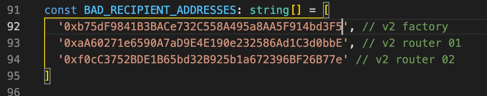
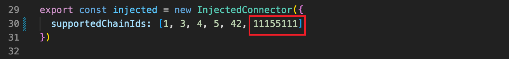
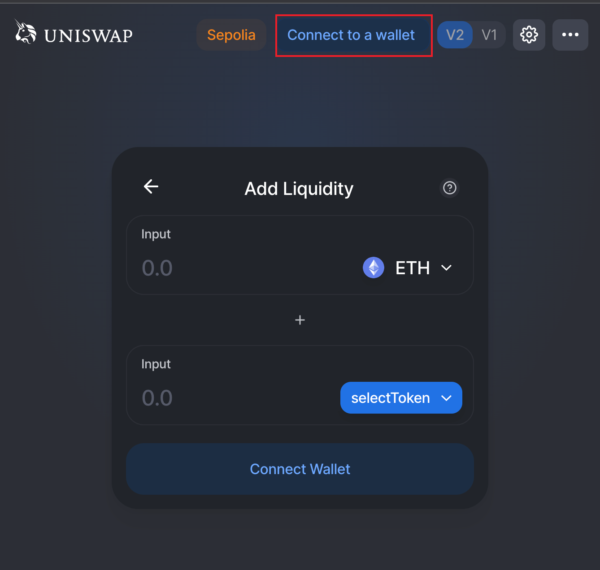

[Uniswap](https://uniswap.org/) 是以太坊最为流行的去中心化交易所，本文以 UniswapV2 为例：

- 将智能合约部署到以太坊 sepolia 测试网络。
- 搭建 Uniswap app 前端，并进行功能验证。

该方法也可用于将 Uniswap V2 部署到 Private Network。

## 准备工作

### Nodejs 版本

uniswapV2 智能合约需要 `node@>=10` 版本，整个部署过程中， Nodejs 版本通过 [nvm](https://github.com/nvm-sh/nvm) 搭配 [.nvmrc](https://github.com/nvm-sh/nvm#nvmrc) 文件控制：

```shell
## .nvmrc
v14.21.3
```

项目下可以通过 `nvm use` 切换到 v14.21.3 这个 lts 版本。

### Ethereum Node

需要准备一个开放了 `JSON RPC API` 的以太坊节点，嫌麻烦可以去 [infura](https://infura.io) 或者类似的基础设施提供商申请一个免费的 API Key。

部署合约需要一个拥有足够 ETH 余额的以太坊地址(后续简称 `deployerAddress`)，sepolia 测试网络可以打开 [pow faucet](https://sepolia-faucet.pk910.de/) 获取测试的 ETH 代币。

### 代码仓库

- uniswapV2 智能合约：
  - [Uniswap/v2-core](https://github.com/Uniswap/v2-core)
  - [Uniswap/v2-periphery](https://github.com/Uniswap/v2-periphery)
- uniswap 前端：
  - 界面仓库 [Uniswap/interface](https://github.com/Uniswap/interface)
  - 依赖 [multicall](https://github.com/makerdao/multicall) 合约。
  - 依赖 [ens](https://ens.domains/) 合约

将上述的几个仓库 clone 到本地：

```shell
git clone git@github.com:Uniswap/v2-core.git
git clone git@github.com:Uniswap/v2-periphery.git
git clone git@github.com:Uniswap/interface.git
git clone https://github.com/makerdao/multicall.git
```

由于智能合约代码存放在两个仓库，不便统一部署，先创建一个文件夹保存后续编译的智能合约代码，

`mkdir uniswap-contracts`

当前的目录结构如下：

`interface multicall uniswap-contracts v2-core v2-periphery`

现在准备工作完成了，下面开始编译并且部署智能合约。

## 编译 uniswap 合约

接下来我们分别编译 `v2-core` 和 `v2-periphery` 两个仓库的代码，然后将编译后的 JSON 文件拷贝到 `uniswap-contracts`  目录。

首先是 `Uniswap/v2-core`  项目，进入目录后拉取依赖然后编译：

```shell
cd v2-core && yarn && yarn compile
```

编译后的代码存放在 `build`  目录，需要把它拷贝至之前创建的 `uniswap-contracts`  目录。

```shell
cp -r build ../uniswap-contracts && cd -
```

接下来编译 `Uniswap/v2-periphery`  项目，也是相同的步骤，最后将编译后的代码拷贝到 `uniswap-contracts`  目录：

```shell
cd v2-periphery && yarn && yarn compile && cp -r build ../uniswap-contracts && cd -
```

## 部署 uniswap 合约

编译好的合约代码我们已经全部拷贝到 `uniswap-contracts`  目录。接下来就是部署合约了，这一步稍微麻烦一些，需要我们编写一个脚本。

首先在 `uniswap-contracts`  目录下创建一个文本文件 `deploy.js`，并将下面的代码拷贝进去。

> 注意：常量 `endpoint` 和 `hexPrivateKey` 请自行修改，并保证地址里面有足够的 `ETH`  用于支付 GAS 费用。



然后再拉取依赖：

```shell
nvm use && yarn init && yarn add web3
```

最后执行部署合约脚本：

```shell
node deploy.js
```

稍等片刻终端就会输入部署后的合约地址了，如下所示：

```shell
~/uniswap-contracts# node deploy.js
WETH: 0xEEbdC6192cB8CD9E27D880Fa0dcEC11a2B407B0C
UniswapV2Factory: 0xb75dF9841B3BACe732C558A495a8AA5F914bd3F5
UniswapV2Router01: 0xaA60271e6590A7aD9E4E190e232586Ad1C3d0bbE
UniswapV2Router02: 0xf0cC3752BDE1B65bd32B925b1a672396BF26B77e
INIT_CODE_HASH: 0x96e8ac4277198ff8b6f785478aa9a39f403cb768dd02cbee326c3e7da348845f
```

到这里合约就部署完成了，把终端输出的合约地址记录下来，部署前端的时候需要进行配置。

## 部署前端依赖合约

前端程序依赖两个合约： multicall 与 ens ，我们分别进行部署。

### multicall

multicall 使用 [DApp.tools](https://DApp.tools/) 开发、测试和部署智能合约，我们首先要安装该工具。

DApp.tools 是用于以太坊智能合约开发的命令行工具和智能合约库。该工具依赖 `nix`：

```shell
apt update && apt install -y git nix
echo y | nix profile install github:dapphub/dapptools#{DApp,ethsign,hevm,seth} --extra-experimental-features nix-command --extra-experimental-features flakes
alias DApp=~/.nix-profile/bin/DApp
```

DApp 安装过程会持续很长时间。完成之后进行编译：

```shell
cd multicall
DApp update && DApp build
```

会在 `out/` 下生成编译后好的 abi 文件，其中信息很多，需要提取 multicall 合约部分：

```shell
jq '.contracts."src/Multicall.sol:Multicall"' out/DApp.sol.json > ../uniswap-contracts/build/Multicall.json
cd -
```

部署过程在上面的脚本中。

Multicall 部署位置: 0x908c6E870161204C440469FfAC38330b283E7554

### ens

参考 [Deploying ENS on a Private Chain](https://docs.ens.domains/deploying-ens-on-a-private-chain)，[中文版](https://ensuser.com/docs/deploying-ens-on-a-private-chain.html)

这两篇文章中的部署说明有 bug，我给他们提了一个 issue：[Failed to deploy ReverseRegistrar contract](https://github.com/ensdomains/docs/issues/130)

ens_register 部署位置: 0x457f57fEF8c189EB688f27A7E0674dc610810897

## 添加 ChainID 改动

我们需要将 `Uniswap/interface`仓库 tag 切换到 `v2.6.5`，因为后续的版本推出了 `UNI` 代币和治理功能，这里不进行部署。

```shell
cd interface
git checkout v2.6.5
```

首先进入 `Uniswap/interface`  目录然后拉取依赖：

```shell
cd interface
yarn
```

下面我们需要修改将 SDK 与前端代码，目的：

- 修改涉及上面合约部署地址的地方。
- 添加 sepolia 网络相关配置。

### 修改 SDK

我们需要修改 SDK 中的：

`node_modules/@uniswap/sdk/dist/constants.d.ts`

1. 添加 Sepolia chain ID.
2. 修改 FACTORY_ADDRESS 和 INIT_CODE_HASH 为之前部署的值。


`node_modules/@uniswap/sdk/dist/sdk.esm.js`

1. 添加 Sepolia chain ID。
2. 修改 FACTORY_ADDRESS and INIT_CODE_HASH。
3. 添加 sepolia WETH 新配置。


`node_modules/@uniswap/sdk/dist/sdk.cjs.development.js`

1. 添加 Sepolia chain ID。
2. 修改 FACTORY_ADDRESS and INIT_CODE_HASH。
3. 添加 sepolia WETH 新配置。


`node_modules/@uniswap/sdk/dist/entities/token.d.ts`, 添加 sepolia 新配置。


`node_modules/@uniswap/default-token-list/build/uniswap-default.tokenlist.json`添加 sepolia weth 新配置。


### 修改交互代码

由于我们部署了新的合约，而前端配置里面还是 uniswap 官方的合约地址，所以需要进行如下修改：

`src/constants/index.ts`  文件中 `ROUTER_ADDRESS`  的值为 `${UniswapV2Router02}`。


`src/state/swap/hooks.ts`文件中 `BAD_RECIPIENT_ADDRESSES`  数组的值为 [`${UniswapV2Factory}`, `${UniswapV2Router01}`, `${UniswapV2Router02}`]。



`src/connectors/index.ts` L29, 添加 sepolia chainId(11155111) in the `supportedChainIds` array.



`src/constants/multicall/index.ts` (why)


`src/constants/v1/index.ts` (why)


`src/state/lists/hooks.ts`


`src/utils/index.ts` , 这一变化主要用于交易后的哈希提示，可以直接点击进入浏览器查看。


`src/components/Header/index.tsx`, 这一变化主要用于显示在页面右上角的网络名称。


修改 ens 相关部署

`src/hooks/useContract.ts` 添加 sepolia 配置：


`src/utils/resolveENSContentHash.ts` 修改 `REGISTRAR_ADDRESS` 数值。


## 修改原生代币名称改动

如果我们需要将原生代币名称由 ETH 改为其它的，例如 GAS，还需要作出以下修改。

打开 node_modules/@uniswap/sdk/dist/sdk.cjs.development.js 文件，找到 Currency.ETHER，将值改为 new Currency(18, 'GAS', 'Gas Token');
打开 node_modules/@uniswap/sdk/dist/sdk.esm.js 文件，找到 Currency.ETHER，将值改为 new Currency(18, 'GAS', 'Gas Token');
打开 src/components/Header/index.tsx 文件，将文本 ETH 修改为 GAS。
打开 src/components/SearchModal/CommonBases.tsx 文件，将文本 ETH 修改为 { ETHER.symbol }。

## 启动前端

修改完成之后运行前端程序：`nvm exec yarn start`

```html
Starting the development server... Browserslist: caniuse-lite is outdated.
Please run: npx browserslist@latest --update-db Files successfully emitted,
waiting for typecheck results... Compiled successfully! You can now view
@uniswap/interface in the browser. Local: http://localhost:3000 On Your Network:
http://172.23.227.86:3000 Note that the development build is not optimized. To
create a production build, use yarn build.
```

最后打开浏览器访问地址 [http://localhost:3000](http://localhost:3000)  查看效果。

## 验证功能

### 连接钱包

点击 `Connect to a wallet`，选择 `MetaMask`(需要预先安装[浏览器插件](https://metamask.io/))。注意切换钱包网络至 sepolia 测试网络，因为我们的智能合约部署在上面。




可以看到正常显示 sepolia 当前地址的余额。

### 切换钱包网络

由于 interface 代码中默认包含 uniswap 在 goerli 网络上的相关配置，所以我们可以直接将钱包切换到 goerli 测试网。如果刚才没有更新 ens 合约地址，这里切换钱包网络时程序会 crash 掉。


可以看到 goerli 网络上的余额也正常展示。同样，还可以切会 sepolia 网络继续下面的测试。

### 添加代币列表

我们想要在交易所添加自己的代币该怎么办呢？下面我就来一步一步讲解如何添加自定义代币。

下面就来通过添加一个代币详细描述这个过程，这里可以自己部署代币，也可以使用 sepolia 网络上已经部署好的，当前测试用 [`ChainLink token`](https://etherscan.io/token/0x514910771af9ca656af840dff83e8264ecf986ca)，可在 [faucet](https://faucets.chain.link/) 领取。

uniswapV2 前端显示的代币列表配置在 `interface/src/constants/lists.ts`  文件中的 `DEFAULT_LIST_OF_LISTS`  常量数组，数组元素的值可以是一个 `http 地址`、`ifps 地址` 和 `ENS name`。地址返回结果必须是指定结构的 `JSON` 文件，我们可以通过向 `DEFAULT_LIST_OF_LISTS`  常量数组添加新的地址达到添加自定义代币的目的。

#### 创建 tokens.json 文件

文件格式如下：

```json
{
  "name": "sepolia Tokens List",
  "version": {
    "major": 1,
    "minor": 0,
    "patch": 0
  },
  "logoURI": "https://raw.githubusercontent.com/smartcontractkit/chainlink/develop/docs/logo-chainlink-blue.svg",
  "timestamp": "2023-03-01 00:00:00.000+00:00",
  "tokens": [
    {
      "chainId": 11155111,
      "address": "0x779877A7B0D9E8603169DdbD7836e478b4624789",
      "name": "ChainLink Token",
      "symbol": "LINK",
      "decimals": 18,
      "logoURI": "https://raw.githubusercontent.com/smartcontractkit/chainlink/develop/docs/logo-chainlink-blue.svg"
    }
  ]
}
```

`tokens`  字段是一个数组类型，它负责描述代币列表包含的所有代币。我们在里面添加了一个名为 `ChainLink Token`  的代币(当然也可以添加多个代币)，符号是 `LINK`，合约地址是 `0x779877A7B0D9E8603169DdbD7836e478b4624789`(可从 [Etherscan](https://sepolia.etherscan.io/token/0x779877a7b0d9e8603169ddbd7836e478b4624789?a=0x4281ecf07378ee595c564a59048801330f3084ee) 查询到)。

请注意里面有一个 `chainId` 字段，值为 `11155111`，这是因为 sepolia 测试网络的 chainId 是 11155111，前端只有在钱包连接网络的 chainId 为 11155111 时才会显示这个代币。

其它以太坊网络 chainId 的值可在[ChainList](https://chainlist.org/) 查询到。

#### 上传 tokens.json 文件

tokens.json 文件完成编辑后就可以上传至服务器了。随便上传到哪里都可以，比如你自己的 HTTP 文件服务器，只要能够公网访问就行。

这里选择直接将内容复制到 [GitHub gist](https://gist.github.com/alexshliu/b3119bdfbee6ef2a6b83297b3fd7aff5)  上。

可以选择将该链接添加到 `interface/src/constants/lists.ts`  文件中的 `DEFAULT_LIST_OF_LISTS`，这样前端启动之后就会有默认展示。


也可以选择在前端界面手动添加。

### 在前端添加 Tokens List


首先打开 uniswapV2 前端页面，连接钱包，并切换至 seplia 网络，然后点击 `selectToken`  按钮。


选择 `change`


填写 tokens.json 在 GitHub gist 上的文件链接，点击 `add`。


就可以看到 Tokens List 就会出现在列表里面了，点击 `select`  按钮添加我们的代币列表。


就可以在跳转后的界面看到列表中设置 `LINK` token 了，点击 token 图标，就可以选中该代币进行交易了。


同时，也可以看到当前地址持有的 `LINK` Token 数量。

### 添加流动性

在与代币进行交换之前，需要为代币添加流动性。


经过一系列点击操作和 metamask 确认信息后，可以 `pool` 中看到刚才添加的流动性


操作过程中可以在 Etherscan 上看到相关的操作记录。


### 交换代币


选择代币以及要交换的数额，发起交换。


uniswap 预览交易详情，确认交换。


metamask 确认交换。


交换成功，metamask 给出消息提示。


etherscan 上可以看到相关的交易记录。

## 自动化部署

可以看出上面的部署过程很复杂，代码改动也比较多，我们需要做一些整理和优化工作，达到可自动化部署的效果。

### patch @uniswap module changes

为了复用之前的 uniswap module 改动，我们需要将其做成 patch。

```shell
yarn add --dev patch-package
yarn patch-package @uniswap/default-token-list
yarn patch-package @uniswap/sdk
```

此外，还需要升级 @uniswap/sdk 到 3.0.3，因为当前 beta 版本无法进行 patch。

```bash
yarn add --dev postinstall-postinstall
```

这样, `yarn install` 后直接运行 `yarn patch-package` 就可将之前的 `@uniswap` module 的改动重新应用到当前 `node_modules/@uniswap` 中。

也可以将这个过程作为 npm script 放在 package.json 中：


这样运行 `yarn postinstall` 也可以达到同样的效果。

### 整合合约部署脚本

所有合约整合一个 Hardhat 项目中进行部署：[uniswap-v2-deploy](https://github.com/taikoxyz/uniswap-v2-deploy)，结合 Hardhat 很大程度上简化了部署脚本，降低了部署难度。

### 合约验证

`yarn add --dev @nomiclabs/hardhat-etherscan`

ToDo：如何验证合约

### 前端界面 docker 部署

固定合约部署的地址一种方法：使用特定的私钥，从 `nonce=0` 开始执行合约部署，如何合约部署顺序不变，那么合约地址就是固定的。利用这个特性，前段界面中的代码只需要修改一次，就可以不再改动了。

这样，我们只需要将编译（`yarn build`）后的前端代码制作成 Docker 镜像，就可以在 k8s 上部署了：

```dockerfile
FROM nginx:alpine
COPY build/ /usr/share/nginx/html
```

## 参考

- [knows-token-decimals](https://medium.com/@nuuneoi/knows-token-decimals-when-1-million-tokens-does-not-always-mean-there-is-only-1-million-tokens-d89c1a8c27ee)
- [在以太坊测试网络部署 uniswap v2 去中心化交易所](https://segmentfault.com/a/1190000040401731)
- [完整部署 uniswap 合约、前端教程（可部署 uniswap 到 bsc、heco）](https://blog.csdn.net/zgf1991/article/details/109127260)
- [如何使 uniswap v2 去中心化交易所支持以太坊私链](https://segmentfault.com/a/1190000040404602)
- [Deploying an Example Application (Uniswap) to Moonbeam](https://moonbeam.network/tutorial/deploying-uniswap-to-moonbeam/)
