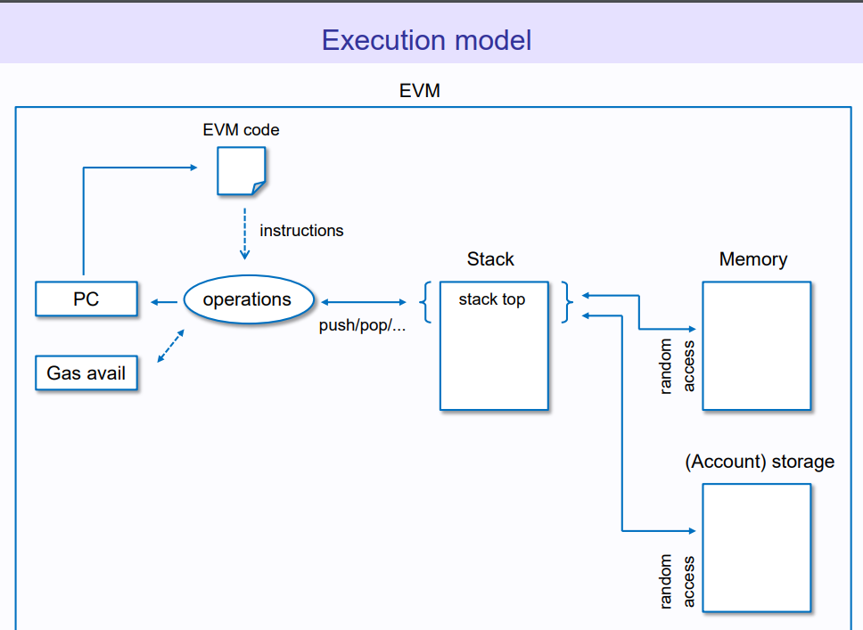

## 概述

ZKEVM 是一种虚拟机，它生成[零知识证明](https://www.alchemy.com/overviews/snarks-vs-starks)以验证程序的正确性。ZKEVM 被设计以支持零知识技术的方式执行智能合约。

ZKEVM 是 [ZK-Rollups](https://www.alchemy.com/blog/zero-knowledge-rollups)的一部分，ZK-Rollup 是以太坊第二层扩展解决方案，通过将计算和状态存储转移到链下来提高吞吐量。ZK-rollup 将交易数据和验证链下交易批次有效性的零知识证明一起提交给以太坊。

早期的 ZK-Rollups 缺乏执行智能合约的能力，仅限于简单的代币交换和支付。但是，随着 EVM 兼容的零知识虚拟机的引入，ZK-Rollups 开始支持以太坊 dApps。

在这篇文章中，我们探讨了 ZKEVM 是如何运作的，为什么它重要，以及存在哪些类型的 ZKEVM。

## 什么是 ZKEVM？

ZKEVM 是一种支持零知识证明计算的 EVM 兼容虚拟机。与常规虚拟机不同，ZKEVM 证明程序执行的正确性，包括在操作中使用的输入和输出的有效性。

我们将进一步解析这个定义，以便让您更容易理解：

### EVM 兼容性

[EVM](https://www.alchemy.com/overviews/what-is-the-ethereum-virtual-machine-evm) 是以太坊网络上部署的智能合约执行的运行环境。EVM 充当一个“世界计算机”，为运行在以太坊区块链上的去中心化应用程序（dApps）提供动力。

如果一台虚拟机能够运行在 EVM 环境中创建的程序，那么它就被认为是“兼容 EVM”的。这样的虚拟机可以执行用 Solidity 或其他在以太坊开发中使用的高级语言编写的智能合约。ZKEVM 是兼容 EVM 的，因为它们可以执行以太坊智能合约，而无需对底层逻辑进行大量修改。

### 对零知识技术的支持

EVM 从未被设计用来支持零知识证明，这使得构建与 EVM 兼容、对零知识友好的虚拟机变得困难。然而，研究的进步在一定程度上使得将 EVM 计算包裹在零知识证明中成为可能。

不同的 ZKEVM 项目采用不同的方法将 EVM 执行与零知识证明计算相结合。每种方法都有其独特的权衡，我们将在本指南的后续部分探讨这些权衡。

## ZKEVM 是如何工作的？

就像 EVM 一样，ZKEVM 也是一种虚拟机，它会因程序操作而在各种状态之间转换。但 ZKEVM 更进一步，通过产生证明来证实计算的正确性。本质上，ZKEVM 使用一种机制来证明执行步骤遵循了规则。

要理解 ZKEVM 是如何运作的（以及它为何与众不同），让我们回顾一下当前 EVM 的运作方式。

### EVM 如何运作

以太坊虚拟机是一种状态机，它会根据一些输入从旧状态转变为新状态。每一次智能合约的执行都会触发 EVM 状态的改变（被称为“状态转换”）。以下是在智能合约交易过程中发生的事情的高级概述：

1. 合约字节码（从源代码编译而来）从 EVM 的存储中加载，并由 EVM 上的 p2p 节点执行。节点使用相同的交易输入，这保证每个节点得出相同的结果（否则它们无法达成共识）。

2. [EVM 操作码](https://www.ethervm.io/)（包含在字节码中）与 EVM 状态的不同部分（内存，存储和堆栈）进行交互。操作码执行读写操作——从状态存储中读取（获取）值并向 EVM 的存储写入（发送）新值。

3. EVM 操作码在返回新值之前，对从状态存储中获取的值进行计算。这次更新导致 EVM 转变到一个新的状态（因此，交易被称为“状态转换”）。其他节点复制这个新状态，并保持直到执行另一笔交易。

### ZKEVM 是如何运作的

ZKEVM 生成零知识证明，以验证每个计算中的各种元素：

1. 字节码访问：是否已从正确的地址正确加载了适当的程序代码？
2. 读写操作：
   a. 计算前，程序是否从堆栈/内存/存储中获取了正确的值？
   b. 执行完成后，程序是否将正确的输出值写入堆栈/内存/存储中？
3. 计算：操作码是否正确执行（即，一个接一个，没有跳过任何步骤）？

#### ZKEVM 的架构

ZKEVM 分为三个部分：执行环境、证明电路和验证器合约。每个组件都为 ZKEVM 的程序执行、证明生成和证明验证做出贡献。

1. 执行环境

   正如其名，执行环境是在 ZKEVM 中运行程序（智能合约）的地方。ZKEVM 的执行环境的功能非常类似于 EVM：它接受初始状态和当前交易，以输出一个新的（最终）状态。

2. 证明电路

   证明电路产生零知识证明，验证在执行环境中计算的交易的有效性。证明生成过程使用 pre-state、transaction inputs 和 post-state 信息作为输入来完成。之后，证明者获得了对特定状态转换有效性的简洁证明。

   

3. 验证器合约

   ZK-Rollups 将有效性证明提交给部署在 L1 链（以太坊）上的智能合约进行验证。输入（预状态和交易信息）和输出（最终状态）也提交给验证器合约。然后，验证器对提供的证明进行计算，并确认提交的输出是从输入正确计算出来的。

## ZKEVM 操作码是什么？

ZKEVM 操作码是用于在 EVM 兼容的 ZK-rollup 中执行程序的低级机器指令。与 EVM 一样，用高级语言编写的合约必须被编译成虚拟机可以解释的低级语言（字节码）。这个字节码指定了在虚拟机中部署程序时使用的操作码。

我们需要 ZKEVM 操作码，因为常规的 EVM 操作码在零知识证明电路中的使用效率不高。通常有两种方法来为 ZKEVM 创建操作码：

1. 为原生 EVM 操作码构建 ZK 电路
2. 为 ZK 证明计算创建新的语言

### 为原生 EVM 操作码构建零知识电路

这种方法需要在算术电路中实现所有 EVM 指令集，这是一项复杂且耗时的任务。其优点是，开发人员可以使用[现有的区块链开发工具](https://www.alchemy.com/overviews/20-blockchain-development-tools)创建智能合约，或者将现有的以太坊合约移植到 ZK-Rollups，无需进行大量修改。

### 为零知识证明计算创建新的语言

这种方法需要构建一种新的语言——专为支持有效性证明而设计——并开发自定义操作码。开发人员将需要直接用新语言编写合约，或者将 Solidity 源代码编译为自定义的 ZKEVM 操作码。

虽然这种方法通常比第一种方法更容易实施，但它也有缺点。例如，开发者可能无法访问现有的以太坊基础设施和资源。

## 构建 ZKEVM 有什么困难？

由于 EVM 并未考虑到 zk-proof 计算，因此它具有一些对证明电路不友好的特性。以下是四个使构建 ZKEVMs 困难的因素的简要概述：

1. 特殊操作码
2. 基于栈的架构
3. 存储开销
4. 证明成本

### 1. 特殊操作码

与常规的虚拟机不同，EVM 使用特殊的操作码进行程序执行（CALL，DELEGATECALL）和错误处理（REVERT，INVALID）等操作。这增加了为 EVM 操作设计证明电路的复杂性。

### 2. 基于栈的架构

EVM 使用的是基于栈的架构，尽管比基于寄存器的结构简单，但却增加了证明计算的难度。这就是为什么知名的零知识虚拟机，如 ZkSync 的 ZKEVM 和 StarkWare 的 StarkNet 采用基于寄存器的模型。

### 3. 存储开销

EVM 的存储布局依赖于 Keccak 哈希函数和 Merkle Patricia Trie，这两者都具有高证明开销。一些 zkVMs，如 ZkSync，试图通过替换 KECCAK256 函数来规避这个问题——但这可能会破坏与现有以太坊工具和基础设施的兼容性。

### 4. 证明成本

即使上述问题得到解决，我们仍然需要面对证明生成过程。生成零知识证明需要专门的硬件，以及在时间、金钱和努力上的大量投入。

虽然这个列表并不详尽，但它列出了一些阻碍构建 EVM 兼容 ZKEVMs 的问题。然而，[零知识技术的几项突破](https://hackmd.io/@yezhang/S1_KMMbGt#Why-possible-now)使得缓解这些问题成为可能，从而重新激发了对 ZKEVM 解决方案的兴趣。

## ZKEVM 为何重要？

构建一个完全功能的 ZKEVM 将鼓励开发 EVM 兼容的 [ZK-rollup 项目](https://www.alchemy.com/overviews/zk-rollup-projects)。这带来了几个优点：

1. 安全可扩展性
2. 更低的成本
3. 更快的最终确定性和资本效率
4. 网络效应

### 1. 安全可扩展性

根据协议规则，所有验证节点必须重新执行以太坊虚拟机中进行的所有计算。这种方法确保了安全性，因为以太坊节点可以独立验证程序的正确性，但它对可扩展性设定了限制（以太坊网络只能处理大约 15-20 笔交易）。

兼容 EVM 的 ZK-Rollups 可以解决以太坊的吞吐量问题，而不会破坏网络安全。与其他扩展协议一样，ZK-Rollups 不受以太坊的共识协议规则的限制，可以优化执行速度。一些估计表明，[ZK-Rollups 可以每秒处理约 2000 笔交易](https://blog.matter-labs.io/optimistic-vs-zk-rollup-deep-dive-ea141e71e075)，而不会产生以太坊的高昂费用。

然而，与其他扩容项目相比，ZK-Rollups 具有更高的安全保证；它们通过有效性证明来验证链下计算的正确性。这意味着可以在 L1（以太坊）上可靠地验证在 L2 上由智能合约执行的交易，而无需节点重新执行操作。这可以显著提高以太坊的处理速度，而不会降低安全性。

### 2. 更低的成本

Rollups 通过将交易数据写入以太坊主网来获取安全性，这些数据以 CALLDATA 的形式存在。然而，OP-Rollups 和 ZK-Rollups 关于哪些数据必须发布在以太坊上存在差异。

由于[optimistic rollups](https://www.alchemy.com/overviews/optimistic-rollups) 并未为链下交易提供有效性证明，因此它们需要将所有与交易相关的数据发布到链上（包括签名和交易参数）。如果不将所有数据放在链上，挑战者将无法构建用于挑战无效 rollup 交易的欺诈证明。

相反，ZK-Rollups 可以在以太坊上发布最少的数据，因为有效性证明已经保证了状态转换的可信度。ZKEVM 甚至可能省略交易输入，只发布最终状态的变化，进一步减少了 CALLDATA 的需求。

这对开发者和用户都有益，因为[大部分 rollup 的成本](https://forum.celestia.org/t/ethereum-rollup-call-data-pricing-analysis/141)来自于在链上发布数据。通过将 CALLDATA 减至最低，ZK-rollup 可以降低使用去中心化应用程序的成本，如去中心化交易所、NFT 市场、预测市场等等。

### 3. 更快的最终确定性和资本效率

除了更好的安全性，ZK-Rollups还有一个优势超过optimistic rollups：更快的最终确定性。在区块链中，最终确定性是指交易变得不可逆转所需的时间；只有当网络参与者拥有其有效性的客观证据时，交易才能被最终确定。

使用 ZK-Rollups，ZKEVM 中执行的交易通常在发布到以太坊后立即完成。由于每个交易批次都附带有可以立即验证的有效性证明，主以太坊链可以快速应用状态更新。

由于optimistic rollups仅发布无需证明的虚拟机交易，因此必须等待挑战期过去后，交易才能最终确定。挑战期是一个为期 1-2 周的期间，在此期间任何人都可以在交易提交到以太坊后对其提出挑战。

较慢的最终性对用户体验有许多影响。例如，用户不能在延迟期满之前从 rollup 中提取资产。流动性提供者可能会解决这个问题，但如果提款涉及高价值资产甚至 NFTs，可能会无效。

ZKEVM 没有上述所描述的任何问题。更快的最终确定性对于高级用户非常有利，例如 NFT 交易者，DeFi 投资者，或者需要无缝转移资产的套利交易者（尤其是在 L1 和 L2 之间）。

### 4. 网络效应

构建 EVM 兼容的 zkVMs 最重要的原理是利用以太坊的网络效应。作为全球最大的智能合约平台，以太坊拥有一个大型生态系统，为开发者和项目提供价值。

例如，开发者可以访问经过严格测试和审计的代码库，广泛的工具，文档等等。创建一个与以太坊基础设施不兼容的新 zkVM 将阻止项目和开发团队利用以太坊的网络效应。

## 存在哪些类型的 ZKEVMs？

当前的 ZKEVM 项目主要分为两大类：支持原生 EVM 操作码的 zkVMs 和使用定制 EVM 操作码的 zkVMs。以下我们将比较不同的 ZKEVM 协议，并解释它们的工作原理：

### Polygon ZKEVM

Polygon Hermez 是一个配备了兼容 EVM 的 ZKEVM的 [Polygon ZK-rollup](https://www.alchemy.com/overviews/polygon-zk-rollups)，旨在支持 EVM 兼容性。为了实现这一点，EVM 字节码被编译成"微操作码"，并在 uVM 中执行——这是一个使用 SNARK 和 STARK 证明来验证程序执行正确性的虚拟机。

将两种证明类型结合的决定是战略性的。STARK（可扩展透明知识论证）证明的生成速度更快，但 SNARK（简洁非交互式知识论证）证明更小，且在以太坊上验证的成本更低。

Polygon Hermez ZKEVM 使用 STARK 证明电路来生成状态转换的有效性证明。SNARK 证明验证 STARK 证明的正确性（可以将其视为生成“证明的证明”），并提交给以太坊进行验证。

### zkSync ZKEVM

zkSync 是由 Matter Labs 开发并由其自身的 [ZKEVM](https://docs.zksync.io/zkevm/) 驱动的与 EVM 兼容的 ZK-rollup。zkSync 通过以下策略实现与以太坊的兼容性：

1. 将用 Solidity 编写的合约代码编译为 Yul，这是一种可以编译为不同虚拟机字节码的中间语言。

2. 使用 LLVM 框架重新编译 Yul 字节码，转换为专为 zkSync 的 ZKEVM 特别设计的定制电路兼容字节码集。

就像 Polygon Hermez 一样，zkSync ZKEVM 在语言级别实现了 EVM 的兼容性，而不是字节码级别。例如，传统的乘法和加法操作码（ADDMOD，SMOD，MULMOD）不被 zkSync 的 ZKEVM 所支持。

### Scroll ZKEVM

[Scroll](https://scroll.io/blog/zkEVM) 是一款正在开发中的全新零知识 EVM 实现。Scroll 团队计划为每个 EVM 操作码设计零知识电路。这将允许开发者在不需要修改底层 EVM 字节码的情况下，在 Scroll 上部署以太坊原生的智能合约 EVM。

除其他事项外，Scroll ZKEVM 将使用“密码学累加器”来验证存储的正确性。这被用来证明合约字节码已从给定地址正确加载。

它还提供了一个电路，用于将字节码与执行跟踪（execution trace）进行链接。执行跟踪是一个序列，指定了执行了哪些虚拟机指令以及执行的顺序。在生成证明时，证明者将提交执行跟踪，以验证计算是否与原始字节码一致。

### AppliedZKP ZKEVM

[Applied ZKP](https://github.com/privacy-scaling-explorations/zkevm-specs)是一个由以太坊基金会资助的项目，旨在开发一个与 EVM 兼容的 ZK-rollup 以及一个用于生成以太坊区块有效性证明的机制。最后一部分至关重要，因为将区块与有效性证明配对将消除节点重新执行区块的需要。

Applied ZKP 的创新在于将计算与存储分离。它使用两种有效性证明——状态证明和 EVM 证明：

### State proofs‍

检查涉及存储、内存和堆栈的操作是否正确进行。状态证明基本上验证了读写操作的准确性。

### EVM proofs

检查计算是否在正确的时间调用了准确的操作码。EVM 证明验证了计算本身，同时也确认了状态证明为每个操作码执行了正确的操作。

AppliedZKP ZKEVM 的 ZKEVM 利用总线映射来连接状态证明和 EVM 证明。此外，在以太坊区块被认定为有效之前，必须验证这两种证明。

## 我们在 ZKEVMs 的开发进程中处于哪个阶段？

除了 zkSync，大多数零知识 EVM 仍在生产中。然而，零知识技术的发展日益增长，意味着全功能的 ZKEVM 的前景比以往任何时候都更好。

与此同时，开发者可以利用 StarkNet 零知识虚拟机的优势，享受零知识应用的好处。StarkNet 并不与 EVM 兼容，但可以将 Solidity 源代码编译为定制的 ZK 友好字节码。您也可以选择用 Cairo（StarkNet 的语言）编写合约。
