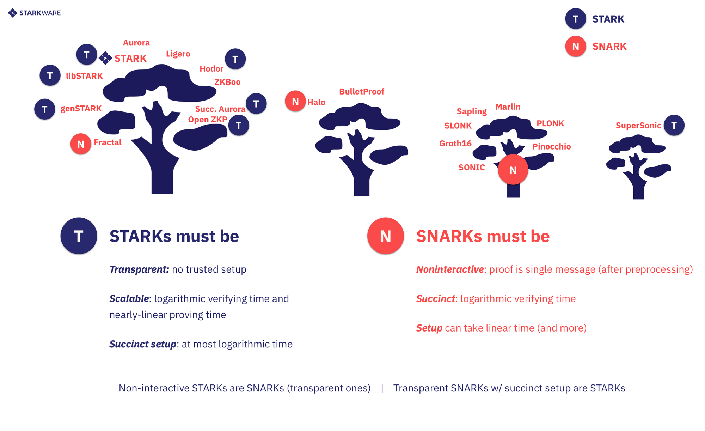

本文介绍零知识证明。

<!--more-->

## 零知识证明

## 核心原理

多项式性质 [Schwartz-Zippel Lemma](https://www.youtube.com/watch?v=nkrk3jLj8Jw) 是很多零知识证明方法的核心原理。

## 交互式零知识证明

$\varSigma$ 协议：

- 系统参数：生成椭圆曲线群 $\mathbb{G}$ 的阶为 $q$，生成元为 $G$ ；
  - 公开输入为 $Q \in \mathbb{G}$
  - 证明放 $p$ 证明知道秘密 $\omega$, 且 $\omega$ 满足离散对数关系 $Q = \omega \cdot G$
- 承诺：证明方 $p$ 选择随机数$r$，计算并发送 $C=r\cdot G$
- 挑战：验证方 $v$ 选择发送随机数 $e$
- 响应：证明方 $p$ 计算并发送 $z=r+e\cdot\omega$
- 验证：验证法 $v$ 验证 $z\cdot G=C+e\cdot Q$

协议思想：

1. 证明方 $p$ 将 $\omega$ 与随机数 $e$ 进行线性组合 $z=r+e\cdot\omega$ 来生成响应 $z$.
2. 验证方 $v$ 基于响应 $z$ 和挑战$e$ 构造椭圆曲线离散对数点 $z\cdot G,e\cdot Q$, 并于承诺 $C$ 在椭圆曲线离散对数上重构线性关系，实现正确性验证，但是不知道秘密 $\omega$ 。 这里用到了双线性映射的性质。

## 非交互式零知识证明

- 承诺：证明方 $p$ 选择随机数$r$，计算 $C=r\cdot G$
- 挑战：证明方 $p$ 计算随机数 $e=Hash(Q,C)$;
- 响应：证明方 $p$ 计算 $z=r+e\cdot\omega$，并发送 $C,z$
- 验证：验证法 $v$ 计算$e=Hash(Q,C)$，验证 $z\cdot G=C+e\cdot Q$

## 证明系统

目前主流的 ZKP 有 zkSNARK 和 zkSTARK。SNARK、STARK、ZKP 都属证明系统，SNARK 与 ZKP 相交的地方称为 zkSNARK, SNARK 与 ZKP 相交的地方称为 zkSTARK。

### SNARK

SNARK(Succinct Non-Interactive Argument ofKnowledge) 代表“简洁的非交互式知识论证”

- S：简洁性 (Succinctness)。证明的内容足够简短，使得验证者能在短时间内完成验证。
- N：非交互性 (Non-Interactivity) SNARKs 是非交互式的，因为证明者和验证者无需交换超出初始证明提交的信息。早期的零知识证明系统需要证明者和验证者交换多条信息以验证声明。非交互性可以带来许多的便利，为证明系统带来更多的应用场景。例如，在区块链系统中，非交互性的零知识证明可以附在交易中，供任何人随时查验，而不需要交易的作者随时在线与验证者交互。
- ARK：知识论证 (Argument of Knowledge)。 如果要求 Prover 必须“知道”一些信息才能让 Verifier 验证通过，这个系统就被称为知识证明 (Proof of Knowledge)。

### STARK

- S：扩展性 (Scalability)，它在简洁性的基础上还要求 Prover 复杂度至多是拟线性 (Quasi-linear) 的，即 O(nlogn)。证明时间与证明内容的复杂性呈拟线性关系，而验证时间则与其呈多对数关系，因此，当证明内容的复杂性显著增加时，尽管链下证明的耗时也拟线性增长，链上验证的耗时却增加不大。
- T：透明性 (Transparent)，STARK 不需要可信第三方 Setup。
- ARK：知识论证 (Argument of Knowledge)。

### STARK VS. SNARK

STARK 和 SNARK 只有一字之差，但有很多不同。下面我们比较一下这两个概念。

共同点：

都是知识论证 (ARK)，即只有计算意义下的可靠性，且证明是知识性的。

区别：

- SNARK 的 “S” 是简洁性 (Succintness)，而 STARK 的 “S” 是可扩展性 (Scalability)，它在简洁性的基础上还要求 Prover 复杂度至多是拟线性 (Quasi-linear) 的，即 O(nlogn)。
- 透明性 (Transparent)：STARK 不需要可信第三方 Setup，因此是抗量子计算的。
- 非交互性 (Non-Interactivity)：SNARK 一定是非交互的，而 STARK 没有这个限制。可以看出，SNARK 比 STARK 唯一多出的限制就是非交互性。尽管如此，STARK 一般都可以转化为非交互证明，转化的结果必然是一个 SNARK。在这种意义上，可以把 STARK 看做 SNARK 的子集。
- 目前大多数的 zkSNARK 是基于电路模型的，STARK 是基于 RAM 模型的，RAM 模型的构造极其复杂。
- 证明大小：STARK 比 SNARK 大，这也意味着它们在以太坊上验证的成本更高，因为更大的证明 = 更多的计算 = 更高的 gas 费。
- 可扩展性：通常认为 STARK 比 SNARK 更有效，具体取决于实现情况。证明和验证 STARK 的复杂度规模相对于被证明的计算复杂度呈拟线性增长，而 SNARK 的复杂度呈线性增长。这意味着在证明更大的计算量时，STARKs 比 SNARKs 具有更大的优势。
- 生态系统和项目：使用 SNARK 的项目比使用 STARK 的项目多得多，因为 SNARK 的存在时间更长。
- 递归：SNARK 支持递归，可以创建一个父 SNARK 来证明多个子 SNARK，这是许多扩展解决方案使用的主要功能。STARK 不支持递归。
- 量子安全：SNARK 使用椭圆曲线密码术，这不是量子安全的。量子计算的进步可能会使基于 SNARK 的系统容易受到攻击。STARK 不易受到攻击，因为它们的加密方案依赖散列函数。
- 可信设置：如前所述，SNARK 在创建 CRS 期间需要可信设置。STARK 通过利用可公开验证的随机性来生成证明者和验证者共享的参数，从而避免了这个不便的问题。

需要注意的是，这些特点在不断发展。最近出现了新的基于 SNARK 的方案，以解决传统 SNARK 的弱点。

### zk-SNARK

ZK-SNARK(Zero-Knowledge Succinct Non-Interactive Argument ofKnowledge) 为不泄露秘密 $\omega$，需使用 R1CS 约束（电路约束）等价描述算法的运算规则。

证明过程可以理解为以下等价转换过程：

将 w 满足公开的计算关系 $y=F（w）$
$\iff$ w 满足公开的 R1CS 约束
$\iff$ 向量 s 与多维向量的內积，
$\iff$ 向量与矩阵的内积
$\iff$ 再等价转化为向量 s 对三组多项式的线性组合运算
$\iff$ 目标多项式 $z(x)$ 整除 QAP/QSP 多项式 （构成 NP 问题）
$\iff$ 基于这三个多项式的系数计算椭圆曲线离散对数点 （构成零知识），对外暴漏离散对数点；

### zk-STARK

ZK-STARK（Zero-Knowledge Succinct Transparent-Interactive Argument ofKnowledge，中文意思：简洁化的全透明零知识证明）

### Bulletproof

## 验证系统

### groth16

### PLONK

### UltraPLONK

### Plonky2

### halo2

## 开发库

## 硬件加速

而是 zk 算法运行 zk 电路生成证明耗时较长，当前研究方向就是如何通过 ASIC（专用集成电路）、GPU（图形处理单元）和 FPGA（现场可编程门阵列）等硬件加速器帮助提高零知识证明系统中证明者的计算性能。

## 使用场景

## 延伸阅读
