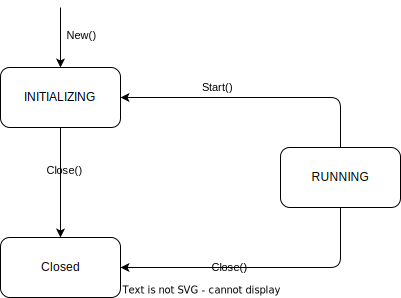

## 概述

Geth 中的命令行程序基于 [urfave/cli]()，该工具可以方便的集成了 subcommand 以及命令行参数的解析。

## Node

 ([Node](https://github.com/phenix3443/go-ethereum/blob/b5f3e54a8b2b9950095d78c8ccde4f8c806dc384/node/node.go#L44)) 是以太坊节点的实现，它支持多种协议，是一组服务（services）的集合，这些服务使用共享资源来提供 RPC API。这些服务还可以提供 devp2p 协议，当启动节点实例时，它们将连接到 devp2p 网络上。

 在创建 geth 节点的时候，定义的是变量名 [stack](https://github.com/phenix3443/go-ethereum/blob/b5f3e54a8b2b9950095d78c8ccde4f8c806dc384/cmd/geth/config.go#L150) 就有协议栈的含义。

## 生命周期

Node 对象具有 [三种基本状态](https://github.com/phenix3443/go-ethereum/blob/b5f3e54a8b2b9950095d78c8ccde4f8c806dc384/node/node.go#L71-L73)： INITIALIZING（初始化）、RUNNING（运行）和 CLOSED（关闭）。

创建一个节点会分配基本资源，如数据目录，并返回处于初始化状态的节点。在此状态下，可以 ：

- [注册实现 service](https://github.com/phenix3443/go-ethereum/blob/b5f3e54a8b2b9950095d78c8ccde4f8c806dc384/node/node.go#L559)，service 是实现 Lifecycle 接口的对象
- [注册 RPC API](https://github.com/phenix3443/go-ethereum/blob/f52d18e6a1e5d7cdd9daa00e6432637559246ae0/node/node.go#L584)
- [注册 p2p 网络协议](https://github.com/phenix3443/go-ethereum/blob/b5f3e54a8b2b9950095d78c8ccde4f8c806dc384/node/node.go#L133-L140)。

在初始化期间，允许执行基本操作，如打开键值数据库。

一旦所有内容 [都注册完成](https://github.com/phenix3443/go-ethereum/blob/f52d18e6a1e5d7cdd9daa00e6432637559246ae0/cmd/geth/config.go#L169)，可以 [启动节点](https://github.com/phenix3443/go-ethereum/blob/f52d18e6a1e5d7cdd9daa00e6432637559246ae0/cmd/geth/main.go#L352)，将其状态转换为运行状态。启动节点会 [启动所有已注册的 Lifecycle 对象](https://github.com/phenix3443/go-ethereum/blob/b5f3e54a8b2b9950095d78c8ccde4f8c806dc384/node/node.go#L189)，并 [启用 RPC 和 p2p 网络](https://github.com/phenix3443/go-ethereum/blob/b5f3e54a8b2b9950095d78c8ccde4f8c806dc384/node/node.go#L177)。请注意，在节点运行时不能注册额外的 Lifecycle、API 或 p2p 协议（这是通过 [Node.lock](https://github.com/phenix3443/go-ethereum/blob/f52d18e6a1e5d7cdd9daa00e6432637559246ae0/node/node.go#L560-L561) 实现的）。

关闭节点会释放所有占用的资源。Close 方法执行的操作取决于节点的状态。当关闭处于初始化状态的节点时，会释放与数据目录相关的资源。如果节点在运行状态下关闭，它还会 [停止 service 并关闭 RPC 和 p2p 网络](https://github.com/phenix3443/go-ethereum/blob/b5f3e54a8b2b9950095d78c8ccde4f8c806dc384/node/node.go#L293)。

无论节点是否已启动，都必须始终调用 Node 的 Close 方法。

## 节点管理的资源

节点实例使用的所有文件系统资源都位于名为 "data" 的目录中。每个资源的位置可以通过额外的节点配置进行覆盖。数据目录是可选的。如果未设置数据目录，并且资源的位置未明确指定，包 "node" 将[在内存中创建资源](https://github.com/phenix3443/go-ethereum/blob/f52d18e6a1e5d7cdd9daa00e6432637559246ae0/node/node.go#L756)。

为了访问 devp2p 网络，Node 配置并启动 p2p.Server。devp2p 网络上的每个主机都具有唯一的标识符，即节点密钥。Node 实例会跨重启保留此密钥。Node 还加载静态和可信的节点列表，并确保保存了关于其他主机的信息。

可以在 Node 上启动运行 HTTP、WebSocket 或 IPC 的 JSON-RPC 服务器。由已注册的服务提供的 RPC 模块将提供在这些端点上。用户可以将任何端点限制为一组 RPC 模块。Node 本身提供 "debug"、"admin" 和 "web3" 模块。

服务实现可以通过服务上下文打开 LevelDB 数据库。包 "node" 会选择每个数据库的文件系统位置。如果节点配置为不使用数据目录运行，那么 [数据库将在内存中打开](https://github.com/phenix3443/go-ethereum/blob/b5f3e54a8b2b9950095d78c8ccde4f8c806dc384/node/node.go#L756)。

Node 还创建了加密的 [以太坊账户密钥的共享存储](https://github.com/phenix3443/go-ethereum/blob/b5f3e54a8b2b9950095d78c8ccde4f8c806dc384/node/node.go#L123-L128)。服务可以通过服务上下文访问帐户管理器。

## 在实例之间共享数据目录

如果多个节点实例具有不同的实例名称（通过 Name 配置选项设置），它们可以共享单个 data 目录。共享行为取决于资源的类型。

与 devp2p 相关的资源（节点密钥、静态/可信节点列表、已知主机数据库）存储在与实例名称相同的目录中。因此，使用相同数据目录的多个节点实例将把这些信息存储在数据目录的不同子目录中。

LevelDB 数据库也存储在实例子目录中。如果多个节点实例使用相同的数据目录，并且以相同名称打开数据库，将为每个实例创建一个数据库。

除非通过 KeyStoreDir 配置选项更改其位置，否则所有使用相同数据目录的节点实例将共享帐户密钥存储。

## 数据目录共享示例

在这个示例中，使用相同数据目录启动了两个节点实例，分别命名为 A 和 B。节点实例 A 打开了数据库 "db"，节点实例 B 打开了数据库 "db" 和 "db-2"。以下文件将在数据目录中创建：


