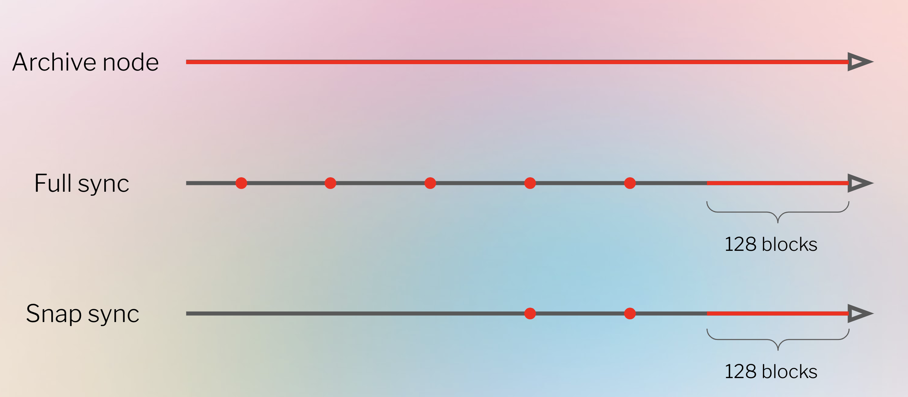

## 概述

同步是 Geth 追赶最新以太坊区块和当前全球状态的过程。有几种不同的方式可以同步 Geth 节点，它们在速度、存储需求和信任假设上有所不同。现在以太坊使用基于权益证明的共识，Geth 同步需要一个共识客户端。

按照同步方式的不同，geth 节点可以分为：

- 完整节点（Full Node）
- 归档节点（Archive Nodes）
- 轻节点（Light Nodes）



## 完整节点

Full Node 是一个完整的以太坊节点，它可以通过全量同步（Full Sync）或快照同步（Snap Sync）这两种不同的同步方式来建立。二者都是完整节点的同步选项，具有不同的特点和用途，用户可以根据自己的需求和硬件资源来选择适当的同步方式。快照同步提供了更快的同步速度，但牺牲了一些安全性，因此在选择时需要权衡。

### 快照同步{#snap_sync}

快照同步的节点在内存中保存最近的 128 个块状态 (`block state`)，因此可以快速访问该范围内的交易。但是，快照同步仅从相对较新的块开始处理（不同于完全同步从创世块开始同步）。在初始同步块和最近的 128 个块之间，节点存储偶尔的检查点 (`checkpoint`)，可用于即时重建状态。这意味着交易可以追溯到用于初始同步的块。跟踪单个交易需要重新执行同一块中的所有先前交易以及所有先前块中的所有先前存储的快照 (`snapshot`)。快照同步通过`--syncmode snap` 来开启。

### 全量同步{#full_sync}

全量同步通过执行从创世块开始的每个块来生成当前状态。全量同步通过重新执行整个历史区块序列中的交易来独立地验证工作量证明和区块出处以及所有状态转换。只有最近的 128 个块状态存储在全节点中，较旧的块状态会定期修剪并表示为一系列检查点，可以根据请求从这些检查点重新生成任何先前的状态。128 个区块大约是 25.6 分钟的历史，区块时间为 12 秒。通过`--syncmode full`创建一个全量同步的节点。

## 归档节点

归档节点是一个保留所有历史数据直到创世纪的节点。无需从检查点重新生成任何数据，因为所有数据都直接存储在节点自己的存储中。因此，归档节点非常适合快速查询历史状态。在撰写本文时（2023 年 9 月），一个完整的归档节点，存储自创世纪以来的所有数据，占用了近 15TB 的磁盘空间（请在 [Etherscan](https://etherscan.io/chartsync/chainarchive) 上关注当前大小）。通过配置 Geth 的垃圾收集，使得旧数据永不删除，就可以创建归档节点：`geth --syncmode full --gcmode archive`。

也可以使用`--syncmode snap --gcmode archive`创建一个最近的存档节点，该节点使用 snap 同步，但状态永不修剪。这将创建一个存档节点，保存从节点首次同步开始的所有状态数据。

## 轻节点

轻节点同步速度非常快，存储的区块链数据最少。轻节点只处理区块头，而不是整个区块。这大大减少了相对于全节点所需的计算时间、存储和带宽。这意味着轻节点适合资源受限的设备，并且当它们是新的或者已经离线一段时间后，可以更快地追赶到链的头部。但是，轻节点严重依赖由无私的全节点提供的数据。轻客户端可以用来从以太坊查询数据并提交交易，充当本地托管的以太坊钱包。然而，因为它们不保留以太坊状态的本地副本，轻节点不能像全节点那样验证区块 - 它们从全节点接收证明，并根据本地头链进行验证。通过`--syncmode light`启动轻节点。请注意，提供轻数据的全节点相对较少，所以轻节点可能会找不到 peer。轻节点目前不适用于权益证明的以太坊。

## 共识层同步

现在以太坊已经切换到权益证明，所有的共识逻辑和区块传播都由共识客户端处理。这意味着同步区块链是共识客户端和执行客户端共享的过程。区块由共识客户端下载并由执行客户端验证。为了让 Geth 同步，它需要从其连接的共识客户端获取一个头部。在共识客户端指示之前，Geth 不会导入任何数据。如果没有连接到共识客户端，Geth 无法同步。这包括从创世区块开始的逐块同步。共识客户端需要提供一个来自链尖的头部，Geth 可以朝着这个方向同步 - 如果没有它，Geth 无法知道它是否遵循了正确的区块序列。

一旦有一个可用于同步的目标头部，Geth 会按照逆时间顺序获取该目标头部和本地头部链之间的所有头部。这些头部显示出区块的序列是正确的，因为父哈希将一个区块链接到下一个区块，一直到目标区块。最终，同步将到达本地数据库中的一个区块，此时，本地数据和目标数据被认为是“链接”的，节点同步正确链的可能性非常高。然后下载区块体，然后是状态数据。只要同步的速度超过了区块链的增长，共识客户端就可以更新目标头部，那么节点最终将会同步。

共识客户端有两种方式找到 Geth 可以用作同步目标的区块头：乐观同步（Optimistic sync）和检查点同步（Checkpoint sync）

### 乐观同步

乐观同步在执行客户端验证它们之前就下载了区块。在乐观同步中，节点在下载阶段假设从其对等节点那里接收的数据是正确的，但然后对每个下载的区块进行回溯验证。节点在仍然'乐观'的时候不被允许证明或提议区块，因为它们还不能保证对链头的视图是正确的。

请在 [乐观同步规范](https://github.com/ethereum/consensus-specs/blob/dev/sync/optimistic.md) 规格中阅读更多内容。

### 检查点同步

或者，共识客户端可以从一个可信赖的源获取一个检查点，该源提供一个目标状态以同步，然后切换到全量同步并逐个验证每个区块。在这种模式下，节点信任检查点是正确的。这个检查点有许多可能的来源 - 黄金标准是从另一个可信赖的朋友那里获取它，但也可以来自区块浏览器或公共 API/网络应用。检查点同步非常快 - 使用这种方法，共识客户端应该能在几分钟内同步。

## 代码走读

切换到权益证明之后，执行端必须要从共识端获取到一个头部才能开始执行同步，所以我们从 engine API 中的 [forkchoiceUpdated 函数](https://github.com/phenix3443/go-ethereum/blob/09608745a08c710ca604927b07210b7adf44ff02/eth/catalyst/api.go#L230) 开始走读代码。

### full sync

在全量同步模式下，同步模块调用`BlockChain.InsertChain`向数据库中插入从别它节点获取到的区块数据。而在`BlockChain.InsertChain`中，会逐个计算和验证每个块的`state`和`receipts`等数据，如果一切正常就将同步而来的区块数据以及自己计算得到的 state、receipts 数据一起写入到数据库中。

### snap sync

快照同步首先下载一部分区块头部。一旦验证了区块头部，就会下载这些块的`body`和收据 (`receipt`)。同时，Geth 也同步开始状态同步 (`state-sync`)。在状态同步中，Geth 首先下载每个块的状态树的叶子，没有中间节点 (`intermediate nodes`) 以及范围证明（`range proof`? 什么是范围证明）。然后在本地重新生成状态树 (`state trie`)。状态下载是快照同步中完成时间最长的部分，可以使用日志消息中的 ETA 值监控进度。但是，区块链也在同时进步，使部分再生状态数据失效。这意味着还需要有一个修复状态错误的“修复”阶段 (`healing phase`)。无法监视状态修复的进度，因为在当前状态已经重新生成之前无法知道错误的程度。

Geth 在状态修复期间定期报告`Syncing, state heal in progress`, 这会通知用户状态修复尚未完成。也可以使用`eth_syncing`确认这一点：如果此命令返回 false，则节点处于同步状态。如果它返回 false 以外的任何内容，则同步仍在进行中。

```html
# this log message indicates that state healing is still in progress INFO
[10-20|20:20:09.510] State heal in progress accounts=313,309@17.95MiB
slots=363,525@28.77MiB codes=7222@50.73MiB nodes=49,616,912@12.67GiB
pending=29805
```

```html
# this indicates that the node is in sync, any other response indicates that
syncing has not finished eth.syncing >> false
```

修复速度必须超过区块链的增长速度，否则节点将永远赶不上当前状态。有一些硬件因素决定了状态修复的速度（磁盘读/写和互联网连接的速度）以及每个块中使用的总 gas（更多的 gas 意味着必须处理更多的状态变化）。

总而言之，快照同步按以下顺序进行：

- 下载并验证标头。
- 下载块体和收据。同时，下载原始状态数据并构建状态树。
- 修复状态试图解释新到达的数据。

注意：快照同步是默认行为，使用 snap 启动的节点一旦赶上链的头部，就会切换到逐块同步。

## 延伸阅读

- [Geth v1.10.0](https://blog.ethereum.org/2021/03/03/geth-v1-10-0)
