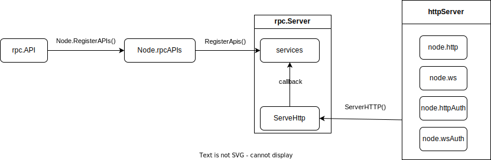

## 概述

为了让软件应用能够与以太坊区块链进行交互，以太坊制定了 [JSON-RPC](https://www.jsonrpc.org/specification) 规范，目前包括两种 API：

- 共识层 [Beacon API webpage](https://ethereum.github.io/beacon-APIs/#/)
- 执行层：[JSON-RPC API spec](https://github.com/ethereum/execution-apis)

[前面的文章]() 已经介绍过过如何借助 [vscode debugging](https://code.visualstudio.com/docs/editor/debugging) 功能 以及 geth 的开发者模式来搭建调试环境，本文我们来分析 geth 中 API 的是如何对外提供服务的，以及自己编写一个 Hello-world 的 JSON API。

## 源码走读



上图中说明了一个 API 对外提供服务的过程中涉及的关键点：

1. [rpc.API](https://github.com/phenix3443/go-ethereum/blob/252d06ee5b2d88f9b8f3f540ed53749303cb6198/rpc/types.go#L32) 描述了对外提供 RPC 服务的名字空间对象。

```go
// API describes the set of methods offered over the RPC interface
type API struct {
  Namespace     string      // namespace under which the rpc methods of Service are exposed
  Service       interface{} // receiver instance which holds the methods
  Authenticated bool        // whether the api should only be available behind authentication.
}
```

2. API 对象通过 [Node.RegisterAPIs](https://github.com/phenix3443/go-ethereum/blob/252d06ee5b2d88f9b8f3f540ed53749303cb6198/node/node.go#L584) 注册到 Node.rpcAPIs 中，该字段包含了 node 支持的所有服务，通过命令行 flag 过滤，将可对外提供服务的 apis 封装为 [rpc.Server](https://github.com/phenix3443/go-ethereum/blob/252d06ee5b2d88f9b8f3f540ed53749303cb6198/rpc/server.go#L45)。API.Service 会对应的 [转变](https://github.com/phenix3443/go-ethereum/blob/252d06ee5b2d88f9b8f3f540ed53749303cb6198/rpc/service.go#L65) 为 Server.services[API.Namespace] 下的 callback 函数。

```go
type Server struct {
  services serviceRegistry
}
```

3. Node 对外提供 http 服务的 httpServer 对象（node.http/node.ws/node.httpAuth/node.wsAuth）在收到请求后 [实际调用 rpc.Server.ServerHttp](https://github.com/phenix3443/go-ethereum/blob/252d06ee5b2d88f9b8f3f540ed53749303cb6198/node/rpcstack.go#L221)，最终通过 [callback](https://github.com/phenix3443/go-ethereum/blob/252d06ee5b2d88f9b8f3f540ed53749303cb6198/rpc/handler.go#L501) 调用到 API 对象定义的 Service 中。

## 代码实践

定义两个 RPC 方法：

- Hello 用于普通 RPC 调用。
- Clock 用于订阅（subscribe）。



最后在 makeFullNode 函数中 [注册该 API](https://github.com/phenix3443/go-ethereum/blob/4ed9da449986448d0559233924c7fa53a9c735a9/cmd/geth/config.go#L229)，跑下测试即可验证。

同时，我们还可以注意到，同一个名字空间是可以有两种同名但不同类型的的 RPC 方法的，比如 `eth_syncing` 的两个实现 ：

- [EthereumAPI.Syncing()](https://github.com/phenix3443/go-ethereum/blob/4ed9da449986448d0559233924c7fa53a9c735a9/internal/ethapi/api.go#L126)
- [DownloaderAPI.Syncing()](https://github.com/phenix3443/go-ethereum/blob/4ed9da449986448d0559233924c7fa53a9c735a9/eth/downloader/api.go#L93)

rpc 方法根据是否为订阅方法在 rpc.Server 中 [分开存放](https://github.com/phenix3443/go-ethereum/blob/4ed9da449986448d0559233924c7fa53a9c735a9/rpc/service.go#L84-L90)，在处理请求的时候会根据 rpc 调用中的 `method`来 [判断](https://github.com/phenix3443/go-ethereum/blob/4ed9da449986448d0559233924c7fa53a9c735a9/rpc/handler.go#L498-L502) 应该调用哪个方法。
