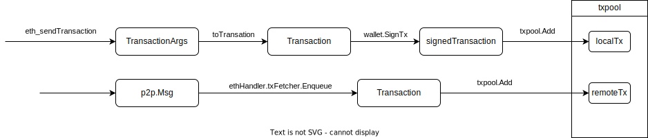

## 概述

本文分析 txpool 的相关源码。

## txpool

## local tx

通过 `eth_sendTransaction` 来说明本地交易进入 txpool 的过程：

[eth_sendTransaction](https://github.com/phenix3443/go-ethereum/blob/9a44a7ddd0578ae342bddf68711455b292e5ef16/internal/ethapi/api.go#L1895) 代码逻辑很简单，API 参数 TransactionArgs 经过一系列的处理后转换给 Transaction, 然后通过 [txpool.Add](https://github.com/phenix3443/go-ethereum/blob/9a44a7ddd0578ae342bddf68711455b292e5ef16/eth/api_backend.go#L291) 放入到 txpool 中。

## remote tx

remoteTx 是通过 [txFetcher](https://github.com/phenix3443/go-ethereum/blob/9a44a7ddd0578ae342bddf68711455b292e5ef16/eth/handler.go#L279) 从链接的 peer 获得的。通过监听 peer 发来的相关消息，将[eth.TransactionsPacket](https://github.com/phenix3443/go-ethereum/blob/9a44a7ddd0578ae342bddf68711455b292e5ef16/eth/handler_eth.go#L75) 放入 txpool.
