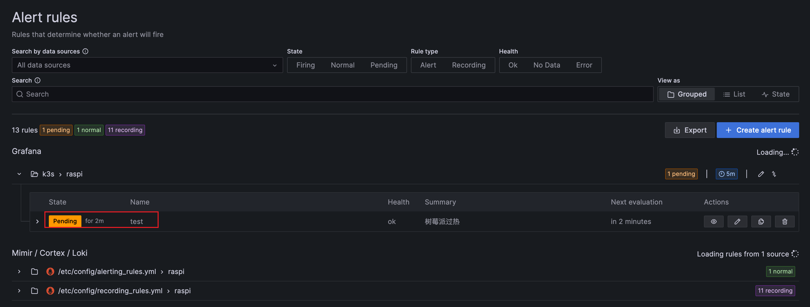
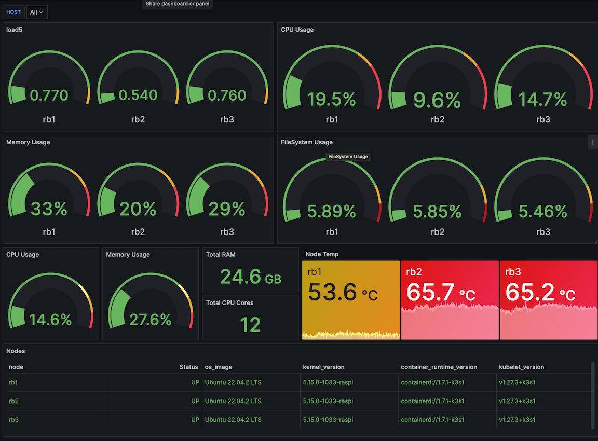
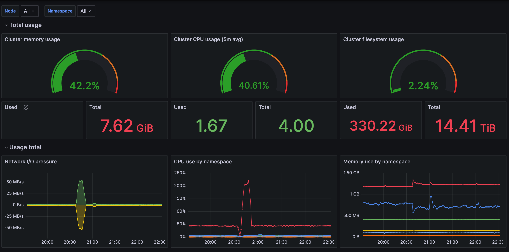

## 概述

[grafana](https://grafana.com/docs/grafana/latest/introduction/) 能够查询、可视化、预警和探索您的 metrics、logs 和 traces。将时间序列转化为具有洞察力的图标和可视化的数据。

## 部署



```shell
helm repo add grafana https://grafana.github.io/helm-charts &&
    helm repo update &&
    helm upgrade grafana grafana/grafana -f grafana/values.yaml --install --namespace monitor --create-namespace
```



浏览器打开：

```shell
kubectl port-forward services/grafana 6789:80
```

## Dashboard

[导入和导出 dashboard](https://grafana.com/docs/grafana/latest/dashboards/share-dashboards-panels/#dashboard-export) 可以方便的使用他人已经配置好的 dashboard。

## 配置

参考 [configuration](https://grafana.com/docs/grafana/latest/setup-grafana/configure-grafana/)

## 告警



## 应用

### 树莓派监控



### k3s 监控



## mlt

[intro-to-mlt](https://github.com/grafana/intro-to-mlt)

## Next
