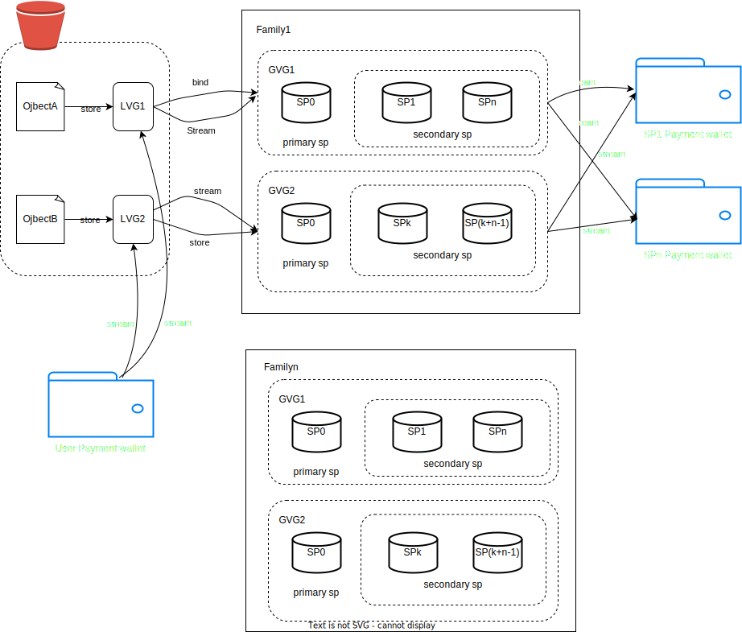

## 概述

GF 建议采用 Virtual Groups 作为解决方案，以消除 Buckets/Objects 与 SP（SP）之间的相互依赖关系。这种方法可以有效减少在 SP 退出和 bucket 迁移过程中修改链上存储 BucketInfo 和 ObjectInfo 时需要传输的大量交易。

Virtual Group 由一个 primary SP 和多个 secondary SPs group 成。每个 object 都与特定的 Virtual Group 相关联，Virtual Group 限制了负责存储 object 副本数据的辅 secondary SP 的范围。每个 Virtual Group 中 SP 的数量由冗余策略决定。例如，如果我们的冗余策略指定了一个完整副本和一个 4+2 擦除编码（EC）副本，则每个 Virtual Group 应由一个 primary SP 和六个 secondary SPs group 成。

### 术语

+ Global Virtual Group (GVG)：GVG 由一个 primary SP 和多个 secondary SP group 成。
+ Local Virtual Group（LVG）：每个 bucket 都维护一个从 local group ID 到 Global group ID 的映射。
+ Virtual Group Family（VGF）：每个 primary SP 可创建多个 Virtual Group Family，每个 Family 包含多个 Global Virtual Group。每个 Family 只能存储数量有限的 bucket。

### 关系

Local Virtual Group 关联它们对应的 bucket，每个 object 都需要存储 Local Virtual Group 的 ID 信息。每个 Local Virtual Group 必须对应一个且只能对应一个 Global Virtual Group。

为了避免 primary SP 的所有数据在短时间内转移到一个 SP，我们引入了 "family"的概念。

Family 可以包含同一 SP 创建的多个 GVG。一个 bucket 只能由同一个 Family 中的 GVG 服务，bucket 内不允许有跨 Family 的 GVG。一旦 Family 的总存储容量超过 64TB（TBD），Family 内的 GVG 就不能再为新的 bucket 提供服务，SP 必须创建一个新的 Family。通过引入 Family，primary SP 可以在不破坏一个 bucket、一个 primary SP 规则的情况下退出 Family。

关于 object 存储，primary-sp secondary-sp 概念参见 [Data Storage](https://docs.bnbchain.org/greenfield-docs/docs/guide/core-concept/data-storage/#primary-sp)

### 存储质押

我们根据存储空间大小引入了新的质押规则。可以使用公式 `storage_staking_price * stored_size` 计算所需的最低质押代币。如果需要，SP 可以选择为即将到来的存储预预先质押代币。

所有质押代币都将由 Virtual Group 模块账户管理。只有在删除或交换时，SP 才能取回这些质押代币。如果 SP 强制退出，这些代币将被没收，用于奖励接管这些 GVG 的 SP。

## 关键工作流程

### 创建和销毁

GVG 可由任何 SP 自主创建，无需 secondary SP 批准。不过，为了控制验证器 group 的扩散，创建 GVG 需要支付相对较高的费用，并需要为存储进行质押。

group 内的 secondary SP 数量可作为该 group 内存储的所有 object 的冗余度指标。该系统可以建立不同冗余度的 secondary  Virtual Group，因此具有极大的灵活性。

创建 GVG 时，如果未指定 GVG Family，交易将自动在链上创建一个 Family，并将其与新创建的 GVG 关联。

相反，LVG 会在创建 object 时自动生成，但其在 bucket 内的数量应限制在特定范围内。

当 GVG 中存储的大小为零时，该 GVG 中的任何 SP 都可以删除该 GVG，并将质押代币归还给该 GVG 的所有者。不能主动删除 GVG Family。如果删除了该 Family 中的所有 GVG，该 Family 也将自动删除。

也不需要手动删除 LVG，因为在删除相关 bucket 时，它们总是会被自动删除。

### 退出

以下是存储提供程序 (SP) 退出流程的关键步骤：

1. SP1 通过向区块链提交 StorageProviderExit 交易启动退出流程。
2. 随后，SP1 或其后后继 SP 必须反复调用 SwapOut，将自己从所有 GVG 中删除。
3. 对于 primary SP 来说，交换过程发生在 family 层面，以确保不会与 GVG 内的其他 SP 发生冲突。
4. 对于 secondary SP，交换发生在 GVG 层面，还必须避免与 primary SP 冲突。
5. 一旦 SP1 成功完成从所有 GVG 的交换过程，它就可以提交 CompleteStorageProviderExit 交易，以取回抵押的代币。

这种有序的退出流程可确保责任和资源的平稳过渡，同时维护网络的完整性以及与退出 SP 相关的已托管代币。

### bucket 迁移

以下是 bucket 迁移的主要工作流程：

1. 用户提交带有新 primary SP 签名的 bucket 迁移交易。
2. 新 SP 开始从旧 primary SP 或 secondary SP 接收完整数据。
3. 新 SP 根据其新的 GVG 在 secondary SP 之间分配数据。
4. 新的 SP 会在链上提交一个 bucket seal 交易，同时提交来自新的 secondary SP 的所有汇总签名。
5. 链上模块将
   1. 解除旧的 LVG 和 GVG 映射绑定，并建立新的映射关系。
   2. 在 LVG、GVF 和 SP 之间结算付款流。
6. 在迁移期间，用户不能将文件上传到此存储 bucket。
7. 在迁移期间，旧 SP 仍应为查询请求提供服务。
