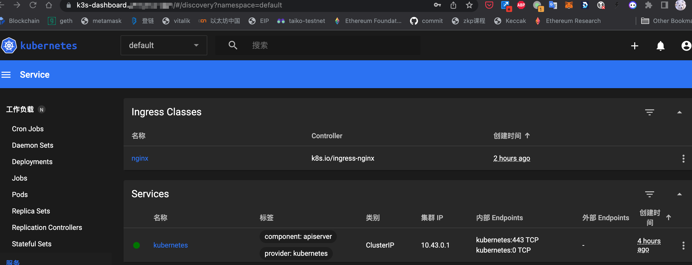

本文介绍 kubernetes dashboard 的安装和使用。

<!--more-->
## 概述

[Kubernetes Dashboard](https://github.com/kubernetes/dashboard) 是一个通用的、基于 Web 的 Kubernetes 集群的用户界面。它允许用户管理集群中运行的应用程序，并对其进行故障排除，以及管理集群本身。

## helm 部署

values.yaml 是 Helm 部署需要的配置：



安装：

```shell
helm upgrade -f values.yaml  --install kubernetes-dashboard kubernetes-dashboard \
  --repo https://kubernetes.github.io/dashboard/ \
  --namespace kubernetes-dashboard --create-namespace
```

执行成功后提示如下：



生成配置中需要的 tls：

```shell
kubectl -n kubernetes-dashboard create secret tls kubernetes-dashboard-ingress-tls --key example.com.cf.key --cert example.com.cf.pem
```

## 确认部署

```shell
kubectl -n kubernetes-dashboard get pods,svc,ingress
```

显示如下：


浏览器打开 `https://k3s-dashboard.example.com` 也可以看到登录界面。

## 创建用户

我们知道：

- kubernetes 所有的资源都是通过 API 进行访问。
- 命名空间下的所有资源都是通过 Role 进行授权访问的。

为了保护集群数据，默认情况下，Dashboard 会使用最少的 [RBAC](https://kubernetes.io/zh-cn/docs/reference/access-authn-authz/rbac/) 配置进行部署。

```shell
kubectl -n kubernetes-dashboard get role
```

```shell
NAME                   CREATED AT
kubernetes-dashboard   2023-06-27T05:25:31Z
```

可以看到默认只创建了 `kubernetes-dashboard` 这一个角色 (role)，该角色也只能管理 kubernetes-dashboard 命名空间内的资源。

```shell
kubectl -n kubernetes-dashboard describe role kubernetes-dashboard
```

```shell
Name:         kubernetes-dashboard
Labels:       k8s-app=kubernetes-dashboard
Annotations:  <none>
PolicyRule:
  Resources       Non-Resource URLs  Resource Names                     Verbs
  ---------       -----------------  --------------                     -----
  secrets         []                 [kubernetes-dashboard-certs]       [get update delete]
  secrets         []                 [kubernetes-dashboard-csrf]        [get update delete]
  secrets         []                 [kubernetes-dashboard-key-holder]  [get update delete]
  configmaps      []                 [kubernetes-dashboard-settings]    [get update]
  services/proxy  []                 [dashboard-metrics-scraper]        [get]
  services/proxy  []                 [heapster]                         [get]
  services/proxy  []                 [http:dashboard-metrics-scraper]   [get]
  services/proxy  []                 [http:heapster:]                   [get]
  services/proxy  []                 [https:heapster:]                  [get]
  services        []                 [dashboard-metrics-scraper]        [proxy]
  services        []                 [heapster]                         [proxy]
```

如果 dashboard 需要通过 apiserver 管理集群就需要满足对应的 [身份认证](https://kubernetes.io/zh-cn/docs/reference/access-authn-authz/authentication/) 需求，这就涉及到了 [ServiceAccount](https://kubernetes.io/zh-cn/docs/reference/access-authn-authz/service-accounts-admin/) 相关知识。

按照 [创建示例用户](https://github.com/kubernetes/dashboard/blob/master/docs/user/access-control/creating-sample-user.md) 为 dashboard service 以服务账户 (ServiceAccount) 方式创建管理员 (admin-user)，该服务账号通过 ClusterRoleBinding 到系统的 cluster-admin role 上，进而有权限可以管理集群所有资源。

创建以下资源清单文件：





部署 admin-user 配置：

```shell
kubectl -n kubernetes-dashboard create -f admin-user.yaml -f admin-user-bind.yaml
```

当前，Dashboard 仅支持使用 Bearer 令牌登录。获取管理员令牌：

```shell
kubectl -n kubernetes-dashboard create token admin-user
```

在浏览器中输入产生的 token ，系统会认为是 admin-user 登录，进而可以操作集群。



## Next

- [helm]()
