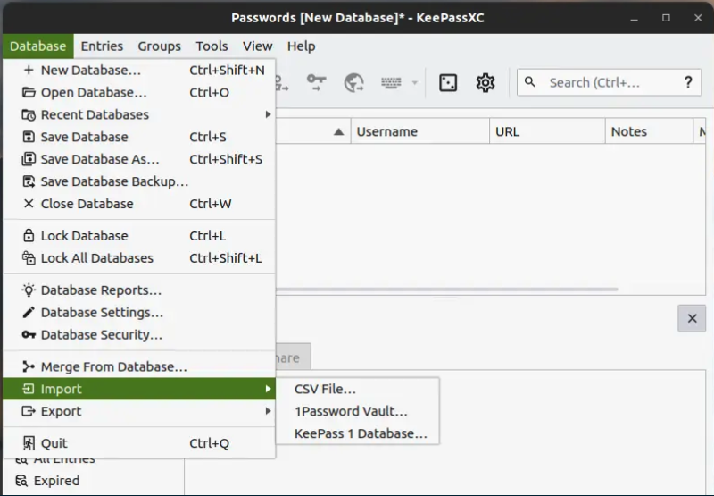
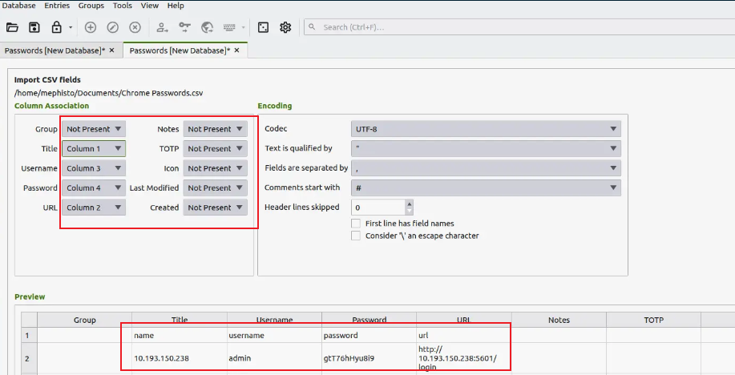
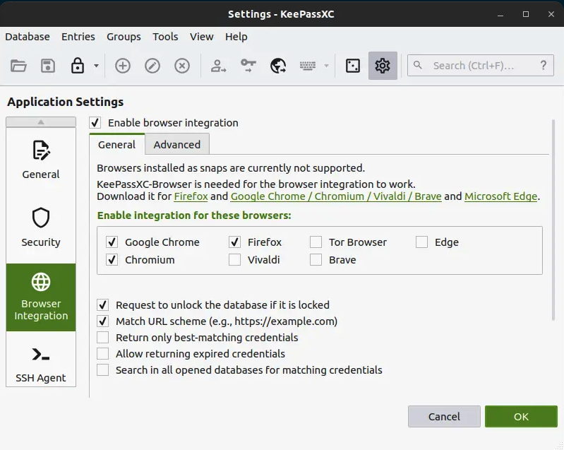

## 概述

keepass 是一种密码管理软件，相比较 LastPass、1password，它开源免费，有跨平台多种实现，可以满足日常需要，关键还免费。这里记录一下各平台的最佳选择：

## keepassxc

官方只有 Windows 版本-[keepass](https://keepass.info/) ， 界面简陋，但很多功能需要可以配合插件使用，其实功能拓展性更强。

目前跨平台客户端 [keepassxc](https://keepassxc.org/) 是桌面软件的最好选择，相比 keepass，优点：

- 设置上更简单易用，界面上也更好看。
- 配合浏览器插件 KeePassXC_Browser 更是无缝衔接。
- 可以直接解析其他软件（如 LastPass、1password 等）导出的密码数据。

缺点是目前还不支持通过 webDAV 加载数据库，但是这个可以通过坚果云或者 oneDriver 等同步网盘解决。

### 批量导入

keepassxc 还支持批量导入其他软件的密码记录：

lastPass 导出的 csv 密码文件，简单设置以下字段映射关系就可顺利的导入到 keepassxc 中：

下面还有字段映射的相关提示，可以很直观的判断映射结果。

### 浏览器插件

浏览器自动填充是必不可少的一个功能，在设置中进行开启：

安装对应的浏览器插件后，点击插件图标，连接 keepassxc 即可。

### 全局自动输入

通过全局自动输入，可以在本地电脑的其他应用上也进行自动输入账号和密码。 在常规 → 自动输入选项卡，单击“全局自动输入快捷键”，然后按所需的组合键设置快捷键。

## KeePass2Android

[KeePass2Android](https://github.com/PhilippC/keepass2android) 与 [KeePassDX](https://www.keepassdx.com/) 是 Android 上的解决方案，二者相比：

- KeePass2Android 支持通过 webDAB 加载数据库。
- KeePassDX 项目更新，界面也要更好看。

其他功能二者差不多，如果不想安装其他同步软件的话，可以选择 KeePass2Android + webDAV 解决方案，[这篇文章](https://github.com/1688aa/KeePass-Instructions-for-use/blob/master/%E5%AE%89%E5%8D%93%E7%89%88%E4%BD%BF%E7%94%A8%E8%AF%B4%E6%98%8E/%E5%AE%89%E5%8D%93%E7%89%88%E4%BD%BF%E7%94%A8%E8%AF%B4%E6%98%8E.md) 是 KeePass2Android 设置说明。

## keepassium

[keepassium](https://www.appinn.com/keepassium-for-ios/) 是 iOS && iPad 上的最佳选择，没有太复杂的设置，简单易用。
