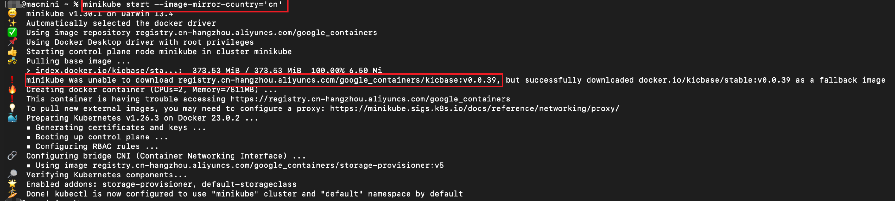
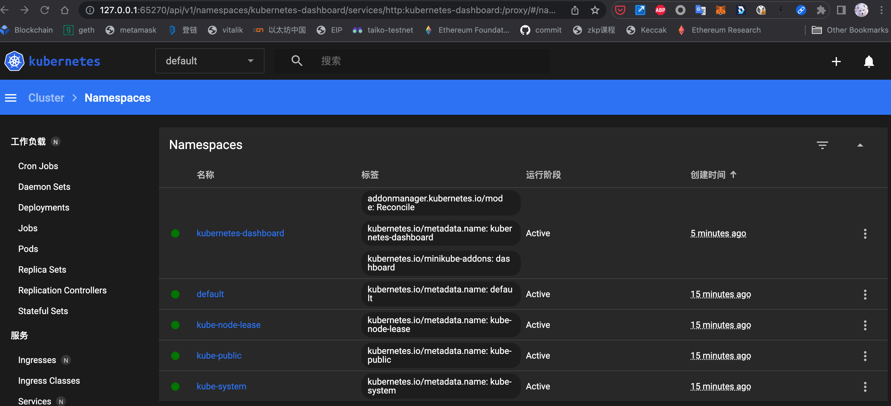

## 概述

为了方便开发和体验 Kubernetes，社区提供了可以在本地部署的开发环境 Minikube。

- [minikube 官方教程](https://minikube.sigs.k8s.io/docs/start/)

```shell
brew install minikube
```

## 基本使用

### 启动集群

由于国内网络原因，无法下载相关的镜像，官方给出了[解决办法](https://minikube.sigs.k8s.io/docs/faq/#i-am-in-china-and-i-encounter-errors-when-trying-to-start-minikube-what-should-i-do)(`minikube start --image-mirror-country='cn'`)不可以用。



需要直接使用代理，可以参考[使用 clash 设置透明代理]()

启动集群，同时启用插件 dashboard：

```shell
minikube start
```



该命令会在 kubectl 的配置文件(`${HOME}/.kube/config`)中添加 minikube 相关的信息，并将 current-context 设置为 minikube，这样后续的 kubectl 命令才可以直接操作 minikube 集群。



### 查看集群信息

查看一下当前集群信息：



查看当前 Nodes:



默认启动单节点的集群，即使 control plane，也是 node plane.

### 启动控制面板

```shell
minikube dashboard
```



会自动在浏览器打开 dashboard 界面：



可以简单浏览一下默认启动的 Services/cluster/namespaces/config 等资源信息。

### minikube 内部



通过`minikube ssh` 登录到 minikube master node，可以看到实际上 minikube 使用 [docker-in-docker](https://blog.mafeifan.com/DevOps/Docker/Docker-%E5%AD%A6%E4%B9%A0%E7%B3%BB%E5%88%9727-Docker-in-Docker.html) 的方式，来启动 kubernetes control plane 相关的服务的。

### 添加节点



### 删除集群

可以随时删除已经启动的集群以方便测试。

```shell
minikube stop && minikube delete --all
```

更多的命令行参数参见 [commands](https://minikube.sigs.k8s.io/docs/commands/)。

### 集群外访问

minikube service 命令可以在集群外部访问内部 service 的 URL，更加方便调试。



## addons

minikube 内置了可以轻松部署的应用程序和服务列表，例如 Istio 或 Ingress。

```shell
minikube addons enable ingress
```
