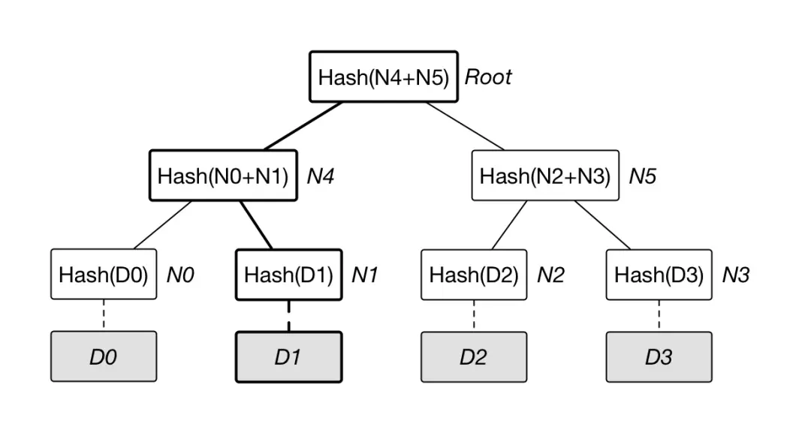
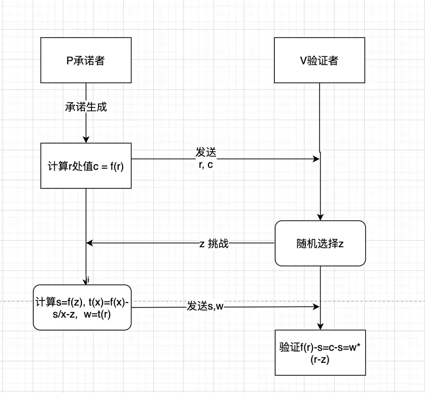
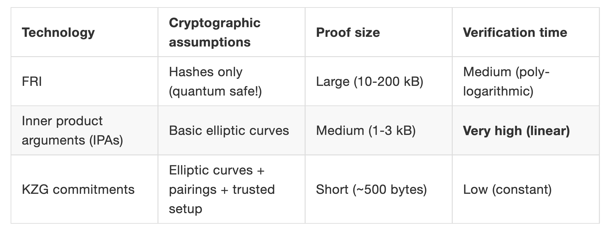

## 简单猜拳

猜拳游戏往往因为“慢出” 产生争执，在不引入可信任的第三方情况下，一个最简单的解法是：

1. 每人把自己的决定（石头、剪刀、布）写到一张纸上，放入信封。
2. 然后两人见面拆信封既可以知道输赢。

这样的猜拳结果是完全公平的，因为决定已经装在信封里，就无法再更改了！

这个过程中，写在纸上就相当于是对出拳结果`做出承诺（make commitment）`；拆开信封则是`揭示承诺 (reveal commitment)`的过程。

## 异地猜拳

难度提高一点：如何保证异地猜拳的公平呢？

假设蜀地的诸葛亮和魏国的曹操想要猜拳，如果诸葛亮把自己的信封用快马送给曹操，那曹操可以拆开看到诸葛亮的出拳之后再写自己的信。所以之前的解法就失效了。

信封这个解法不行了，不过如果用一点密码学，还是可以异地猜拳。我们假设猜拳选择，石头、剪刀、布可以分别对应整数 0,1,2。有一个抗碰撞的哈希函数 (collision-resistant hash function) $f(x)$，满足如下的条件：

1. 从 $x$ 很容易计算 $f(x)$。
2. 非常难找到两个 $x$, $y$ 满足 $f(x) = f(y)$.

接下来：

1. 诸葛亮先从石头、剪刀、布确定一个选择 $m_1$ 。然后再选择一串随机数 $r_1$，计算自己的承诺$y_1 = f(r_1 , m_1)$ 。
2. 曹操同样计算自己的承诺： $y_2 = f(r_2 , m_2)$。
3. 两人互相发送各自的承诺。
4. 诸葛亮在收到曹操的承诺 $y_2$ 以后，再把随机数 $r_1$ 和自己的选择 $m_1$ 发送过去。曹操同样如此。
5. 曹操通过计算 $f(r_1, m_1) = y1$ 来确保诸葛亮没有作弊，诸葛亮也同样如此。

现在双方可以比较彼此的出拳选择 $m_1$ 和 $m_2$，来决定谁胜谁负！问题是：为什么这样可以杜绝一方作弊？

假设诸葛亮想要作弊，那他必须在收到曹操的所有信息之后再发送（$r_1$, $m_1$）。现在假设诸葛亮想把自己的选择改成 $m_1'$ , 那么他必须找到另一个随机数 $r_1'$，满足

$$
f(r_1 , m_1) = f(r_1', m_1')
$$

然而， 根据对函数 $f(x)$ 的假设，诸葛亮是找不到 $r_1'$ 的。所以他没有办法作弊：任何他能找到的 $r_1'$，曹操计算出的承诺 $f(r_1', m_1')$ 都和 $y_1$ 对不上。

## 承诺方案{#commitment_scheme}

上面介绍的“公平的远程猜拳”方法用到的实际是密码学的一个重要原型：[承诺方案 (Commitment Scheme)](https://en.wikipedia.org/wiki/Commitment_scheme)。它起源于两篇文章：

- 1979 年 Blum 的 [通电话猜硬币 (coin flipping over the telephone)](https://dl.acm.org/doi/10.1145/1008908.1008911)
- 1981 年 RSA 三巨头的 [通电话玩扑克 (Mental Poker)](https://en.wikipedia.org/wiki/Mental_poker)。

可以看出来，密码学承诺最大的优势是用来远程进行公平的博弈，而不需要有第三方裁判。

密码学承诺方案是一个涉及两方的`二阶段交互协议`，双方分别为承诺方和接收方。

- 第一阶段为承诺 (Commit) 阶段，承诺方选择随机数 `r`，和消息 `m` 生成`承诺 (commitment)`，并将承诺发送给接收方，`意味着自己不会更改 m`。
- 第二阶段为揭示 (Reveal) 阶段，承诺方公开消息 `m` 与随机数`r`，接收方据此计算来验证其得出的承诺值与上一阶段所接收的承诺是否一致，进而可以知道`判断承诺方是否修改了消息 m`。

承诺方案有两个基本性质：`隐藏性 (Hiding)`和`绑定性 (Binding)`。

- 隐藏性：第一阶段，承诺值不会泄露任何关于消息 `m` 的信息。
- 绑定性：任何恶意的承诺方都不能修改 `m` 后还可以生成与第一阶段相同的承诺来让验证通过，即接收方可以确信 `m` 是和该承诺对应的消息。

密码学中有多种承诺方案，下面我们介绍常见的几种。

## 哈希承诺{#hash_commitment}

哈希承诺，用户可以通过以下公式计算关于敏感数据 v 的承诺，其中 H 是一个密码学安全的单向哈希算法。

$$
c = H(v)
$$

简而言之，哈希算法是一个`单向不可逆且对输入敏感`的算法。以此为例，对于不同的输入 v，得到的哈希结果 c 也是不同，准确的说，随机输入一个 v, 得到的唯一的 c 是均匀分布的，且无法预测即抗碰撞性。

基于单向哈希的单向性，难以通过哈希值 H(v) 反推出敏感数据 v，提供了一定的隐匿性；基于单向哈希的抗碰撞性，难以找到不同的敏感数据 v'产生相同的哈希值 H(v)，以此提供了一定的绑定性。

举例说明，我有一篇文章将其哈希后结果作为该篇文章的承诺公开，之后任何人要求验证我的承诺，OK，我把原始文章拿出来，对方做一次哈希得到结果等于之前承诺，证明承诺为真。如果我没有那篇文章或者说用别的文章代替，那么哈希结果会发生变化，这样的作弊行为就无法通过验证。这种形式可以作为版权证明的一种方式。

哈希承诺的构造简单、使用方便，满足密码学承诺基本的特性，适用于对隐私数据机密性要求不高的应用场景。

对隐私数据秘密性要求高的场合，哈希承诺提供的隐匿性比较有限，不具备随机性。对于同一个敏感数据 v，H(v) 值总是固定的，因此理论上可以通过暴力穷举，列举所有可能的 v 值，来反推出 H(v) 中实际承诺的 v（注：安全性高的哈希函数目前算力破解还很难）。

另外，哈希承诺不具有在密文形式对其处理的附加功能，例如，多个相关的承诺值之间密文运算和交叉验证，对于构造复杂密码学协议和安全多方计算方案的作用比较有限。

## Merkle 树承诺{#merkle_tree_commitment}

Merkle 树是一种典型的二叉树结构，由一组叶节点，一组中间节点和一个根节点组成见下图，Merkle 树最早由 Merkle Ralf 在 1980 年提出，曾广泛用于文件系统和 P2P 系统中。

其主要特点为：

- 最下面的叶子节点包含存储数据（或哈希值）, 非叶子节点（包括中间节点和根节点）都是它的两个孩子节点内容的哈希值。
- Merle 树逐层记录哈希值的特点，让它具有了一些独特的性质。例如，底层数据的任何变动，都会传递到其父节点，一层层沿着路径一直到树 root。这意味 root 根的值实际上代表了对底层所有数据的“数字摘要”。
  进一步地，Merkle 树可以推广到多叉树的情形，此时非叶子节点的内容为它所有的孩子节点的内容的哈希值。

## 多项式承诺

[之前的文章]() 介绍了多项式及其两种表示方法：系数表示法和点值对表示法。下面我们重点介绍如何用多项式表示二进制数据，以及利用多项式的性质来证明数据没有发生变化。

### 将数据编码为多项式

对于一段二进制数据，如果我们按照 `32 bytes` 进行分组，那么可以将可以转化为数组：

$$
[y_0,y_1,y_2...y_n]
$$

其中 $y_n$ 对应 32 bytes 的整数。同时，我们可以将上面的数组用点值对表示：

$$
(x_0,y_0),(x_1,y_1),....,(x_n,y_n)
$$

其中$x_n$代表数组下标，即 $x_n = n$。

我们可以通过 [多项式差值](https://zh.wikipedia.org/wiki/%E5%A4%9A%E9%A1%B9%E5%BC%8F%E6%8F%92%E5%80%BC) 或者 [多项式拟合](https://zh.wikipedia.org/zh-cn/%E6%9B%B2%E7%B7%9A%E6%93%AC%E5%90%88) 将这些点值对编码为一个多项式（比如 [consensus-specs 中使用的方法](https://github.com/ethereum/consensus-specs/blob/23d3aeebba3b5da0df4bd25108461b442199f406/specs/eip4844/polynomial-commitments.md#blob_to_polynomial)）。对于任意的 $x_n$，都可以通过这个多项式计算出对应的 $y_n$。

到此为止，我们可以得出结论：**任何二进制数据都可以编码为一个多项式**。

### 基于多项式的承诺

多项式承诺 (polynomial commitments) 就是将数据编码为多项式后，`通过多项式特性来验证数据是否发生改变`的方法。

多项式承诺有多种方式，比如最直接的就是把多项式系数承诺出去，这样`多项式在承诺后就不能再改变了`，也就意味着数据不再改变了。这种方式在系数较少即多项式度数较低时适用。当系数比较多（比如超过 10 万）承诺结果就会比较大，增加存储与传输的代价。能不能用点值方式做承诺呢？最好适用一个点的值，因为点值用的多了同样也会有上述问题。

一个原始的点值承诺方法浮出水面：

### 全部揭示

- 承诺 (Commit) 阶段：

  承诺方选择一个暂不公开的多项式，在某一点 r 处，计算出对应的承诺 $c = f(r)$ 并公开，将 $(r,c)$ 公开给验证方。

- 揭示 (Reveal) 阶段：

  承诺方公布多项式，验证方根据多项式计算 r 处值 $c' = f(r)$，比较 $c' == c$，一致则表示承诺之后多项式没有发生变化。

这种原始承诺方式有问题吗？仔细想想容易发现有以下问题：

在 r 处取值为 c 的多项式存在多个，比如：
$$
f(r) = c \\\\
g(r) = c
$$

那么承诺方就可以在承诺时候使用多项式 $f(x)$, 而在验证阶段使用 $g(x)$ 也能通过验证，这样就达不到承诺的目的了。

### 交互型部分揭示{#polynomial_commitments}

上面这种把多项式和盘托出的揭示方式成为`全部揭示`，还有一种`部分揭示`的方式：

- 承诺 (Commit) 阶段：

  承诺方选择一个暂不公开的多项式，在某一点 r 处，计算出对应的承诺 $c = f(r)$, 将 $(r，c)$ 公开给验证方。

- 揭示 (Reveal) 阶段：

  验证方 V 随机选择一个数 z, 发给承诺方，承诺方计算在 z 处值 $s = f(z)$ ，同时使用多项式：
  
  $$
  t(x) = \frac{f(x) - s} {x - z} \tag{公式一}
  $$
  
  计算 $t(x)$ 在 r 处的值 $w = t(r)$, 将 $(s,w)$ 返回给验证方。

  > 为什么会选用公式一？
  > 灵感来自拉格朗日插值法。该方程可以隐藏 $f(x)$ 的实际值，原因如下：
  >
  > 1. 当 $x \neq z$ 时，$t(x)$ 的计算涉及 $f(x)$ 和 $s$ 的差值，但是由于 $s$ 是承诺者给出的值，所以并不算泄露。
  > 2. 当 $x = z$ 时，$t(x)$ 的计算变为 $\frac{0}{0}$，这是一个未定义的操作。这个情况在数学上表示为一个无效的点，因此也不会泄露 $f(x)$ 的实际值。
  >
  > 这样，计算出来的 $w$ 实际是当前 $r$ 与 $z$ 的差值。
  
  使用同样的公式验证之前承诺 r 与 当前 z 的差值 $w'$：
  
  $$
  w' = \frac {f(r) - s} {r - z} \\\\
  \Rightarrow w' = \frac {c - s} {r - z}
  $$

  如果 $w == w'$ 验证成功，否则失败。

这种方法采用部分揭示方式验证，将对 $f(x)$ 的验证转化为两个数值对之间关系的验证，自始至终没有完全暴露最初的多项式 $f(x)$，使得多项式增加了隐私性。现在已经比较接近 Kate 承诺的方案了。

建议进一步学习 [币圈李白：零知识证明 KZG Commitment 1:Polynomial Commitment](https://www.youtube.com/watch?v=nkrk3jLj8Jw)，详细介绍了多项式性质以及应用、IOP、Non-IOP 等。

### 非交互式部分验证

上面的场景中，验证者提交 z 还是需要与验证者交互，还可以使用非交互的办法：要点在于承诺者将交互式证明中证明着随机提供的 $z$ 由使用 $hash(commit)$ 替代。

- 承诺 (Commit) 阶段：

  承诺方选择一个暂不公开的多项式，在某一点 r 处，计算出对应的承诺 $c = f(r)$，公布承诺 $(r,c)$，证明者保存。
  
  计算承诺的 $z = hash(r,c)$ 以及对应的 $s = f(z)$，以及公式一计算出的差值 w ，发布 $(s,z,w)。

- 揭示 (Reveal) 阶段：

  证明者之前的承诺验证 $\displaystyle w = \frac {c - s} {r - z}$。

### 应用场景

上面的 Merkle 树如果说有其不足之处的话，当叶子节点的数量级非常大，树层级数变多，在打开验证节点需要的 merkle 树证明路径也就越长，数据量就越大，相对于此，前文描述的多项式承诺没有这个问题：

多项式承诺利用一个度为 $d$ 的多项式隐藏其对应的数据，数据对应多项式系数，或者等效的多个点值对。密码学多年的研究已经证明，当多项式的度远远小于验证域的阶时候，可以通过只验证点值的方式就能实现计算意义上的完备性 (Computational Soundness)。

显而易见，如果只验证少数几个点值对，计算工作量远远小于验证个点值对插值求多项式，这也提供了良好的简洁性，即 Succinct。但是简单的利用多项式来实现“通用”、“零知识”等重要的密码学特征，还需要做很多工作。

Vitalik 的一篇文章：
[Using polynomial commitments to replace state roots](https://ethresear.ch/t/using-polynomial-commitments-to-replace-state-roots/7095)([中文版](https://www.8btc.com/article/567865)) 畅想以后可能考虑使用多项式承诺代替现在已有的 merkle 树承诺。

多项式承诺应用方向总结起来可以分为 3 大类：

- 数据可用性（ETH Surge 升级，ETH danksharding，降低 L2 成本，模块化数据可用性项目 Avails）
- 数据结构优化（MPT 树改为 Verkle 树，ETH Verge 升级，无状态客户端，实现 ETH 的轻量的验证节点）
- 零知识证明系统（zkSync，zkSwap，Scroll，PSE 给零知识证明提供多项式承诺方案，大大提升链的拓展能力）

### 实现

上表中：

- FRI 是 StarkWare 采用的多项式承诺方案，可以实现量子级别的安全，但证明的数据量却是最大。
- IPA 是 Bulletproof 和 Halo2 零知识算法默认的多项式承诺方案，验证时间相对较长，采用的项目有门罗币，zcash 等，前两者是不需要初始可信设置的。
- 在证明大小与验证时间上，KZG 多项式承诺的优势比较大，KZG 承诺也是目前应用最广的一种多项式承诺方式。但 KZG 基于椭圆曲线和配对函数，需要初始可信设置。

## 延伸阅读

- [用一点密码学实现远程猜拳 -- 闲聊 commitment scheme](https://zhuanlan.zhihu.com/p/25241252)
- [Polynomial Commitments](https://cacr.uwaterloo.ca/techreports/2010/cacr2010-10.pdf)
- [多项式](https://zh.wikipedia.org/wiki/%E5%A4%9A%E9%A0%85%E5%BC%8F)
- [多项式运算](http://accu.cc/content/cryptography/polynomial_math/)
- [Vitalik：以太坊状态爆炸问题，多项式承诺方案可解决](https://www.8btc.com/article/567865) 建议阅读。
- [区块链中的数学 - 多项式承诺](https://learnblockchain.cn/article/2165)
- [多项式承诺 Polynomial commitment 方案汇总](https://blog.csdn.net/mutourend/article/details/125922653)
- [多项式承诺，正在重塑整个区块链](https://web3caff.com/zh/archives/38949)

## 总结

本文中，我们首先通过“猜拳游戏”解释承诺 (commitment) 在密码学中的含义以及相关术语，然后介绍常见的密码学承诺方式，其中重点介绍多项式承诺及其应用场景，最后附录一些可以进一步阅读的资料。

## Next

- [KZG 多项式承诺]()
