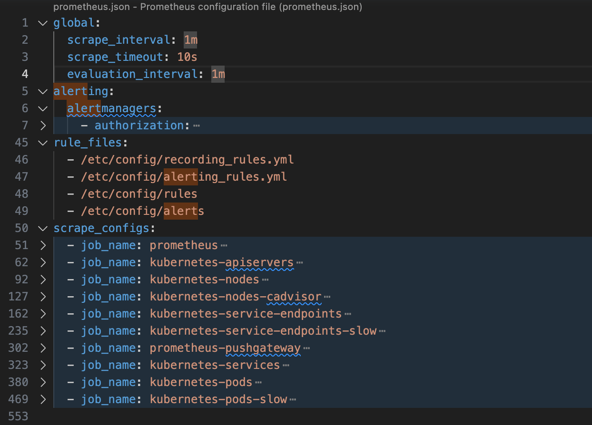
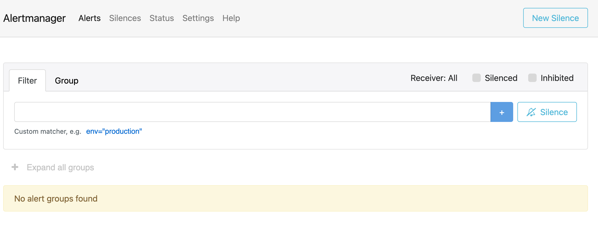
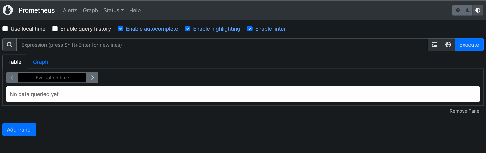
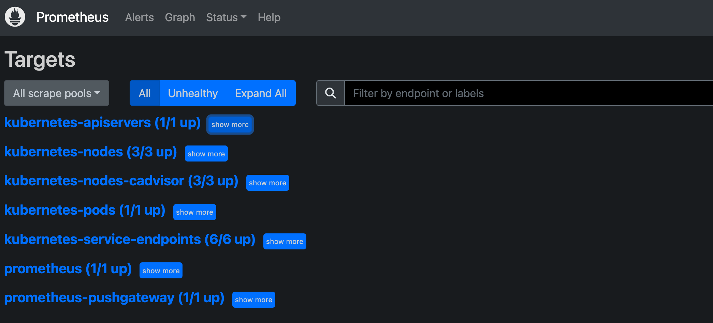

本文介绍如何在 k3s 中使用 Prometheus。

<!--more-->
## 概述

[prometheus](https://prometheus.io/docs/introduction/overview/) 是一个开源的系统和服务的监控系统。它周期性采集 metrics 指标，匹配规则和展示结果，以及触发某些条件的告警发送。

## 时间序列

prometheus 使用的数据模型是 [时间序列（time series）](https://prometheus.io/docs/concepts/data_model/):

```shell
<metric name>{<label name>=<label value>, ...}@timestamp value
```

### metric

每个时间序列都由其 metric 以及 label 集合构成唯一标识。

metric 的 [类型](https://prometheus.io/docs/concepts/metric_types/) 有：

- counter
- gauge
- histogram
- summary

### timestamp

metric 发生的时间。

### value

所有 metric 取值都是 float64 类型。

## 部署{#deploy}

可以通过 helm 安装到 k8s 集群。



上面的配置中包含 prometheus server 与 alert manager 的配置。

```shell
helm repo add prometheus-community https://prometheus-community.github.io/helm-charts &&
    helm repo update &&
    helm upgrade prometheus prometheus-community/prometheus -f prometheus/values.yaml --install --namespace monitor --create-namespace
```

部署的 pods：



## 架构

可以对照部署的 pods 了解一下架构：


## Server{#server}

Server 是 Prometheus 组件中的核心部分，负责实现对监控数据的获取，存储以及查询。

### metrics

Server 本身提供了内存使用、垃圾回收等各种 machine 级别的 metrics，可以通过其暴露的接口查看具体的 metrics。

```shell
kubectl port-forward pods/prometheus-server-5dcccb966d-rrq88 6789:9090
```

浏览器打开 `http://localhost:6789/metrics` 查看相关的 metrics。

### Configuration {#server_config}



server 的配置主要分为以下四个部分，更详细的信息参见 [官方说明](https://prometheus.io/docs/prometheus/latest/configuration/configuration/)。

#### global

global 指定在所有其他配置上下文中有效的参数。它们还用作其他配置部分的默认值。

#### scrape_configs

[scrape_config](https://prometheus.io/docs/prometheus/latest/configuration/configuration/#scrape_config) 指定采集目标和相关参数。可以通过 [静态配置 (static config)](https://prometheus.io/docs/prometheus/latest/configuration/configuration/#static_config) 管理监控目标，也可以配合使用服务发现（比如 [kubernetes 服务发现配置](https://prometheus.io/docs/prometheus/latest/configuration/configuration/#kubernetes_sd_config)）的方式动态管理监控目标。

此外，[relabel_configs](https://prometheus.io/docs/prometheus/latest/configuration/configuration/#relabel_config) 允许在采集前对任何目标及其标签进行高级修改。

#### rule_files

指定包含 recording rules 和 alert rules 的文件。详见 [规则]()。

#### alerting{#alerting}

与 [Alertmanager]() 交互相关的配置。

## Jobs/exporters

在 Prometheus 中，用于暴露 metrics 的程序称为 [exporter](https://prometheus.io/docs/instrumenting/exporters/)。

每一个可以抓取监控样本数据的 endpoint 称为一个实例 (Instance)，通常对应单个进程。例如在当前主机上运行的 node exporter 可以被称为一个实例。

具有相同目的的实例集合（例如，为了可扩展性或可靠性而复制的进程）称为 job。

本次部署中，因为有三个 raspi 作为 DateNode，所以 prometheus 启动了三个 export 来搜集对应的 Node 相关的 machine metrics。详见 [Node Exporter](https://quay.io/repository/prometheus/node-exporter)。

通过 describe pod 的相关信息：



可以看到 node-pod 是以 DaemonSet 方式部署在 Node 上，并且可以直接通过 NodeIP:9100 进行访问。

浏览器 `http://192.168.122.16:9100/metrics` 可以看到该 node-exporter 上报的信息，可以通过 cpu/memory/load 搜索到相关的 metric。

prometheus-kube-state-metrics 通过监听 kubernetes apiserver 获得各种资源对象的 metrics。详见 [github 介绍](https://github.com/kubernetes/kube-state-metrics)

## Push Gateway

通过 Push gateway，可以将时间序列从短期服务级批处理作业推送到 Prometheus，参见 [pushing metrics](https://prometheus.io/docs/instrumenting/pushing/)。

## Alert Manager{#alert_manager}

Alertmanager 可处理 Prometheus 服务器等客户端应用程序发送的警报。它负责对警报进行重复、分组，并将其路由到正确的接收器集成（如电子邮件、PagerDuty 或 OpsGenie）。它还负责警报的静音和抑制。

### 功能

#### 分组

分组将性质相似的警报归类到一个通知中。当许多系统同时发生故障，成百上千个警报可能同时响起时，这在较大的故障期间尤其有用。

作为用户，只希望看到一个告警通知，同时还能看到受影响的服务实例。因此，可对进行配置，按群集和警报名称对警报进行分组，这样就能发送一个简洁的通知。

警报分组、分组通知的时间以及这些通知的接收者都是通过配置文件中的路由树 (route tree) 来配置的。

#### 抑制

抑制的概念是，如果某些其他警报已经触发，则抑制某些警报的通知。

例如一个警报正在发出，通知说整个群集无法访问。可以对 Alertmanager 进行配置，使其在该特定警报触发时静音与该群集有关的所有其他警报。这样就可以防止数百或数千个与实际问题无关的警报触发通知。

抑制功能可通过 Alertmanager 的配置文件进行配置。

#### 静默

静音是一种在给定时间内使警报静音的简单方法。静音是根据匹配器配置的，就像路由树一样。会检查传入的警报是否与活动静默的所有等价或正则表达式匹配器匹配。如果匹配，则不会发送该警报的通知。

静默在 Alertmanager 的 Web 界面中进行配置。

### 配置

详见 [configuration](https://prometheus.io/docs/alerting/latest/configuration/)

#### route

route 用来对告警进行分组设置

#### template

详见 [template](https://prometheus.io/docs/alerting/latest/notifications/)

### web UI

alertmanager 也有一个 web 页面：

```shell
kubectl port-forward services/prometheus-alertmanager 6789:9093
```



## WEB UI

Prometheus UI 是 Prometheus 内置的一个可视化管理界面，通过 Prometheus UI 用户能够轻松的了解 Prometheus 当前的配置、监控任务运行状态等。

```shell
kubectl port-forward services/prometheus-server 6789:80
```



### Alerts

### Graph{#graph}

通过 Graph 面板，用户可以直接使用 [PromQL]() 实时查询结果。该功能多用于临时查询和调试，更专业应使用 [grafana]() 等工具。

### Status

Status 系统运行状态的相关信息，比如 prometheus server 编译信息、tsdb 数据库状态、sever 命令行参数、server 配置、数据来源 (target)、服务发现等信息。

#### Configuration{#Configuration}

server 配置，参见 [服务端配置说明]()。

#### Rules

显示当前配置的规则，详见 [配置 Rules]()

#### Targets

Targets 页面查看当前所有的监控任务（定义在 [configuration]()），以及各个任务下所有实例 (instances) 的状态：



这与使用“up”表达式查询到的信息是一样的。

#### Service Discovery

## PromQL{#PromQL}

[探索 PromQL](https://yunlzheng.gitbook.io/prometheus-book/parti-prometheus-ji-chu/promql) 做了很好地解释，推荐学习。

## Rules {#rules}

### record

[采集规则](https://prometheus.io/docs/prometheus/latest/configuration/recording_rules/)

### alert{#alert_rules}

[告警规则](https://prometheus.io/docs/prometheus/latest/configuration/alerting_rules/)。

### notify template

[规则模板](https://prometheus.io/docs/prometheus/latest/configuration/alerting_rules/#templating)

### 调试

编辑好的规则文件可以通过 promtool 检查：

```shell
promtool check rules /path/to/example.rules.yml
```

## Alert

Prometheus 的告警分为两个部分。Prometheus 服务器中的 [alert rule]() 向 [alert manager]() 发送告警。 Alertmanager 管理这些告警，包括静音、抑制、聚合以及通过电子邮件、值班通知系统和聊天平台等方式发送通知。

设置告警和通知的主要步骤如下：

- 设置和配置 [Alertmanager]()
- [配置 Prometheus 与 Alertmanager 对话]()
- 在 Prometheus 中创建 [告警规则]()

## 高级

## 参考

- [prometheus book](https://yunlzheng.gitbook.io/prometheus-book/)

## Next

- Prometheus UI 提供了快速验证 PromQL 以及临时可视化支持的能力，而在大多数场景下监控系统通常还需要可以长期使用的监控数据可视化面板（Dashboard）。这时用户可以考虑使用第三方的可视化工具如 [Grafana]()
