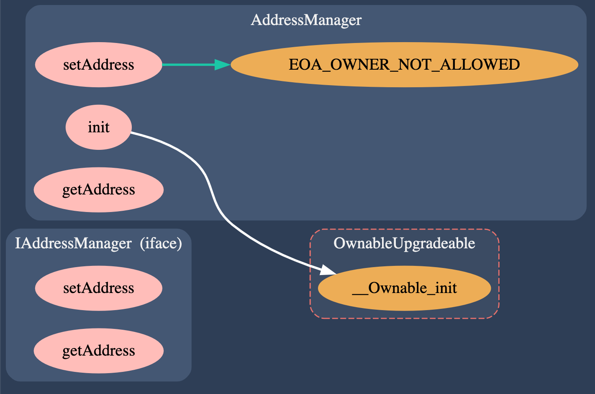
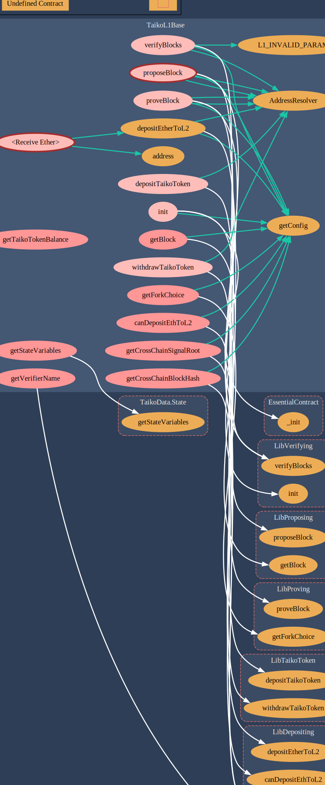

本文介绍 Taiko 实现的合约。主要针对 [taiko-protocol](https://github.com/taikoxyz/taiko-mono/blob/839326c9aa776e1335a2b8aac5a797ee081e667d/packages/protocol)。

<!--more-->

## AddressManager（L1/L2）

AddressManger 与 AddressResolver 搭配使用，实现了类似 ens 的作用，避免在代码中硬编码合约地址。

AddressManger 在私有状态变量 [addresses](https://github.com/taikoxyz/taiko-mono/blob/839326c9aa776e1335a2b8aac5a797ee081e667d/packages/protocol/contracts/common/AddressManager.sol#L44) 中保存了链上合约到部署地址之间的映射：

```solidity
mapping(uint256 chainID=> mapping(bytes32 name => address)) private addresses;
```



AddressResolver 则会通过 [resolve](https://github.com/taikoxyz/taiko-mono/blob/839326c9aa776e1335a2b8aac5a797ee081e667d/packages/protocol/contracts/common/AddressResolver.sol#L91) 方法对外提供 ContractName 到 DeployAddress 的解析。同时，该合约通过 [EssentialContract](https://github.com/taikoxyz/taiko-mono/blob/839326c9aa776e1335a2b8aac5a797ee081e667d/packages/protocol/contracts/common/EssentialContract.sol#L18) 被其他合约继承。


## TaikoToken(L1)

L1 上部署的 [TaikoToken](https://github.com/taikoxyz/taiko-mono/blob/839326c9aa776e1335a2b8aac5a797ee081e667d/packages/protocol/contracts/L1/TaikoToken.sol#L35) 是一个 ERC20 代币合约，可以用于充值和提现，主要用于质押。

## HorseToken && BullToken(L1)

L1 上部署的两个 ERC20 代币，可用于 swap。

## TaikoL1(L1)



从上图中可以看出：`TaikoL1.sol` 主要封装了对外接口，内部实现都是位于在对应的库合约（LibContract）中。除了 [taiko core]() 中介绍的核心逻辑，还支持一下功能：



### 充值提现

- depositTaikoToken
- withdrawTaikoToken
- depositEtherToL2
- canDepositEthToL2

假设当前 propose 第一个 block：

### 查询链状态

- getBlock
- getBlockFee
- getForkChoice
- getStateVariables
- getConfig

## Bridge(L1)

Taiko Bridge 实现，需要配合 SignalService 使用。

## ERC20Vault(L1)

## ERC721Vault(L1)

## ERC20Vault(L1)

## ERC1155Vault(L1)

## ProofVerifier(L1)

用于验证 zkProof 的合约。

## SignalService(L1/L2)

用于实现 signalService。

## TaikoL2(L2)

主要实现了 anchor 以及与 EIP-1559 相关功能。
