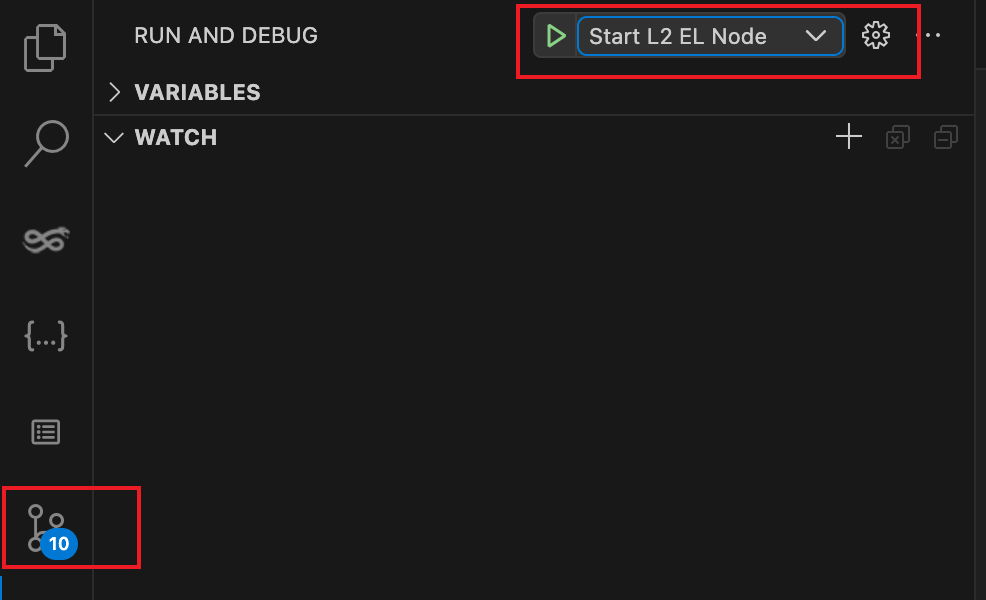

## 概述

本文介绍如何基于 vscode 搭建 Taiko-client 源码开发调试环境，其中的使用技巧也可用于 Golang/Solidity 调试环境的搭建。

整体思路是 [vscode debugging](https://code.visualstudio.com/docs/editor/debugging) 结合 [Task](https://code.visualstudio.com/docs/editor/tasks) 来完成以下目标：

- 将 forge anvil 作为 L1 执行层节点启动，并部署 taiko-mono 中的一层合约。
- 调试器启动 taiko-geth 作为 L2 层的执行层节点，以及 taiko-client 的 proposer/prover/driver。这几个组件才是需要通过 golang 调试器开发打断点的程序，也是 taiko 项目中除 zkevm 以及合约代码外的主要部分。

## Start L2

[相关代码](https://github.com/taikoxyz/taiko-geth/tree/vscode/.vscode)，调试完成后，还会有 task 清理调试过程中产生的垃圾文件，不会污染目录。

## Start L1 && Taiko-Client

[相关代码](https://github.com/taikoxyz/taiko-client/tree/vscode/.vscode)

由于 StartL1 主要是是为了部署 TaikoL1 合约，来作为 taiko-client 启动做前置准备，所以将两部分配置都放在 taiko-client 项目中。

## 调试

通过上面的配置，启动调试只需要两步就可以完成开发调试环境的搭建，接下来就打断点进行调试吧。
